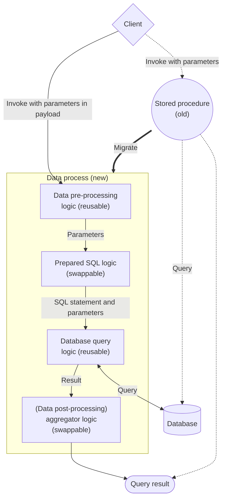
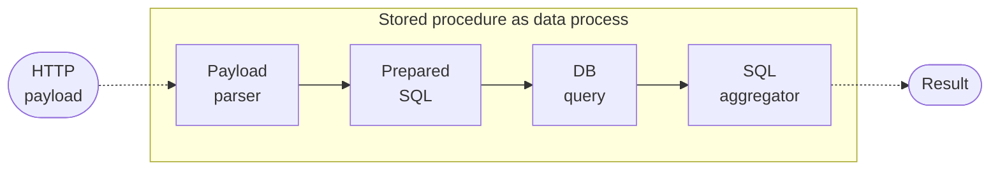

# LOC Tip >> Migrating Stored Procedures (SQL Scripts) to LOC

A simple concept framework of how to migrate your [stored procedures](https://en.wikipedia.org/wiki/Stored_procedure) (prepared SQL scripts) into LOC data processes.

import Tabs from "@theme/Tabs";
import TabItem from "@theme/TabItem";

## The Necessity of Modernising Stored Procedures

Stored procedures go back to the late 1980s with the coming of relational database management systems ([RDBMS](https://en.wikipedia.org/wiki/Relational_database#RDBMS)). There are advantages for storing reusable SQL "functions" directly on your database server:

-   Stored procedures can be "deployed" quickly and can be executed with less overhead.
-   Stored procedures are run directly on the database server so the SQL statements do not need to be sent over network traffic.

However, with the larger network bandwith available and the rise of modern software technologies, new issues have surfaced:

-   Stored procedures are difficult to read/debug and have no version control.
-   Since stored procedures contain business and data logic, the system loading are focused on the database server and make it a potential deadlock. And if the database server is down, the business and data logic would be inaccessible as well.
-   Stored procedures themselves (as a data pipeline) can only be scaled together with the database server.

There are a lot of talks of migrating SQL scripts (or at least, the business logic) from the database server to standalone services - for example, as microservices - so that you can achieve better maintainability and availability for the business and data logic.

In this article we'll discuss a simple design for migrating stored procedures to LOC data processes.

### Benefits of Moving SQL to LOC Data Processes

1. **Better code readability and maintainability** using JavaScript instead of writing pure SQL scripts.
2. Can create **highly modualised and reusable business/data logic** to save development time.
3. **Revision history and active metadata** (logging, data events, audit logs, etc.) are available for better data governance.
4. Data processes, logic and API routes **can be deployed just as fast** as stored procedures.
5. Easily invoke SQL scripts from anywhere with **simple HTTP requests**.
6. Can implement **custom user authentication, data validation and data transformation** as you see fit.

## Migrating the Stored Procedure

While migrating a stored procedure to a data process, we can try to divide some business and data logic into reusable logic:



The actual boundaries or dividing the logic, of course, entirely depends on your use case and business logic. A good modular logic design can be extremely valuable for improving developing experience and reduce developing time.

### The Stored Procedure Example

For the demonstration, we'll use Microsoft's [AdventureWorks sample database](https://learn.microsoft.com/en-us/sql/samples/adventureworks-install-configure), for which you can replicate on your own SQL server:

<div className="center-padded-sm">
    
</div>

In one of Microsoft's [example](https://learn.microsoft.com/en-us/sql/relational-databases/stored-procedures/create-a-stored-procedure?view=sql-server-ver16), we can create a stored procedure named `vEmployeeDepartmentHistory` under the `HumanResources` table to query a record with matching first name and last name:

```sql
USE AdventureWorks2019;
GO
CREATE PROCEDURE HumanResources.uspGetEmployeesTest2
    @LastName nvarchar(50),
    @FirstName nvarchar(50)
AS
    SET NOCOUNT ON;
    SELECT FirstName, LastName, Department
    FROM HumanResources.vEmployeeDepartmentHistory
    WHERE FirstName = @FirstName AND LastName = @LastName
    AND EndDate IS NULL;
GO
```

After executing the SQL script above, the stored procedure would be available on the SQL Server and can be invoked via SQL like a function:

```sql
EXECUTE HumanResources.uspGetEmployeesTest2 @FirstName = N'Pilar', @LastName = N'Ackerman';
GO
```

Which should return a result like this:

<div className="center-padded">
    
</div>

### The Data Process "Framework"

For the sake of demonstration, we will design a really simple data process to get the job done:



This data process has three generic logic and one aggregator logic:

| Logic              | Type       | Description                                                                                           | May contain business/data logic? |
| ------------------ | ---------- | ----------------------------------------------------------------------------------------------------- | -------------------------------- |
| **Payload parser** | Generic    | Parse HTTP payload into JSON object                                                                   | ✗                                |
| **Prepared SQL**   | Generic    | Extract, pre-process and validate parameters then pass the SQL statement/data to database query logic | ✓                                |
| **Database query** | Generic    | Execute SQL query and return results or errors                                                        | ✗                                |
| **SQL aggregator** | Aggregator | Post-processing database results                                                                      | ✓                                |

### Logic Design

Based on the data process design, we can create the four logic as such:

:::note
The following function example works for LOC SDK `v0.8.0` and above.
:::

import PayloadJSONParserJSDocExample from "../../legacy_versioned_docs/version-0.10/_logic-template-sources/_payload-json-parser-jsdoc.mdx";
import DatabaseQueryJSDocExample from "../../legacy_versioned_docs/version-0.10/_logic-template-sources/_database-query-jsdoc.mdx";

<Tabs>
  <TabItem value="payload-logic" label="Payload parser">

<PayloadJSONParserJSDocExample />

  </TabItem>
  <TabItem value="sql-logic" label="Prepared SQL (example)" default>

```javascript title="prepared-sql.js" showLineNumbers
import { LoggingAgent, SessionStorageAgent } from "@fstnetwork/loc-logic-sdk";

// ==================== START Stored Procedure Logic ====================

// database configuration reference name
// highlight-next-line
const configRefName = "AdventureWorks";

// SQL statement
// highlight-start
const storedProcedure = `SELECT FirstName, LastName, Department  
FROM HumanResources.vEmployeeDepartmentHistory  
WHERE FirstName = @P1 AND LastName = @P2
AND EndDate IS NULL;`;
// highlight-end

// parameters name and type (by the order in the WHERE clause)
// [@P1, @P2]
// highlight-next-line
const parameters = ["FirstName", "LastName"];

// parameter value validation
// highlight-start
const parameterValidation = (param, value) => {
    switch (param) {
        case "FirstName": // @P1; @FirstName nvarchar(50)
            if (
                !value ||
                typeof value != "string" ||
                value.split("").length * 2 > 50
            )
                return false;
            break;
        case "LastName": // @P2; @LastName nvarchar(50)
            if (
                !value ||
                typeof value != "string" ||
                value.split("").length * 2 > 50
            )
                return false;
            break;
    }
    return true; // check passed
};
// highlight-end

// data transformation
// highlight-start
const parameterTransformation = (param, value) => {
    switch (param) {
        case "FirstName": // @P1; @FirstName
            return value; // no transformation
            break;
        case "LastName": // @P2; @LastName
            return value; // no transformation
            break;
    }
    return null;
};
// highlight-end

// ==================== END Stored Procedure Logic ====================

/** @param {import('@fstnetwork/loc-logic-sdk').GenericContext} ctx */
export async function run(ctx) {
    // load parsed JSON parload
    const parsed = await SessionStorageAgent.get("parsed");

    // throw error if parsed is null but parameters are expected
    if (!parsed && parameters)
        throw new Error("parsed payload is null while parameters are expected");

    // extract parameters and check types
    // throw error if parameter is not found in parsed, has incorrect type or failed to meet constraint
    let params = [];
    parameters.forEach((param) => {
        if (!(param in parsed)) {
            throw new Error(`SQL parameter field missing: ${param}`);
        } else if (!parameterValidation(param, parsed[param])) {
            throw new Error(
                `SQL parameter failed to meet the constraint: ${param}`,
            );
        } else {
            params.push(parameterTransformation(param, parsed[param]));
        }
    });

    // prepare sql object for database query logic
    const sql = {
        configName: configRefName,
        statement: storedProcedure,
        params: params,
    };

    // log sql
    LoggingAgent.info({
        sql: sql,
    });

    // write sql into session storage
    await SessionStorageAgent.putJson("sql", sql);
}

/**
 * @param {import('@fstnetwork/loc-logic-sdk').GenericContext} ctx
 * @param {import('@fstnetwork/loc-logic-sdk').RailwayError} error
 */
export async function handleError(ctx, error) {
    LoggingAgent.error({
        error: true,
        errorMessage: error.message,
        stack: error.stack,
        taskId: ctx.task.taskKey,
    });
}
```

  </TabItem>
  <TabItem value="db-logic" label="Database query">

<DatabaseQueryJSDocExample />

  </TabItem>
  <TabItem value="aggregator-logic" label="SQL aggregator">

```javascript title="sql-aggregator.js" showLineNumbers
import {
    LoggingAgent,
    ResultAgent,
    SessionStorageAgent,
} from "@fstnetwork/loc-logic-sdk";

/** @param {import('@fstnetwork/loc-logic-sdk').GenericContext} ctx */
export async function run(ctx) {
    // read database query status
    const db_query_status = await SessionStorageAgent.get("db_query_status");

    // read database response
    const db_resp = await SessionStorageAgent.get("db_resp");

    // read database error
    const db_error = await SessionStorageAgent.get("db_error");

    const result = {
        status: db_query_status,
        taskId: ctx.task.taskKey,
        data: db_resp?.rows || {},
    };

    if (db_error) result.error = db_error;

    // finalise result
    ResultAgent.finalize(result);
}

/**
 * @param {import('@fstnetwork/loc-logic-sdk').AggregatorContext} ctx
 * @param {import('@fstnetwork/loc-logic-sdk').RailwayError} error
 */
export async function handleError(ctx, error) {
    const err = {
        error: true,
        errorMessage: error.message,
        stack: error.stack,
        taskKey: ctx.task.taskKey,
    };

    // error logging
    LoggingAgent.error(err);

    // finalise result
    ResultAgent.finalize(err).httpStatusCode(500);
}
```

  </TabItem>
</Tabs>

### Add Agent Configuration Reference

:::tip
Before accessing a database, you'll have to add a database configuration in LOC.

Also see: [Create a Data-Driven Microservice with Database](/docs/tutorials/db-microservice#adding-database-configuration-reference)
:::

Even though we specify the database configure reference name in `Prepared SQL` logic, it is actually the `Database query` logic that requires the configuration. You'll need to add it to the logic in the data process.

In our example the database confuration reference is named as **`AdventureWorks`**.

### Deploy an API Route

To expose a service of a data process, you'll need to link it to one of the triggers, like the API route.

In our example, the API route accepts POST requests with JSON payload. The path is set as **`/api/sql/HumanResources/uspGetEmployeesTest2`**.

> Also see: [Create and Use an API Route Trigger](/docs/tutorials/create-api-route)

### Invoke With HTTP Payload

Now, in order to invoke the migrated stored procedure, we can send a HTTP POST request to the API route with the following JSON payload:

```json
{
    "FirstName": "Pilar",
    "LastName": "Ackerman"
}
```

You can send the request with any HTTP clients, including `curl` if you are macOS or Linux users:

```bash
curl -X POST -d '{
    "FirstName": "Pilar",
    "LastName": "Ackerman"
}' -v -i 'https://api.xxxxxx.fst.network/api/sql/HumanResources/uspGetEmployeesTest2'
```

Which would return a execution result in JSON format:

```json
{
    "_status": 200,
    "_metadata": {
        "executionId": "ZHhTV5N8iGhLemm1a8vGPQ",
        "triggerType": "ApiRoute",
        "triggerId": "f9c0661e-d708-42ed-9bf7-154a04791980",
        "creationTimestamp": "2023-06-01T08:14:15.195041Z",
        "completionTimestamp": "2023-06-01T08:14:15.605214Z",
        "status": "success"
    },
    "data": {
        "status": "ok",
        "taskId": {
            "executionId": "ZHhTV5N8iGhLemm1a8vGPQ",
            "taskId": "cXsWBrVLGjBxtpLENzMNTw"
        },
        "data": [
            // highlight-start
            {
                "FirstName": "Pilar",
                "LastName": "Ackerman",
                "Department": "Shipping and Receiving"
            }
            // highlight-end
        ]
    }
}
```

The JSON object inside `data` is exactly the same as before, indicating that we have successfully migrate the stored procedure to a RESTful-like web service.

## Modyfy or Create New Stored Procedure Logic

With this "framework" in place, it would become easy to modify your existing SQL logic or to migrate more stored procedures as data processes:

1. Copy the `Prepared SQL` and maybe `SQL aggregator` logic code to create new ones. (In our example `SQL aggregator` does nothing other than return the queried result - if any - directly to the client.)

2. Modify the section between `Stored Procedure Logic` comment section:

```javascript
// ==================== START Stored Procedure Logic ====================

// database configuration reference name
const configRefName = "...";

// SQL statement
const storedProcedure = `...`;

// parameters name and type (by the order in the WHERE clause)
const parameters = [];

// parameter value validation
const parameterValidation = (param, value) => {
    // ...validation based on param and value
    return true;
};

// data transformation
const parameterTransformation = (param, value) => {
    // ...transformation based on param and value
    return null;
};

// ==================== END Stored Procedure Logic ====================
```

| Item                      | Description                                                                                                                    |
| ------------------------- | ------------------------------------------------------------------------------------------------------------------------------ |
| `configRefName`           | The database configuration reference name that to be used by `Database query` logic                                            |
| `storedProcedure`         | SQL statemtnt with parameter placeholders                                                                                      |
| `parameters`              | The expected parameter names by the order appearing in the WHERE clause. Can be an empty array (no parameters).                |
| `parameterValidation`     | A function that validate a parameter value. If check fails, an error would be thrown. Simply return `true` to skip validation. |
| `parameterTransformation` | A function that transform a parameter values. Simply return the original value for no transformations.                         |

:::tip
Since the SQL statement is now stored in the logic, we no longer need to use declared variable names like `@FirstName` or `@LastName`. Instead they have to be written as `@P1`, `@P2`... for the SQL server. See Database Agent to learn more about the prepared statement.

Also, both `@FirstName` and `@LastName` fields are `nvarchar` type in the database, which would store every character for 2 bytes. In the example before we calculated the character length in JavaScript and times it with 2. **It would be your responsibility to validate the data before actually executing the query**.
:::
