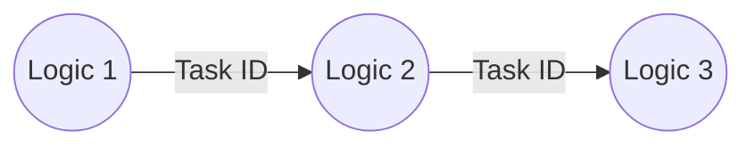
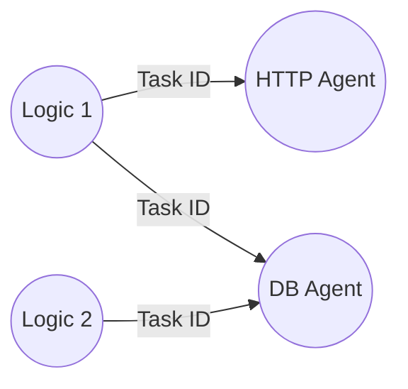

# LOC Tip >> Creating System Lineage with Events

Can you make LOC agents to emit their own events to visualise logic flows and agent usage lineage for system impact analysis?

---

LOC's event store and Event Agent are the most prominent active metadata functionalities provided on the platform. Unlike most database and SQL-based lineaget tools, the data [events](/docs/tutorials/loc-feat-overview#events) are far more flexible in representing any relationships or flows.

Although, wouldn't it be better if LOC agents - especially the ones operating external data sources and systems - automatically emit events on their own?

## Logic Flow Events

For example, we can create a series of events to "draw" the logic flows:



The scheme of these events may be like this:

| Event Fields | Value                                                                                                                                                      |
| ------------ | ---------------------------------------------------------------------------------------------------------------------------------------------------------- |
| Label Name   | `System_Event: {Task ID}`                                                                                                                                  |
| Source DID   | `DP: {DP Name} -> Logic: {Previous Logic PID}`                                                                                                             |
| Target DID   | `DP: {DP Name} -> Logic: {Current Logic PID}`                                                                                                              |
| Meta         | Serialised JSON string of<ul><li>Task ID and Execution ID</li><li>Data process context</li><li>Logic name context</li><li>Executed logic context</li></ul> |

## Agent Action Events

We can also emit events to indicate what agent configuration is invoked in a logic:



The event scheme would be like this:

| Event Fields | Value                                                                                                                                                        |
| ------------ | ------------------------------------------------------------------------------------------------------------------------------------------------------------ |
| Label Name   | `System_Event: {Task ID}`                                                                                                                                    |
| Source DID   | `DP: {DP Name} -> Logic: {Current Logic ID}`                                                                                                                 |
| Target DID   | `DP: {DP Name} -> Agent: {Agent Name} -> Config: {Agent Configuration Name}`                                                                                 |
| Meta         | Serialised JSON string of<ul><li>Agent name</li><li>Agent configuration name</li><li>Agent client ID</li><li>Method name</li><li>Method parameters</li></ul> |

# System Lineage Wrapper Function - Proof of Concept

The logic flow and agent action events - together as what we referred as _system events_ - is indeed a potential feature currently undergoing discussion. For the time being, however, we can do a little magic in the logic to "inject" the desired effects.

:::note
The following function example works for LOC SDK `v0.8.0` and above.
:::

:::warning
Since event agent is only available in generic logic, this function will not work in aggregator logic.
:::

The single function `EnableSystemLineage` accepts the `ctx` object in the logic and creates/returns a series of closure functions:

```javascript showLineNumbers
import {
    DatabaseAgent,
    EventAgent,
    FileStorageAgent,
    HttpAgent,
    LoggingAgent,
    MailAgent,
} from "@fstnetwork/loc-logic-sdk";

/** @param {import('@fstnetwork/loc-logic-sdk').GenericContext} ctx */
export async function EnableSystemLineage(ctx) {
    LoggingAgent.info("enabling system lineage...");
    const task = ctx.task;

    const emitLogicFlowEvent = async () => {
        // get previous executed logic
        const previousLogic =
            task.executedLogics[task.executedLogics.length - 1];

        // emit system event (logic flow)
        const event = {
            labelName: `System_Event: ${task.taskKey.taskId}`,
            sourceDID: `DP: ${task.dataProcess.name} -> Logic: ${previousLogic.permanentIdentity}`,
            targetDID: `DP: ${task.dataProcess.name} -> Logic: ${task.currentLogic.permanentIdentity}`,
            meta: JSON.stringify({
                context: task.taskKey,
                dataProcess: task.dataProcess,
                currentLogic: task.currentLogic,
                executedLogic: task.executedLogics,
            }),
            type: "default",
        };
        await EventAgent.emit([event]);

        // log
        LoggingAgent.info({
            eventType: "System_Event_Logic_Flow",
            event: event,
        });
    };

    const agentActionEventDecorator = async (client, func, meta) => {
        return async function (...args) {
            // execute original function/method with 'this' set to the client
            const result = await func.call(client, ...args);

            // emit system event (agent action)
            const event = {
                labelName: `System_Event: ${task.taskKey.taskId}`,
                sourceDID: `DP: ${task.dataProcess.name} -> Logic: ${task.currentLogic.permanentIdentity}`,
                targetDID: `DP: ${task.dataProcess.name} -> Agent: ${meta?.agentName} -> Config: ${meta?.agentConfigName}`,
                meta: JSON.stringify({
                    ...meta,
                    method: func.name,
                    params: JSON.stringify(args),
                    result: JSON.stringify(result),
                }),
                type: "default",
            };
            await EventAgent.emit([event]);

            // log
            LoggingAgent.info({
                eventType: "System_Event_Agent_Action",
                event: event,
            });

            return result;
        };
    };

    // emit system event (logic flow)
    if (task.executedLogics?.length > 0) await emitLogicFlowEvent(task);

    // decorating methods to emit system events (agent action)

    const HTTPAgentAcquireOriginal = HttpAgent.acquire;
    HttpAgent.acquire = async function (configurationName) {
        const http_client = await HTTPAgentAcquireOriginal(configurationName);
        const meta = {
            agentName: "HttpAgent",
            agentConfigName: configurationName,
            agentClientId: http_client.configurationId,
        };
        http_client.fetch = await agentActionEventDecorator(
            http_client,
            http_client.fetch,
            meta,
        );
        return http_client;
    };

    const DatabaseAgentAcquireOriginal = DatabaseAgent.acquire;
    DatabaseAgent.acquire = async function (configurationName) {
        const db_client = await DatabaseAgentAcquireOriginal(configurationName);
        const meta = {
            agentName: "DatabaseAgent",
            agentConfigName: configurationName,
            agentClientId: `${db_client.uid.dataSourceId}_${db_client.uid.connectionId}`,
        };
        db_client.query = await agentActionEventDecorator(
            db_client,
            db_client.query,
            meta,
        );
        db_client.execute = await agentActionEventDecorator(
            db_client,
            db_client.execute,
            meta,
        );
        db_client.beginTransaction = await agentActionEventDecorator(
            db_client,
            db_client.beginTransaction,
            meta,
        );
        db_client.commitTransaction = await agentActionEventDecorator(
            db_client,
            db_client.commitTransaction,
            meta,
        );
        db_client.rollbackTransaction = await agentActionEventDecorator(
            db_client,
            db_client.rollbackTransaction,
            meta,
        );
        return db_client;
    };

    const FileStorageAgentAcquireOriginal = FileStorageAgent.acquire;
    FileStorageAgent.acquire = async function (configurationName) {
        const file_client =
            await FileStorageAgentAcquireOriginal(configurationName);
        const meta = {
            agentName: "FileStorageAgent",
            agentConfigName: configurationName,
            agentClientId: file_client.configurationId,
        };
        file_client.list = await agentActionEventDecorator(
            file_client,
            file_client.list,
            meta,
        );
        file_client.simpleGet = await agentActionEventDecorator(
            file_client,
            file_client.simpleGet,
            meta,
        );
        file_client.simplePut = await agentActionEventDecorator(
            file_client,
            file_client.simplePut,
            meta,
        );
        file_client.delete = await agentActionEventDecorator(
            file_client,
            file_client.delete,
            meta,
        );
        file_client.createDirAll = await agentActionEventDecorator(
            file_client,
            file_client.createDirAll,
            meta,
        );
        return file_client;
    };

    const MailAgentAcquireOriginal = MailAgent.acquire;
    MailAgent.acquire = async function (configurationName) {
        const mail_client = await MailAgentAcquireOriginal(configurationName);
        const meta = {
            agentName: "MailAgent",
            agentConfigName: configurationName,
            agentClientId: mail_client.uid,
        };
        mail_client.send = await agentActionEventDecorator(
            mail_client,
            mail_client.send,
            meta,
        );
        return mail_client;
    };
}
```

All the user need to do is to add or import this function and calls it at the beginning of `run` in a logic. `EnableSystemLineage` will then replace some methods globally to create the extra functionalities.

:::info
For now the code ignores error handling for potential expected errors.

Be noted that the function `EnableSystemLineage` has to be **imported and run in each generic logic** of a data process to create the proper logic flow lineage.
:::

## Import System Lineage Function

### In Studio

Copy `EnableSystemLineage` at the end of each logic, remove keyword `export` and add neceeary imports at the beginning:

```javascript title="Logic" showLineNumbers
import {
    ...
} from '@fstnetwork/loc-logic-sdk';

export async function run(ctx) {
    // highlight-next-line
    await EnableSystemLineage(ctx);

    // ... call SDK normally
}

// highlight-start
/** @param {import('@fstnetwork/loc-logic-sdk').GenericContext} ctx */
async function EnableSystemLineage(ctx) {
    // ...
}
// highlight-end
```

### In CLI

Create a JavaScript file as a shared utility library in your CLI, and import it into any logic:

```javascript title="[workspace]/utils/system-lineage.js" showLineNumbers
import {
    DatabaseAgent,
    EventAgent,
    FileStorageAgent,
    HttpAgent,
    LoggingAgent,
    MailAgent,
} from "@fstnetwork/loc-logic-sdk";

/** @param {import('@fstnetwork/loc-logic-sdk').GenericContext} ctx */
export async function EnableSystemLineage(ctx) {
    // ...
}
```

Afterwards you can import `EnableSystemLineage` into any logic in your workspace:

```javascript title="Logic" showLineNumbers
import {
    ...
} from '@fstnetwork/loc-logic-sdk';
// highlight-next-line
import { EnableSystemLineage } from '../utils/systemlineage'

export async function run(ctx) {
    // highlight-next-line
    await EnableSystemLineage(ctx);

    // ... call SDK normally
}
```

## Demo Execution Result

Below is an example consisted with three generic logic and two different HTTP agent configurations:

<div className="center-padded">
    
</div>

`EnableSystemLineage` also generates logs in the execution history, for example:

```
2023-03-28T07:15:52.868005689+00:00	Info	plaintext	enabling system lineage...
2023-03-28T07:15:52.868732373+00:00	Info	json	{"eventType":"System_Event_Logic_Flow","event":{"labelName":"System_Event: URgMeKHCIM6iGajp3Bc4Vw","sourceDID":"DP: SystemLineageDP -> Logic: 1e097610-a0b9-441a-83c6-c9f6aabd0c53","targetDID":"DP: SystemLineageDP -> Logic: 4003983e-5cde-44b3-860d-4a01d9ab7ff3","meta":"{\"taskId\":{\"id\":\"URgMeKHCIM6iGajp3Bc4Vw\",\"executionId\":\"ZCKUEGaX13KYmc16TZQXrg\"},\"dataProcess\":{\"permanentIdentity\":\"39098872-10d7-4924-8115-2bc5d111f5c6\",\"revision\":3,\"name\":\"SystemLineageDP\"},\"currentLogic\":{\"permanentIdentity\":\"4003983e-5cde-44b3-860d-4a01d9ab7ff3\",\"revision\":1,\"name\":\"system-lineage-logic-3\"},\"executedLogic\":[{\"permanentIdentity\":\"bba195c1-f708-46db-befe-90c0277f1a99\",\"revision\":1,\"name\":\"system-lineage-logic-1\"},{\"permanentIdentity\":\"1e097610-a0b9-441a-83c6-c9f6aabd0c53\",\"revision\":1,\"name\":\"system-lineage-logic-2\"}]}","type":"default"}}
2023-03-28T07:15:52.964382223+00:00	Info	json	{"eventType":"System_Event_Agent_Action","event":{"labelName":"System_Event: URgMeKHCIM6iGajp3Bc4Vw","sourceDID":"DP: SystemLineageDP -> Logic: 4003983e-5cde-44b3-860d-4a01d9ab7ff3","targetDID":"DP: SystemLineageDP -> Agent: HttpAgent -> Config: world-time-api","meta":"{\"agentName\":\"HttpAgent\",\"agentConfigName\":\"world-time-api\",\"agentClientId\":\"5e758039-5cbe-4725-9a61-021c7f90f3c0\",\"method\":\"fetch\",\"params\":[\"/api/ip\"]}","type":"default"}}
```

Since all events share the same label name, we can easily filter them out or query them with the task ID.
