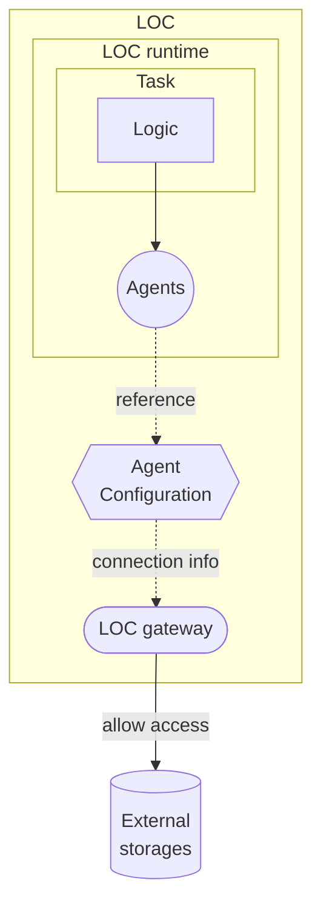

# Overview

An overview of the concept and purpose of LOC agent configurations.

## What is an Agent Configuration?

> See: [Manage Configuration](/main/feature/agent-config/manage) and [Add Configuration to Data Process](/main/feature/agent-config/add-config)

An **agent configuration** is a mechanism to whitelist external data source hosts, as well as to hide connection information from the logic code themselves.

The following agents require at least an agent configuration to reference in a logic linked in a data process:

-   [HTTP Agent](/main/feature/agent/agent-list#http-agent) (for sending requests to HTTP endpoints)
-   [Database Agent](/main/feature/agent/agent-list#database-agent) (for database servers)
-   [File Storage Agent](/main/feature/agent/agent-list#file-storage-agent) (for file servers like FTP, SMB or S3)
-   [Mail Agent](/main/feature/agent/agent-list#mail-agent) (for SMTP servers)

## What is a Logic Variable?

A **logic variable** is an environment variable that can be attached to a logic, in the manner similar to an agent configuration.

In fact, a logic variable can be used to provide different configurations for a logic, for example, the reference name and HTTP endpoint path, so that you do not need to create additional logic to accommodate these details.
