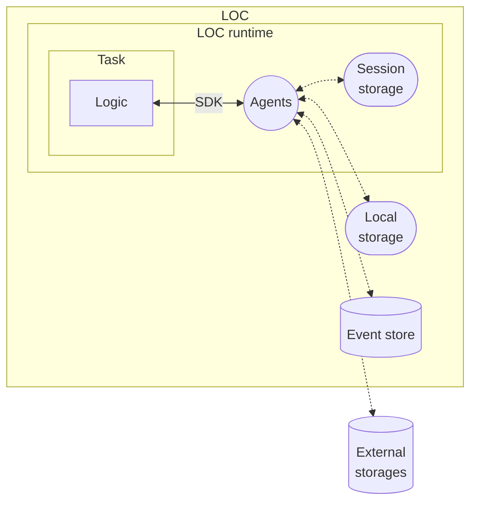

# Overview

**Agents** are built-in services to access internal or external data sources, as well as runtime metadata from the execution, task and triggers, etc.

## List of Agents

> See: [List of Agents](/main/feature/agent/agent-list)

The specs and examples of agents are available in SDK docs.
