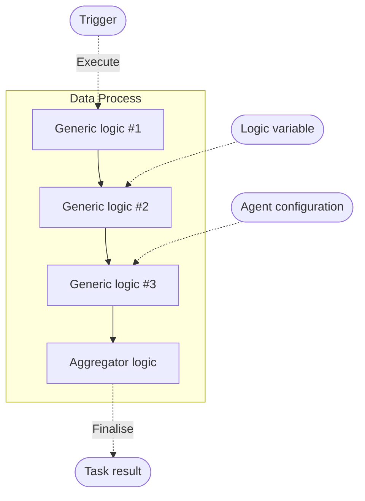

# Overview

An overview of the concept and purpose of LOC data processes.

## What is a Data Process?

> See: [Create Data Process](/main/feature/data-process/create) and [Edit and Manage Data Process](/main/feature/data-process/manage)

A **data process** in LOC is a workflow or a data pipeline, which includes a series of logic to be executed.

A data process has its own revision system. If one of the included logic is modified, you'll need to edit the data process as well, which will create a new revision.

:::info Permanent ID (PID)
Every user asset created in LOC - for example, a data process - will have an unique identity string called **PID (permanent ID)**.
:::

### Workspace, Projects and Scenarios

> See: [Manage Project and Scenario](/main/feature/data-process/project-scenario)

A data process belongs to a **scenario** under a **project**; both can be created by users.

Projects belong to a **workspace** or **unit**. Currently, the default workspace or unit is not editable.

### Agent Configurations and Environment Variables

> See: [Agent Configuration](/main/category/agent-configuration)

A logic, once added into a data process, can have its own environment variables and references to agent configurations (for connecting whitelisted external data sources).

## Data Process Execution

### Invoke an Execution

> See: [Trigger](/main/category/trigger)

A trigger can invoke an execution with one or more data processes as tasks.

### Execution Result and Error Handling

> See: [Execution and Task](/main/category/execution-and-task)

The execution and task results - including errors - will be stored as execution results.
