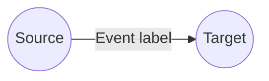
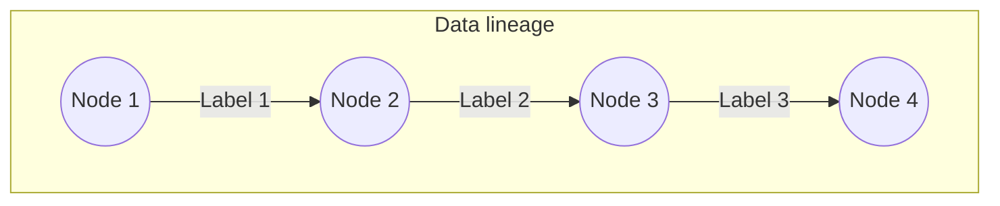

# Overview

An overview of the concept and purpose of LOC data events and data lineages.

## What is an Event?

In LOC, an **event** is a timestamped log or metadata representing a _data flow_:

The source and target **digital identity** (DID) are customised _nodes_ defined by users, which can or do not necessarily mirror to actual data schema. Instead, they can represent any higher-level business logic happening at runtime.

_Any_ generic logic can "emit" and/or query events, which are stored in LOC's internal **event store**.

:::info
Events can even serve as communication between tasks, since they are capable to carry payload data as well.
:::

## Emit Events

> See: [Event Store Agent](/main/feature/agent/agent-list#event-store-agent)

The only way to emit events is to use the Event Store Agent in logic SDKs.

## What is Data Lineage?

> See: [View Event and Data Lineage](/main/feature/event-and-lineage/view)

Multiple events with shared source/target nodes form a **data lineage**:

The graphical representation of a data lineage is available in LOC Studio, as long as the user filter the right events.

Below is an example of a data lineage graph inspected in Studio:

    

