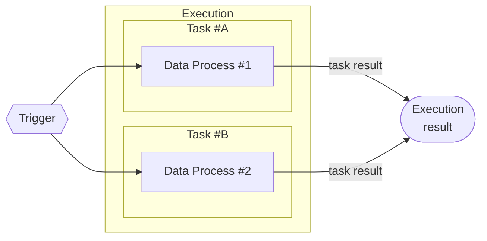
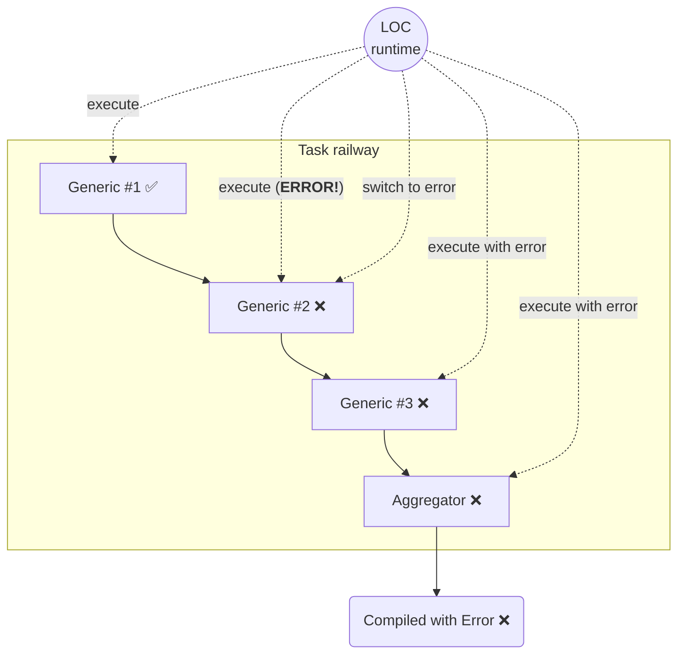

# Overview

An overview of the concept and purpose of LOC executions, tasks and their results.

## What is an Execution and a Task?

When one or more data processes are triggered to be executed, the process is referred as an **Execution** with each data process is run as a **task**.

### Execution and Task Results

> See: [Inspect Execution Result](/main/feature/execution-and-task/view) and [Logging and Finalise Task Result](/main/feature/execution-and-task/logging-and-finalise)

Each task generate a **task result**, and all task results in the same execution will be combined into an **execution result**.

A task result can be defined using SDK's result agent in the aggregator logic.

Both task and execution results contain metadata and other data includes:

-   Timestamps
-   Execution status
-   Task payloads
-   Execution/task results
-   Logs (from logging agent)
-   ID of execution, task, data process, logic, etc.

As mentioned above, an execution result may also be returned to the trigger invoker depending on the trigger type and mode, for example, as part of the HTTP responses of an API route.

## Railway and Error Handling in Task

> See: [Error Handling in Task](/main/feature/execution-and-task/error-handling)

During a task, the LOC runtime will execute each logic in the data process one by one. The process is called a **railway**.

The default error handling behavior in LOC is: **if one logic fails, the task fails**. Or, if a logic throws an error (or an agent in the LOC runtime throws an error due to how the logic uses it), LOC will _switch_ the railway and pass the error to the rest of logic.

