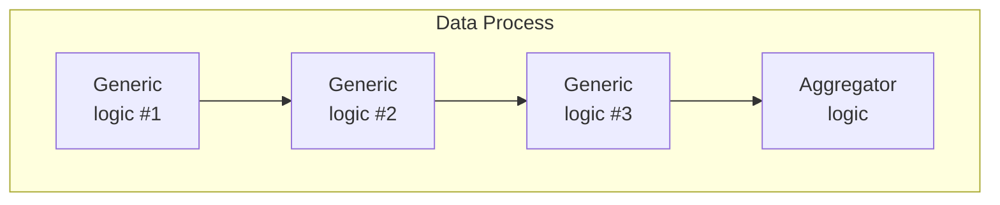
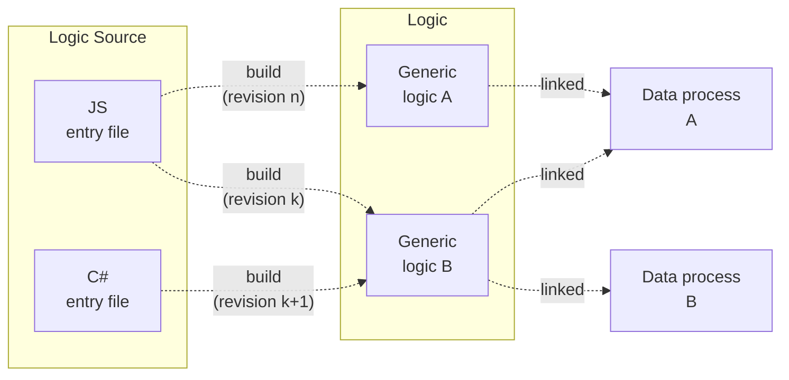

# Overview

An overview of the concept and purpose of LOC logic.

## What is a Logic?

In LOC, a **logic** is an executable code module that can contain any business logic and be part of a [data process](/main/category/data-process).

### Logic Types

The primary logic types are:

-   **Generic** logic
-   **Aggregator** logic - the last logic in a data process

Generic logic can be included in any data process in any order, thus makes them modularised and reusable. The aggregator logic, as the name suggests, is the last logic in the data process to collect and output (finalise) data.

A data process has **at least one generic logic** and **only one aggregator logic**.



### Logic Source and Revision

> See: [Manage Logic Source](/main/feature/logic/source)

A logic is, in fact, a _compiled asset_ based on a source script called **entry file**. The entry files are collectively referred as **logic source**.



When a logic is updated from an entry file, a new **revision** will be created. The older logic version(s) will still be available to avoid breaking changes.

Also:

-   A logic can be created or modified using **any entry file in any languages** of the _same logic type_.
-   A data process can link **any revision of any built logic**.

:::info Permanent ID (PID)
Every user asset created in LOC - for example, a logic - will have an unique identity string called **PID (permanent ID)**.
:::

### Shared Modules and Project Files

Multiple logic can share libraries or modules from so-called **shared modules**, which are entry files in a separated folder in the logic source. The referenced libraries or modules will be bundled and compiled together into a logic asset if imported.

The logic source also contains the package or project configuration file, for example, `package.json` for JavaScript/TypeScript logic and `Logic.csproj` for C# logic.

:::info
_Everything_ in the shared module and the third-party packages defined in the project file will be included in the logic building process.
:::

### Cloud Logic vs. Native Logic

> See: [View and Manage Logic](/main/feature/logic/manage)

Depending on where the source files are stored, a logic would be categorised to one of the following group:

|                              | **Cloud Logic** | **Native Logic**             |
| ---------------------------- | --------------- | ---------------------------- |
| Created in                   | LOC Studio      | Local workspace              |
| Built (compiled) in          | LOC Core        | LOC CLI (in local workspace) |
| Source (entry file) viewable | Yes             | Yes                          |
| Editable in Studio           | Yes             | No                           |

## Logic Structure

A logic is consisted of two functions named as, for example, `run` and `handleError` in JavaScript:

import Tabs from "@theme/Tabs";
import TabItem from "@theme/TabItem";

<Tabs>
  <TabItem value="js" label="JavaScript" default>

```javascript showLineNumbers
export async function run(ctx) {
    // business logic code
}

export async function handleError(ctx, error) {
    // error handling code
}
```

  </TabItem>
  <TabItem value="ts" label="TypeScript">

```typescript showLineNumbers
import { GenericContext, RailwayError } from "@fstnetwork/loc-logic-sdk";

export async function run(ctx: GenericContext) {
    // business logic code
}

export async function handleError(ctx: GenericContext, error: RailwayError) {
    // error handling code
}
```

  </TabItem>
  <TabItem value="csharp" label="C#">

```csharp showLineNumbers
public static class Logic
{

    public static async Task Run(Context ctx)
    {
        // business logic code
    }

    public static async Task HandleError(Context ctx, Exception error)
    {
        // error handling code
    }
}
```

  </TabItem>
</Tabs>

See [Execution and Task](/main/category/execution-and-task) for how the error handling in logic works.

### Logic Languages and SDKs

LOC currently supports the following languages with corresponding SDKs (links to SDK docs):

| Supported Language    | SDK                       |
| --------------------- | ------------------------- |
| JavaScript/TypeScript | [SDK for JS/TS](/sdk-ts)  |
| C#                    | [SDK for C#](/sdk-csharp) |

SDKs are included via the project files for building logic.

### Agents

> See: [Agent](/main/category/agent)

SDKs include a list of **agents**, which are the interface for logic to access built-in data services in the LOC runtime.
