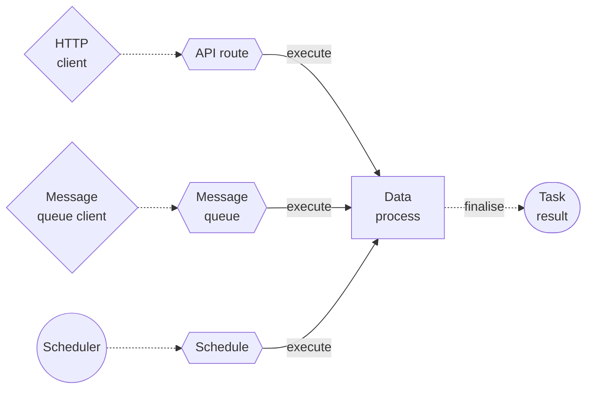

# Overview

An overview of the concept and purpose of LOC triggers.

## What is a Trigger?

**Triggers** are mechanisms to start an execution with one or more linked data processes as tasks running _simultaneously_.

:::info Trigger Broker
The triggers _do not_ execute tasks directly. Instead, they broadcast messages to the LOC trigger broker, which will in turn inform the LOC runtime to initialise the executions.
:::

Triggers do not have revisions. The same data process can be linked to multiple triggers with any type.

### Trigger Types

> See: [API Route](/main/feature/trigger/api-route) and [Schedule](/main/feature/trigger/schedule)

LOC currently provides the following triggers:

| Trigger Type      | Description   | Invoke Mode | Can Has Payload |
| ----------------- | ------------- | ----------- | --------------- |
| **API Route**     | HTTP requests | Sync/Async  | Yes             |
| **Message Queue** | MQ messages   | Async       | Yes             |
| **Schedule**      | Scheduled job | Async       | No              |

### Trigger Response

> See: [Execution and Task](/main/category/execution-and-task)

For some trigger types in specific modes, the invoker - for example, the HTTP client that invoked an API route - will receive a response containing execution and task results.

The following setup will return a response to the trigger:

-   API Route (synchronous only)
-   Message Queue (asynchronous)

For all trigger types and modes, the results will be available as execution results.

## Load Trigger Metadata and Payload

The trigger metadata and payload can be loaded from a logic's data context object.

See the SDK docs for details.

-   [Trigger Payload (SDK for JS/TS)](/sdk-ts/category/payload)
-   [Trigger Payload (SDK for C#)](/sdk-csharp/category/payload)
