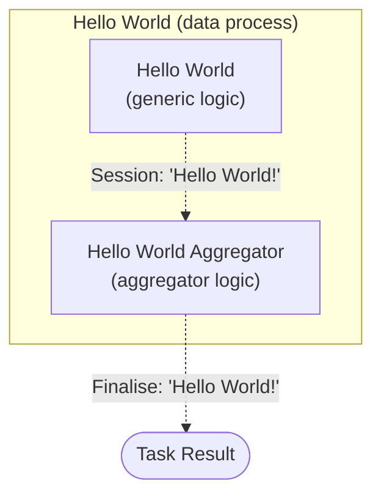

# Hello World: Quick Start

The beginner's walkthrough to create and run a "Hello World" task in LOC.

:::info Learning Objective

1. To create a simplest data process with one generic logic and one aggregator logic. The data process would return a simple "Hello World" message.

2. Execute the data process as a task and view its execution result.

:::

---

## Data Process Design



#### Logic

| Logic | Type       | Name                     | Purpose                                                                                  |
| ----- | ---------- | ------------------------ | ---------------------------------------------------------------------------------------- |
| #1    | Generic    | `Hello World`            | Write string `"Hello World!"` into the session storage.                                  |
| #2    | Aggregator | `Hello World Aggregator` | Get the string `"Hello World!"` from session storage and finalise it in the task result. |

#### Task Payload

None required.

#### Task Result

```json
{
    "status": "ok",
    "taskId": "...",
    "message": "Hello World!"
}
```

---

## Sign in LOC Studio

> See: [Signing In](/main/feature/misc/studio-interface#signing-in)

Make sure you have an account for your LOC instance, open LOC Studio in the web browser and sign in.

---

## Create Logic Entry Files

> See: [Create an Entry File](/main/feature/logic/source#create-an-entry-file)

In order to create a **data process** (a data pipeline that can be run as a **task**), it requires at least one **generic logic** and only one **aggregator logic**. We will create two simple logic for this tutorial.

#### Create a Generic File

1. Go to **Logic** ➞ **Logic Source** and select **Javascript repository**, **Typescript repository** or **C# repository** depending on the language of your choice.

2. Right-click on `entry_files` and select **New Folder** to create a folder (for example, named using your own name).

3. Right-click on the folder and select **New Generic File**.

4. Name the entry file as **`hello-world.js`**, **`hello-world.ts`** or **`hello-world.cs`** depending on the language of your choice.

5. While still selecting the file, click the **Edit icon** on the top right.

6. Copy the following code (the language you've chosen) and paste into the editor to replace the template script, then click the **Save icon**.

7. Click the **Cancel icon** to close editing mode.

import Tabs from "@theme/Tabs";
import TabItem from "@theme/TabItem";

<Tabs>
  <TabItem value="js1" label="JavaScript" default>

```javascript title="hello-world.js" showLineNumbers
import { LoggingAgent, SessionStorageAgent } from "@fstnetwork/loc-logic-sdk";

/** @param {import('@fstnetwork/loc-logic-sdk').GenericContext} ctx */
export async function run(ctx) {
    // log a message
    LoggingAgent.info("Hello World!");

    // write message to session storage
    await SessionStorageAgent.putString("message", "Hello World!");
}

/**
 * @param {import('@fstnetwork/loc-logic-sdk').GenericContext} ctx
 * @param {import('@fstnetwork/loc-logic-sdk').RailwayError} error
 */
export async function handleError(ctx, error) {}
```

  </TabItem>
  <TabItem value="ts1" label="TypeScript">

```typescript title="hello-world.ts" showLineNumbers
import {
    GenericContext,
    LoggingAgent,
    RailwayError,
    SessionStorageAgent,
} from "@fstnetwork/loc-logic-sdk";

export async function run(ctx: GenericContext) {
    // log a message
    LoggingAgent.info("Hello World!");

    // write message to session storage
    await SessionStorageAgent.putString("message", "Hello World!");
}

export async function handleError(ctx: GenericContext, error: RailwayError) {}
```

  </TabItem>
  <TabItem value="csharp1" label="C#">

```csharp title="hello-world.cs" showLineNumbers
public static class Logic
{
   public static async Task Run(Context ctx)
   {
        // log a message
        await LoggingAgent.Info("Hello World!");

        // write message to session storage
        await SessionStorageAgent.Put(
            "message",
            StorageValue.FromString("Hello World!")
        );
   }

   public static async Task HandleError(Context ctx, Exception error)
   {

   }
}
```

  </TabItem>
</Tabs>

<div className="center-padded-sm">
    
</div>

#### Create a Aggregator File

1. In the same manner as above, right-click on your folder and select **New Folder** to create a folder (for example, named using your own name).

2. Right-click on the folder and select **New Generic File**.

3. Name the entry file as **`hello-world-aggregator.js`**, **`hello-world-aggregator.ts`** or **`hello-world-aggregator.cs`** depending on the language of your choice.

4. While still selecting the file, click the **Edit icon** on the top right.

5. Copy the following code (the language you've chosen) and paste into the editor to replace the template script, then click the **Save icon**.

6. Click the **Cancel icon** to close editing mode.

<Tabs>
  <TabItem value="js2" label="JavaScript" default>

```javascript title="hello-world-aggregator.js" showLineNumbers
import { ResultAgent, SessionStorageAgent } from "@fstnetwork/loc-logic-sdk";

/** @param {import('@fstnetwork/loc-logic-sdk').AggregatorContext} ctx */
export async function run(ctx) {
    // read message from session storage
    const message = await SessionStorageAgent.get("message");

    // finalise task result
    ResultAgent.finalize({
        status: "ok",
        taskId: ctx.task.taskKey.taskId,
        message: message,
    });
}

/**
 * @param {import('@fstnetwork/loc-logic-sdk').AggregatorContext} ctx
 * @param {import('@fstnetwork/loc-logic-sdk').RailwayError} error
 */
export async function handleError(ctx, error) {
    // finalise task result with error
    ResultAgent.finalize({
        status: "error",
        taskId: ctx.task.taskKey.taskId,
        message: error.message,
    });
}
```

  </TabItem>
  <TabItem value="ts2" label="TypeScript">

```typescript title="hello-world-aggregator.ts" showLineNumbers
import {
    AggregatorContext,
    RailwayError,
    ResultAgent,
    SessionStorageAgent,
} from "@fstnetwork/loc-logic-sdk";

export async function run(ctx: AggregatorContext) {
    // read message from session storage
    const message: string = await SessionStorageAgent.get("message");

    // finalise task result
    ResultAgent.finalize({
        status: "ok",
        taskId: ctx.task.taskKey.taskId,
        message: message,
    });
}

export async function handleError(ctx: AggregatorContext, error: RailwayError) {
    // finalise task result with error
    ResultAgent.finalize({
        status: "error",
        taskId: ctx.task.taskKey.taskId,
        message: error.message,
    });
}
```

  </TabItem>
  <TabItem value="csharp2" label="C#">

```csharp title="hello-world-aggregator.cs" showLineNumbers
public static class Logic
{
   public static async Task Run(Context ctx)
   {
        // read message from session storage
        string? message = (await SessionStorageAgent.Get("message"))?.StringValue;

        // read task metadata
        var task = await ctx.GetTask();

        // finalise task result
        await ResultAgent.SetResult(
            new Dictionary<string, object?>()
            {
                { "status", "ok" },
                { "taskId", task.TaskKey.TaskIdString() },
                { "message", message }
            }
        );
   }

   public static async Task HandleError(Context ctx, Exception error)
   {
        // finalise task result with error
        var task = await ctx.GetTask();
        await ResultAgent.SetResult(
            new Dictionary<string, object?>()
            {
                { "status", "error" },
                { "taskId", task.TaskKey.TaskIdString() },
                { "message", error.Message }
            }
        );
   }
}
```

  </TabItem>
</Tabs>

---

## Build Logic

> See: [Build a Logic From an Entry File](/main/feature/logic/build#build-a-logic-from-an-entry-file)

The next step is to compile and deploy the logic using the source entry files.

#### Build Generic Logic

1. In the logic source, select **`hello-world.*`** and click the **Build icon** on the top right.

2. In the build window, select **Create new** and enter the name **Hello World**.

3. Click **Build**.

#### Build Aggregator Logic

1. In the same manner of above, select **`hello-world-aggregator.*`** and click the **Build icon** on the top right.

2. In the build window, select **Create new** and enter the name **Hello World Aggregator**.

3. Click **Build**.

---

## Create Project and Scenario

> See: [Create a Project and Scenario](/main/feature/data-process/project-scenario#create-a-project-and-scenario)

Create a project (for example, **`<Your Name>'s' Project`**) and a scenario (for example, **`Tutorial`**) so that you can create data processes.

---

## Create Data Process

> See: [Create Data Process](/main/feature/data-process/create)

Now with the two logic, a project and a scenario created, we can create a data process to include these two logic.

1. In LOC Studio, go to **Data Process** ➞ **Explorer**.

2. Select a scenario and click **Create Data Process** on the top right.

3. Name the data process as **`Hello World`** or your name of choice.

4. Click **Add Generic Logic**, select **`hello-world.*`** in the list and click **Add**.

5. Click **Add Aggregator Logic**, select **`hello-world-aggregator.*`** in the list and click **Add**.

6. Back in the data process creation window, click **Create**.

<div className="center-padded-sm">
    
</div>

:::tip Having Trouble to Find Your Logic?

1. Have you built the logic and was it built successfully? If not sure, go to [**Cloud Logic**](/main/feature/logic/manage#inspect-a-logic) to check if it exist, and go to [**Build History**](/main/feature/logic/build#browse-build-history) to check the build status.

2. Have you accidentally create and build the **wrong type** of logic (generic or aggregator)?

:::

---

## Run the Task

> See: [Execute with A Mocked API Route](/main/feature/data-process/execute#execute-with-a-mocked-api-route)

1. In the data process explorer, select the **`Hello World`** data process and click **Execute Data Process** on the top right.

2. Select **Execute as API Route Task**.

3. Skip the payload and click **Execute**.

4. Wait for the task execution to finish.

<div className="center-padded-sm">
    
</div>

5. Click the **Preview icon** under the **Result** column title to inspect the task result.

```json
{
    "message": "Hello World!",
    "status": "ok",
    "taskId": "wQ2hNBVYXJUB89dvJ53ZLg"
}
```

You can see the task has been successfully executed and has returned a JSON data containing the "Hello World" message.
