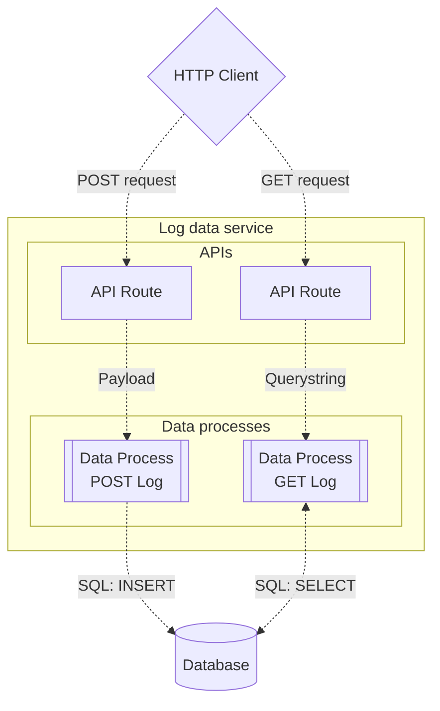
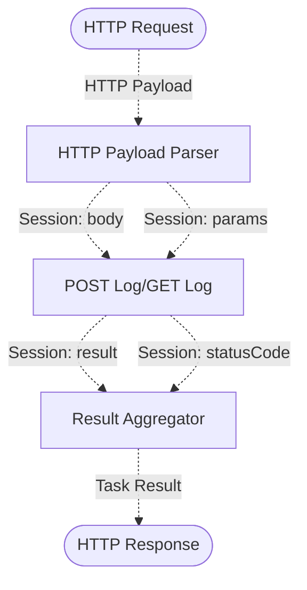

# Logger: Create RESTful Data Services

Although LOC data processes are not built and run exactly like microservices (containered applications), they are versatile enough for creating similar functionalities, and can be deployed or revisied quickly thanks to their serverless nature.

Here we will learn how to create _two_ simple RESTful services that can read or wrote user logs in a database.

:::info Learning Objective

1. To create two data process that can read and write a database table with RESTful-like input and output.

2. To create reusable logic modules and to control their behavior using logic variables.

3. To create an agent configuration for

4. To create multiple API routes as the RESTful API endpoints.

:::

---

## Data Service Design

### Database Table Schema

For this tutorial, we will create a simple table `Log` in the database (for which we will use [Microsoft SQL Server](https://learn.microsoft.com/en-us/sql/sql-server/what-is-sql-server) as the example) with the following fields:

| Field       | Type                    |
| ----------- | ----------------------- |
| `ID`        | `INT IDENTITY NOT NULL` |
| `Message`   | `Text`                  |
| `Timestamp` | `DATETIME`              |

:::tip
`IDENTITY` in Transact-SQL is equivalent to `AUTO_INCREMENT` in other SQL variations.
:::

<details>
    <summary>Create or Drop Log Table in MS SQL Server</summary>

#### Create table

```sql title="Transact-SQL"
CREATE TABLE dbo.Log (
    ID INT IDENTITY NOT NULL,
    Message TEXT,
    Timestamp DATETIME
);
GO
```

The table name is `dbo.Log` since `dbo` is the default schema for all tables in SQL Server.

#### Delete all rows in table

```sql title="Transact-SQL"
DELETE FROM dbo.Log;
GO
```

Be noted that delete the table content _will not_ reset the auto increment value of `ID`.

#### Drop Table

```sql title="Transact-SQL"
DROP TABLE dbo.Log;
GO
```

To reset the auto increment value of `ID`, drop (remove) the table then create it again.

</details>

### API Endpoints

We will create two RESTful-like APIs to read and write the `Log` table:

| Method | API path                              | Description                          | Input        |
| ------ | ------------------------------------- | ------------------------------------ | ------------ |
| `POST` | `/api/data-service/v1/logs`           | Write logs                           | JSON payload |
| `GET`  | `/api/data-service/v1/logs?limit={n}` | Query logs with maximum limit of `n` | Querystring  |

import Tabs from "@theme/Tabs";
import TabItem from "@theme/TabItem";

<Tabs>
  <TabItem value="post-log" label="POST Log API" default>

#### Input

```json title="Payload (request body)"
{
    "logs": ["Life, Universe and Everything", "42", "Don't Panic"]
}
```

The POST data service will throw an error or exception if no logs are provided in the payload.

#### Response

```json title="Task result (response body)"
{
    "status": "ok",
    "statusCode": 201,
    "timestamp": "2024-01-01T12:00:00.000000000Z",
    "result": {
        "affectedRowCount": 3
    }
}
```

  </TabItem>
  <TabItem value="get-log" label="GET Log API">

#### Input

```text title="Querystring (request URL)"
?limit={n}
```

`n` will be set to `1000` if no valid parameter is provided in the querystring.

#### Response

```json title="Task result (response body)"
{
    "status": "ok",
    "statusCode": 200,
    "timestamp": "2024-01-01T18:00:00.000000000Z",
    "result": {
        "logCount": 3,
        "logs": [
            {
                "id": 3,
                "message": "Don't Panic",
                "timestamp": "2024-01-01T12:00:00.000000000Z"
            },
            {
                "id": 2,
                "message": "42",
                "timestamp": "2024-01-01T12:00:00.000000000Z"
            },
            {
                "id": 1,
                "message": "Life, Universe and Everything",
                "timestamp": "2024-01-01T12:00:00.000000000Z"
            }
        ]
    }
}
```

  </TabItem>
</Tabs>

#### Response On Error

```json title="Task result (response body)"
{
    "status": "error",
    "statusCode": 500,
    "timestamp": "2024-01-01T18:00:00.000000000Z",
    "result": {
        "error": {
            "name": "error name",
            "message": "error message",
            "stack": "error stack"
        },
        "task": {
            "executionId": "execution id",
            "taskId": "task id",
            "dataProcessId": "data process id",
            "logicId": "logic id where the error has occurred"
        }
    }
}
```

### Trigger and Data Process

We will create two API routes and two data processes to implement each of the APIs:



Although both APIs share the same URL, the HTTP method is different hence they will be handled by separated API routes in LOC.

### Logic

In this tutorial, each data process will have 3 logic. Further more, **the first and the last logic will be the same**, which means we only have to create **4 logic** instead of 6.

| Logic          | Type       | Name                  | Purpose                                                                                                                      |
| -------------- | ---------- | --------------------- | ---------------------------------------------------------------------------------------------------------------------------- |
| #1             | Generic    | `HTTP Payload Parser` | Parse payload and Query String to JSON and write everything into the session storage.                                        |
| #2a (POST Log) | Generic    | `Post Log`            | Connect to the database, submit an action query to insert logs, then write the number of affected rows into session storage. |
| #2b (GET Log)  | Generic    | `Get Log`             | Parse the name field from payload as a `Person` data structure and write it into the session storage.                        |
| #3             | Aggregator | `Result Aggregator`   | Finalise a task result with anything stored as `result` in the session storage.                                              |

#### Logic "Contracts"

For `HTTP Payload Parser` and `Result Aggregator` to be reusable logic modules, they must provide an "interface" of predetermined input and output:



As long as the `POST Log` and `GET Log` logic comsume data from the session storage values `body` and/or `params` and write results into `result` and `statusCode`, their implementation can be modified without affecting `HTTP Payload Parser` or `Result Aggregator`.

The session storage values are designed as follows:

| Session Storage Value | Type                        | Description                                     |
| --------------------- | --------------------------- | ----------------------------------------------- |
| `body`                | JSON                        | Parsed data from the HTTP payload body          |
| `params`              | JSON                        | Parsed data from the HTTP payload querystring   |
| `result`              | JSON                        | Data to be outputed into the task result        |
| `statusCode`          | JSON (as an integer number) | HTTP status code to be set with the task result |

---

## Create Agent Configuration

> See: [Manage Configuration](/main/feature/agent-config/manage)

Create the following agent configuration for the database server: (as mentioned above, we'll use a Microsoft SQL Server as example:)

| Field                    | Value                           |
| ------------------------ | ------------------------------- |
| Agent Configuration Name | `MS SQL Server`                 |
| Agent Configuration Type | `Database Agent`                |
| Database Type            | `MSSQL`                         |
| Host                     | (Your SQL server URL)           |
| Port                     | `1433`                          |
| Username                 | (Your SQL server username)      |
| Password                 | (Your SQL server password)      |
| Database Name            | (Your SQL server database name) |

---

## Create and Build Logic

> See: [Create an Entry File](/main/feature/logic/source#create-an-entry-file) and [Build a Logic From an Entry File](/main/feature/logic/build#build-a-logic-from-an-entry-file)

### Generic Logic: `HTTP Payload Parser`

The **`HTTP Payload Parser`** is designed with the following purposes:

1. Read the trigger payload.
2. Throw an error or exception if the payload is not a HTTP payload or does not contain one.
3. Read and log the payload body and querystring.
4. Parse the body and querystring to JSON objects (`null` if no data or failed to parse; an error log will be written but no error or exception will be thrown).
5. Log the JSON objects and write them into the session storage as `body` and `params` respectively.

<Tabs>
  <TabItem value="js1" label="JavaScript" default>

```javascript title="http-payload-parser.js" showLineNumbers
import { LoggingAgent, SessionStorageAgent } from "@fstnetwork/loc-logic-sdk";

/** @param {import('@fstnetwork/loc-logic-sdk').GenericContext} ctx */
export async function run(ctx) {
    const payload = await ctx.payload();

    if (!("http" in payload))
        throw new Error("this logic only accepts http payload");

    const data = payload.http.request.data;
    const decodedData = data
        ? new TextDecoder().decode(new Uint8Array(data))
        : "";
    const query = payload.http.request.query;

    LoggingAgent.info(`body: ${decodedData}`);
    LoggingAgent.info(`querystring: ${query}`);

    let body = null;
    try {
        if (data) body = JSON.parse(decodedData);
    } catch (e) {
        LoggingAgent.error(`error on parsing payload to JSON: ${e.message}`);
    }
    const params = query
        ? Object.fromEntries(new URLSearchParams(query))
        : null;

    LoggingAgent.info({ body: body });
    LoggingAgent.info({ params: params });

    await SessionStorageAgent.putJson("body", body);
    await SessionStorageAgent.putJson("params", params);
}

/**
 * @param {import('@fstnetwork/loc-logic-sdk').GenericContext} ctx
 * @param {import('@fstnetwork/loc-logic-sdk').RailwayError} error
 */
export async function handleError(ctx, error) {
    LoggingAgent.error({
        errorMessage: error.message,
        stack: error.stack,
        task: ctx.task.taskKey,
    });
}
```

  </TabItem>
  <TabItem value="ts1" label="TypeScript">

```typescript title="http-payload-parser.ts" showLineNumbers
import {
    GenericContext,
    LoggingAgent,
    RailwayError,
    SessionStorageAgent,
} from "@fstnetwork/loc-logic-sdk";

export async function run(ctx: GenericContext) {
    const payload = await ctx.payload();

    if (!("http" in payload))
        throw new Error("this logic only accepts http payload");

    const data = payload.http.request.data;
    const decodedData = data
        ? new TextDecoder().decode(new Uint8Array(data))
        : "";
    const query = payload.http.request.query;

    LoggingAgent.info(`body: ${decodedData}`);
    LoggingAgent.info(`querystring: ${query}`);

    let body = null;
    try {
        if (data) body = JSON.parse(decodedData);
    } catch (e) {
        LoggingAgent.error(`error on parsing payload to JSON: ${e.message}`);
    }
    const params = query
        ? Object.fromEntries(new URLSearchParams(query))
        : null;

    LoggingAgent.info({ body: body });
    LoggingAgent.info({ params: params });

    await SessionStorageAgent.putJson("body", body);
    await SessionStorageAgent.putJson("params", params);
}

export async function handleError(ctx: GenericContext, error: RailwayError) {
    LoggingAgent.error({
        errorMessage: error.message,
        stack: error.stack,
        task: ctx.task.taskKey,
    });
}
```

  </TabItem>
  <TabItem value="csharp1" label="C#">

```csharp title="http-payload-parser.cs" showLineNumbers
using System.Collections.Specialized;
using System.Text;
using System.Text.Json.Nodes;
using System.Web;

public static class Logic
{

   public static async Task Run(Context ctx)
   {
        var payload = await ctx.GetPayload();

        if (payload.Http is null)
            throw new Exception("this logic only accepts http payload");

        byte[] data = payload.Http.Request.Data;
        string decodedData = data.Length > 0 ? Encoding.UTF8.GetString(data) : "";
        string query = payload.Http.Request.Query;

        await LoggingAgent.Info($"body: {decodedData}");
        await LoggingAgent.Info($"querystring: {query}");

        JsonNode? body = null;
        try
        {
            if (decodedData.Length > 0)
                body = JsonNode.Parse(decodedData);
        }
        catch (Exception e)
        {
            await LoggingAgent.Error($"error on parsing payload to JSON: {e.Message}");
        }

        JsonObject? queryParams = null;
        if (!String.IsNullOrWhiteSpace(query))
        {
            NameValueCollection parsedQueryParams = HttpUtility.ParseQueryString(query);
            if (parsedQueryParams.AllKeys is not null)
            {
                queryParams = new JsonObject {};
                foreach (string key in parsedQueryParams.AllKeys)
                {
                    queryParams[key] = parsedQueryParams[key];
                }
            }
        }

        await LoggingAgent.Info(new JsonObject
            { ["body"] = body }
        );
        await LoggingAgent.Info(new JsonObject
            { ["params"] = queryParams }
        );

        await SessionStorageAgent.Put(
            "body",
            StorageValue.FromJson(body)
        );
        await SessionStorageAgent.Put(
            "params",
            StorageValue.FromJson(queryParams)
        );
   }

   public static async Task HandleError(Context ctx, Exception error)
   {
        var task = await ctx.GetTask();
        await LoggingAgent.Error(new JsonObject
            {
                ["errorMessage"] = error.Message,
                ["stack"] = error.StackTrace,
                ["task"] = new JsonObject
                {
                    ["taskId"] = task.TaskKey.TaskIdString(),
                    ["executionId"] = task.TaskKey.ExecutionIdString()
                }
            }
        );
   }
}
```

  </TabItem>
</Tabs>

### Generic Logic: `POST Log`

<Tabs>
  <TabItem value="js2" label="JavaScript" default>

```javascript title="post-log.js" showLineNumbers
import { DatabaseAgent, LoggingAgent, SessionStorageAgent } from "@fstnetwork/loc-logic-sdk";

/** @param {import('@fstnetwork/loc-logic-sdk').GenericContext} ctx */
export async function run(ctx) {
    const body = await SessionStorageAgent.get("body");
    const logs = body?.logs;

    if (!body || !logs) {
        await SessionStorageAgent.putJson("statusCode", 400);
        throw new Error("the session value 'body' does not exist or contain no logs");
    }

    let placeholders = [];
    let sqlParams = [];
    const now = new Date().toISOString();
    logs.foreach((log, idx) => {
        placeholders.push(`((@P${idx * 2 + 1}), (@P${idx * 2 + 2}))`);
        sqlParams.push(log);
        sqlParams.push(now);
    });
    const statement = `INSERT INTO dbo.Log (Message, Timestamp) VALUES ${placeholders.join(
         ", ",
    )};`
    LoggingAgent.info(`SQL statement: ${statement}`);
    LoggingAgent.info({ sqlParams: sqlParams });

    const dbClient = await DatabaseAgent.acquire("log-db-config-ref");
    let err = null;
    let statusCode = 201;
    try {
        await dbClient.execute(statement, sqlParams);

        const result = {
            affectedRowCount: log.length;
        };

        LoggingAgent.info({ result: result });
        await SessionStorageAgent.putJson("result", result)
    } catch (e) {
        err = e;
        statusCode = 500;
    } finally {
        await dbClient.release();

        LoggingAgent.info(`statusCode: ${statement}`);
        await SessionStorageAgent.putJson("statusCode", statusCode);

        if (err) throw new Error(`database error: ${err.message}`);
    }
}

/**
 * @param {import('@fstnetwork/loc-logic-sdk').GenericContext} ctx
 * @param {import('@fstnetwork/loc-logic-sdk').RailwayError} error
 */
export async function handleError(ctx, error) {
    LoggingAgent.error({
        errorMessage: error.message,
        stack: error.stack,
        task: ctx.task.taskKey,
    });
}
```

  </TabItem>
  <TabItem value="ts2" label="TypeScript">

```typescript title="post-log.ts" showLineNumbers
import {
    DatabaseAgent,
    GenericContext,
    LoggingAgent,
    RailwayError,
    SessionStorageAgent,
} from "@fstnetwork/loc-logic-sdk";

export async function run(ctx: GenericContext) {
    const body: any = await SessionStorageAgent.get("body");
    const logs: number[] = body?.logs;

    if (!body || !logs) {
        await SessionStorageAgent.putJson("statusCode", 400);
        throw new Error("the session value 'body' does not exist or contain no logs");
    }

    let placeholders: string[] = [];
    let sqlParams: any[] = [];
    const now = new Date().toISOString();
    logs.foreach((log, idx) => {
        const timestamp = new Date().toISOString();
        placeholders.push(`((@P${idx * 2 + 1}), (@P${idx * 2 + 2}))`);
        sqlParams.push(log);
        sqlParams.push(now);
    });
    const statement = `INSERT INTO dbo.Log (Message, Timestamp) VALUES ${placeholders.join(", ")};`
    LoggingAgent.info(`SQL statement: ${statement}`);
    LoggingAgent.info({ sqlParams: sqlParams });

    const dbClient = await DatabaseAgent.acquire("log-db-config-ref");
    let err = null;
    let statusCode = 201;
    try {
        await dbClient.execute(statement, sqlParams);

        const result = {
            affectedRowCount: log.length;
        };

        LoggingAgent.info({ result: result });
        await SessionStorageAgent.putJson("result", result)
    } catch (e) {
        err = e;
        statusCode = 500;
    } finally {
        await dbClient.release();

        LoggingAgent.info(`statusCode: ${statement}`);
        await SessionStorageAgent.putJson("statusCode", statusCode);

        if (err) throw new Error(`database error: ${err.message}`);
    }
}

export async function handleError(ctx: GenericContext, error: RailwayError) {
    LoggingAgent.error({
        errorMessage: error.message,
        stack: error.stack,
        task: ctx.task.taskKey,
    });
}
```

  </TabItem>
  <TabItem value="csharp2" label="C#">

```csharp title="post-log.cs" showLineNumbers
using System.Text.Json.Nodes;

public static class Logic
{

   public static async Task Run(Context ctx)
   {
        JsonNode? body = (await SessionStorageAgent.Get("body"))?.JsonValue;
        JsonArray? logs = body?["logs"].AsArray();

        if (body is null || logs is null)
        {
            await SessionStorageAgent.Put(
                "statusCode",
                StorageValue.FromJson(JsonValue.Create(400))
            );
            throw new Exception("the session value 'body' does not exist or contain no logs");
        }

        List<string> placeholders = new();
        List<object> sqlParams = new();
        string now = DateTime.UtcNow.ToString("yyyy-MM-ddTHH:mm:ss.fffK");
        for(int idx = 0; idx < logs.Count; idx++)
        {
            string logValue = "";
            logs[idx].AsValue().TryGetValue<string>(out logValue);
            placeholders.Add($"((@P{idx * 2 + 1}), (@P{idx * 2 + 2}))");
            sqlParams.Add(logValue);
            sqlParams.Add(now);
        }

        string statement = $"INSERT INTO dbo.Log (Message, Timestamp) VALUES {String.Join(", ", placeholders)};";

        await LoggingAgent.Info($"SQL statement: {statement}");
        await LoggingAgent.Info(new Dictionary<string, object?>()
            {
                { "sqlParams", sqlParams }
            }
        );

        var dbClient = await DatabaseAgent.Acquire("log-db-config-ref");
        Exception? err = null;
        int statusCode = 201;
        try
        {
            await dbClient.Execute(statement, sqlParams);

            JsonObject result = new()
            {
                ["affectedRowCount"] = logs.Count
            };

            await LoggingAgent.Info(new JsonObject
                { ["result"] = result }
            );
            await SessionStorageAgent.Put(
                "result",
                StorageValue.FromJson(result)
            );
        }
        catch (Exception e)
        {
            err = e;
            statusCode = 500;
        }
        finally
        {
            await dbClient.Release();

            await LoggingAgent.Info($"statusCode: {statusCode}");
            await SessionStorageAgent.Put(
                "statusCode",
                StorageValue.FromJson(JsonValue.Create(statusCode))
            );

            if (err is not null) throw new Exception($"database error: {err.Message}");
        }
   }

   public static async Task HandleError(Context ctx, Exception error)
   {
        var task = await ctx.GetTask();
        await LoggingAgent.Error(new JsonObject
            {
                ["errorMessage"] = error.Message,
                ["stack"] = error.StackTrace,
                ["task"] = new JsonObject
                {
                    ["taskId"] = task.TaskKey.TaskIdString(),
                    ["executionId"] = task.TaskKey.ExecutionIdString()
                }
            }
        );
   }
}
```

  </TabItem>
</Tabs>

### Generic Logic: `GET Log`

<Tabs>
  <TabItem value="js3" label="JavaScript" default>

```javascript title="get-log.js" showLineNumbers
import { LoggingAgent, SessionStorageAgent } from "@fstnetwork/loc-logic-sdk";

/** @param {import('@fstnetwork/loc-logic-sdk').GenericContext} ctx */
export async function run(ctx) {
    const params = await SessionStorageAgent.get("params");
    let limit = 1000;
    try {
        limit = Number(params?.limit);
    } finally {
    }

    const statement =
        "SELECT TOP (@P1) * FROM dbo.Log ORDER BY Timestamp DESC, ID DESC;";
    LoggingAgent.info(`SQL statement: ${statement}`);
    LoggingAgent.info({ sqlParams: [limit] });

    const dbClient = await DatabaseAgent.acquire("log-db-config-ref");
    let err = null;
    let statusCode = 200;
    try {
        const dbResult = await dbClient.query(statement, [limit]);

        const logs = dbResult?.rows || [];
        const result = {
            logCount: logs.length,
            logs: logs.map((log) => {
                return {
                    id: Number(log.ID),
                    message: String(log.Message),
                    timestamp: String(log.Timestamp),
                };
            }),
        };

        LoggingAgent.info({ result: result });
        await SessionStorageAgent.putJson("result", result);
    } catch (e) {
        err = e;
        statusCode = 500;
    } finally {
        await dbClient.release();

        LoggingAgent.info(`statusCode: ${statusCode}`);
        await SessionStorageAgent.putJson("statusCode", statusCode);

        if (err) throw new Error(`database error: ${err.message}`);
    }
}

/**
 * @param {import('@fstnetwork/loc-logic-sdk').GenericContext} ctx
 * @param {import('@fstnetwork/loc-logic-sdk').RailwayError} error
 */
export async function handleError(ctx, error) {
    LoggingAgent.error({
        errorMessage: error.message,
        stack: error.stack,
        task: ctx.task.taskKey,
    });
}
```

  </TabItem>
  <TabItem value="ts3" label="TypeScript">

```typescript title="get-log.ts" showLineNumbers
import {
    DatabaseAgent,
    GenericContext,
    LoggingAgent,
    RailwayError,
    SessionStorageAgent,
} from "@fstnetwork/loc-logic-sdk";

export async function run(ctx: GenericContext) {
    const params: any = await SessionStorageAgent.get("params");
    let limit = 1000;
    try {
        limit = Number(params?.limit);
    } finally {
    }

    const statement =
        "SELECT TOP (@P1) * FROM dbo.Log ORDER BY Timestamp DESC, ID DESC;";
    LoggingAgent.info(`SQL statement: ${statement}`);
    LoggingAgent.info({ sqlParams: [limit] });

    const dbClient = await DatabaseAgent.acquire("log-db-config-ref");
    let err = null;
    let statusCode = 200;
    try {
        const dbResult = await dbClient.query(statement, [limit]);

        const logs: any[] = dbResult?.rows || [];
        const result = {
            logCount: logs.length,
            logs: logs.map((log) => {
                return {
                    id: Number(log.ID),
                    message: String(log.Message),
                    timestamp: String(log.Timestamp),
                };
            }),
        };

        LoggingAgent.info({ result: result });
        await SessionStorageAgent.putJson("result", result);
    } catch (e) {
        err = e;
        statusCode = 500;
    } finally {
        await dbClient.release();

        LoggingAgent.info(`statusCode: ${statusCode}`);
        await SessionStorageAgent.putJson("statusCode", statusCode);

        if (err) throw new Error(`database error: ${err.message}`);
    }
}

export async function handleError(ctx: GenericContext, error: RailwayError) {
    LoggingAgent.error({
        errorMessage: error.message,
        stack: error.stack,
        task: ctx.task.taskKey,
    });
}
```

  </TabItem>
  <TabItem value="csharp3" label="C#">

```csharp title="get-log.cs" showLineNumbers
using System.Text.Json.Nodes;

public static class Logic
{

   public static async Task Run(Context ctx)
   {
        JsonNode? queryParams = (await SessionStorageAgent.Get("params"))?.JsonValue;
        string limitData = queryParams?["limit"].GetValue<string>();
        int limit = 1000;
        try
        {
            limit = int.Parse(queryParams?["limit"].GetValue<string>());
        }
        finally {}

        string statement = "SELECT TOP (CAST((@P1) AS INTEGER)) * FROM dbo.Log ORDER BY Timestamp DESC, ID DESC;";

        await LoggingAgent.Info($"SQL statement: {statement}");
        await LoggingAgent.Info(new JsonObject
            { ["sqlParams"] = new JsonArray { limit } }
        );

        var dbClient = await DatabaseAgent.Acquire("log-db-config-ref");
        Exception? err = null;
        int statusCode = 200;
        try
        {
            var dbResult = await dbClient.Query(statement, new List<object>{ limit });

            JsonArray result = new();
            foreach(var row in dbResult.Rows)
            {
                var id = (JsonNode) row["ID"];
                var message = (JsonNode) row["Message"];
                var timestamp = (JsonNode) row["Timestamp"];
                result.Add(new JsonObject
                    {
                        ["id"] = id["Integer"].GetValue<int>(),
                        ["message"] = message["Text"].GetValue<string>(),
                        ["timestamp"] = timestamp["DateTime"].GetValue<string>()
                    }
                );
            }

            await LoggingAgent.Info(new JsonObject
                { ["result"] = result }
            );
            await SessionStorageAgent.Put(
                "result",
                StorageValue.FromJson(result)
            );
        }
        catch (Exception e)
        {
            err = e;
            statusCode = 500;
        }
        finally
        {
            await dbClient.Release();

            await LoggingAgent.Info($"statusCode: {statusCode}");
            await SessionStorageAgent.Put(
                "statusCode",
                StorageValue.FromJson(JsonValue.Create(statusCode))
            );

            if (err is not null) throw new Exception($"database error: {err.Message}");
        }
   }

   public static async Task HandleError(Context ctx, Exception error)
   {
        var task = await ctx.GetTask();
        await LoggingAgent.Error(new JsonObject
            {
                ["errorMessage"] = error.Message,
                ["stack"] = error.StackTrace,
                ["task"] = new JsonObject
                {
                    ["taskId"] = task.TaskKey.TaskIdString(),
                    ["executionId"] = task.TaskKey.ExecutionIdString()
                }
            }
        );
   }
}
```

  </TabItem>
</Tabs>

### Aggregator Logic: `Result Aggregator`

The result aggregator is responsible for collecting whatever result from previous logic, or handle the railway error if there is one.

<Tabs>
  <TabItem value="js4" label="JavaScript" default>

```javascript title="result-aggregator.js" showLineNumbers
import { LoggingAgent, SessionStorageAgent } from "@fstnetwork/loc-logic-sdk";

/** @param {import('@fstnetwork/loc-logic-sdk').GenericContext} ctx */
export async function run(ctx) {
    const result = await SessionStorageAgent.get("result");
    let statusCode = await SessionStorageAgent.get("statusCode");

    if (!statusCode || typeof statusCode != "number") statusCode = 200;

    LoggingAgent.info({ result: result });
    LoggingAgent.info(`statusCode: ${statusCode}`);

    ResultAgent.finalize({
        status: "ok",
        statusCode: statusCode,
        timestamp: new Date().toISOString(),
        result: result,
    }).httpStatusCode(statusCode);
}

/**
 * @param {import('@fstnetwork/loc-logic-sdk').GenericContext} ctx
 * @param {import('@fstnetwork/loc-logic-sdk').RailwayError} error
 */
export async function handleError(ctx, error) {
    let statusCode = await SessionStorageAgent.get("statusCode");

    if (!statusCode || typeof statusCode != "number") statusCode = 500;

    LoggingAgent.info(`statusCode: ${statusCode}`);

    ResultAgent.finalize({
        status: "error",
        statusCode: statusCode,
        timestamp: new Date().toISOString(),
        result: {
            error: {
                message: error.message,
                stack: error.stack,
            },
            task: {
                executionId: ctx.task.taskKey.executionId,
                taskId: ctx.task.taskKey.taskId,
                dataProcessId: ctx.task.dataProcess.permanentIdentity,
                logicId: error.logicPermanentIdentity,
            },
        },
    }).httpStatusCode(statusCode);
}
```

  </TabItem>
  <TabItem value="ts4" label="TypeScript">

```typescript title="result-aggregator.ts" showLineNumbers
import {
    AggregatorContext,
    LoggingAgent,
    RailwayError,
    ResultAgent,
    SessionStorageAgent,
} from "@fstnetwork/loc-logic-sdk";

export async function run(ctx: GenericContext) {
    const result: any = await SessionStorageAgent.get("result");
    let statusCode = await SessionStorageAgent.get("statusCode");
    if (!statusCode || typeof statusCode != "number") statusCode = 200;

    LoggingAgent.info({ result: result });
    LoggingAgent.info(`statusCode: ${statusCode}`);

    ResultAgent.finalize({
        status: "ok",
        statusCode: statusCode,
        timestamp: new Date().toISOString(),
        result: result,
    }).httpStatusCode(statusCode);
}

export async function handleError(ctx: GenericContext, error: RailwayError) {
    let statusCode = await SessionStorageAgent.get("statusCode");
    if (!statusCode || typeof statusCode != "number") statusCode = 500;

    LoggingAgent.info(`statusCode: ${statusCode}`);

    ResultAgent.finalize({
        status: "error",
        statusCode: statusCode,
        timestamp: new Date().toISOString(),
        result: {
            error: {
                message: error.message,
                stack: error.stack,
            },
            task: {
                executionId: ctx.task.taskKey.executionId,
                taskId: ctx.task.taskKey.taskId,
                dataProcessId: ctx.task.dataProcess.permanentIdentity,
                logicId: error.logicPermanentIdentity,
            },
        },
    }).httpStatusCode(statusCode);
}
```

  </TabItem>
  <TabItem value="csharp4" label="C#">

```csharp title="result-aggregator.cs" showLineNumbers
using System.Text.Json.Nodes;

public static class Logic
{

   public static async Task Run(Context ctx)
   {
        JsonNode? result = (await SessionStorageAgent.Get("result"))?.JsonValue;
        JsonNode? statusCodeData = (await SessionStorageAgent.Get("statusCode"))?.JsonValue;

        int statusCode = 200;
        if (statusCodeData is not null)
            statusCodeData.AsValue().TryGetValue<int>(out statusCode);

        await LoggingAgent.Info(new JsonObject
            { ["result"] = result }
        );
        await LoggingAgent.Info($"statusCode: {statusCode}");

        await ResultAgent.SetResult(
            new JsonObject
            {
                ["status"] = "ok",
                ["statusCode"] = statusCode,
                ["timestamp"] = DateTime.Now.ToString("o"),
                ["result"] = result
            }
        );
        await ResultAgent.SetHttpStatusCode(statusCode);
   }

   public static async Task HandleError(Context ctx, Exception error)
   {
        JsonNode? statusCodeData = (await SessionStorageAgent.Get("statusCode"))?.JsonValue;

        int statusCode = 500;
        if (statusCodeData is not null)
            statusCodeData.AsValue().TryGetValue<int>(out statusCode);

        await LoggingAgent.Info($"statusCode: {statusCode}");

        var task = await ctx.GetTask();

        Guid? logicPid = null;
        if (error is RailwayError railwayError)
            logicPid = railwayError.LogicIdentity?.PermanentIdentity;

        await ResultAgent.SetResult(
            new JsonObject
            {
                ["status"] = "error",
                ["statusCode"] = statusCode,
                ["timestamp"] = DateTime.Now.ToString("o"),
                ["result"] = new JsonObject
                {
                    ["error"] = new JsonObject
                    {
                        ["message"] = error.Message,
                        ["stack"] = error.StackTrace
                    },
                    ["task"] = new JsonObject
                    {
                        ["executionId"] = task.TaskKey.ExecutionIdString(),
                        ["taskId"] = task.TaskKey.TaskIdString(),
                        ["dataProcessId"] = task.DataProcess.PermanentIdentity.ToString(),
                        ["logicId"] = logicPid?.ToString()
                    }
                }
            }
        );
        await ResultAgent.SetHttpStatusCode(statusCode);
   }
}
```

  </TabItem>
</Tabs>

---

## Create Data Processes

> See: [Create Data Process](/main/feature/data-process/create)

Create the two data processes `POST Log Service` and `GET Log Service` with the four logic we've created and built:

|            | POST Log Service                                            | GET Log Service                     |                                                    |
| ---------- | ----------------------------------------------------------- | ----------------------------------- | -------------------------------------------------- |
| Generic #1 | [`HTTP Payload Parser`](#generic-logic-http-payload-parser) | `HTTP Payload Parser`               |                                                    |
| Generic #2 | [`POST Log`](#generic-logic-post-log)                       | [`GET Log`](#generic-logic-get-log) | Agent configuration reference: `log-db-config-ref` |
| Aggregator | [`Result Aggregator`](#aggregator-logic-result-aggregator)  | `Result Aggregator`                 |                                                    |

### Add Configuration to Logic

> See: [Add Configuration to Data Process](/main/feature/agent-config/add-config)

While creating or editing the data processes above, add the [database agent configuration we've created](#create-agent-configuration) to `POST Log` and `GET Log` with the reference name **`log-db-config-ref`**.

---

## Create and Invoke API Routes

> See: [API Route](/main/feature/trigger/api-route)

Create two API routes for each data process respectively (`Encapsulation` must set to `False` in both cases):

#### POST Log

| Field                 | Value                                                 |
| --------------------- | ----------------------------------------------------- |
| API Route Name        | **`POST Log API`**                                    |
| HTTP Method           | **`POST`**                                            |
| URL                   | **`/api/data-service/v1/logs`**                       |
| Request Mode          | **`Sync`**                                            |
| Response Content Type | **`JSON`**                                            |
| Encapsulation         | **`False`**                                           |
| API Tasks             | Data Process **`POST Log Service`** (latest revision) |

API invoke example:

```bash
curl -X POST -d '{
    "logs": ["Life, Universe and Everything", "42", "Don't Panic"]
}' 'https://{LOC server}/api/data-service/v1/logs'
```

#### GET Log

| Field                 | Value                                                |
| --------------------- | ---------------------------------------------------- |
| API Route Name        | **`GET Log API`**                                    |
| HTTP Method           | **`GET`**                                            |
| URL                   | **`/api/data-service/v1/logs`**                      |
| Request Mode          | **`Sync`**                                           |
| Response Content Type | **`JSON`**                                           |
| Encapsulation         | **`False`**                                          |
| API Tasks             | Data Process **`GET Log Service`** (latest revision) |

API invoke example:

```bash
curl -X GET 'https://{LOC server}/api/data-service/v1/logs?limit=1000'
```

---

With everything in place, you've successfully created two RESTful APIs that can read or write a database table.

:::tip Creating Additional APIs and Functionalities
Following this tutorial, you can create other data services in the same manner to support additional methods - for example, a `PATCH` service for updating logs and a `DELETE` service for removing them.

You can also add functionalities to the data services, for example, user authentication using either request headers or query string parameters, and additional data validation for the values in payload or querystring.
:::
