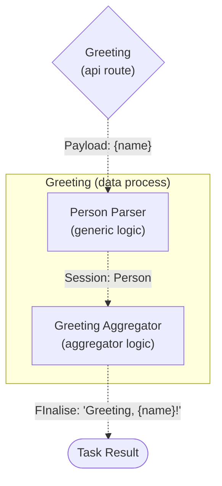

# Greeting (Part I): Run a Task with an API Route

Continuing the [quick start tutorial](/main/tutorial/task-with-trigger), we will now learn how to invoke a task with an actual trigger.

:::info Learning Objective

1. To create a data process and an API route trigger, and have the data process to read payload data from the trigger, parse the name and generate a greeting response.

2. Learn how to pass data in and out of the session storage and cast them to user-defined data structures.

3. Execute the data process as a task using the API route and view its execution result.

:::

---

## Data Process Design



#### Logic

| Logic | Type       | Name                  | Purpose                                                                                               |
| ----- | ---------- | --------------------- | ----------------------------------------------------------------------------------------------------- |
| #1    | Generic    | `Greeting`            | Parse the name field from payload as a `Person` data structure and write it into the session storage. |
| #2    | Aggregator | `Greeting Aggregator` | Get `Person` from session storage and finalise the task result with a greeting message with the name. |

#### Trigger

| Type      | HTTP Method | Path                 |
| --------- | ----------- | -------------------- |
| API Route | GET         | `/tutorial/greeting` |

#### Task Payload

```json
{
    "name": "Arthur Dent"
}
```

#### Task Result

```json
{
    "status": "ok",
    "taskId": "...",
    "message": "Hello, Arthur Dent!"
}
```

---

## Create and Build Logic

> See: [Create an Entry File](/main/feature/logic/source#create-an-entry-file) and [Build a Logic From an Entry File](/main/feature/logic/build#build-a-logic-from-an-entry-file)

Create and build two logic as you've learned in Quick Start.

### Generic Logic: `Greeting`

The **Person Parser** (`person-parser.*`) generic logic is responsible for the following steps:

1. Read the API route payload. Throw an error or Exception if it is not a HTTP payload from an API route.
2. Parse the payload body to a `Person` object (with or without an explicitly defined type) containing only the `name` field.
3. Write the `Person` object into the session storage.

import Tabs from "@theme/Tabs";
import TabItem from "@theme/TabItem";

<Tabs>
  <TabItem value="js1" label="JavaScript" default>

```javascript title="person-parser.js" showLineNumbers
import { LoggingAgent, SessionStorageAgent } from "@fstnetwork/loc-logic-sdk";

/** @param {import('@fstnetwork/loc-logic-sdk').GenericContext} ctx */
export async function run(ctx) {
    // load payload
    const payload = await ctx.payload();

    // throw an error if payload is not from API route
    if (!("http" in payload))
        throw new Error("this logic requires HTTP payload");

    // read payload body
    const data = payload.http.request.data;

    // try to parse body to JSON
    let parsed = null;
    if (data) {
        try {
            parsed = JSON.parse(new TextDecoder().decode(new Uint8Array(data)));
        } catch (e) {
            LoggingAgent.error(
                `failed to parse HTTP payload to JSON: ${e.message}`,
            );
        }
    }

    // create Person object
    /** @type {{ name: string; }} */
    const person = {
        name: parsed?.name || "User",
    };
    LoggingAgent.info({
        person: person,
    });

    // write Person into session storage
    await SessionStorageAgent.putJson("person", person);
}

/**
 * @param {import('@fstnetwork/loc-logic-sdk').GenericContext} ctx
 * @param {import('@fstnetwork/loc-logic-sdk').RailwayError} error
 */
export async function handleError(ctx, error) {
    LoggingAgent.error(error.message);
}
```

  </TabItem>
  <TabItem value="ts1" label="TypeScript">

```typescript title="person-parser.ts" showLineNumbers
import {
    GenericContext,
    LoggingAgent,
    RailwayError,
    SessionStorageAgent,
} from "@fstnetwork/loc-logic-sdk";

// Person interface
interface Person {
    name?: string;
}

export async function run(ctx: GenericContext) {
    // load payload
    const payload = await ctx.payload();

    // throw an error if payload is not from API route
    if (!("http" in payload))
        throw new Error("this logic requires HTTP payload");

    // read payload body
    const data = payload.http.request.data;

    // try to parse body to JSON
    let parsed = null;
    if (data) {
        try {
            parsed = JSON.parse(new TextDecoder().decode(new Uint8Array(data)));
        } catch (e) {
            LoggingAgent.error(
                `failed to parse HTTP payload to JSON: ${e.message}`,
            );
        }
    }

    // create Person object
    const person: Person = {
        name: parsed?.name || "User",
    };
    LoggingAgent.info({
        person: person,
    });

    // write Person into session storage
    await SessionStorageAgent.putJson("person", person);
}

export async function handleError(ctx: GenericContext, error: RailwayError) {
    LoggingAgent.error(error.message);
}
```

  </TabItem>
  <TabItem value="csharp1" label="C#">

```csharp title="person-parser.cs" showLineNumbers
using System.Text;
using System.Text.Json;
using System.Text.Json.Serialization;

// Person class
internal class Person
{
    [JsonPropertyName("name")]
    public string? Name { get; set; }

    public Person(string name = "User")
    {
        Name = name;
    }

    public override string ToString() => $"Person: {name}";
}

// Source Context class for Person
[JsonSourceGenerationOptions()]
[JsonSerializable(typeof(Person))]
internal partial class PersonSourceGenerationContext : JsonSerializerContext
{
}

public static class Logic
{
   public static async Task Run(Context ctx)
   {
        // load payload
        var payload = await ctx.GetPayload();

        // throw an exception if payload is not from API route
        if (payload.Http is null)
        {
            throw new Exception("this logic requires HTTP payload");
        }

        // read payload body
        byte[] data = payload.Http.Request.Data;

        // create a Person object with default name
        Person person = new();

        // try to parse body to JsonNode
        if (data.Length > 0)
        {
            try
            {
                person = JsonSerializer.Deserialize<Person>(
                    Encoding.UTF8.GetString(data),
                    PersonSourceGenerationContext.Default.Person
                );
            }
            catch (Exception e)
            {
                await LoggingAgent.Error(
                    $"failed to parse HTTP payload to JSON: {e.Message}!"
                );
            }
        }
        await LoggingAgent.Info($"person = {person}");

        // write Person into session storage
        await SessionStorageAgent.Put(
            "person",
            StorageValue.FromJson(
                person,
                PersonSourceGenerationContext.Default.Person
            )
        );
   }

   public static async Task HandleError(Context ctx, Exception error)
   {
        await LoggingAgent.Error(error.Message);
   }
}
```

  </TabItem>
</Tabs>

### Aggregator Logic: `Greeting Aggregator`

The **Greeting Aggregator** (`greeting-aggregator.*`) aggregator is similar to the one in Quick Start, except that it will

1. Read the `Person` object from the session storage.
2. Generate a task result containing a greeting message, which will include the `name` field of `Person`.

<Tabs>
  <TabItem value="js2" label="JavaScript" default>

```javascript title="greeting-aggregator.js" showLineNumbers
import {
    LoggingAgent,
    ResultAgent,
    SessionStorageAgent,
} from "@fstnetwork/loc-logic-sdk";

/** @param {import('@fstnetwork/loc-logic-sdk').AggregatorContext} ctx */
export async function run(ctx) {
    // read Person from session storage
    /** @type {{ name: string; }} */
    const person = (await SessionStorageAgent.get("person")) || {
        name: "User",
    };
    LoggingAgent.info(`person = Person: ${person.name}`);

    // finalise task result
    ResultAgent.finalize({
        status: "ok",
        taskId: ctx.task.taskKey.taskId,
        message: `Greetings, ${person.name}!`,
    });
}

/**
 * @param {import('@fstnetwork/loc-logic-sdk').AggregatorContext} ctx
 * @param {import('@fstnetwork/loc-logic-sdk').RailwayError} error
 */
export async function handleError(ctx, error) {
    // finalise task result with error
    ResultAgent.finalize({
        status: "error",
        taskId: ctx.task.taskKey,
        message: error.message,
    });
}
```

  </TabItem>
  <TabItem value="ts2" label="TypeScript">

```typescript title="greeting-aggregator.ts" showLineNumbers
import {
    AggregatorContext,
    LoggingAgent,
    RailwayError,
    ResultAgent,
    SessionStorageAgent,
} from "@fstnetwork/loc-logic-sdk";

// Person interface
interface Person {
    name?: string;
}

export async function run(ctx: AggregatorContext) {
    // read Person from session storage
    const person: Person = (await SessionStorageAgent.get("person")) || {
        name: "User",
    };
    LoggingAgent.info(`person = Person: ${person.name}`);

    // finalise task result
    ResultAgent.finalize({
        status: "ok",
        taskId: ctx.task.taskKey.taskId,
        message: `Greetings, ${person.name}!`,
    });
}

export async function handleError(ctx: AggregatorContext, error: RailwayError) {
    // finalise task result with error
    ResultAgent.finalize({
        status: "error",
        taskId: ctx.task.taskKey,
        message: error.message,
    });
}
```

  </TabItem>
  <TabItem value="csharp2" label="C#">

```csharp title="greeting-aggregator.cs" showLineNumbers
using System.Text.Json;
using System.Text.Json.Nodes;
using System.Text.Json.Serialization;

// Person class
internal class Person
{
    [JsonPropertyName("name")]
    public string? Name { get; set; }

    public Person(string name = "User")
    {
        Name = name;
    }

    public override string ToString() => $"Person: {name}";
}

// Source Context class for Person
[JsonSourceGenerationOptions()]
[JsonSerializable(typeof(Person))]
internal partial class PersonSourceGenerationContext : JsonSerializerContext
{
}

public static class Logic
{
   public static async Task Run(Context ctx)
   {
        // read Person from session storage
        JsonNode? data =
            (await SessionStorageAgent.Get("person"))?.JsonValue;

        // create a Person object with default name
        Person person = new();

        // convert JsonNode to JSON string and parse to Person
        if (data is not null)
        {
            person = JsonSerializer.Deserialize<Person>(
                data,
                PersonSourceGenerationContext.Default.Person
            );
        }

        await LoggingAgent.Info($"person = {person}");

        // finalise task result
        var task = await ctx.GetTask();
        await ResultAgent.SetResult(
            new JsonObject()
            {
                ["status"] = "ok",
                ["taskId"] = task.TaskKey.TaskIdString(),
                ["message"] = $"Greetings, {person.name}!"
            }
        );
   }

   public static async Task HandleError(Context ctx, Exception error)
   {
        // finalise task result with error
        var task = await ctx.GetTask();
        await ResultAgent.SetResult(
            new JsonObject()
            {
                ["status"] = "error",
                ["taskId"] = task.TaskKey.TaskIdString(),
                ["message"] = error.Message
            }
        );
   }
}
```

  </TabItem>
</Tabs>

---

## Create Data Process

> See: [Create a Data Process](/main/feature/data-process/create)

After creating and building both logic successfully, create a data process containing the **People Parser** and **Greeting Aggregator** logic.

---

## Create API Route

> See: [Create an API Route](/main/feature/trigger/api-route#create-an-api-route)

After creating the data process, create an API route with the following configuration:

| Field                 | Value                                         |
| --------------------- | --------------------------------------------- |
| API Route Name        | **`Greeting`**                                |
| HTTP Method           | **`POST`**                                    |
| URL                   | **`/tutorial/greeting`**                      |
| Request Mode          | **`Sync`**                                    |
| Response Content Type | **`JSON`**                                    |
| Encapsulation         | **`True`**                                    |
| API Tasks             | Data Process **`Greeting`** (latest revision) |

The full API route URL will be `https://{LOC server}/tutorial/greeting` that accepts POST Requests.

---

## Invoke API Route

> See: [Invoke an API Route](/main/feature/trigger/api-route#invoke-an-api-route)

After creating an API route, wait a moment for LOC to deploy it, then use a HTTP client to invoke the API route with the following JSON body (with `Content-Type` set to `application/json` if necessary):

```json
{
    "name": "Arthur Dent"
}
```

For example, using curl:

```bash
curl -X POST -d '{
    "name": "Arthur Dent"
}' 'https://{LOC server}/tutorial/greeting'
```

The API route, once invoked successfully, should return a HTTP response that contains a body similar to below:

```json
{
    "_status": 200,
    "_metadata": {
        "executionId": "Ze_xtJgVmKhqc9rUqa5XEw",
        "triggerType": "ApiRoute",
        "triggerId": "52439ea1-50eb-40de-8012-3cb61d42d452",
        "creationTimestamp": "2024-03-12T06:09:56.761490Z",
        "completionTimestamp": "2024-03-12T06:09:57.412465Z",
        "status": "Complete"
    },
    "data": {
        "message": "Greetings, Arthur Dent!",
        "status": "ok",
        "taskId": "Aray_jJycub2NBrGB9Aabg"
    }
}
```

The task responded to our input with a greeting message containing the name we've gave it.

---

## View Trigger Response and Execution Result

> See: [Inspect an Execution Result](/main/feature/execution-and-task/view#inspect-an-execution-result)

For viewing more detailed information of the execution, copy the execution ID (`Ze_xtJgVmKhqc9rUqa5XEw`) from the result above and use it to search the corresponding execution result in Studio.

<div className="center-padded-sm">
    
</div>

Click **`API Route /tutorial/greeting`** to inspect the full execution result:

<div className="center-padded-sm">
    
</div>

Click the icon behind **Execution Result** to inspect the response body, which is the same as the one we've received via the HTTP client:

<div className="center-padded-sm">
    
</div>
