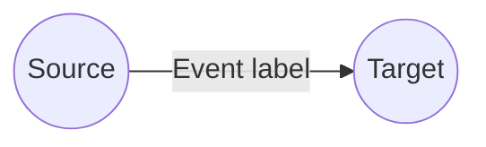
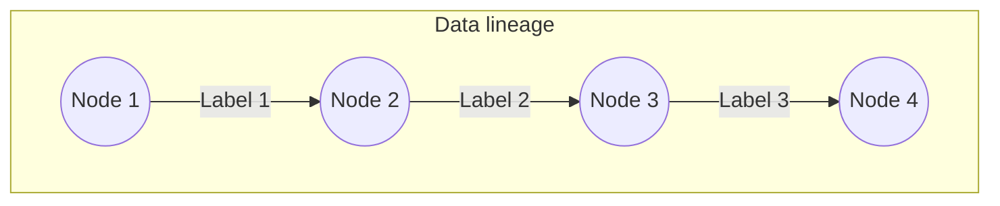

# Event Introduction - C Sharp

Read and write the **event store**.

| Logic Type       | Available |
| ---------------- | --------- |
| Generic logic    | ✅        |
| Aggregator logic | ❌        |

A LOC **event** is a timestamped log or metadata representing a _data flow_, which can be read and write in LOC's event store (implemented with [Elasticsearch](https://www.elastic.co/elasticsearch)).



The source and target **digital identity** (DID) are customised _nodes_ defined by users. Multiple events with shared source/target nodes form a **data lineage**:



## Import and Usage

The agent can be used without using additional namespaces:

```csharp showLineNumbers
public static class Logic
{

    public static async Task Run(Context ctx)
    {
        await EventAgent.EmitEvent(new List<EmitEventArgs>
        {
            new EmitEventArgs(
                "some label name",
                "some source DID",
                "some target DID",
                "",
                "default"
            ),
        });
    }

    public static async Task HandleError(Context ctx, Exception error)
    {
        // ... same
    }
}
```

## Events Fields For Query

An event in the event store has the following field names that can be added in query, exclude, filter and sort conditions:

| Event Store Field                 | Description                                                           |
| --------------------------------- | --------------------------------------------------------------------- |
| `label_id`                        | label ID                                                              |
| `label_name`                      | Label name (`labelName` in `EmitEventArgs`)                           |
| `source_digital_identity`         | Source DID (`sourceDigitalIdentity` in `EmitEventArgs`)               |
| `target_digital_identity`         | Target DID (`targetDigitalIdentity` in `EmitEventArgs`)               |
| `type`                            | Type (`type` in `EmitEventArgs`)                                      |
| `timestamp`                       | Event emitted time (unix timestamp)                                   |
| `sequence`                        | Event sequence number (the emit order in an array, starting from `0`) |
| `execution_id`                    | Execution ID                                                          |
| `task_id`                         | Task ID                                                               |
| `data_process_permanent_identity` | Data process permanent ID                                             |
| `data_process_name`               | Data process name                                                     |
| `data_process_revision`           | Data process revision number                                          |
| `logic_name`                      | Logic name                                                            |
| `logic_permanent_identity`        | Logic permanent ID                                                    |
| `logic_revision`                  | Logic revision number                                                 |

:::info
The sequence number represents the order of an event emitted in the array. If you emit 10 events at once, they will have sequence number from 1 to 10.
:::

## Class Reference

### Type

-   Public static class `EventAgent`

### Method: Emit Events

> Refer to: [Emit Events](/sdk-ts/agents/event-store/emit-event)

### Method: Search Events

> Refer to: [Search Events](/sdk-ts/agents/event-store/search-event)

### Method: Search Event Sequences

> Refer to: [Search Event Sequences](/sdk-ts/agents/event-store/search-sequence)

## Examples

See each method pages above for their examples.
