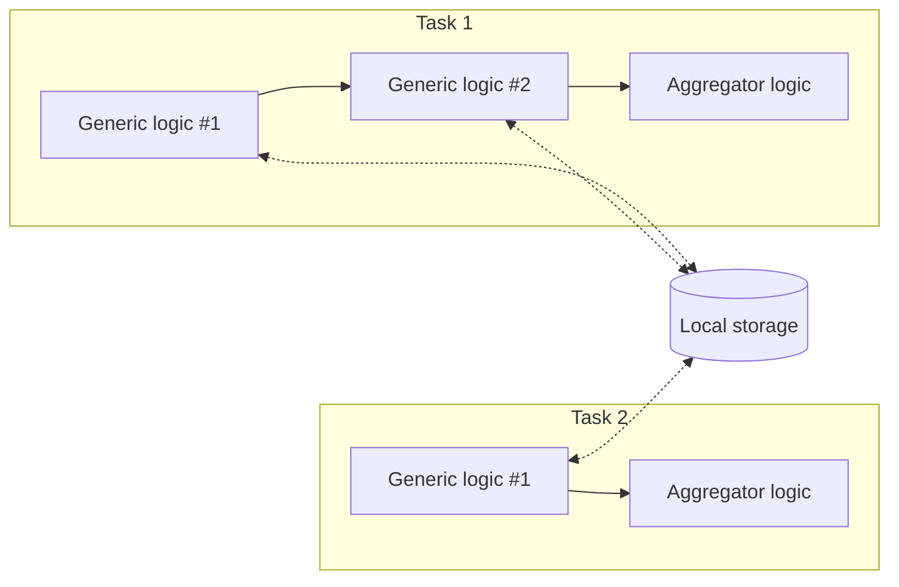

# Local Storage Agent - C Sharp

Read and write value in **local storage**.

| Logic Type       | Available |
| ---------------- | --------- |
| Generic logic    | ✅        |
| Aggregator logic | ❌        |

## Local Storage

Unlike a task's session storage, the local storage is implemented in Kubernetes' [etcd](https://etcd.io/) database and can be accessed by different tasks. Data can stay persistent after executions for a limit amount of time.

The local storage _is not meant as the primary way to exchange data across tasks_, more like a debugging or testing tool.



## Import and Usage

The agent can be used without using additional namespaces:

```csharp showLineNumbers
public static class Logic
{

    public static async Task Run(Context ctx)
    {
        var data = (await LocalStorageAgent.Get("data"))?.JsonValue;
    }

    public static async Task HandleError(Context ctx, Exception error)
    {
        // ... same
    }
}
```

## Class Reference

### Type

-   Public static class `LocalStorageAgent`

### Method: Get Local Value

```csharp
public async static Task<StorageValue?> Get(string key) {}
```

| Parameter | Description       |
| --------- | ----------------- |
| `key`     | Key of local data |

Returns a [`StorageValue`](#storagevalue) value from local storage (`null` if not exist).

### Method: Write Local Value

```csharp
public async static Task Put(string key, StorageValue value, ulong? timeoutSeconds = null) {}
```

| Parameter | Description                                                                       |
| --------- | --------------------------------------------------------------------------------- |
| `key`     | Key of local data                                                                 |
| `value`   | `StorageValue` data                                                               |
| `timeout` | (Optional) data persistent time (seconds; default `300`, maximum `86400` = 1 day) |

Write a [`StorageValue`](#storagevalue) value into local storage. Overwrite if already exists.

### Method: Delete Local Value

```csharp
public async static Task Delete(string key) {}
```

| Parameter | Description       |
| --------- | ----------------- |
| `key`     | Key of local data |

Delete a value in local storage. Do nothing if not exist.

### Sub Class Reference

#### `StorageValue`

> Refer to: [`StorageValue`](/sdk-csharp/agents/session-storage#storagevalue)

## Examples

> See the [example of session storage agent](/sdk-csharp/agents/session-storage#examples) for more detailed examples (replace `LocalStorageAgent` to `SessionStorageAgent` and without the `timeout` parameter).

### Write String Data Into Local Storage

```csharp showLineNumbers
await LocalStorageAgent.Put(
    "data",
    StorageValue.FromString("so long, and thanks for all the fish"),
    86400  // persistent for 1 day
);
```

### Write JSON Data Into Local Storage

```csharp showLineNumbers
await LocalStorageAgent.Put(
    "data",
    StorageValue.FromJson(
        new Dictionary<string, object?>()
        {
            // ...
        }
    ),
    86400  // persistent for 1 day
);

// or

/*
- import the following namespace:

using System.Text.Json.Nodes;
*/
await LocalStorageAgent.Put(
    "data",
    StorageValue.FromJson(
        new JsonObject
        {
            // ...
        }
    ),
    86400  // persistent for 1 day
);
```

### Read String Data from Local Storage

```csharp showLineNumbers
string? data = (await LocalStorageAgent.Get("data"))?.StringValue;
```

Set a default value if the local data does not exist (returns `null`):

```csharp showLineNumbers
string data = (await LocalStorageAgent.Get("data"))?.StringValue ?? "default value";
```

### Read Json Data from Local Storage

```csharp title="Import namespace(s)" showLineNumbers
using System.Text.Json.Nodes;
```

```csharp showLineNumbers
JsonNode? data = (await LocalStorageAgent.Get("data"))?.JsonValue;

// get values (null if not found)
string? name = data?["name"]?.GetValue<string>();
int? age = data?["age"]?.GetValue<int>();
```
