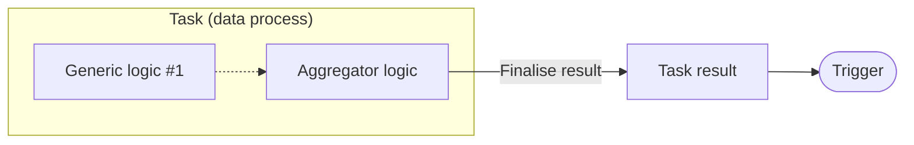

# Result Agent - C Sharp

Finalise **task result** in aggregator logic.

| Logic Type       | Available |
| ---------------- | --------- |
| Generic logic    | ❌        |
| Aggregator logic | ✅        |

The task result will be part of the execution result, and will be returned to user if the trigger type is synchronized API route or message queue.



## Import and Usage

The agent can be used without using additional namespaces:

```csharp showLineNumbers
public static class Logic
{

    public static async Task Run(Context ctx)
    {
        await ResultAgent.SetResult(
            new Dictionary<string, object?>()
            {
                { "status", "ok" }
            }
        );
    }

    public static async Task HandleError(Context ctx, Exception error)
    {
        await ResultAgent.SetResult(
            new Dictionary<string, object?>()
            {
                { "status", "error" }
            }
        );
    }
}
```

## Class Reference

### Type

-   Public static class `ResultAgent`

### Method: Finalise Task Result

```csharp
public async static Task SetResult(object result) {}
```

| Parameter | Description     |
| --------- | --------------- |
| `result`  | A "JSON" object |

Write an object to be serialised to JSON as the content of task result, which will be part of the execution result and may be returned to the user. The JSON data may be converted to other formats depending on the trigger configuration.

:::warning
Using objects of user-defined class will cause the fields not parsed properly. Use [**Dictionary**](https://learn.microsoft.com/en-us/dotnet/api/system.collections.generic.dictionary-2?view=net-7.0) or [**JsonObject**](https://learn.microsoft.com/en-us/dotnet/api/system.text.json.nodes.jsonobject?view=net-7.0) instead.

If an execution contains multiple tasks, fields with the same name in different task results _will be overwritten_. Consider to use unique field names to avoid the issue.
:::

### Method: Set HTTP Status Code

```csharp
public async static Task SetHttpStatusCode(UInt16 statusCode) {}
```

| Parameter    | Description                                                                                   |
| ------------ | --------------------------------------------------------------------------------------------- |
| `statusCode` | [HTTP status code](https://developer.mozilla.org/en-US/docs/Web/HTTP/Status) (default: `200`) |

Set HTTP status code for the HTTP response when the trigger is API route.

:::info
The HTTP code will also be applied to the `_status` field in the execution result if the execution is invoked by an actual API route. The `_status` field will always `20x` in manual executions.

The task will still return status code `202` for timed out execution.

Setting HTTP status code _does not_ affect triggers other than API routes.

If an execution contains multiple tasks, the highest HTTP status code value will be used for the API route response.
:::

## Examples

### Finalise Task Result

```csharp showLineNumbers
var task = await ctx.GetTask();

await ResultAgent.SetResult(
    new Dictionary<string, object?>()
    {
        { "status", "ok" },
        { "taskId", task.TaskKey.TaskIdString() },
        { "data", new Dictionary<string, object?>()
            {
                { "name", "Arthur Dent" },
                { "age", 42 },
                { "job", new Dictionary<string, object?>()
                    {
                        { "title", "Sandwich-maker" },
                        { "salary", 0 },
                    }
                },
                { "quotes", new List<string>()
                    {
                        "Is there any tea on this spaceship?",
                        "This must be Thursday. I never could get the hang of Thursdays.",
                        "Would it save you a lot of time if I just gave up and went mad now?"
                    }
                },
            }
        },
    }
);

// or

/*
- import the following namespace:

using System.Text.Json.Nodes;
*/
await ResultAgent.SetResult(
    new JsonObject
    {
        ["status"] = "ok",
        ["taskId"] = task.TaskKey.TaskIdString(),
        ["data"] = new JsonObject
        {
            ["name"] = "Arthur Dent",
            ["age"] = 42,
            ["job"] = new JsonObject
            {
                ["title"] = "Sandwich-maker",
                ["salary"] = 0
            },
            ["quotes"] = new JsonArray(
                "Is there any tea on this spaceship?",
                "This must be Thursday. I never could get the hang of Thursdays.",
                "Would it save you a lot of time if I just gave up and went mad now?"
            ),
        },
    }
);
```

> See the [example of session storage agent](/sdk-csharp/agents/session-storage#examples) for how to use classes extended from `JsonNode`.

:::info
The field `status: "ok"` will be part of the task result, not to be confused with HTTP status code in the HTTP response.
:::

:::tip Pass Session/Local Storage Value as Result

You can log the received `JsonNode` object from session or local storages without any conversion:

```csharp showLineNumbers
JsonNode? data = (await SessionStorageAgent.Get("data"))?.JsonValue;

await ResultAgent.SetResult(data);
```

:::

### Finalise Task Result and Set HTTP Status Code

```csharp showLineNumbers
await ResultAgent.SetResult(new {
    // ...
});
await ResultAgent.SetHttpStatusCode(200);
```

### Finalise Task Result with Error

```csharp showLineNumbers
var task = await ctx.GetTask();

await ResultAgent.SetResult(
    new Dictionary<string, object?>()
    {
        { "status", "error" },
        { "taskId", task.TaskKey.TaskIdString() },
        { "error", error.Message },
        { "stack", error.StackTrace }
    }
);
await ResultAgent.SetHttpStatusCode(500);
```

## Advanced Examples

### Log User-Defined Classes

Assuming we have a `Person` and a `Job` class with its source context class defined:

```csharp title="Import namespace(s) and declare classes" showLineNumbers
using System.Text.Json;
using System.Text.Json.Nodes;
using System.Text.Json.Serialization;

internal class Person
{
  [JsonPropertyName("name")]
  public string? Name { get; set; }

  [JsonPropertyName("age")]
  public int? Age { get; set; }

  [JsonPropertyName("job")]
  public Job? Job { get; set; }

  [JsonPropertyName("quotes")]
  public List<string>? Quotes { get; set; }

  public Person(string name, int age, Job job, List<string> quotes)
  {
    Name = name;
    Age = age;
    Job = job;
    Quotes = quotes;
  }
}

internal class Job
{
  [JsonPropertyName("title")]
  public string? Title { get; set; }

  [JsonPropertyName("salary")]
  public int? Salary { get; set; }

  public Job(string title, int salary)
  {
    Title = title;
    Salary = salary;
  }
}

// source generation context for Person
// highlight-start
[JsonSourceGenerationOptions()]
[JsonSerializable(typeof(Person))]
internal partial class PersonSourceGenerationContext : JsonSerializerContext
{
}
// highlight-end
```

You can convert the object to a JSON string, then convert it to a `JsonNode` object for the logging agent:

```csharp showLineNumbers
JsonNode personData = JsonNode.Parse(
    JsonSerializer.Serialize<Person>(
        person,
        PersonSourceGenerationContext.Default.Person
    )
);

await ResultAgent.SetResult(
    new JsonObject
    {
        ["status"] = "ok",
        ["taskId"] = task.TaskKey.TaskIdString(),
        // highlight-next-line
        ["data"] = personData,
        // ...
    }
);
```
