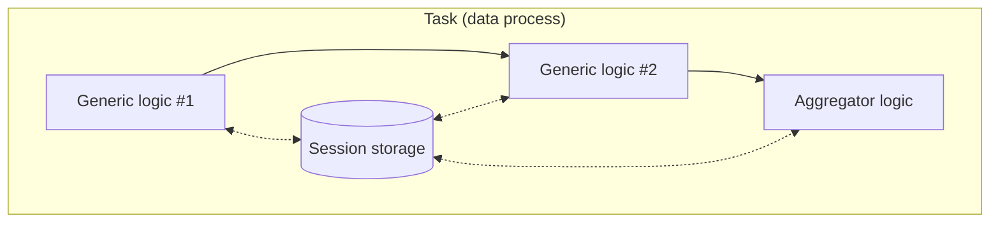

# Session Storage Agent - C Sharp

Read and write value in **session storage**.

| Logic Type       | Available |
| ---------------- | --------- |
| Generic logic    | ✅        |
| Aggregator logic | ✅        |

## Session Storage

For each executed task, a session storage is created in LOC runtime and shared by all logic in the same data process. It is the primary apporach for a task to pass data from one lofic to others. The session storage will be purged after the task complete execution.



## Import and Usage

The agent can be used without using additional namespaces:

```csharp showLineNumbers
public static class Logic
{

    public static async Task Run(Context ctx)
    {
        var data = (await SessionStorageAgent.Get("data"))?.JsonValue;
    }

    public static async Task HandleError(Context ctx, Exception error)
    {
        // ... same
    }
}
```

## Class Reference

### Type

-   Public static class `SessionStorageAgent`

### Method: Get Session Value

```csharp
public async static Task<StorageValue?> Get(string key) {}
```

| Parameter | Description         |
| --------- | ------------------- |
| `key`     | Key of session data |

Returns a [`StorageValue`](#storagevalue) value from session storage (`null` if not exist).

### Method: Write Session Value

```csharp
public async static Task Put(string key, StorageValue value) {}
```

| Parameter | Description         |
| --------- | ------------------- |
| `key`     | Key of session data |
| `value`   | `StorageValue` data |

Write a [`StorageValue`](#storagevalue) value into local storage. Overwrite if already exists.

### Method: Delete Session Value

```csharp
public async static Task Delete(string key) {}
```

| Parameter | Description         |
| --------- | ------------------- |
| `key`     | Key of session data |

Delete a value in session storage. Do nothing if not exist.

### Sub Class Reference

#### `StorageValue`

Data structure for a session or [local storage](/sdk-csharp/agents/local-storage) value.

Properties:

| Property      | Type                     | Description                         |
| ------------- | ------------------------ | ----------------------------------- |
| `JsonValue`   | [`JsonNode?`](#jsonnode) | Object value representing JSON data |
| `StringValue` | `string?`                | String value                        |
| `BytesValue`  | `byte[]?`                | Byte array value                    |

:::info
For writing a session or local value, only one property in `StorageValue` object will be used.
:::

Constructor:

```csharp
public StorageValue()
```

Methods:

```csharp
// create a StorageValue with JSON object
public static StorageValue FromJson(object obj) {}
public static StorageValue FromJson(T obj, JsonTypeInfo<T> jsonTypeInfo) {}

// create a StorageValue with string
public static StorageValue FromString(string str) {}

// create a StorageValue with byte array
public static StorageValue FromBytes(byte[] bytes) {}

// get value type
public ValueType GetValueType() {}
```

Enumeration type:

```csharp
public enum ValueType
{
    None = 0,
    Bytes = 1,
    String = 2,
    Json = 3
}
```

:::info
Method `StorageValue.FromJson()` will try to convert the input `object` to `JsonNode`.

See the examples for how to pass objects correctly.
:::

### `JsonNode`

> Refer to: [`JsonNode`](https://learn.microsoft.com/en-us/dotnet/api/system.text.json.nodes.jsonnode?view=net-7.0)
>
> The `JsonValue` property and `FromJson` method also accepts classes extended from `JsonNode`: [`JsonValue`](https://learn.microsoft.com/en-us/dotnet/api/system.text.json.nodes.jsonvalue?view=net-7.0), [`JsonObject`](https://learn.microsoft.com/en-us/dotnet/api/system.text.json.nodes.jsonobject?view=net-7.0) or [`JsonArray`](https://learn.microsoft.com/en-us/dotnet/api/system.text.json.nodes.jsonarray?view=net-7.0).

## Examples

### Write String Data Into Session Storage

```csharp showLineNumbers
await SessionStorageAgent.Put(
    "data",
    StorageValue.FromString("so long, and thanks for all the fish")
);
```

### Write JSON Data Into Session Storage

```csharp showLineNumbers
await SessionStorageAgent.Put(
    "data",
    StorageValue.FromJson(
        new Dictionary<string, object?>()
        {
            { "name", "Arthur Dent" },
            { "age", 42 },
            { "job", new Dictionary<string, object?>()
                {
                    { "title", "Sandwich-maker" },
                    { "salary", 0 },
                }
            },
            { "quotes", new List<string>()
                {
                    "Is there any tea on this spaceship?",
                    "This must be Thursday. I never could get the hang of Thursdays.",
                    "Would it save you a lot of time if I just gave up and went mad now?"
                }
            },
        }
    )
);

// or

/*
- import the following namespace:

using System.Text.Json.Nodes;
*/
await SessionStorageAgent.Put(
    "data",
    StorageValue.FromJson(
        new JsonObject
        {
            ["name"] = "Arthur Dent",
            ["age"] = 42,
            ["job"] = new JsonObject
            {
                ["title"] = "Sandwich-maker",
                ["salary"] = 0
            },
            ["quotes"] = new JsonArray(
                "Is there any tea on this spaceship?",
                "This must be Thursday. I never could get the hang of Thursdays.",
                "Would it save you a lot of time if I just gave up and went mad now?"
            ),
        }
    )
);
```

:::tip Write a Single Number
A single number is valid Json thus can be saved as a JSON session data:

```csharp showLineNumbers
/*
- import the following namespace:

using System.Text.Json.Nodes;
*/
await SessionStorageAgent.Put(
    "number",
    StorageValue.FromJson(JsonValue.Create(42))
);
```

It will be read as a `JsonNode` representing an `int32` value from `SessionStorageAgent.Get`.
:::

:::tip Convert List to JsonArray

```csharp
List<string> list = new()
{
    "Is there any tea on this spaceship?",
    "This must be Thursday. I never could get the hang of Thursdays.",
    "Would it save you a lot of time if I just gave up and went mad now?"
};

JsonArray array = new(list.ConvertAll<JsonNode>((item) => JsonValue.Create(item)).ToArray());
```

:::

### Read String Data from Session Storage

```csharp showLineNumbers
string? data = (await SessionStorageAgent.Get("data"))?.StringValue;
```

Set a default value if the session data does not exist (returns `null`):

```csharp showLineNumbers
string data = (await SessionStorageAgent.Get("data"))?.StringValue ?? "default value";
```

### Read Json Data from Session Storage

```csharp title="Import namespace(s)" showLineNumbers
using System.Text.Json.Nodes;
```

```csharp showLineNumbers
JsonNode? data = (await SessionStorageAgent.Get("data"))?.JsonValue;

// convert to JSON string
string jsonString = data.ToJsonString();

// get values (null if not found)
string? name = data?["name"]?.GetValue<string>();
int? age = data?["age"]?.GetValue<int>();

JsonNode? job = data?["job"];
string? title = job?["title"]?.GetValue<string>();

JsonArray? quotes = data?["quotes"].AsArray();
string? firstQuote = quotes?[0].GetValue<string>();

foreach(var quote in quotes)
{
    string quote = quote.GetValue<string>();
}

// convert JsonArray to List
if (quotes is not null)
{
    List<string> quoteList = new(from item in quotes select item.GetValue<string>());
}
```

:::tip Safer Way of Getting Value

`GetValue<type>()` will throw an Exception if the value cannot be converted to the type.

A safe way is to use the `TryGetValue()` method of `JsonValue` class:

```csharp showLineNumbers
int age = 42; // default value

// convert to JsonValue and try to convert the value into 'age'; if not successful, no exception would be thrown.
data?["age"]?.AsValue().TryGetValue<int>(out age);
```

:::

:::tip Directly Type Casting
If you can be sure the returned `JsonNode` object and its fields won't be `null`, you can also use type casting for basic types:

```csharp showLineNumbers
// adding "!"" (null-forgiving operator) to avoid null warnings

string name = (string) data!["name"]!;
int age = (int) data!["age"]!;
```

:::

## Advanced Examples

### Use User-Defined Classes With Session Storage

Assuming we have a `Person` and a `Job` class with its source context class defined, we can serialise or deserialise the session storage value with these classes:

```csharp title="Import namespace(s) and declare classes" showLineNumbers
using System.Text.Json;
using System.Text.Json.Nodes;
using System.Text.Json.Serialization;

internal class Person
{
    [JsonPropertyName("name")]
    public string? Name { get; set; }

    [JsonPropertyName("age")]
    public int? Age { get; set; }

    [JsonPropertyName("job")]
    public Job? Job { get; set; }

    [JsonPropertyName("quotes")]
    public List<string>? Quotes { get; set; }

    public Person(string name, int age, Job job, List<string> quotes)
    {
        Name = name;
        Age = age;
        Job = job;
        Quotes = quotes;
    }
}

internal class Job
{
    [JsonPropertyName("title")]
    public string? Title { get; set; }

    [JsonPropertyName("salary")]
    public int? Salary { get; set; }

    public Job(string title, int salary)
    {
        Title = title;
        Salary = salary;
    }
}

// source generation context for Person
// highlight-start
[JsonSourceGenerationOptions()]
[JsonSerializable(typeof(Person))]
internal partial class PersonSourceGenerationContext : JsonSerializerContext
{
}
// highlight-end
```

:::info
You can also move these classes into a shared module as `public` classes. See the [tutorial](/main/tutorial/shared-modules) for examples.
:::

#### Write Class to Session Storage

```csharp showLineNumbers
Person person = new(
    "Arthur Dent",
    42,
    new Job(
        "Sandwich-maker",
        0
    ),
    new List<string>()
    {
        "Is there any tea on this spaceship?",
        "This must be Thursday. I never could get the hang of Thursdays.",
        "Would it save you a lot of time if I just gave up and went mad now?"
    }
);

// write Person data using source generation context
await SessionStorageAgent.Put(
    "data",
    StorageValue.FromJson(
        person,
        // highlight-next-line
        PersonSourceGenerationContext.Default.Person
    )
);
```

#### Read Class to Session Storage

```csharp showLineNumbers
// read data as JsonNode
JsonNode? data = (await SessionStorageAgent.Get("data"))?.JsonValue;
Person? person = null;

// convert JsonNode to Person using source generation context
if (data is not null)
{
    person = JsonSerializer.Deserialize<Person>(
        data,
        // highlight-next-line
        PersonSourceGenerationContext.Default.Person
    );
}

// read Person fields with properties
if (person is not null)
{
    string name = person.name;
    int age = person.age;
    string title = person.job.title;
    List<string> quotes = person.quotes;
}
```
