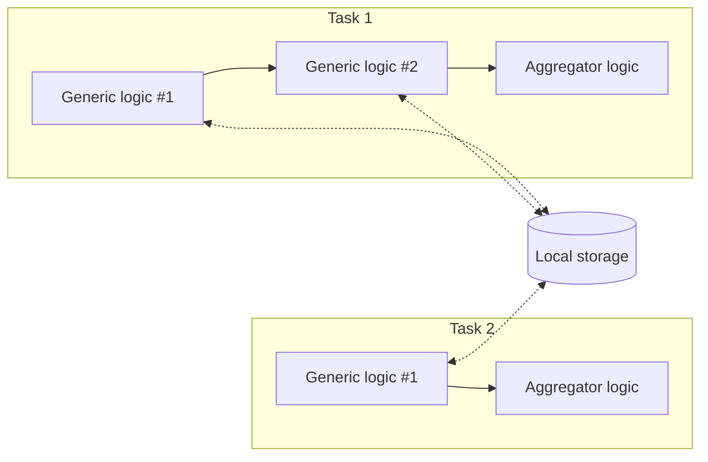

# Local Storage Agent - JS/TS

Read and write value in **local storage**.

| Logic Type       | Available |
| ---------------- | --------- |
| Generic logic    | ✅        |
| Aggregator logic | ❌        |

## Local Storage

Unlike a task's session storage, the local storage is implemented in Kubernetes' [etcd](https://etcd.io/) database and can be accessed by different tasks. Data can stay persistent after executions for a limit amount of time.

The local storage _is not meant as the primary way to exchange data across tasks_, more like a debugging or testing tool.



## Import and Usage

import Tabs from "@theme/Tabs";
import TabItem from "@theme/TabItem";

<Tabs>
  <TabItem value="js" label="JavaScript" default>

```javascript showLineNumbers
import {
    // highlight-next-line
    LocalStorageAgent,
} from "@fstnetwork/loc-logic-sdk";

export async function run(ctx) {
    const data = await LocalStorageAgent.get("data");
}

export async function handleError(ctx, error) {
    // ... same
}
```

  </TabItem>
  <TabItem value="ts" label="TypeScript">

```typescript showLineNumbers
import {
    GenericContext,
    RailwayError,
    // highlight-next-line
    LocalStorageAgent,
} from "@fstnetwork/loc-logic-sdk";

export async function run(ctx: GenericContext) {
    const data = await LocalStorageAgent.get("data");
}

export async function handleError(ctx: GenericContext, error: RailwayError) {
    // ... same
}
```

  </TabItem>
</Tabs>

## Class Reference

### Type

-   `LocalStorageAgent`

### Method: Get Local Value

```typescript
async get(key: string): Promise<string | number | object | Uint8Array>
```

| Parameter | Description       |
| --------- | ----------------- |
| `key`     | Key of local data |

Returns a value from local storage (`null` if not exist).

The return type depends how it was written into the local storage. If the value is a single number (which is valid JSON) and stored using `putJson`, it would be returned as a number.

### Methods: Write Local Value

<Tabs>
  <TabItem value="json" label="JSON" default>

```typescript
async putJson(key: string, value: any, timeout?: number): Promise<boolean>
```

| Parameter  | Description                                                             |
| ---------- | ----------------------------------------------------------------------- |
| `key`      | Key of local data                                                       |
| `value`    | JavaScript JSON object                                                  |
| `timeout?` | Data persistent limit (seconds; default `300`, maximum `86400` = 1 day) |

Write a JSON value into local storage. Overwrite if already exists.

:::warning
Runtime will throw a JSON parsing error if the object cannot be serialised properly to JSON.

You can try using `JSON.parse(JSON.stringify(object)` to transform an object with methods into a proper JSON object, although some fields may be different or discarded.
:::

  </TabItem>
  <TabItem value="string" label="String">

```typescript
async putString(key: string, value: string, timeout?: number): Promise<boolean>
```

| Parameter  | Description                                                             |
| ---------- | ----------------------------------------------------------------------- |
| `key`      | Key of local data                                                       |
| `value`    | `string` data                                                           |
| `timeout?` | Data persistent limit (seconds; default `300`, maximum `86400` = 1 day) |

Write a string value into local storage. Overwrite if already exists.

  </TabItem>
  <TabItem value="array" label="Uint8Array">

```typescript
async putByteArray(key: string, value: Uint8Array | string): Promise<boolean>
```

```typescript
async putByteArray(key: string, value: Uint8Array | string, timeout?: number): Promise<boolean>
```

| Parameter  | Description                                                                       |
| ---------- | --------------------------------------------------------------------------------- |
| `key`      | Key of local data                                                                 |
| `value`    | `Uint8Array` or `string` data                                                     |
| `timeout?` | (Optional) data persistent time (seconds; default `300`, maximum `86400` = 1 day) |

Write a Uint8Array or string value into local storage. Overwrite if already exists.

  </TabItem>
</Tabs>

### Method: Delete Session Value

```typescript
async delete(key: string): Promise<void>
async remove(key: string): Promise<void>
```

| Parameter | Description         |
| --------- | ------------------- |
| `key`     | Key of session data |

Delete a value in local storage. Do nothing if not exist.

## Examples

### Write String Data Into Local Storage

```typescript showLineNumbers
await LocalStorageAgent.putString(
    "data",
    "so long, and thanks for all the fish",
    86400, // persistent for 1 day
);
```

### Write JSON Data Into Local Storage

```typescript showLineNumbers
await LocalStorageAgent.putJson(
    "data",
    {
        // ...
    },
    86400, // persistent for 1 day
);
```

> See: [Write JSON Data Into Session Storage](/sdk-ts/agents/session-storage#write-json-data-into-session-storage)

### Read String Data from Local Storage

```typescript showLineNumbers
const data = await LocalStorageAgent.get("data");
```

Set a default value if the local data does not exist (returns `null`):

```csharp showLineNumbers
const data = await LocalStorageAgent.get("data") || "default value";
```

### Read Json Data from Local Storage

```typescript showLineNumbers
const data = await LocalStorageAgent.get("data");

// get values (undefined if not found)
const name = data?.name;
const age = data?.age;
```

> See: [Read Json Data from Session Storage](/sdk-ts/agents/session-storage#read-json-data-from-session-storage)
