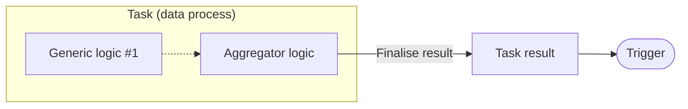

# Result Agent - JS/TS

Finalise **task result** in aggregator logic.

| Logic Type       | Available |
| ---------------- | --------- |
| Generic logic    | ❌        |
| Aggregator logic | ✅        |

The task result will be part of the execution result, and will be returned to user if the trigger type is synchronized API route or message queue.



## Import and Usage

import Tabs from "@theme/Tabs";
import TabItem from "@theme/TabItem";

<Tabs>
  <TabItem value="js" label="JavaScript" default>

```javascript showLineNumbers
import {
    // highlight-next-line
    ResultAgent,
} from "@fstnetwork/loc-logic-sdk";

export async function run(ctx) {
    ResultAgent.finalize({
        status: "ok",
    });
}

export async function handleError(ctx, error) {
    ResultAgent.finalize({
        status: "error",
    });
}
```

  </TabItem>
  <TabItem value="ts" label="TypeScript">

```typescript showLineNumbers
import {
    GenericContext,
    RailwayError,
    // highlight-next-line
    ResultAgent,
} from "@fstnetwork/loc-logic-sdk";

export async function run(ctx: GenericContext) {
    ResultAgent.finalize({
        status: "ok",
    });
}

export async function handleError(ctx: GenericContext, error: RailwayError) {
    ResultAgent.finalize({
        status: "error",
    });
}
```

  </TabItem>
</Tabs>

## Class Reference

### Type

-   `ResultAgent`
-   `IResultAgent` (alias)

### Method: Finalise Task Result

```typescript
finalize(value: object): IResultAgent
```

| Parameter | Description              |
| --------- | ------------------------ |
| `value`   | A JavaScript JSON object |

Write an JSON object as the content of task result, which will be part of the execution result and may be returned to the user. The JSON data may be converted to other formats depending on the trigger configuration.

:::warning
If an execution contains multiple tasks, fields with the same name in different task results _will be overwritten_. Consider to use unique field names to avoid the issue.

Runtime will throw a JSON parsing error if the object cannot be serialised properly to JSON. You can try using `JSON.parse(JSON.stringify(object)` to transform an object with methods into a proper JSON object, although some fields may be different or discarded.
:::

### Method: Set HTTP Status Code

```typescript
httpStatusCode(statusCode: number): IResultAgent
```

| Parameter    | Description                                                                                   |
| ------------ | --------------------------------------------------------------------------------------------- |
| `statusCode` | [HTTP status code](https://developer.mozilla.org/en-US/docs/Web/HTTP/Status) (default: `200`) |

Set HTTP status code for the HTTP response when the trigger is API route.

:::info
The HTTP code will also be applied to the `_status` field in the execution result if the execution is invoked by an actual API route. The `_status` field will always `20x` in manual executions.

The task will still return status code `202` for timed out execution.

Setting HTTP status code _does not_ affect triggers other than API routes.

If an execution contains multiple tasks, the highest HTTP status code value will be used for the API route response.
:::

## Examples

### Finalise Task Result

```typescript showLineNumbers
ResultAgent.finalize({
    status: "ok",
    taskId: ctx.task.taskKey.taskId,
    data: {
        name: "Arthur Dent",
        age: 42,
        job: {
            title: "Sandwich-maker",
            salary: 0,
        },
        quotes: [
            "Is there any tea on this spaceship?",
            "This must be Thursday. I never could get the hang of Thursdays.",
            "Would it save you a lot of time if I just gave up and went mad now?",
        ],
    },
});
```

:::info
The field `status: "ok"` will be part of the task result, not to be confused with HTTP status code in the HTTP response.
:::

### Finalise Task Result and Set HTTP Status Code

```typescript showLineNumbers
ResultAgent.finalize({
    // ...
}).httpStatusCode(200);
```

:::tip

Since all methods return the Result Agent itself, they can be chain in different order or invoked separately:

```typescript showLineNumbers
ResultAgent.httpStatusCode(200).finalize({
    // ...
});

// or

ResultAgent.finalize({
    // ...
};)
ResultAgent.httpStatusCode(200);
```

:::

### Finalise Task Result with Error

```typescript showLineNumbers
ResultAgent.finalize({
    status: "error",
    taskId: ctx.task.taskKey.taskId,
    error: error.message,
    stack: error.stack,
}).httpStatusCode(500);
```
