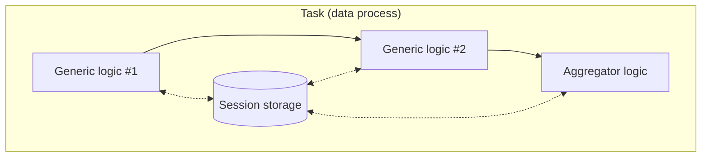

# Session Storage Agent - JS/TS

Read and write value in **session storage**.

| Logic Type       | Available |
| ---------------- | --------- |
| Generic logic    | ✅        |
| Aggregator logic | ✅        |

## Session Storage

For each executed task, a session storage is created in LOC runtime and shared by all logic in the same data process. It is the primary approach for a task to pass data from one lofic to others. The session storage will be purged after the task complete execution.



## Import and Usage

import Tabs from "@theme/Tabs";
import TabItem from "@theme/TabItem";

<Tabs>
  <TabItem value="js" label="JavaScript" default>

```javascript showLineNumbers
import {
    // highlight-next-line
    SessionStorageAgent,
} from "@fstnetwork/loc-logic-sdk";

export async function run(ctx) {
    const data = await SessionStorageAgent.get("data");
}

export async function handleError(ctx, error) {
    // ... same
}
```

  </TabItem>
  <TabItem value="ts" label="TypeScript">

```typescript showLineNumbers
import {
    GenericContext,
    RailwayError,
    // highlight-next-line
    SessionStorageAgent,
} from "@fstnetwork/loc-logic-sdk";

export async function run(ctx: GenericContext) {
    const data = await SessionStorageAgent.get("data");
}

export async function handleError(ctx: GenericContext, error: RailwayError) {
    // ... same
}
```

  </TabItem>
</Tabs>

## Class Reference

### Type

-   `SessionStorageAgent`

### Method: Get Session Value

```typescript
async get(key: string): Promise<string | number | object | Uint8Array>
```

| Parameter | Description         |
| --------- | ------------------- |
| `key`     | Key of session data |

Returns a value from session storage (`null` if not exist).

The return type depends on how it was written into the session storage. If the value is a single number (which is valid JSON) and stored using `putJson`, it would be returned as a number.

### Methods: Write Session Value

<Tabs>
  <TabItem value="json" label="JSON" default>

```typescript
async putJson(key: string, value: any): Promise<boolean>
```

| Parameter | Description            |
| --------- | ---------------------- |
| `key`     | Key of session data    |
| `value`   | JavaScript JSON object |

Write a JSON value into session storage. Overwrite if already exists.

:::warning
Runtime will throw a JSON parsing error if the object cannot be serialised properly to JSON.

You can try using `JSON.parse(JSON.stringify(object)` to transform an object with methods into a proper JSON object, although some fields may be different or discarded.
:::

  </TabItem>
  <TabItem value="string" label="String">

```typescript
async putString(key: string, value: string): Promise<boolean>
```

| Parameter | Description         |
| --------- | ------------------- |
| `key`     | Key of session data |
| `value`   | `string` data       |

Write a string value into session storage. Overwrite if already exists.

  </TabItem>
  <TabItem value="array" label="Uint8Array">

```typescript
async putByteArray(key: string, value: Uint8Array | string): Promise<boolean>
```

| Parameter | Description                   |
| --------- | ----------------------------- |
| `key`     | Key of session data           |
| `value`   | `Uint8Array` or `string` data |

Write a Uint8Array or string value into session storage. Overwrite if already exists.

  </TabItem>
</Tabs>

### Method: Delete Session Value

```typescript
async delete(key: string): Promise<void>
async remove(key: string): Promise<void>
```

| Parameter | Description         |
| --------- | ------------------- |
| `key`     | Key of session data |

Delete a value in session storage. Do nothing if not exist.

## Examples

### Write String Data Into Session Storage

```typescript showLineNumbers
await SessionStorageAgent.putString(
    "data",
    "so long, and thanks for all the fish",
);
```

### Write JSON Data Into Session Storage

```typescript showLineNumbers
await SessionStorageAgent.putJson("data", {
    name: "Arthur Dent",
    age: 42,
    job: {
        title: "Sandwich-maker",
        salary: 0,
    },
    quotes: [
        "Is there any tea on this spaceship?",
        "This must be Thursday. I never could get the hang of Thursdays.",
        "Would it save you a lot of time if I just gave up and went mad now?",
    ],
});
```

:::tip Write a Single Number
A single number is valid Json thus can be saved as a JSON session data:

```typescript showLineNumbers
await SessionStorageAgent.putJson("number", 42);
```

It will be read as a number from `SessionStorageAgent.get`.
:::

:::tip
If the object contains methods, you can force convert it to a JSON object (although non-JSON values like `undefined` would be dropped):

```typescript
await SessionStorageAgent.putJson(
    "data",
    JSON.parse(JSON.stringify(objectWithMethods)),
);
```

:::

### Read String Data from Session Storage

```typescript showLineNumbers
const data = await SessionStorageAgent.get("data");
```

Set a default value if the local data does not exist (returns `null`):

```csharp showLineNumbers
const data = await SessionStorageAgent.get("data") || "default value";
```

### Read Json Data from Session Storage

```typescript showLineNumbers
const data = await SessionStorageAgent.get("data");

// get values (undefined if not found)
const name = data?.name;
const age = data?.age;
const title = data?.job?.title;

const quotes = data?.quotes;
const firstQuote = quotes ? quotes[0] : null;
for (const quote of quotes) {
    // ...
}
```
