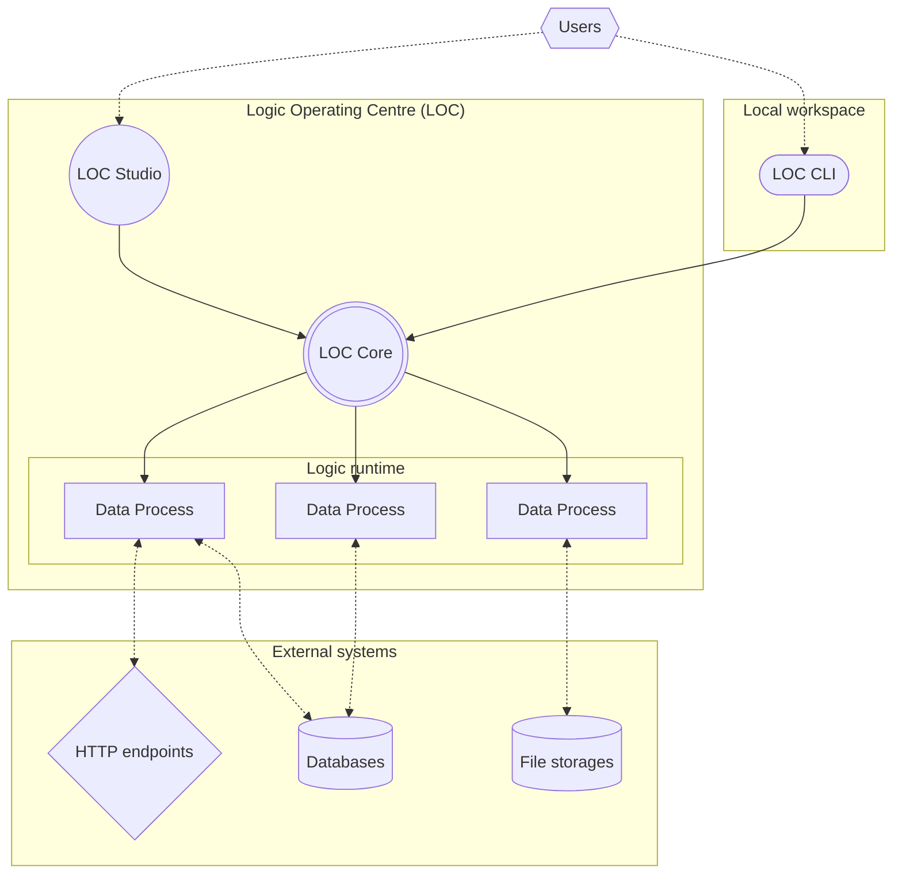

# Components of LOC

As a platform, LOC is in fact consisted with several components.

<table>
    <tr>
        <td width="120px">
            

                
                 
                <b>LOC Core</b>
            

        </td>
        <td>
            

                An advanced data engine built with
                [Rust](https://www.rust-lang.org/) that enables fast, serverless
                data product deployment as well as event-driven triggers and
                metadata for data lineages.
            

        </td>
    </tr>
    <tr>
        <td width="120px">
            

                
                 
                <b>LOC Studio</b>
            

        </td>
        <td>
            

                A sleek, interactive and intuitive
                [React](https://react.dev/)-based web client which provides data
                product management, built-in logic code editors, and data
                catalogue for data events and execution results.
            

        </td>
    </tr>
    <tr>
        <td width="120px">
            

                
                 
                <b>LOC CLI</b>
            

        </td>
        <td>
            

                A local command line tool designed for developers to build and
                upload logic/data processes, utilising the power of modern tools
                like Visual Studio Code.
            

        </td>
    </tr>
</table>

**LOC SDK**, helper packages and runtime client designed for specific logic programming languages, is included in Studio and can be installed locally for CLI.

