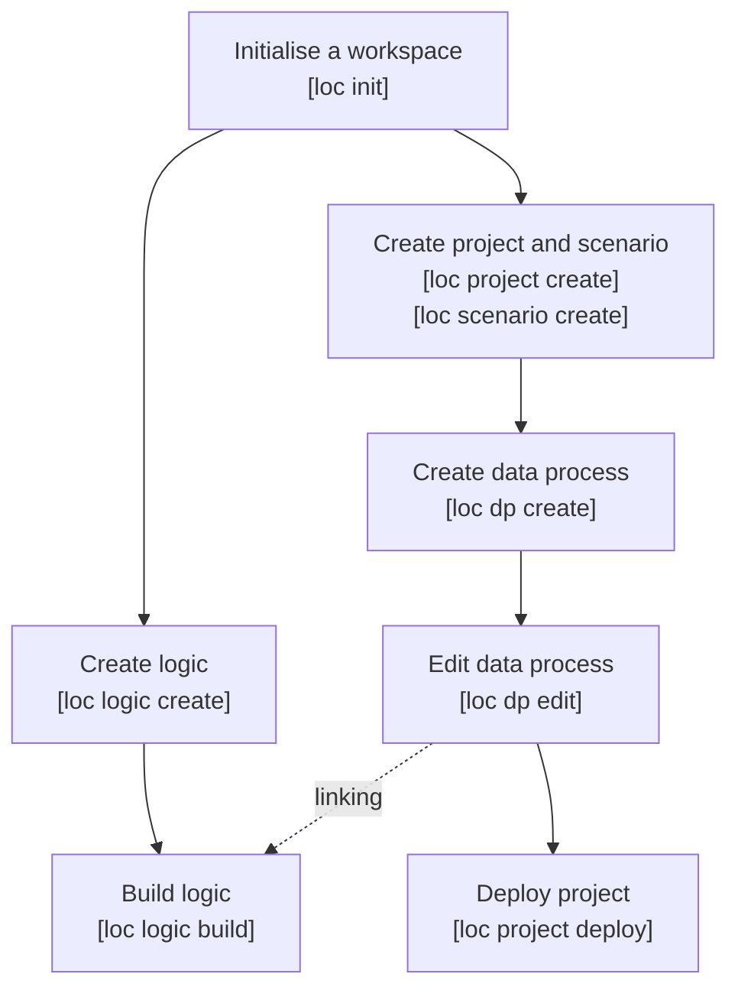

# Create and Deploy Data Process

:::info
See [Introduction and Setup](/legacy/0.10/cli-handbook/setup) first if you haven't gone through the steps above.

Also refer to [LOC Feature Overview](/legacy/0.10/tutorials/loc-feat-overview) to learn more about LOC features, especially the hierarchy of projects, scenarios, data processes and logic.
:::

In this article we'll see how to create and deploy a data process (as well as the project, scenario and associated logic) using LOC CLI.



:::note
Some actions require logged in since they would read or operate remote assets:

-   Build logic
-   Edit data process (to link deployed logic)
-   Deploy project
    :::

See [CLI Command Reference](/legacy/0.10/category/cli-command-reference) to knnow more about CLI commands.

## Workspace Structure Overview

From CLI `v0.8.0`, the new CLI workspace would look like this:

```
/[local workspace]
    /.loc
        /projects
            projects.yaml      <-- metadata of all projects, scenarios and data processes
        logic-manifest.yaml    <-- metadata of logic
    /generic-logic-source      <-- directory of generic logic source code
        logic-1.js
        logic-2.js
        logic-3.ts
        logic-4.ts
        ...
    /aggregator-logic-source   <-- directory of aggregator logic source code
        aggregator-1.js
        aggregator-2.ts
        ...
    .locignore                 <-- files to be ignored during deploy
    loc                        <-- CLI binary
    package.json               <-- local NPM package information
```

Unlike in `v0.7.0` and previous versions, logic (source logic files) are now created and stored separately - and to be linked into data processes afterwards - while data processes are stored as metadata under projects and scenarios.

## Deploy Logic

### Create a Logic

Here we'll use the [Quick Start](/legacy/0.10/quickstart) tutorial as our example. First create the [`Payload JSON Parser`](/legacy/0.10/logic-library/payload-json-parser) generic logic (CLI will prompt you for various fields and options):

```
> ./loc logic create

✔ Logic Name · payload-json-parser
✔ Logic Type · Generic
✔ Programming Language · JavaScript
All Logic source files will be placed under "generic-logic-source" where you can create your own sub-directory. For example: giving "mylogic/convertJSON.js" will create a new sub-directory under "generic-logic-source"
✔ Entrypoint File Path · payload-json-parser.js
✔ Description for Logic · Payload JSON parser
Successfully create Generic Logic source file at "generic-logic-source/payload-json-parser.js"
```

Create the other two logic in the same way (be minded that one of them is an aggregator logic.)

Now in `./loc/logic-manifest.yaml` should contains three new logic metadata entry:

```yaml title="./loc/logic-manifest.yaml"
version: v0
logics:
    - permanentIdentity: null
      name: payload-json-parser
      description: ""
      type: Generic
      spec:
          JavaScript:
              entrypointFilePath: generic-logic-source/payload-json-parser.js
    - permanentIdentity: null
      name: greeting
      description: ""
      type: Generic
      spec:
          JavaScript:
              entrypointFilePath: generic-logic-source/greeting.js
    - permanentIdentity: null
      name: result-aggregator
      description: ""
      type: Aggregator
      spec:
          JavaScript:
              entrypointFilePath: aggregator-logic-source/result-aggregator.js
```

:::warning
Do not manually edit any files under the `.loc` sub-directory!
:::

Which points the new logic metadata to the new source files. The logic do not have permanent IDs yet, which are assigned by LOC and are required for linking logic into a data process, so we need to deploy them.

### Deploy Logic to LOC

Now build and upload the logic we've just created:

```bash
> ./loc logic build

Select a Logic to build.

?  LOGIC TYPE   PROGRAMMING LANGUAGE   NAME                  PERMANENT IDENTITY   ENTRYPOINT FILE PATH                           DESCRIPTION
  ═════════════════════════════════════════════════════════════════════════════════════════════════════════════════════════════
❯  Generic      JavaScript             payload-json-parser   <null>               generic-logic-source/payload-json-parser.js    Payload JSON parser
   Generic      JavaScript             greeting              <null>               generic-logic-source/greeting.js               Hello World greeting
   Aggregator   JavaScript             result-aggregator     <null>               aggregator-logic-source/result-aggregator.js   Result aggregrator
```

Select the generic logic to build. After a very short while you should see the following message:

```
Build 1 logic successfully!

 LOGIC TYPE   NAME                  PERMANENT IDENTITY                     REVISION   DESCRIPTION
══════════════════════════════════════════════════════════════════════════════════════════
 Generic      Payload JSON Parser   5864162f-e163-4a5c-b9f7-f3bc503132c1   1          Payload JSON parser
```

Run the command _again_ to build/upload the aggregator logic as well.

Check `./loc/logic-manifest.yaml` and you should see both logic are assigned with an unique ID:

```yaml title="./loc/logic-manifest.yaml"
version: v0
logics:
# highlight-next-line
- permanentIdentity: 5864162f-e163-4a5c-b9f7-f3bc503132c1
  name: payload-json-parser
  ...
# highlight-next-line
- permanentIdentity: d31255ee-6ef4-4390-bd70-846b9ea8b675
  name: greeting
  ...
# highlight-next-line
- permanentIdentity: 4bd3c39f-a137-423e-885b-d4159fbd29a2
  name: result-aggregator
  ...
```

:::tip
You can also build and upload all logic at once:

```bash
./loc logic build --all
```

If a logic is already deployed, run `loc logic build` will not upload a new revision of it.
:::

## Create Project, Scenario and Data Process

In order to link logic into a data process, we'll need to create the following assets.

### New Project

```
> ./loc project create

✔ Name of Project · my-cli-project
✔ Description of Project · My CLI project
```

### New Scenario

```
> ./loc scenario create

Select Project of Scenario

Select Project of Scenario
?  PROJECT NAME     DESCRIPTION      CREATED TIME
  ══════════════════════════════════════════════════════════
❯  my-cli-project   My CLI project   2023-03-29 16:06:51.312136500 UTC

✔ Name of Scenario · my-cli-scenario
✔ Description of Scenario · My CLI scenario

Successfully create Scenario my-cli-scenario
```

### New Data Process

```
> ./loc dp create

Select Project

✔  PROJECT NAME     DESCRIPTION
  ═══════════════════════════
   my-cli-project   My CLI project

Select Scenario

✔  SCENARIO NAME     DESCRIPTION
  ═════════════════════════════
   my-cli-scenario   My CLI scenario

✔ Data Process Name · hello-world
✔ Data Process Description · Hello World tutorial

Successfully create Data Process hello-world
```

### Checkout Project and Scenario

For the convenience of creating a data process under a given project and scenario, we can "checkout" them as below:

```bash
> ./loc checkout my-cli-project my-cli-scenario

Switch current project/scenario to my-cli-project/my-cli-scenario.
```

:::note
The checkout action does not affect any local nor remote assets. This is merely creating a shortcut so you don't have to repeatly select a project and a scenario.
:::

:::tip
To cancel current checkout, run

```bash
./loc checkout --reset
```

:::

### Link Deployed Logic into Data Process

In order to link logic to the data process, we need to edit it:

```
> ./loc dp edit

Select Data Process

✔  PERMANENT IDENTITY   DATA PROCESS NAME   REVISION   LINKED LOGICS   PROJECT
  ══════════════════════════════════════════════════════════════════════
   <null>               hello-world         1          0               my-cli-project

✔ New Data Process name · hello-world
✔ New Data Process description · Hello World tutorial

Data Process: hello-world

 Generic Logic
 <No Generic Logic linked to Data Process>

 Aggregator Logic
 <No Aggregator Logic linked to Data Process>

(`e` to edit, or press enter to skip)
```

:::note
If you did not checkout a project and a scenario with `loc checkout`, CLI will prompt you to select them.
:::

You'll have the options to modify the name and description of the data process. The last section shows there are currently no logic in this data process.

Now press `e` to enter the logic edit menu:

```
? Choose your next move ›

❯ Add Generic Logic
  Edit Generic Logic
  Unlink Generic Logics
  Add/Edit Aggregator Logic
  Unlink Aggregator Logic
  Save
  Exit
```

We select our deployed generic logic into the first slot:

```
✔ Choose your next move · Add Generic Logic

[1/4] Add Generic Logic - Choose Position
Move cursor to where you want to insert Generic Logic, press enter to continue
By default, Logic will be inserted right below chosen one except first logic slot

?  PERMANENT IDENTITY   LOGIC NAME   REVISION   ORDER
  ════════════════════════════════════════════
❯  <first logic slot>

[2/4] Add Generic Logic - Pick Generic Logic
Move cursor to select which Generic Logic you want to add

?  PERMANENT IDENTITY                     LOGIC NAME                     REVISION   ORDER
  ══════════════════════════════════════════════════════════════════════════
   ...
❯  5864162f-e163-4a5c-b9f7-f3bc503132c1   payload-json-parser            1

[3/4] Add Generic Logic - Pick Generic Logic Revision
Move cursor to select which Generic Logic revision you want to use

═══════════════════════════════════════════════════
 PERMANENT IDENTITY | 5864162f-e163-4a5c-b9f7-f3bc503132c1 |
═══════════════════════════════════════════════════
?  REVISION   LOGIC NAME            DESCRIPTION
  ═════════════════════════════════════════════
❯  1          payload-json-parser   Payload JSON parser
```

:::info
If there are existing generic, select `<first logic slot>` will add the new logic in front of it. Select the existing logic will add the new logic _behind_ it, for example, for linking the `greet` logic:

```
✔ Choose your next move · Add Generic Logic
[1/4] Add Generic Logic - Choose Position
Move cursor to where you want to insert Generic Logic, press enter to continue

By default, Logic will be inserted right below chosen one except first logic slot
?  PERMANENT IDENTITY                     LOGIC NAME            REVISION   ORDER
  ══════════════════════════════════════════════════════════════════
   <first logic slot>
❯  5864162f-e163-4a5c-b9f7-f3bc503132c1   Payload JSON Parser   1          1
```

If the logic has multiple revisions existing on LOC server, CLI will also prompt you to select one.
:::

After adding the generic logic, you can add the aggregator logic in the exact same way:

```
 Aggregator Logic
 <No Aggregator Logic linked to Data Process>

? Choose your next move ›
  Add Generic Logic
  Edit Generic Logic
  Unlink Generic Logics
❯ Add/Edit Aggregator Logic
  Unlink Aggregator Logic
  Save
  Exit
```

Finally select `save`:

```
? Choose your next move ›
  Add Generic Logic
  Edit Generic Logic
  Unlink Generic Logics
  Add/Edit Aggregator Logic
  Unlink Aggregator Logic
❯ Save
  Exit

✔ Choose your next move · Save

Successfully update Data Process: hello-world
```

### Inspect the Edited Data Process

You can open `.loc/projects/projects.yaml` under the workspace to inspect how projects, scenarios and data processes metadata are saved:

```yaml title=".loc/projects/projects.yaml"
projects:
    - name: my-cli-project
      description: My CLI project
      creation_timestamp: 2023-03-29T16:06:51.312136500Z
      unit_id: 00000000-0000-0000-0000-000000000000
scenarios:
    - name: my-cli-scenario
      description: My CLI scenario
      creation_timestamp: 2023-03-29T16:07:27.550192100Z
      project_ref:
          ref_tag: name
          ref: my-cli-project
dataProcesses:
    - revision: 1
      name: hello-world
      description: Hello World tutorial
      genericLogics:
          # highlight-next-line
          - permanentIdentity: 5864162f-e163-4a5c-b9f7-f3bc503132c1
            revision: 1
            logicVariables: {}
            agentConfiguration:
                database:
                    agents: []
                fileStorage:
                    agents: []
                http:
                    agents: []
                mail:
                    agents: []
            # highlight-next-line
          - permanentIdentity: d31255ee-6ef4-4390-bd70-846b9ea8b675
            revision: 1
            logicVariables: {}
            agentConfiguration:
                database:
                    agents: []
                fileStorage:
                    agents: []
                http:
                    agents: []
                mail:
                    agents: []
      aggregatorLogic:
          # highlight-next-line
          permanentIdentity: 4bd3c39f-a137-423e-885b-d4159fbd29a2
          revision: 1
          logicVariables: {}
      enabled: true
      timeout: null
      explorerPath: ""
      creation_timestamp: 2023-03-29T16:07:58.804966Z
      tag_ids: []
      scenario_ref:
          ref_tag: name
          ref: my-cli-scenario
```

You can see that this is a manifest of the interlinking assets, including metadata for each data processes - logic variables, agent configurations and tasks, etc.

:::warning
Since CLI `v0.8.0`, during the current porting process from TypeScript to Rust, does not yet support managing the following assets from local workspace:

-   Tags and units
-   Triggers (API route, message queue and scheduler)
-   Agent configuration
-   License

The API route, agent configuration, tags and license features are available in LOC Studio.
:::

## Deploy Project, Scenario and Data Process

To upload the data process, we need to deploy the _whole_ project. This will upload and update the project with its scenarios/data processes onto LOC:

```
> ./loc project deploy

✔  PROJECT NAME     DESCRIPTION      CREATED TIME
  ═════════════════════════════════════════════════════════
   my-cli-project   My CLI project   2023-03-29 16:06:51.312136500 UTC

Deploy Project: my-cli-project...
Deploy Scenarios...
Deploy Data Processes...
Successfully deploy Project!
```

:::note
CLI will still prompt you to select a project even if you have checkout one with `loc checkout`.
:::

If you take a look at `.loc/projects/projects.yaml` again, you'll see all of the assets now have an assigned unique ID:

```yaml title=".loc/projects/projects.yaml"
projects:
    # highlight-next-line
    - id: d0e930e6-80b1-4e76-8c6c-c65c517cd9dc
      server:
          name: my-cli-project
          description: My CLI project
          creation_timestamp: 2023-03-29T16:20:49.678856Z
          unit_id: 00000000-0000-0000-0000-000000000000
      local: null
      deleted: false
scenarios:
    # highlight-next-line
    - id: c8b0e85a-a214-4402-9b5f-855786df54b6
      server:
          name: my-cli-scenario
          description: My CLI scenario
          creation_timestamp: 2023-03-29T16:20:50.059126Z
          project_ref:
              ref_tag: id
              ref: d0e930e6-80b1-4e76-8c6c-c65c517cd9dc
      local: null
      deleted: false
dataProcesses:
    # highlight-next-line
    - permanent_identity: 8fc20e9a-5c8d-486a-b1c5-b897a6c99f16
      server: ...
```

We have successfully deploy a project with one scenario and one data process with three linked logic. The deployed assets will appear in Studio as well with the logic labeled as "Native" logic:

<div className="center-padded-sm">
    
</div>

:::tip
See [Source and Version Control](/legacy/0.10/cli-handbook/source-control) to learn more about project synchronisation in CLI.
:::

---

## Create Shared Libraries and Types

You can create shared (utility) custom libraries as JavaScript or TypeScript scripts for multiple logic. They will be compiled together when the logic are built and uploaded.

For example, we often have to use `TextDecoder` to decode Uint8Array array to string. We can hence create a `/utils/utils.js` with the following content:

```javascript title="/[local workspace]/utils/common.js" showLineNumbers
// shared helper function
const UTF8ArrToStr = (aBytes) => {
    const utf8decoder = new TextDecoder();
    return utf8decoder.decode(new Uint8Array(aBytes));
};

// export functions
// highlight-next-line
export { UTF8ArrToStr };
```

Then import it into a project's logic:

```javascript title="/[local workspace]/generic-logic-source/<your_logic_filename>.js" showLineNumbers
...
// import UTF8ArrToStr
// highlight-next-line
import { UTF8ArrToStr } from "../utils/common";

export async function run(ctx) {
  const payload = await ctx.payload();
  const data = payload.http.request.data;

  // calling the utility function
  // highlight-next-line
  const parsed = JSON.parse(UTF8ArrToStr(data));

  const name = parsed?.name;  // assuming there is a name field

  // ...
}
```

---

For TypeScript developers, you can also share type definitions using a `.ts` module, which is very useful to enforce type check across TypeScript logic:

```typescript title="/[CLI workspace]/utils/common.ts" showLineNumbers
// now it's called common.ts
...

// shared custom type, which defines a JSON object's shape
type UserName = {
    name: string;
}

// export type
// highlight-next-line
export { ..., UserName };
```

Then import it into a `.ts` logic:

```typescript title="/[CLI workspace]/generic-logic-source/<your_logic_filename>.ts" showLineNumbers
import { ..., HttpPayload } from "@fstnetwork/loc-logic-sdk";
...
// import UTF8ArrToStr
// highlight-next-line
import { ..., UserName } from "../utils/common";

export async function run(ctx) {
  ...

  // calling the utility function and use custom type
  // highlight-next-line
  const parsed: UserName = JSON.parse(UTF8ArrToStr(data));

  const name = parsed.name;  // now name will be inferred as string in IDE

  // ...
}
```
