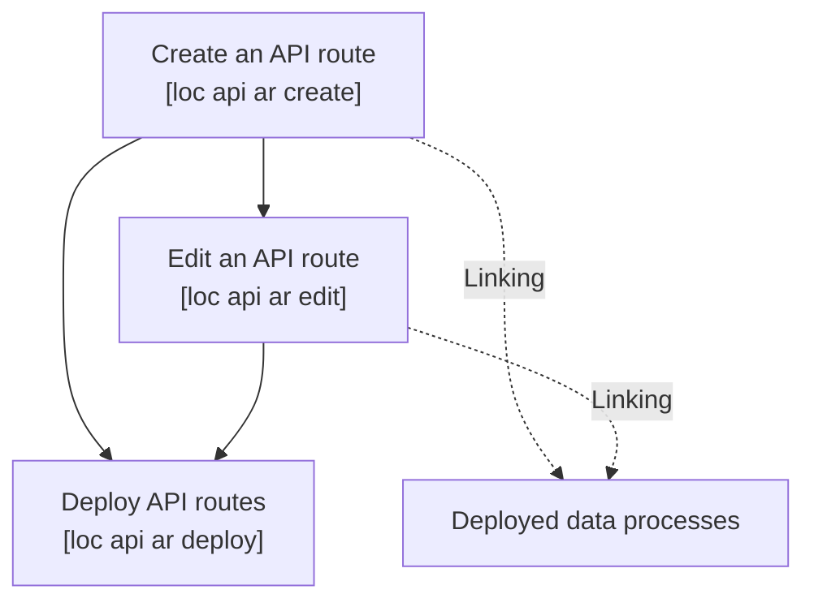

# Create and Use Trigger

## API Route

Managing an API route, or an user-defined HTTP entpoint with CLI, is similar to [the way you do it in Studio](/legacy/0.10/tutorials/create-api-route).



See [CLI Command Reference](/legacy/0.10/category/cli-command-reference) to knnow more about CLI commands.

:::tip
See [Create and Deploy Data Process](/legacy/0.10/cli-handbook/create-deploy-project) for how to deploy the necessary logic and data process for this article.
:::

### Create an API Route

Firstly, check if the API route path you're going to create might conflict with existing ones:

```bash
loc api ar list --remote
```

:::note
CLI allows you to see _all_ API routes on the LOC server, although only ones created by you under the current project can be edited or deleted.
:::

Then create an API route and enter fields/select options. We want a HTTP endpoint that accepts POST requests and returns JSON responses:

```
> ./loc api ar create

Select a Project:
✔  PROJECT NAME     DESCRIPTION
  ═════════════════════════
   my-cli-project

✔ Name of API Route · hello-world-greeting
✔ Description of API Route · API route for Hello World tutorial
✔ Method · POST
✔ Path of API Route · /greeting
✔ Request Mode · Sync
✔ Response Content Type · Json

API Route: hello-world-greeting
 Data Process
 <No Data Process linked to API Route>
```

Now CLI will prompt you to select data processes to be linked:

```
Select Data Process
[1/4] Add Data Process - Choose Position
Move cursor to where you want to insert Data Process, press enter to continue
By default, Data Process will be inserted right below chosen one except first slot
?  PERMANENT IDENTITY          DATA PROCESS NAME   REVISION   ENABLED   ORDER
  ════════════════════════════════════════════════════════════════
❯  <first Data Process slot>

[2/4] Add Data Process - Pick Data Process
Move cursor to select which Data Process you want to add
?  PERMANENT IDENTITY                     DATA PROCESS NAME              REVISION   ENABLE
  ═══════════════════════════════════════════════════════════════════════════
   ...
❯  8fc20e9a-5c8d-486a-b1c5-b897a6c99f16   hello-world                    1          true

[3/4] Add Data Process - Pick Data Process Revision
Move cursor to select which Data Process revision you want to use
═══════════════════════════════════════════════════
 PERMANENT IDENTITY | 8fc20e9a-5c8d-486a-b1c5-b897a6c99f16 |
═══════════════════════════════════════════════════
✔  REVISION   DATA PROCESS NAME   DESCRIPTION
  ══════════════════════════════════════
   1          hello-world

[4/4] Add Data Process - Complete and continue

(`e` to edit linked Data Process, or press enter to skip)
```

You can press `e` to add more data processes, or press `enter` to finish the creation process:

```
Successfully create API Route "hello-world-greeting"
```

If you open `./loc/triggers.yaml` under your local workspace, you should see something like this:

```yaml title="./loc/triggers.yaml"
apiRoutes:
    - name: hello-world-greeting
      description: API route for Hello World tutorial
      path: /greeting
      method: POST
      mode: Sync
      response_content_type: Json
      response_body_aggregation:
          - dataProcessPermanentIdentity: 30c217d3-9aca-41eb-9f7e-7062cdc2b3d7
            dataProcessRevision: 1
            resultAggregationPath: null
      enabled: true
      creation_timestamp: 2023-03-28T03:08:48.060803400Z
      unit_id: 00000000-0000-0000-0000-000000000000
      project_ref:
          ref_tag: id
          ref: 914ef37b-156c-4b14-955a-29aa66f85c8a
```

### Deploy API Routes in a Project

However, the API route we've just created is not yet deployed - the metadata is only stored locally. And despite API routes are grouped under a specific user's project, they will not be deployed or updated while executing `loc project deploy`.

Instead, we can deploy _all_ API routes under the project with the following command:

```
> ./loc api ar deploy

Select a Project:
✔  PROJECT NAME     DESCRIPTION
  ═════════════════════════
   my-cli-project

Select a API Route:
?        ID       NAME                   ENABLED   PATH        METHOD   MODE
  ════════════════════════════════════════════════════════════════
❯  (+)   <null>   hello-world-greeting   true      /greeting   POST     Sync

Successfully deploy API Route local changes to remote server
```

:::warning
If the project you selected is not yet deployed, you will not be able to deploy its API routes.
:::

The API route should appear in Studio's [API Route](/legacy/0.10/studio-guide/triggers#create-an-api-route) panel, and if you check again `./loc/triggers.yaml`, you should see now the metadata is pointing to the deployed (remote) assets:

```yaml title="./loc/triggers.yaml"
apiRoutes:
    - id: 3ec00e56-4b5b-4ea2-83e2-f3cf8ac85ffe
      server:
          name: hello-world-greeting
          # ...
      local: null
      deleted: false
```

### Invoke an API Route

The API route we've deployed should be something like `https://api.xxxxxx.fst.network/greetings`. See [Invoke a Data Process with API Route](/legacy/0.10/tutorials/create-api-route#invoke-a-data-process-with-api-route) for how to invoke the API route via a HTTP client or `curl`.
