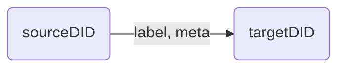

# Event Store Agent

```typescript
import { EventAgent, Event, Search, Pattern } from "@fstnetwork/loc-logic-sdk";
```

Emit and query LOC data events.

Once emitted, events are stored and can be searched in Elasticsearch in a very short time. They will be generated to data lineage graphs in Studio.

The data lineage or data trail is represented by the relationship of the graph below:



#### Availability

-   ✓ Generic logic
-   ✗ Aggregator logic

import Tabs from "@theme/Tabs";
import TabItem from "@theme/TabItem";

## Emit Events

```typescript
async EventAgent.emit(events: Event.Event[]): Promise<void>
```

Emit event(s). The parameter `events` is an array of events.

### Event Schema

Type `Event.Event` has the following fields:

| Field                                  | Type     | Description                                                              |
| -------------------------------------- | -------- | ------------------------------------------------------------------------ |
| `labelName`                            | `string` | Label name (event name)                                                  |
| `sourceDigitalIdentity` or `sourceDID` | `string` | Source digital identity (DID)                                            |
| `targetDigitalIdentity` or `targetDID` | `string` | Target DID                                                               |
| `meta`                                 | `string` | Meta payload (additional data); max length 2<sup>15</sup> (32768) bytes. |
| `type`                                 | `string` | Event type (group)                                                       |

The input parameter/value of a would-be event is also referred as **event schema**.

:::info
For now `type` only supports `"default"`.

Elements of `events` does not have to be `Event.Event` type, but an error would be thrown if `label`, `sourceDID` or `targetDID` field is not present.
:::

Source and target nodes will be created in Elasticsearch if not exist. Any nodes can be both source and target of other events.

#### Example

<Tabs>
  <TabItem value="emit-js" label="JavaScript" default>

```javascript showLineNumbers
await EventAgent.emit([
    {
        // event 1
        labelName: "Event name 1",
        sourceDID: "Event source 1",
        targetDID: "Event target 1",
        meta: "",
        type: "default",
    },
    {
        // event 2
        labelName: "Event name 2",
        sourceDID: "Event source 2",
        targetDID: "Event target 2",
        meta: "",
        type: "default",
    },
    // ...
]);
```

  </TabItem>
  <TabItem value="emit-ts" label="TypeScript">

```typescript title="Import" showLineNumbers
import { ..., Event } from "@fstnetwork/loc-logic-sdk";
```

```typescript title="Logic" showLineNumbers
await EventAgent.emit([
    {
        // event 1
        labelName: "Event name 1",
        sourceDID: "Source DID 1",
        targetDID: "Target DID 1",
        meta: "",
        type: "default",
    },
    {
        // event 2
        labelName: "Event name 2",
        sourceDID: "Source DID 2",
        targetDID: "Target DID 2",
        meta: "",
        type: "default",
    },
    // ...
] as Event.Event[]);
```

  </TabItem>
</Tabs>

:::warning
The events may not be properly emitted without using `await`.
:::

:::tip
You can also use `JSON.stringify()` to include a JSON object in the meta payload, and later decode it with `JSON.parse()`.
:::

## Query Events

Query event(s) in Elasticsearch.

```typescript
async EventAgent.search(request: Search): Promise<SearchResult>
```

Parameter `request` is of type [`Search`](#search-parameter) and the function returns type [`SearchResult`](/legacy/0.10/sdk-reference/eventstore#search-result).

### Search Parameter

Type: `Search`

| Member         | Type                        | Description              |
| -------------- | --------------------------- | ------------------------ |
| `queries?`     | `Query[]` &#124; `null`     | Event query conditions   |
| `excludes?`    | `Query[]` &#124; `null`     | Event exclude conditions |
| `filters?`     | `Filter[]` &#124; `null`    | Event filter conditions  |
| `sort?`        | `Sort[]` &#124; `null`      | Event sort operator      |
| `aggregation?` | `Aggregation` &#124; `null` | Aggregation syntax       |
| `from?`        | `number` &#124; `null`      | Event query starts from  |
| `size?`        | `number` &#124; `null`      | Event query size         |

All fields are optional. `aggregation` is the syntax for [getting metrics, statistics, or other analytics](https://www.elastic.co/guide/en/elasticsearch/reference/current/search-aggregations.html) from Elasticsearch, which is an advanved feature that we will not demostrate here.

:::note

<Tabs>
  <TabItem value="Query" label="type Query" default>

```typescript
type Query =
    | {
          field: string; // event field - see "available fields names" below
          type: "match"; // match operator
          value: string; // field value to be matched
      }
    | {
          field: string;
          type: "match_phrase";
          value: string;
      }
    | {
          field: string;
          type: "term";
          value: string;
      };
```

These querying methods are directly from Elasticsearch: [match](https://www.elastic.co/guide/en/elasticsearch/reference/current/query-dsl-match-query.html), [term](https://www.elastic.co/guide/en/elasticsearch/reference/current/query-dsl-term-query.html) and [match_phrase](https://www.elastic.co/guide/en/elasticsearch/reference/current/query-dsl-match-query-phrase.html):

| `type` (match operator) | Description                                                                                                                     |
| ----------------------- | ------------------------------------------------------------------------------------------------------------------------------- |
| `"match"`               | _Any word_ in the field matches your value (fuzzy search). Standard full-text search. Suitable for most use cases.              |
| `"term"`                | The field matchees _exactly_ to your value (precise search).                                                                    |
| `"match_phrase"`        | Words and their order matches words given in your value. (For example, value `"has been"` matches field `it has been raining`.) |

> See [query events example](#example-query-events).

  </TabItem>
  <TabItem value="Filter" label="type Filter">

```typescript
type Filter =
    | {
          // range filter
          field: string; // event field - see "available fields names" below
          gte?: number | null; // greater than or equal to (≥)
          lte?: number | null; // less than or equal to (≤)
          type: "range";
      }
    | {
          // wilcard filter
          field: string;
          type: "wildcard";
          value: string;
      };
```

A filter can be either _range_ or _wildcard_ filter. Set `gte` and/or `lte` to `null` means no filter.

The wildcard filter value can contain the following characters:

| Wilcard operator | Description                                                  |
| ---------------- | ------------------------------------------------------------ |
| `?`              | Representing any single character                            |
| `*`              | Representing zero or more characters, including an empty one |

For example, `event-?-*` matches `event-A-1` and `event-B-123`, and so on.

> See [filter events example (range)](#example-filter-events-range) and [filter events example (wildcard)](#example-filter-events-wildcard).

  </TabItem>
  <TabItem value="Sort" label="type Sort">

```typescript
interface Sort {
    field: string; // event field - see "available fields names" below
    order: SortOrder;
}

type SortOrder = "asc" | "desc";
```

`order` can be set to one of the following string:

-   `"asc"` (sort by ascending order)
-   `"desc"` (sort by descending order)

This also works for both numeric data or non-numeric strings (sorting alphabetically).

> See [sort events example](#example-sort-events).

  </TabItem>
</Tabs>

:::

<details>
    <summary>List of available fields names for query, filter or sort</summary>

| Name                              | Description                                                           |
| --------------------------------- | --------------------------------------------------------------------- |
| `label_id`                        | label ID                                                              |
| `label_name`                      | Label name (`labelName` in `emit()`)                                  |
| `source_digital_identity`         | Source DID (`sourceDID` in `emit()`)                                  |
| `target_digital_identity`         | Target DID (`targetDID` in `emit()`)                                  |
| `type`                            | Type (`type` in `emit()`)                                             |
| `sequence`                        | Event sequence number (the emit order in an array, starting from `0`) |
| `timestamp`                       | Event emitted time (unix timestamp)                                   |
| `execution_id`                    | Execution ID                                                          |
| `task_id`                         | Task ID                                                               |
| `data_process_permanent_identity` | Data process permanent ID                                             |
| `data_process_name`               | Data process name                                                     |
| `data_process_revision`           | Data process revision number                                          |
| `logic_name`                      | Logic name                                                            |
| `logic_permanent_identity`        | Logic permanent ID                                                    |
| `logic_revision`                  | Logic revision number                                                 |

</details>

### Search Result

Type: `SearchResult`

| Member         | Type                              | Description                                                     |
| -------------- | --------------------------------- | --------------------------------------------------------------- |
| `events`       | [`Event[]`](#queried-events)      | Queried events                                                  |
| `count`        | `number`                          | Number of events to be queried (`size` parameter from `Search`) |
| `total`        | `number`                          | Actual queried number of events                                 |
| `took`         | `number`                          | Query time (milllisecond seconds)                               |
| `aggregation?` | `AggregationResult` &#124; `null` | Aggregation results                                             |

`count` and `total` are similar metrics from Elasticsearch using different APIs; you can ignore them and simply use `events.length` instead.

List of examples:

-   [query events](#example-query-events)
-   [exclude events](#example-exclude-events)
-   [filter events (range)](#example-filter-events-range)
-   [filter events (wildcard)](#example-filter-events-wildcard)
-   [sort events](#example-sort-events)

#### Example: query events

<Tabs>
  <TabItem value="query-js" label="JavaScript" default>

```javascript showLineNumbers
const requests = {
    // highlight-start
    queries: [
        {
            field: "label_name", // field name
            type: "match", // matching operater
            value: "your event name", // value
        },
        // match condition 2...
    ],
    // highlight-end
    excludes: [],
    filters: [],
    sorts: [],
    aggregation: null,
    from: 0,
    size: 1000,
};

const query = await EventAgent.search(requests);
const events = query?.events;

// iterate through events
events.forEach((event) => {
    const label_name = event.label.name;
    const meta = event.meta;
    // ...
});
```

  </TabItem>
  <TabItem value="query-ts" label="TypeScript">

```typescript title="Import" showLineNumbers
import { ..., Search } from "@fstnetwork/loc-logic-sdk";
```

```typescript title="Logic" showLineNumbers
const requests: Search = {
    // highlight-start
    queries: [
        {
            field: "label_name", // field name
            type: "match", // querying method
            value: "your event name", // value
        },
        // match condition 2...
    ],
    // highlight-end
    excludes: [],
    filters: [],
    sorts: [],
    aggregation: null,
    from: 0,
    size: 1000,
};

const query = await EventAgent.search(requests);
const events = query?.events;

// iterate through events
events.forEach((event) => {
    const label_name = event.label.name;
    const meta = event.meta;
    // ...
});
```

  </TabItem>
</Tabs>

:::tip
Events require a little bit of time to be stored into Elasticsearch. If you query events almost immediately after they are emitted, `EventAgent.search` may return an empty result.

One of the workaround is to use a timed loop:

```javascript
let events = [];
const start = Date.now();
let now = Date.now();

// wait as long as 30 seconds to query events
do {
    const query = await EventAgent.search({
        queries: [
            {
                field: "label_name",
                type: "match",
                value: "label name",
            },
        ],
        excludes: [],
        filters: [],
        sorts: [],
        aggregation: null,
        from: 0,
        size: 1000,
    });
    events = query?.events;
    now = Date.now();
} while (events.length == 0 || now - start < 30000);
```

The example above will keep query events until something is returned or the time exceeds 30 seconds.
:::

#### Example: exclude events

<Tabs>
  <TabItem value="exclude-js" label="JavaScript" default>

```javascript showLineNumbers
const query = await EventAgent.search({
    queries: [],
    // highlight-start
    excludes: [
        {
            // exclude condition 1
            field: "source_digital_identity",
            type: "match",
            value: "your source DID",
        },
        // match condition 2...
    ],
    // highlight-end
    filters: [],
    sorts: [],
    aggregation: null,
    from: 0,
    size: 1000,
});

const events = query?.events;
```

  </TabItem>
  <TabItem value="exclude-ts" label="TypeScript">

```typescript title="Import" showLineNumbers
import { ..., Search } from "@fstnetwork/loc-logic-sdk";
```

```typescript title="Logic" showLineNumbers
// highlight-next-line
const query = await EventAgent.search({
    queries: [],
    // highlight-start
    excludes: [
        {
            // exclude condition 1
            field: "source_digital_identity",
            type: "match",
            value: "your source DID",
        },
        // exclude condition 2...
    ],
    // highlight-end
    filters: [],
    sorts: [],
    aggregation: null,
    from: 0,
    size: 1000,
} as Search);

const events = query?.events;
```

  </TabItem>
</Tabs>

#### Example: filter events (range)

If a field of certain events is numeric data, you can apply a filter range:

<Tabs>
  <TabItem value="filter-js" label="JavaScript" default>

```javascript showLineNumbers
const query = await EventAgent.search({
    queries: [],
    excludes: [],
    // highlight-start
    filters: [
        {
            // filter condition 1
            field: "target_digital_identity", // field name
            gte: 9000, // value greater than or equal to
            lte: null, // value smaller than or equal to
            type: "range",
        },
        // filter condition 2...
    ],
    // highlight-end
    sorts: [],
    aggregation: null,
    from: 0,
    size: 1000,
});

const events = query?.events;
```

  </TabItem>
  <TabItem value="filter-ts" label="TypeScript">

```typescript title="Import" showLineNumbers
import { ..., Search } from "@fstnetwork/loc-logic-sdk";
```

```typescript title="Logic" showLineNumbers
// highlight-next-line
const query = await EventAgent.search({
    queries: [],
    excludes: [],
    // highlight-start
    filters: [
        {
            // filter condition 1
            field: "target_digital_identity", // field name
            gte: 9000, // value greater than or equal to 9000
            lte: null, // value smaller than or equal to null
            type: "range",
        },
        // filter condition 2...
    ],
    // highlight-end
    sorts: [],
    aggregation: null,
    from: 0,
    size: 1000,
} as Search);

const events = query?.events;
```

  </TabItem>
</Tabs>

:::tip
When filtering events within a time range with `timestamp` field, convert the time to **unix timestamp**. For example:

```javascript showLineNumbers
filters: [  // filter events for the past hour
    {
        field: "timestamp",
        gte: Date.now() - 60 * 60 * 1000,  // starts from 1 hour ago (= 60 * 60 * 1000 ms)
        lte: Date.now(),
        type: "range",
    }
],
```

:::

#### Example: filter events (wildcard)

`filters` can apply a [wildcard search](https://www.elastic.co/guide/en/elasticsearch/reference/current/query-dsl-wildcard-query.html) on string names as well, using the following wildcard operators:

<Tabs>
  <TabItem value="filter2-js" label="JavaScript" default>

```javascript showLineNumbers
const query = await EventAgent.search({
    queries: [],
    excludes: [],
    // highlight-start
    filters: [
        {
            // filter condition 2...
            field: "target_digital_identity", // field name
            type: "wildcard",
            value: "some?name*", // wildcard value
        },
        // filter condition 2...
    ],
    // highlight-end
    sorts: [],
    aggregation: null,
    from: 0,
    size: 1000,
});

const events = query?.events;
```

  </TabItem>
  <TabItem value="filter2-ts" label="TypeScript">

```typescript title="Import" showLineNumbers
import { ..., Search } from "@fstnetwork/loc-logic-sdk";
```

```typescript title="Logic" showLineNumbers
// highlight-next-line
const query = await EventAgent.search({
    queries: [],
    excludes: [],
    // highlight-start
    filters: [
        {
            // filter condition 2...
            field: "target_digital_identity", // field name
            type: "wildcard",
            value: "some?name*", // wildcard value
        },
        // filter condition 2...
    ],
    // highlight-end
    sorts: [],
    aggregation: null,
    from: 0,
    size: 1000,
} as Search);

const events = query?.events;
```

  </TabItem>
</Tabs>

#### Example: sort events

<Tabs>
  <TabItem value="sort-js" label="JavaScript" default>

```javascript showLineNumbers
const query = await EventAgent.search({
    queries: [],
    excludes: [],
    filters: [],
    // highlight-start
    sorts: [
        {
            // sort condition 1
            field: "source_digital_identity",
            order: "desc",
        },
        // sort condition 2...
    ],
    // highlight-end
    aggregation: null,
    from: 0,
    size: 1000,
});

const events = query?.events;
```

  </TabItem>
  <TabItem value="sort-ts" label="TypeScript">

```typescript title="Import" showLineNumbers
import { ..., Search } from "@fstnetwork/loc-logic-sdk";
```

```typescript title="Logic" showLineNumbers
// highlight-next-line
const query = await EventAgent.search({
    queries: [],
    excludes: [],
    filters: [],
    // highlight-start
    sorts: [
        {
            // sort condition 1
            field: "source_digital_identity",
            order: "desc",
        },
        // sort condition 2...
    ],
    // highlight-end
    aggregation: null,
    from: 0,
    size: 1000,
} as Search);

const events = query?.events;
```

  </TabItem>
</Tabs>

#### Queried Events

Type: `Event`

An event in `events` is type of `Event` (different from the one used in `emit`):

| Member                       | Type                                                                                                 | Description                                                                        |
| ---------------------------- | ---------------------------------------------------------------------------------------------------- | ---------------------------------------------------------------------------------- |
| `label`                      | `Label`, which is `{ id: string; name: string; }`                                                    | Event label ID and name                                                            |
| `sourceDigitalIdentity`      | `string`                                                                                             | Source DID                                                                         |
| `targetDigitalIdentity`      | `string`                                                                                             | Target DID                                                                         |
| `meta`                       | `string`                                                                                             | Meta payload                                                                       |
| `type`                       | `string`                                                                                             | Event group                                                                        |
| `sequence`                   | `number`                                                                                             | Event sequence (the emit order in an array, starting from `0`)                     |
| `timestamp`                  | `string`                                                                                             | Event emitted datetime ([ISO 8601](https://en.wikipedia.org/wiki/ISO_8601) string) |
| `executionId`                | `string`                                                                                             | Execution ID                                                                       |
| `taskId`                     | `string`                                                                                             | Task ID                                                                            |
| `dataProcessIdentityContext` | [`VersionedIdentityContext`](/legacy/0.10/sdk-reference/context-and-task#versioned-identity-context) | Data process ID and name                                                           |
| `logicIdentityContext`       | `VersionedIdentityContext`                                                                           | Logic identity ID and name                                                         |

Each queried event, other than the basic fields, also contains info about the execution, task, logic and data process where it was emitted.

## Query Event Sequences

Search _sequence_ of events. The first event has to satisfy first search condition, and so on...

```typescript
async EventAgent.searchWithPattern(request: Pattern): Promise<PatternResult>
```

### Sequence Search Parameter

Type: `Pattern`

| Member      | Type                                                                     | Description                                                                                                            |
| ----------- | ------------------------------------------------------------------------ | ---------------------------------------------------------------------------------------------------------------------- |
| `sequences` | [`Sequence[]`](/legacy/0.10/sdk-reference/eventstore#sequence-parameter) | Sequence of conditions                                                                                                 |
| `filter?`   | `Filter[]`                                                               | Filter conditions (see [here](http://localhost:3000/legacy/0.10/sdk-reference/eventstore#example-filter-events-range)) |
| `maxSpan?`  | `string`                                                                 | Search time span (for example, `30s` = 30 secs and `15m` = 15 mins)                                                    |

#### Sequence Parameter

Type: `Sequence`

| Member          | Type                        | Description               |
| --------------- | --------------------------- | ------------------------- |
| `conditions?`   | `Condition[]` &#124; `null` | Sequence query conditions |
| `sharedFields?` | `string[]` &#124; `null`    |                           |
| `type?`         | `string` &#124; `null`      |                           |

The available field names in `conditions?` are the same as [`search()`](/legacy/0.10/sdk-reference/eventstore#search-parameter). See the example for details.

### Sequence Search Result

Type: `PatternResult`

| Member      | Type                                                                           | Description                       |
| ----------- | ------------------------------------------------------------------------------ | --------------------------------- |
| `sequences` | [`SequencesResult[]`](/legacy/0.10/sdk-reference/eventstore#returned-sequence) | Sequence of queried events        |
| `count`     | `number`                                                                       | Number of events to be queried    |
| `total`     | `number`                                                                       | Actual queried number of events   |
| `took`      | `number`                                                                       | Query time (milllisecond seconds) |

#### Returned Sequence

Type: `SequencesResult`

`PatternResult` contains an array of such sequences, each sequence would contain one or more events:

| Member     | Type                                                              | Description    |
| ---------- | ----------------------------------------------------------------- | -------------- |
| `events`   | [`Event[]`](/legacy/0.10/sdk-reference/eventstore#queried-events) | Queried events |
| `joinKeys` | `string[]`                                                        |                |

#### Example

<Tabs>
  <TabItem value="pattern-js" label="JavaScript" default>

```javascript showLineNumbers
// create sequence search pattern
const query = await EventAgent.searchWithPattern({
    sequences: [
        // must have at least two event conditions!
        {
            // sequence 1 event condition
            // highlight-start
            conditions: [
                {
                    field: "label_name", // field name
                    op: "eq", // operator
                    value: "label name", // value
                },
            ],
            // highlight-end
            sharedFields: [],
            type: "any",
        },
        {
            // sequence 2 event condition
            // highlight-start
            conditions: [
                {
                    field: "source_digital_identity",
                    op: "gt",
                    value: "source DID",
                },
                {
                    field: "target_digital_identity",
                    op: "lt",
                    value: "target DID",
                },
            ],
            // highlight-end
            sharedFields: [],
            type: "any",
        },
    ],
    filter: null,
    maxSpan: null,
});

const sequences = query?.sequences;

// iterate through sequences
sequences.forEach((sequence) => {
    // iterate through events in each sequence
    sequence.events?.forEach((event) => {
        const label_name = event.label.name;
        const meta = event.meta;
        // ...
    });
});
```

  </TabItem>
  <TabItem value="pattern-ts" label="TypeScript">

```typescript title="Import" showLineNumbers
import { ..., Pattern } from "@fstnetwork/loc-logic-sdk";
```

```typescript title="Logic" showLineNumbers
// create sequence search pattern
const query = await EventAgent.searchWithPattern({
    sequences: [
        // must have at least two event conditions!
        {
            // sequence 1 event condition
            // highlight-start
            conditions: [
                {
                    field: "label_name", // field name
                    op: "eq", // operator
                    value: "label name", // value
                },
            ],
            // highlight-end
            sharedFields: [],
            type: "any",
        },
        {
            // sequence 2 event condition
            // highlight-start
            conditions: [
                {
                    field: "source_digital_identity",
                    op: "gt",
                    value: "source DID",
                },
                {
                    field: "target_digital_identity",
                    op: "lt",
                    value: "target DID",
                },
            ],
            // highlight-end
            sharedFields: [],
            type: "any",
        },
    ],
    filter: null,
    maxSpan: null,
} as Pattern);

const sequences = query?.sequences;

// iterate through sequences
sequences.forEach((sequence) => {
    // iterate through events in each sequence
    sequence.events?.forEach((event) => {
        const label_name = event.label.name;
        const meta = event.meta;
        // ...
    });
});
```

  </TabItem>
</Tabs>

`op` operator in `conditions` includes the following options:

| Operator | Descriptionn             |
| -------- | ------------------------ |
| `"eq"`   | equal to                 |
| `"ne"`   | not equal to             |
| `"gt"`   | greater than             |
| `"lt"`   | less than                |
| `"gte"`  | greater than or equal to |
| `"lte"`  | less than or equal to    |
