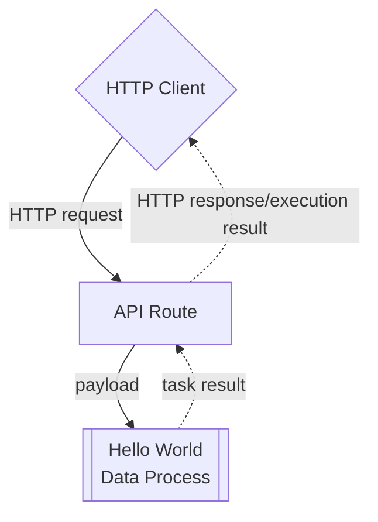

# Create and Use an API Route Trigger

:::tip Learning Objective

-   To create an API route (a HTTP endpoint) for a deployed data process.
-   To invoke a data process with a HTTP client.

:::

In LOC, a [**trigger**](/legacy/0.10/tutorials/loc-feat-overview#triggers-tasks-and-executions) is a feature which can be used to invoke one or more data processes. The most common form of it is **API route**, which is in fact user-defined HTTP endpoints.

Here we'll see how to add one API route for our "Hello World" data process demostrated in [Quick Start](/legacy/0.10/quickstart). The API route would work as follows:



:::note
See [Quick Start](/legacy/0.10/quickstart) for how to deploy the necessary logic and data process for this tutorial.
:::

## Create an API Route

Go to **API Route** panel, right click on your project to create an API route:

<div className="center-padded-sm">
    
</div>

:::tip
If you know have a project, create one in the **Data Pipeline/Data Process/Explorer** panel.
:::

Give the API route a name (for example, `Hello World API`) and set it to accept HTTP `POST` requests. Click `Linked Data Processes` and find your deployed data process:

<div className="center-padded-sm">
    
</div>

Click **Add** to add the data process:

<div className="center-padded-sm">
    
</div>

Then click **Create**:

<div className="center-padded-sm">
    
</div>

Copy the URL in the API route (in the example it's `https://api.xxxxxx.fst.network/hello-world`). This is the HTTP endpoint available for invoking the "Hello World" data process.

:::info
The list of data processes to be invoked by a trigger is also referred as the **trigger manifest**. If there are more than one data process linked, they will be executed _simultaneously_.

If a linked data process is modified, it'll have to be manually re-link to the trigger (by removing and adding it again) to be invoked properly again.
:::

## Invoke a Data Process with API Route

You can use any HTTP client (for example, the free and web-based [Hoppscotch](https://hoppscotch.io/)) to send a HTTP POST request:

:::tip
Make sure you have set the HTTP request type (`POST`) and body (Content type `application/json` with the JSON payload present).
:::

<div className="center-padded-sm">
    
</div>

:::note
The API route should always return a `200` reesponse even though an error had occurred in the data process.

-   If you receive a `404` response, it can be that LOC Core is still deploying the API route. Wait a dozen seconds then try again.

-   If you receive a `202` response, it could be one of the reasons below:

1. The API route has wait more than 15 seconds for the execution result to be returned (timed out). The data process may still run correctly despite for the late response.
2. You set the API route as asynchronous so the trigger did not wait for the result.
3. Something is wrong with LOC runtime to execute data processes properly.
   :::

Linux and macOS users can also use `curl`:

```bash
curl -X POST -d '{
    "name": "Zaphod Beeblebrox"
}' -v -i 'https://api.xxxxxx.fst.network/hello-world'
```

Typically, an API route response will have a JSON body. In our example the response is as below (formatted for readability):

```json
{
    "_status": 200,
    "_metadata": {
        "executionId": "ZNxt-2Bh0vtejFvHzxL0Lw",
        "triggerType": "ApiRoute",
        "triggerId": "97e18e03-6741-4dfc-9ad1-ab9ea67ac532",
        "creationTimestamp": "2023-08-16T06:34:35.499484Z",
        "completionTimestamp": "2023-08-16T06:34:35.746112Z",
        "status": "Complete"
    },
    "data": {
        // highlight-start
        "status": "ok",
        "taskKey": {
            "executionId": "ZNxt-2Bh0vtejFvHzxL0Lw",
            "taskId": "zqy_4-QNnWKS9WQfGo4tTw"
        },
        "data": {
            "message": "Hello, Zaphod Beeblebrox!"
        }
        // highlight-end
    }
}
```

This JSON data is more detailed than the task result we've seen in Quick Start, because this is the _execution result_ which contains one task result. If we have triggered multiple data processes with an API route, all of the task results would be included.

:::info
Data processes linked in the same trigger will be _invoked_ simultaneously.

The marked lines above are data defined by the result agent, which is the **task result**. If you wish to **return the task result only** (the custom result finalised by result agent), you can set the [API route encapsulation](/legacy/0.10/studio-guide/triggers) to `false`.
:::

<details>
    <summary>❓API route response when an error had occurred</summary>

If an error was thrown in one of the logic, the ultimate API route response will be a bit different:

```json
{
    "_status": 200,
    "_metadata": {
        "executionId": "ZNxt-2Bh0vtejFvHzxL0Lw",
        "triggerType": "ApiRoute",
        "triggerId": "97e18e03-6741-4dfc-9ad1-ab9ea67ac532",
        "creationTimestamp": "2023-08-16T06:34:35.499484Z",
        "completionTimestamp": "2023-08-16T06:34:35.746112Z",
        // highlight-start
        "status": "Error",
        "errors": [
            {
                "executionId": "ZNxt-2Bh0vtejFvHzxL0Lw",
                "taskId": "zqy_4-QNnWKS9WQfGo4tTw",
                "message": "..." // task result from result agent
            }
        ]
        // highlight-end
    },
    "data": {
        // task result from result agent
    }
}
```

It may seems strange that task result(s) would appear here twice - the reson is that `"_metadata"` will also be used for the [execution history](/legacy/0.10/studio-guide/data-discovery#execution) to indicate task errors.

The API route responnse will be one of the following depending on task result and the encapsulation setting:

| Have task result | API route encapsulation | API response                                                               |
| ---------------- | ----------------------- | -------------------------------------------------------------------------- |
| Yes              | True                    | Full response with `"errors"` and `"data"` with task results               |
| Yes              | False                   | Only `"data"`                                                              |
| No               | True                    | Full response with `"errors"` and `"data"`, with the task result as `null` |
| No               | False                   | `null`                                                                     |

</details>

## View Execution History

In LOC, any action of invoking data processes with triggers would be preserved as **execution histories** which you can query later.

An execution history contains the following information:

-   Task ID
-   Execution ID
-   Execution timestamps
-   Execution status
-   Trigger ID
-   Executed data process and logic PIDs
-   Logic logging message (output by [Logging Agent](/legacy/0.10/sdk-reference/logging))
-   Trigger payload and result

Go to **Data Discovery/Execution** and find the entry with the correct execution ID:

<div className="center-padded-sm">
    
</div>

Click on the **API Route** link which represents the execution you'd just run:

<div className="center-padded-sm">
    
</div>

:::info
Executions triggered with [manual trigger](/legacy/0.10/quickstart#manually-trigger-the-data-process) would use a mocked API route which have all-zero IDs.
:::

### Execution Result

Click the "Preview" button of **Execution Result**:

<div className="center-padded-sm">
    
</div>

You'll get the exactly same execution result you've seen earlier from the HTTP client:

<div className="center-padded-sm">
    
</div>

You can also inspect task payload and tesk result of each tasks.

### Logic Logging

To inspect logs written by [logging agent](/legacy/0.10/sdk-reference/logging) from _each logic_ in a task, click the **>** arrow in front of the task to expand the executed logic list:

<div className="center-padded-sm">
    
</div>

Like the execution and task, you can also click the "Preview" to see detailed logs from a specific logic, for example, the `Payload JSON Parser` logic reporting the payload data it had parsed from the trigger:

<div className="center-padded-sm">
    
</div>
