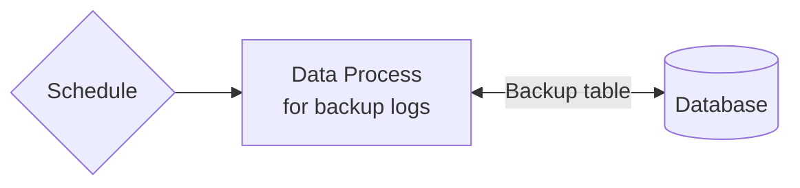

# Create an ETL Pipeline with Schedule

:::tip Learning Objective

-   To create a schedule trigger for executing a data process at a specific interval.

:::

ETL, or _Extract, Transformation and Load_, referes to data pipelines commonly deployed on or beside databases and data warehouses, traditionally mostly in the form of SQL scripts running as scheduled jobs, for example, to migrate or backup data from A to B.

By combining a LOC data process, database-operating logic with a schedule trigger, we can create ETLs to achieve the same objectives with the benefit of revision control and adding active metadata.

In this tutorial, we will create an ETL to automatically backup the log table we've used in the [database microservice](/legacy/0.10/tutorials/db-microservice) tutorial:



## ETL Design

### Database Table Schema

To simplify the example, we will use _the same database_ and copy the logs to another table named `Log_Backup`:

| Field       | Type           |
| ----------- | -------------- |
| `ID`        | `INT NOT NULL` |
| `Message`   | `Text`         |
| `Timestamp` | `DATETIME`     |

> Notice that the `ID` column in `Log_Backup` does not use `IDENTITY` for auto increment as in `Log`.

<details>
    <summary>MS-SQL Statement for Create and Drop Table</summary>

#### Create table

```sql
CREATE TABLE dbo.Log_Backup (
    ID INT NOT NULL,
    Message TEXT,
    Timestamp DATETIME
);
GO
```

#### Drop Table

```sql
DROP TABLE dbo.Log_Backup;
GO
```

</details>

### SQL Statement

The following SQL statement will backup logs into `Log_Backup`:

```sql
MERGE INTO dbo.Log_Backup AS target
USING dbo.Log AS source
ON (target.ID = source.ID)
WHEN NOT MATCHED THEN
    INSERT (ID, Message, Timestamp)
    VALUES (source.ID, source.Message, source.Timestamp)
WHEN MATCHED THEN
    UPDATE SET target.Message = source.Message, target.Message = source.Message;
GO
```

This statement will have the following actions:

-   If a log ID is not found (not matched) in `Log_Backup`, insert the log. This avoids log duplication in the backup table.
-   If a log ID is found (alreadt inserted), update its message and timestamp.

We can thus design our ETL pipeline as such:

### Data Process: `Scheduled Log Backup`

| Logic                | Name                                                                                                                        | Purpose                                     | DB Config Ref                                                                                   |
| -------------------- | --------------------------------------------------------------------------------------------------------------------------- | ------------------------------------------- | ----------------------------------------------------------------------------------------------- |
| **Generic logic #1** | `Log Backup`                                                                                                                | Copy logs from source table to target table |                                                                                                 |
| **Generic logic #2** | `Dtabase Query` ([source](/legacy/0.10/logic-library/database-query))                                                       | Query database                              | `comx` ([source](/legacy/0.10/tutorials/db-microservice#create-a-database-agent-configuration)) |
| **Aggregator logic** | `Database Aggregator` (see [`Log Service POST`](/legacy/0.10/tutorials/db-microservice#log-service-post-post-log-messages)) | Finalise service result                     |                                                                                                 |

See the [microservice tutorial](/legacy/0.10/tutorials/db-microservice#adding-database-configuration-reference) for how to create a database configuration and add the reference to the `Dtabase Query` logic.

#### Logic: `Log Backup`

```javascript showLineNumbers
import { LoggingAgent, SessionStorageAgent } from "@fstnetwork/loc-logic-sdk";

export async function run(ctx) {
    const statement = `MERGE INTO dbo.Log_Backup AS target
USING dbo.Log AS source
ON (target.ID = source.ID)
WHEN NOT MATCHED THEN
INSERT (ID, Message, Timestamp)
VALUES (source.ID, source.Message, source.Timestamp)
WHEN MATCHED THEN
UPDATE SET target.Message = source.Message, target.Message = source.Message;`;

    // create sql object
    const sql = {
        configName: "comx",
        statement: statement,
        params: [],
    };

    // log sql
    LoggingAgent.info({
        sql: sql,
    });

    // write sql into session storage
    await SessionStorageAgent.putJson("sql", sql);
}

export async function handleError(ctx, error) {
    LoggingAgent.error({
        error: true,
        errorMessage: error.message,
        stack: error.stack,
        taskId: ctx.task.taskKey,
    });
}
```

## Create a Schedule Trigger

After the logic and data process are in place, go to **Trigger** -> **Scheduler** and click **Create Schedule** on the top right corner.

Configure the schedule (the start time and interval) and select the `Log Service ETL` as the linked task:

<div className="center-padded-sm">
    
</div>

:::note
For some information about the `Crontab` type schedule - for which macOS and Linux developers are familiar with - see [Studio Guide](/legacy/0.10/studio-guide/triggers#create-a-schedule).
:::

Then click **Create**. When you go back to the schedule list, you can see the schedule type and the enable status:

<div className="center-padded-sm">
    
</div>

:::note
You can manually trigger a schedule from the list, or edit the schedule to enable/disable it.
:::

When a enabled schedule is created, the LOC scheduler will trigger the linked data process(es) on the interval you'd chosen.

That is it - you've successfully created a scheduled backup pipeline which will run on its own until you turned it off.

:::tip

#### Utilising Execution History and Data Lineage for Scheduled Pipelines

In real life scenarios, you may need to read, write and even recover across several databases and/or file storages. Since schedule triggers _do not_ return task results to users, you'll have to rely on reading the [execution histories](/legacy/0.10/tutorials/create-api-route#view-execution-history).

Another good practice is to use [events](/legacy/0.10/tutorials/emit-and-inspect-event) as persistent logging and for generating [data lineages](/legacy/0.10/studio-guide/data-discovery#event) that representing actual data actions occurred in scheduled jobs. They can be queried later and are immensely useful for tracking and analysing data operation issues.
:::
