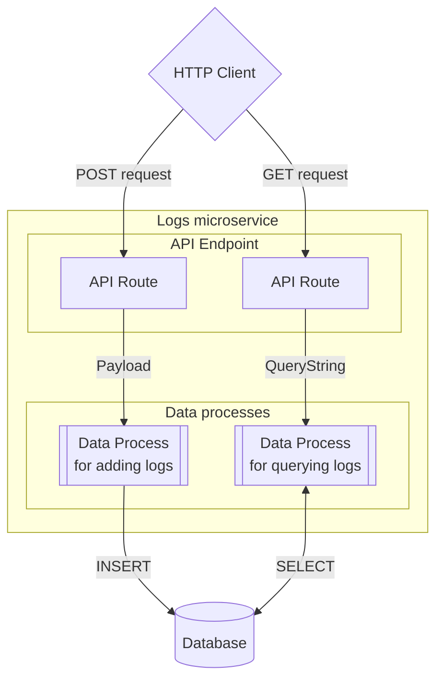

# Create a Data-Driven Microservice with Database

:::tip Learning Objective

-   To create a microservice consisted of two data processes.
-   To create a database configuration and read/write the database in logic.

:::

LOC data processes - after linked to at least one API routes - can serve as [RESTful](https://learn.microsoft.com/en-us/azure/architecture/best-practices/api-design)-like microservices. In this tutorial, we'll see how to create a simple logging microservice which can read and write a database table.

The "microservice" we'll create should be able to do the following things:

1. Accepts a `GET` request to query and return logs from database
2. Accepts a `POST` request with JSON payload to add logs into database
3. The two actions share the same HTTP endpoint, for example, `/api/db-tutorial/v1/logs`.



:::info
In this post we'll use a Microsoft SQL Server database deployed on Amazon AWS. The SQL statements in this tutorial are hence designed for SQL Server only and need to be modified for other types of databases.

Currently LOC supports the following types of databases:

-   MySQL
-   PostgreSQL
-   MS SQL Server
-   Oracle Database
    :::

import Tabs from "@theme/Tabs";
import TabItem from "@theme/TabItem";

## Database Table Schema

For this tutorial, we'll create a table `Log` with a simple schema as below:

| Field       | Type                    |
| ----------- | ----------------------- |
| `ID`        | `INT IDENTITY NOT NULL` |
| `Message`   | `Text`                  |
| `Timestamp` | `DATETIME`              |

> The `ID` field is defined as auto increment (`IDENTITY`; equivalent to `AUTO_INCREMENT` in other SQL variations).

<details>
    <summary>MS-SQL Statements for Create and Drop Table</summary>

Be noted that the statement would differ on different databases. The name `dbo` and and command `GO` are required for MS SQL Server.

#### Create table

```sql
CREATE TABLE dbo.Log (
    ID INT IDENTITY NOT NULL,
    Message TEXT,
    Timestamp DATETIME
);
GO

```

#### Delete all rows in table

> Does not reset the auto increment number of `ID`

```sql
DELETE FROM dbo.Log;
GO
```

#### Drop (remove) dable

```sql
DROP TABLE dbo.Log;
GO
```

</details>

## Create a Database Agent Configuration

As the way we've setup the HTTP agent configuration [in another tutorial](/legacy/0.10/tutorials/http-agent-configuration#create-a-configuration), go to **Administration/Agent Configuration** and add a database configuration under one of the folders:

<div className="center-padded-sm">
    
</div>

:::info
Modify the database type, host path, port and login information according to your database.

Since our MS SQL Server is for testing purpose only, the `Trust Certificate` is set to `True`.
:::

## RESTful Actions, API Routes and Data Processes

For the sake of demonstration, our "microservice" supports only two actions:

| Action                                         | HTTP Method/API Route                  |
| ---------------------------------------------- | -------------------------------------- |
| POST (insert) logs                             | POST `/api/db-tutorial/v1/logs`        |
| GET (query) logs; default latest 1000 messages | GET `/api/db-tutorial/v1/logs?limit=n` |

Each action is mapped to its own API route and data process. We'll take a look of these two data processes and their logic.

---

### `Log Service POST`: POST Log Messages

#### Input Data

The service accepts a payload which may include one or more log messages:

```json
[
    {
        "Message": "Life, Universe and Everything"
    },
    {
        "Message": "42"
    },
    {
        "Message": "Don't Panic"
    }
]
```

Since `ID` is auto increment and `Timestamp` is generated at the time when the service process the messages, we only need to provide messages.

In order to keep the demonstration simple, the POST service will not return anything except the `"OK"` or `"Error"` status.

#### SQL Statement

The insert SQL script as prepared statement would be like this:

```sql
INSERT INTO dbo.Log
    (Message, Timestamp)
VALUES
    (@P1, @P2),
    (@P3, @P4),
    (@P5, @P6),
    ...;
GO
```

:::note
The `@P1`, `@P2`... are placeholders for MS SQL Server. In MySQL it would be `?` and in PostgreSQL it would be `$1`, `$2`...
:::

Each set of values is correspond to the message and the timestamp (ISO 8601 string).

#### Logic Design

| Logic                | Name                                                                             | Purpose                                                    | DB Config Ref |
| -------------------- | -------------------------------------------------------------------------------- | ---------------------------------------------------------- | ------------- |
| **Generic logic #1** | `Payload JSON Parser` ([source](/legacy/0.10/logic-library/payload-json-parser)) | Parse payload to JSON object                               |               |
| **Generic logic #2** | `Log Service POST Logic`                                                         | Read parsed payload and generate SQL statements/parameters |               |
| **Generic logic #3** | `Database Query` ([source](/legacy/0.10/logic-library/database-query))           | Query database                                             | `comx`        |
| **Aggregator logic** | `Database Aggregator`                                                            | Finalise service result                                    |               |

Code for two of the logic (generic #1 and #3) can be found in the [Logic Module Library](/legacy/0.10/category/logic-module-library) (the database query logic handles both select and action queries).

:::note
The `Database Query` logic accepts the SQL statements and parameters from another logic, in this case namely `log-service-post-logic`.
:::

Aanother two built specifically for the service:

import PayloadJSONParserJSExample from "../_logic-template-sources/_payload-json-parser-js.mdx";
import DatabaseQueryJSExample from "../_logic-template-sources/_database-query-js.mdx";

<Tabs>
  <TabItem value="generic-a1" label="Generic logic #1">

<PayloadJSONParserJSExample />

  </TabItem>
  <TabItem value="generic-a2" label="Generic logic #2" default>

```javascript title="log-service-post-logic.js" showLineNumbers
import { LoggingAgent, SessionStorageAgent } from "@fstnetwork/loc-logic-sdk";

export async function run(ctx) {
    // read parsed JSON payload
    const parsed = await SessionStorageAgent.get("parsed");

    // log payload
    LoggingAgent.info({
        parsed: parsed,
    });

    if (!Array.isArray(parsed)) throw new Error("payload has to be an array");

    // generate sql object for select/insert query
    let values = [];
    let params = [];
    let params_id = 1;

    // generating SQL value placeholders and parameter array
    parsed.forEach((msg) => {
        if ("Message" in msg || "message" in msg) {
            values.push(`((@P${params_id}), (@P${params_id + 1}))`);
            const new_msg = msg.Message ? msg.Message : msg?.message;
            const new_dt = new Date().toISOString();
            params.push(new_msg);
            params.push(new_dt);
            params_id += 2;
        }
    });

    if (!values) throw new Error("no messages to insert");

    const sql = {
        configName: "comx",
        statement: `INSERT INTO dbo.Log (Message, Timestamp) VALUES ${values.join(
            ", ",
        )};`,
        params: params,
    };

    // log sql
    LoggingAgent.info({
        sql: sql,
    });

    // write sql into session storage
    await SessionStorageAgent.putJson("sql", sql);
}

export async function handleError(ctx, error) {
    LoggingAgent.error({
        error: true,
        errorMessage: error.message,
        stack: error.stack,
        taskId: ctx.task.taskKey,
    });
}
```

  </TabItem>
  <TabItem value="generic-a3" label="Generic logic #3" default>

<DatabaseQueryJSExample />

  </TabItem>
  <TabItem value="aggregator-a" label="Aggregator logic">

```javascript title="log-service-aggregator.js" showLineNumbers
import {
    LoggingAgent,
    ResultAgent,
    SessionStorageAgent,
} from "@fstnetwork/loc-logic-sdk";

export async function run(ctx) {
    // read database query status
    const db_query_status = await SessionStorageAgent.get("db_query_status");

    // read database response
    const db_resp = await SessionStorageAgent.get("db_resp");

    // read database error
    const db_error = await SessionStorageAgent.get("db_error");

    const result = {
        status: db_query_status,
        taskId: ctx.task.taskKey,
        data: db_resp?.rows || [],
    };

    if (db_error) result.error = db_error;

    // finalise result
    ResultAgent.finalize(result);
}

export async function handleError(ctx, error) {
    const err = {
        error: true,
        errorMessage: error.message,
        stack: error.stack,
        taskKey: ctx.task.taskKey,
    };

    // error logging
    LoggingAgent.error(err);

    // finalise result with HTTP code 400 (Internal Server Error)
    ResultAgent.finalize(err).httpStatusCode(500);
}
```

  </TabItem>
</Tabs>

---

### `Log Service Get`: GET Log Messages

#### Planned Output Data

The GET service should return a task result like this:

```json
{
    "status": "ok",
    "taskId": {
        "executionId": "...",
        "taskId": "..."
    },
    "data": [
        {
            "ID": 3,
            "Message": "Don't Panic",
            "Timestamp": "2023-05-24T04:07:36.686666666Z"
        },
        {
            "ID": 2,
            "Message": "42",
            "Timestamp": "2023-05-24T04:07:36.686666666Z"
        },
        {
            "ID": 1,
            "Message": "Life, Universe and Everything",
            "Timestamp": "2023-05-24T04:07:36.686666666Z"
        }
    ]
}
```

#### SQL Statement

The select SQL script as prepared statement would be like this:

```sql
SELECT TOP (@P1) *
FROM dbo.Log
ORDER BY
    Timestamp DESC,
    ID DESC;
GO
```

> The `TOP` clause is equivalent to `LIMIT` at the end of other SQL variations.

The `@P1` parameter will be the QueryString parameter `limit` from the GET request. If not provided, the service will use the default value of `1000`.

#### Logic Design

| Logic                | Name                                                                                  | Purpose                                                        | DB Config Ref |
| -------------------- | ------------------------------------------------------------------------------------- | -------------------------------------------------------------- | ------------- |
| **Generic logic #1** | `QueryString Parser` ([source](/legacy/0.10/logic-library/querystring-parser))        | Parse QueryString to object                                    |               |
| **Generic logic #2** | `Log Service GET Logic`                                                               | Read parsed QueryString and generate SQL statements/parameters |               |
| **Generic logic #3** | `Database Query` ([source](/legacy/0.10/logic-library/database-query))                | Query database and return results                              | `comx`        |
| **Aggregator logic** | `Database Aggregator` (see [`Log Service POST`](#log-service-post-post-log-messages)) | Finalise service result                                        |               |

Like the first data process, code for two of the logic (generic #1 and #3) can be found in the [Logic Module Library](/legacy/0.10/category/logic-module-library). This means the two data processes actually share 50% of the code with reusable logic modules.

Other than using a QueryString parser this time, the second logic is different as well:

import QueryStringParserJSExample from "../_logic-template-sources/_querystring-parser-js.mdx";

<Tabs>
  <TabItem value="generic-b1" label="Generic logic #1">

<QueryStringParserJSExample />

  </TabItem>
  <TabItem value="generic-b2" label="Generic logic #2" default>

```javascript title="log-service-get-logic.js" showLineNumbers
import { LoggingAgent, SessionStorageAgent } from "@fstnetwork/loc-logic-sdk";

export async function run(ctx) {
    // read parsed querystring
    const params = await SessionStorageAgent.get("params");

    // log params
    LoggingAgent.info({
        params: params,
    });

    // get limit
    let limit = 1000; // default
    if ("limit" in params) {
        try {
            limit = Number(params.limit);
        } catch (e) {
            // skip
        }
    }

    // generate sql object for select/insert query
    const sql = {
        configName: "comx",
        statement:
            "SELECT TOP (@P1) * FROM dbo.Log ORDER BY Timestamp DESC, ID DESC;",
        params: [limit], // query 1000 rows by default
    };

    // log sql
    LoggingAgent.info({
        sql: sql,
    });

    // write sql into session storage
    await SessionStorageAgent.putJson("sql", sql);
}

export async function handleError(ctx, error) {
    LoggingAgent.error({
        error: true,
        errorMessage: error.message,
        stack: error.stack,
        taskId: ctx.task.taskKey,
    });
}
```

  </TabItem>
</Tabs>

---

### Adding Database Configuration Reference

While adding the `Database Query` logic to both data processes, you'll need to add a database confiuration _reference_, in this case named as `comx`:

<div className="center-padded-sm">
    
</div>

### API Routes

Finally [create API routes](/legacy/0.10/tutorials/create-api-route#create-an-api-route) for both data processes:

| HTTP Method | API Route URL              | Request Mode | Response Content Type | Linked Data Process |
| ----------- | -------------------------- | ------------ | --------------------- | ------------------- |
| POST        | `/api/db-tutorial/v1/logs` | Sync         | JSON                  | `Log Service POST`  |
| GET         | `/api/db-tutorial/v1/logs` | Sync         | AUTO                  | `Log Service GET`   |

You can see that both API routes share the same path but accepts different HTTP methods, so that they will invoke different data processes that implements corresponding service logic.

## Invoke the Service

After everything is in place, you would be able to invoke the service with either GET or POST requests:

<div className="center-padded-sm">
    
</div>

## Further Development

### Adding More RESTful Actions

Although we only implemented two actions here, more can be applied with the same principle - for example, `PATCH` (update log messages) and `DELETE` (delete log messages) - with more API routes and data processes added.

<details>
  <summary>Example payload and logic for UPDATE and DELETE services</summary>

Here we'll give you another two example code for `PATCH` and `DELETE`. Both data processes would share the same logic of the `POST` service except the second logic:

<Tabs>
  <TabItem value="patch" label="PATCH (update)">

#### API Route

| HTTP Method | API Route URL              | Request Mode | Response Content Type | Linked Data Process |
| ----------- | -------------------------- | ------------ | --------------------- | ------------------- |
| PATCH       | `/api/db-tutorial/v1/logs` | Sync         | JSON                  | `Log Service PATCH` |

#### JSON payload

```json
[
    {
        "id": "id of message 1",
        "message": "new message 1"
    },
    {
        "id": "id of message 2",
        "message": "new message 2"
    },
    {
        "id": "id of message 3",
        "message": "new message 3"
    }
]
```

#### SQL statement

```sql
UPDATE dbo.Log
SET
    message = (
        CASE id
            WHEN @P1 THEN @P2
            WHEN @P3 THEN @P4
            ...
            ELSE message
        END
    );
GO

```

#### Logic

```javascript title="log-service-patch-logic.js" showLineNumbers
import { LoggingAgent, SessionStorageAgent } from "@fstnetwork/loc-logic-sdk";

export async function run(ctx) {
    // read parsed JSON payload
    const parsed = await SessionStorageAgent.get("parsed");

    // log payload
    LoggingAgent.info({
        parsed: parsed,
    });

    if (!Array.isArray(parsed)) throw new Error("payload has to be an array");

    // generate sql object for select/insert query
    let cases = [];
    let params = [];
    let params_id = 1;

    // generating SQL value placeholders and parameter array
    parsed.forEach((update) => {
        if (
            ("id" in update || "ID" in update) &&
            ("Message" in update || "message" in update)
        ) {
            const id = update.id ? update.id : update?.ID;
            const new_msg = update.Message ? update.Message : update?.message;
            cases.push(`WHEN @P${params_id} THEN @P${params_id + 1}`);
            params.push(id);
            params.push(new_msg);
            params_id += 2;
        }
    });

    if (!cases) throw new Error("no messages to be updated");

    const sql = {
        configName: "comx",
        statement: `UPDATE dbo.Log SET message = (CASE id ${cases.join(" ")} ELSE message END);`,
        params: params,
    };

    // log sql
    LoggingAgent.info({
        sql: sql,
    });

    // write sql into session storage
    await SessionStorageAgent.putJson("sql", sql);
}

export async function handleError(ctx, error) {
    LoggingAgent.error({
        error: true,
        errorMessage: error.message,
        stack: error.stack,
        taskId: ctx.task.taskKey,
    });
}
```

  </TabItem>
  <TabItem value="delete" label="DELETE">

#### API Route

| HTTP Method | API Route URL              | Request Mode | Response Content Type | Linked Data Process  |
| ----------- | -------------------------- | ------------ | --------------------- | -------------------- |
| DELETE      | `/api/db-tutorial/v1/logs` | Sync         | JSON                  | `Log Service DELETE` |

#### JSON payload

```json
[
    {
        "id": "id of message 1"
    },
    {
        "id": "id of message 2"
    },
    {
        "id": "id of message 3"
    }
]
```

#### SQL statement

```sql
DELETE FROM dbo.Log
WHERE
    id IN (@P1, @P2, @P3...);
GO
```

#### Logic

```javascript title="log-service-delete-logic.js" showLineNumbers
import { LoggingAgent, SessionStorageAgent } from "@fstnetwork/loc-logic-sdk";

export async function run(ctx) {
    // read parsed JSON payload
    const parsed = await SessionStorageAgent.get("parsed");

    // log payload
    LoggingAgent.info({
        parsed: parsed,
    });

    if (!Array.isArray(parsed)) throw new Error("payload has to be an array");

    // generate sql object for select/insert query
    let values = [];
    let params = [];
    let params_id = 1;

    // generating SQL value placeholders and parameter array
    parsed.forEach((IDs) => {
        if ("id" in IDs || "ID" in IDs) {
            values.push(`@P${params_id++}`);
            const new_id = IDs.id ? IDs.id : IDs?.ID;
            params.push(new_id);
        }
    });

    if (!values) throw new Error("no ids to be deleted");

    const sql = {
        configName: "comx",
        statement: `DELETE FROM dbo.Log WHERE id IN (${values.join(", ")});`,
        params: params,
    };

    // log sql
    LoggingAgent.info({
        sql: sql,
    });

    // write sql into session storage
    await SessionStorageAgent.putJson("sql", sql);
}

export async function handleError(ctx, error) {
    LoggingAgent.error({
        error: true,
        errorMessage: error.message,
        stack: error.stack,
        taskId: ctx.task.taskKey,
    });
}
```

  </TabItem>
</Tabs>

</details>

### Recreate RESTful Responses

The execution result we had above includes the execution metadata, however you can omit these information by turning the API routes' [encapsulation](/legacy/0.10/studio-guide/triggers) off.

For example, we can simply only return the queried database result:

```javascript showLineNumbers
const messages = db_resp?.rows || [];

ResultAgent.finalize(messages);
```

And the API route would return

```json title="API route result without task or execution metadata"
[
    {
        "ID": 3,
        "Message": "Don't Panic",
        "Timestamp": "2023-05-24T04:07:36.686666666Z"
    },
    {
        "ID": 2,
        "Message": "42",
        "Timestamp": "2023-05-24T04:07:36.686666666Z"
    },
    {
        "ID": 1,
        "Message": "Life, Universe and Everything",
        "Timestamp": "2023-05-24T04:07:36.686666666Z"
    }
]
```

When the API route's encapsulation is set to `false`, only the task results - or the object defined by `ResultAgent.finalize()` - would be returned. Which means you can have full control of the services response. This may come in handy if you wish to integrate LOC data processes with your legacy applications or other services.

### Setting Proper HTTP Status Code

In our example above, in case of any unhandled error is thrown, the result agent in the aggregator logic will _always_ return the HTTP status code `500` (Internal Server Error). In reality, a RESTful service may also return codes like:

-   `400` (Bad Request)
-   `401` (Unauthorized Error)
-   `403` (Forbidden)
-   `500` (Internal Server Error)

With proper design, it is entirely possible to match client or server errors to these codes. Combining with setting the API route encapsulation to false, you would be able to create true RESTful services - either new ones or migrated from legacy APIs without breaking integration interfaces.
