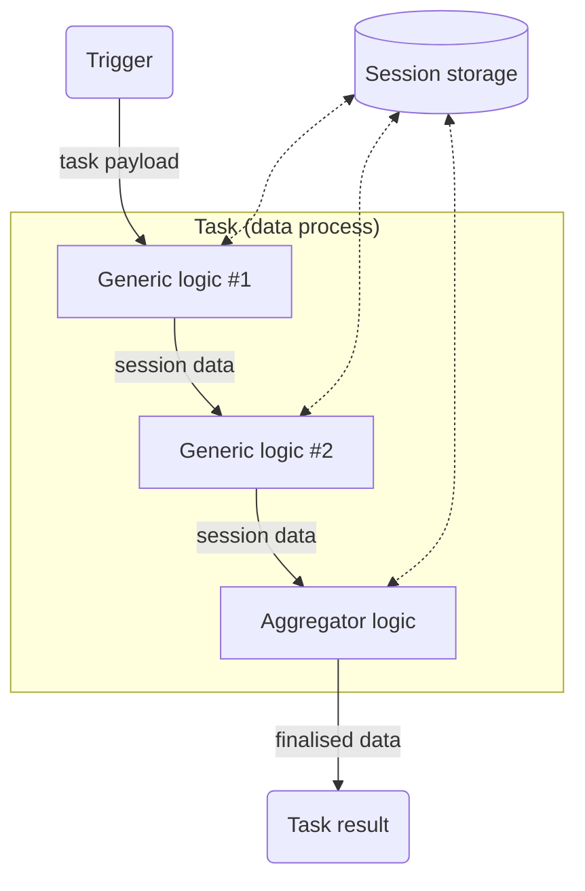
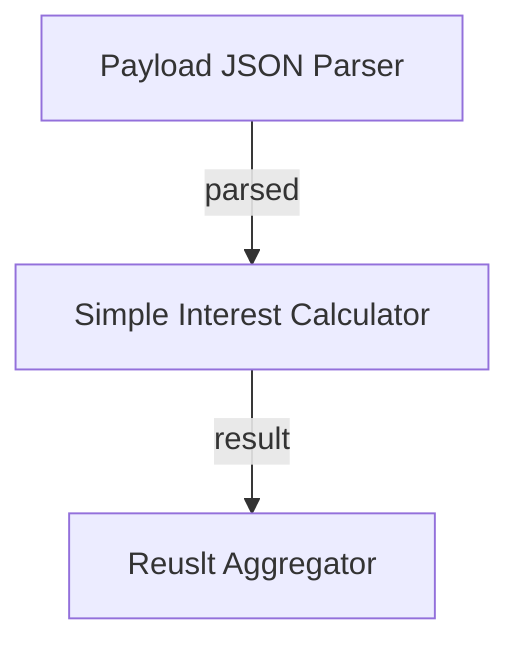
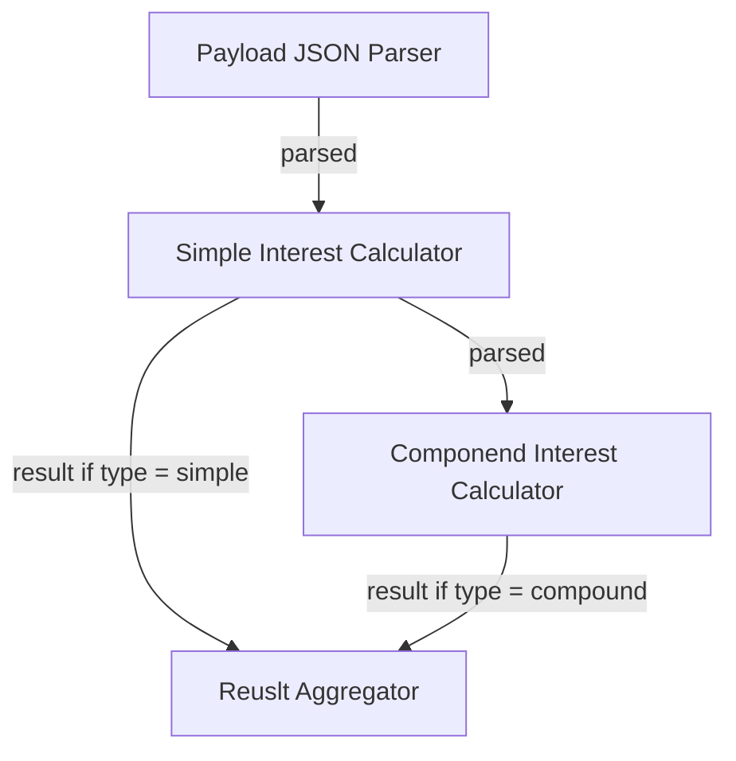

# Logic and Session

:::tip Learning Objective

-   To understand how logic are executed in a data process.
-   To pass data from one logic to another using the Session Storage agent.
-   To control the logic flow with session variables.

:::

Logic are the core elements of a [data process](/legacy/0.10/tutorials/loc-feat-overview#data-process-and-logic). They contains the implementation of a data pipeline (which may be part of a bigger one). And the **session storage** is the thing to link them up together during a task.

import Tabs from "@theme/Tabs";
import TabItem from "@theme/TabItem";

## Understand Logic Functions

Each logic is, in fact, consisted with _two_ JavaScript functions - `run` and `handleError`:

-   `run()` is where the normal logic code runs.
-   `handleError()` will _only_ be executed if `run()` (or `run()` in any logic before this one) throws an unhandled error.

:::info
We will discuss more about logic error handling in [Tips on Error Handling](/legacy/0.10/tutorials/error-handling-tip).
:::

The source of a logic is like this:

<Tabs>
  <TabItem value="js-1" label="JavaScript" default>

```javascript
import { ... } from '@fstnetwork/loc-logic-sdk';

export async function run(ctx) {
    // main logic code
}

export async function handleError(ctx, error) {
    // error handling code
}
```

  </TabItem>
  <TabItem value="ts-1" label="TypeScript">

```javascript
import { GenericContext, RailwayError, ... } from '@fstnetwork/loc-logic-sdk';

export async function run(ctx: GenericContext) {
    // main logic code
}

export async function handleError(ctx: GenericContext, error: RailwayError) {
    // error handling code
}
```

  </TabItem>
</Tabs>

Both `run` and `handleError` has to be exported with `export` keyword. [SDK](/legacy/0.10/category/sdk-reference) is imported for accessing agents and related types.

## Data Process and Session

When a data process is invoked in a task, its linked logic (`run()` of them to be exact) will be executed by LOC runtime one by one. The logic in the same task would share one session storage, which is how logic share data between them.



The session storage would be purged once the task is done. Logic also has no access to session storages created for other tasks.

## Using Session to Share Data

Logic can read and write session data using the [Session Storage Agent](/legacy/0.10/sdk-reference/session). We will use a simple example as demostration.

### Use Case: Simple Interest Calculator

Assuming you are a junior developer in a commercial bank and is tasked to write a _simple interest_ calculator service. A user would submit a principal amount, a yearly interest rate and a time period (months), and the service would return the final amount with interest.

Assuming the input JSON payload is

```json title="payload.json"
{
    "principle": 10000,
    "interest": 0.06,
    "months": 36
}
```

> 10,000 at 6% yearly rate for 36 months

The data process should return

```json
{
    "amount": 11800
}
```

> `10,000 x (1 + (0.06 / 12) x 36) = 11,800`

### Code Walkthrough

Since every stage in the data process all use JSON objects, this is pretty straightforward (we assume that the input format is always correct):

| Logic                | Name                                                                             | Purpose                     |
| -------------------- | -------------------------------------------------------------------------------- | --------------------------- |
| Generic logic #1     | `Payload JSON Parser` ([source](/legacy/0.10/logic-library/payload-json-parser)) | Read and parse JSON payload |
| **Generic logic #2** | `Simple Interest Calculator`                                                     | Calculate simple interest   |
| Aggregator logic     | `Result Aggregator` ([source](/legacy/0.10/logic-library/result-aggregator))     | Finalise task result        |



Two of the three logic are reused from our Quick Start tutorial. The new generic logic #2 (`Simple Interest Calculator`) is as follows:

```javascript title="Generic #2: Simple Interest Calculator" showLineNumbers
import { LoggingAgent, SessionStorageAgent } from "@fstnetwork/loc-logic-sdk";

export async function run(ctx) {
    // read parsed payload from session
    const parsed = await SessionStorageAgent.get("parsed");

    // exit logic if required fields do not exist
    if (
        !("principle" in parsed) ||
        !("interest" in parsed) ||
        !("months" in parsed)
    )
        return;

    // calculate simple interest amount
    const amount =
        parsed.principle * (1 + (parsed.interest / 12) * parsed.months);

    // write the result (in a JSON object) to session
    await SessionStorageAgent.putJson("result", { amount: amount });
}

export async function handleError(ctx, error) {
    // error logging
    LoggingAgent.error({
        error: true,
        errorMessage: error.message,
        stack: error.stack,
        taskId: ctx.task.taskKey,
    });
}
```

In real life, you might need to do more checking, for example, if all the fields are legit numbers. Here we let `handleError()` handles all other possible errors.

Build a new data process with these three logic. When we invoke a data process consisted with these three logic, it should return a result like this:

```json
{
    "_status": 200,
    "_metadata": {
        "..."
    },
    "data": {
        "status": "ok",
        "taskKey": {
            "..."
        },
        "data": {
            // highlight-next-line
            "amount": 18800
        }
    }
}
```

## Logic Flow Control Using Session

Session data can also be used as flags for selectly running logic or to choose between results. This will inevitable introduce more coupling between logic, but still worth it if you want a data process to be more versatile depending on situations.

### Use Case: Simple/Compound Interest Dual Calculator

Continue the last example, your manager now asks you to expand the service so that it can calculate _compound interest_ as well. The user will provide an additional field `type` in the payload to indicate which type of calculation they need:

```json
{
    // highlight-next-line
    "type": "compound",
    "principle": 10000,
    "interest": 0.06,
    "months": 36
}
```

| `type` value | Selected logic    |
| ------------ | ----------------- |
| `"simple"`   | simple interest   |
| `"compound"` | compound interest |

So if the payload specify a `"compound"` type, the JSON input above should get

```json title="payload.json"
{
    "amount": 11966.805248234146
}
```

> 10,000 x (1 + (0.06 / 12))<sup>36</sup> ~= 11,966.81

### Code Walkthrough

In this example we'll add a new logic `componend-interest-calculator` into the data process, as well as modifying the original `simple-interest-calculator`:

| Logic                | Name                                                                             | Purpose                                                           |
| -------------------- | -------------------------------------------------------------------------------- | ----------------------------------------------------------------- |
| Generic logic #1     | `Payload JSON Parser` ([source](/legacy/0.10/logic-library/payload-json-parser)) | Read and parse JSON payload                                       |
| **Generic logic #2** | `Simple Interest Calculator`                                                     | Calculate simple interest (only run when `type` = `"simple"`)     |
| **Generic logic #3** | `Componend Interest Calculator`                                                  | Calculate componend interest (only when if `type` = `"compound"`) |
| Aggregator logic     | `Result Aggregator` ([source](/legacy/0.10/logic-library/result-aggregator))     | Finalise result                                                   |



Since logic will still run one by one, both calculator logic will be executed. However we can have them to skip their job if `type` is not the correct one.

If `type` is neither `"simple"` or `"compound"`, the aggregator will read a `null` result value since both logic would be skipped and no one will write the value into session storage.

:::info
The first logic (payload parser) and the aggregator logic in this section are the same as the [previous version](/legacy/0.10/tutorials/logic-and-session#code-walkthrough).
:::

<Tabs>
  <TabItem value="generic-js-2-2" label="Generic #2 (modified)">

```javascript title="Generic #2: Simple Interest Calculator" showLineNumbers
import { LoggingAgent, SessionStorageAgent } from "@fstnetwork/loc-logic-sdk";

export async function run(ctx) {
    // read parsed payload from session
    const parsed = await SessionStorageAgent.get("parsed");

    // exit logic if type != "simple"
    // highlight-start
    if (parsed?.type != "simple") return;
    // highlight-end

    // exit logic if required fields do not exist
    if (
        !("principle" in parsed) ||
        !("interest" in parsed) ||
        !("months" in parsed)
    )
        return;

    // calculate simple interest amount
    const amount =
        parsed.principle * (1 + (parsed.interest / 12) * parsed.months);

    // write the result (in a JSON object) to session
    await SessionStorageAgent.putJson("result", { amount: amount });
}

export async function handleError(ctx, error) {
    // error logging
    LoggingAgent.error({
        error: true,
        errorMessage: error.message,
        stack: error.stack,
        taskId: ctx.task.taskKey,
    });
}
```

  </TabItem>
  <TabItem value="generic-js-2-3" label="Generic #3 (new)" default>

```javascript title="Generic #3: Compound Interest Calculator" showLineNumbers
import { LoggingAgent, SessionStorageAgent } from "@fstnetwork/loc-logic-sdk";

export async function run(ctx) {
    // read parsed payload from session
    const parsed = await SessionStorageAgent.get("parsed");

    // exit logic if type != "compound"
    // highlight-start
    if (parsed?.type != "compound") return;
    // highlight-end

    // exit logic if required fields do not exist
    if (
        !("principle" in parsed) ||
        !("interest" in parsed) ||
        !("months" in parsed)
    )
        return;

    // calculate simple interest amount
    const amount =
        parsed.principle * Math.pow(1 + parsed.interest / 12, parsed.months);

    // write the result (in a JSON object) to session
    await SessionStorageAgent.putJson("result", { amount: amount });
}

export async function handleError(ctx, error) {
    // error logging
    LoggingAgent.error({
        error: true,
        errorMessage: error.message,
        stack: error.stack,
        taskId: ctx.task.taskKey,
    });
}
```

  </TabItem>
</Tabs>

When requesting the data process to calculate compound interest, the result would be

```json
{
    "_status": 200,
    "_metadata": {
        "..."
    },
    "data":{
        "status": "ok",
        "taskKey": {
            "..."
        },
        "data": {
            // highlight-next-line
            "amount": 11966.805248234146
        }
    }
}
```

In order to create reusable logic to work in complex situations, you should create a set of agreements (like deciding common session variables names, expected logic behaviors and documentations) between your team. It is also a good practice to implement sufficient error handling in logic to avoid operation issues.
