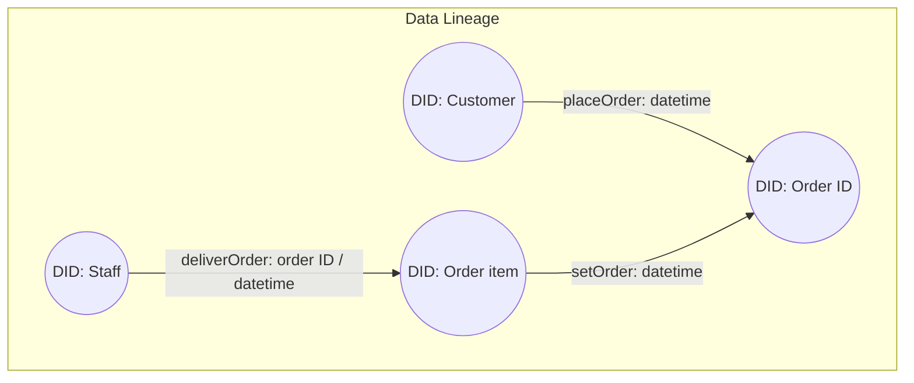
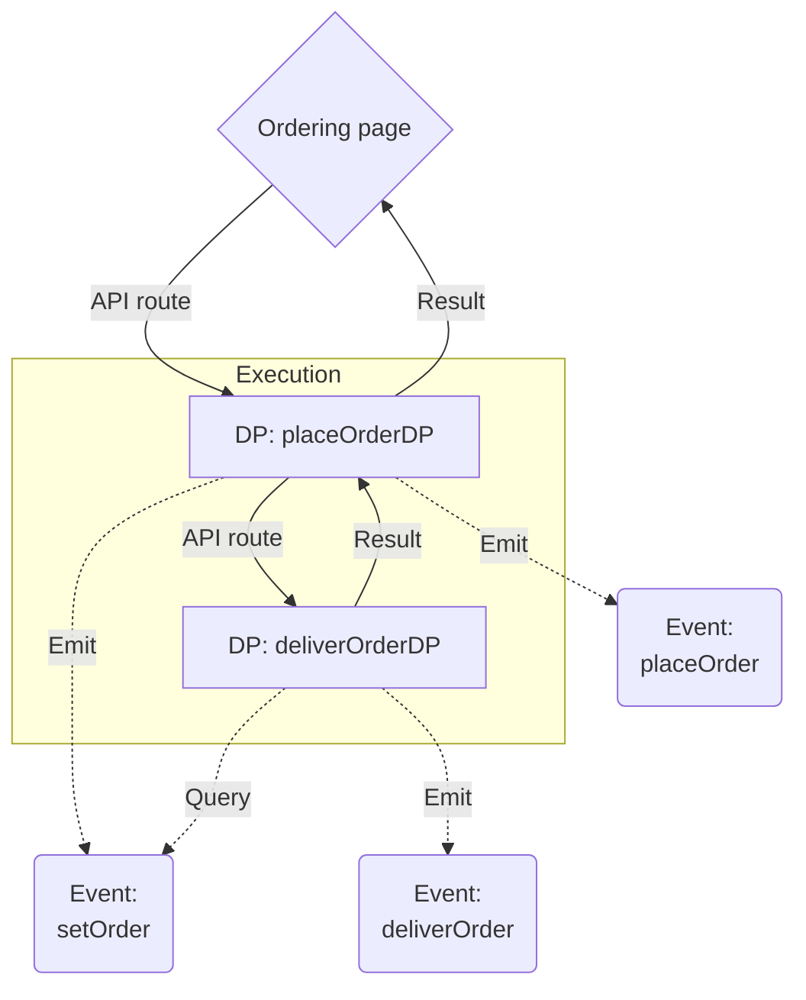
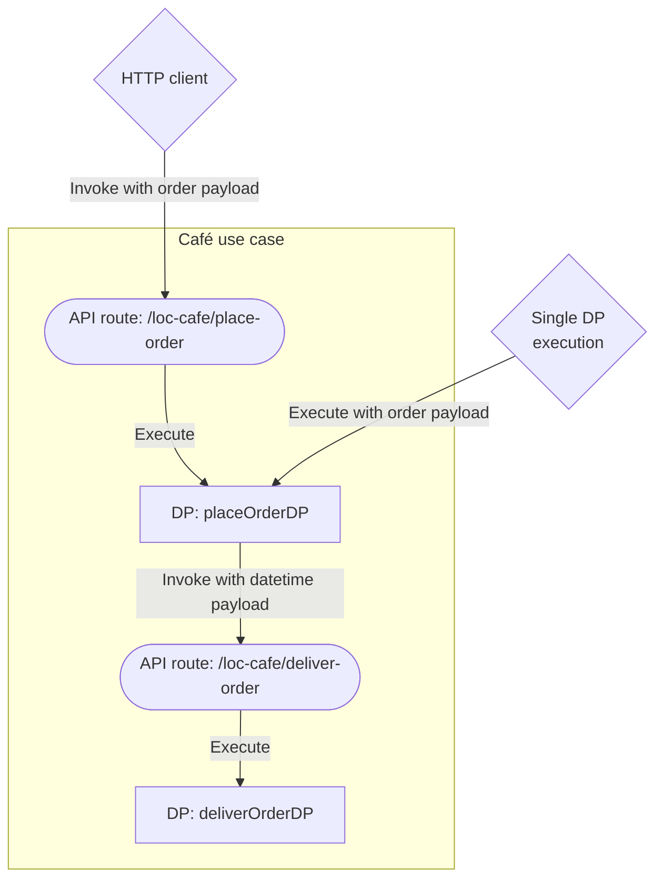

# System Design

In order to implement the order tracking feature for Lakeside Oasis Café, here's a simplified system design process.

## Order Payload Example

The orders submitted from the ordering website would be in JSON format:

```json
[
    {
        "OrderId": "201",
        "Customer": "Judy",
        "OrderItems": {
            "Iced_Coffee": 2,
            "Latte": 1,
            "Espresso": 0,
            "Cappuccino": 0,
            "Sandwich": 1,
            "Croissant": 1,
            "Bagel": 2
        }
    },
    {
        "OrderId": "202",
        "Customer": "Nick",
        "OrderItems": {
            "Iced_Coffee": 1,
            "Latte": 3,
            "Espresso": 2,
            "Cappuccino": 1,
            "Sandwich": 0,
            "Croissant": 0,
            "Bagel": 1,
            "Salad": 1
        }
    }
]
```

One submitted data may contain multiple orders. Each order record contains the order ID, the customer name as well as quantities for each of the items on the menu.

## Mock Staff Responsibility List

In order to assign staff to their responsible items (food that they need to deliver for the order), we'll use the following data structure and a helper function:

```javascript
// mock staff list: staff names and their responsible order items
/** @type { Record<string, string[]> } */
const staffs = {
    Duke: ["Iced_Coffee", "Sandwich"],
    Emmitt: ["Latte", "Espresso", "Cappuccino"],
    Jerry: ["Croissant", "Bagel"],
};

// return the staff responsible for a specific item
/** @param { string } itemName */
const search_staff = (itemName) => {
    for (let staff in staffs)
        for (let responsibility of staffs[staff])
            if (responsibility.toLowerCase() == itemName.toLowerCase())
                return staff;
    return null;
};
```

`search_staff` would return the name of a staff to handle the item, or return `null` if not found:

```javascript
const staff = search_staff("Iced_Coffee");
// staff == "Duke"
```

:::note
We've designed the logic to compare item names in the case-insensitive way (so a item named `"iced_coffee"` still matches `"Iced_Coffee"`). In theory the staff list should be loaded from somewhere else, like a database or a HTTP endpoint.

Note that the in the payload above, the second order data contains an item `"Salad"` which is not in the staff list. This is done _on purpose_ so that we can demostrate the effect of unseeigned items and broken lineage.
:::

## Data Lineage Design

The data lineage for one submitted order data is consisted with three groups of events:



---

| Event          | Source DID | Target DID | Description                             |
| -------------- | ---------- | ---------- | --------------------------------------- |
| `placeOrder`   | Customer   | Order ID   | A customer has placed an order          |
| `setOrder`     | Order Item | Order ID   | An ordered item belongs to an order     |
| `deliverOrder` | Staff      | Order Item | A staff is assigned to deliver the item |

In order to differentiate events generated from the same order payload, both `placeOrder` and `setOrder` event names would attach a datetime string ([ISO 8601](https://en.wikipedia.org/wiki/ISO_8601) format) so that they can be queried in a precise way.

All events would include related values in the `meta` field as JSON strings. This helps extracting information from events in a more straightfoward manner.

The `setOrder` events would _only_ be emitted if an item has been actually ordered (quantity > 0).

## Data Process Design

We will split the functionalities into two data processes:



---

| Execution Order | Data Process     | Description                                                                   | Trigger                                        |
| --------------- | ---------------- | ----------------------------------------------------------------------------- | ---------------------------------------------- |
| #1              | `placeOrderDP`   | Process the order payload and emit events `placeOrder` and `setOrder` events. | API route (triggered by user)                  |
| #2              | `deliverOrderDP` | Query `setOrder` events to assign staff and emit `deliverOrder` events.       | API route (may be triggered by `placeOrderDP`) |

Instead of using a single API route to invoke these two data processes, we'll use the first one to invoke the second - however `deliverOrderDP` might not needed to be invoked when there are no `setOrder` events available to query (no item has been ordered).

### API Routes

We will also create two API routes for the data processes respectively:



---

| API Route                 | Linked Data Process | Method | Payload Type |
| ------------------------- | ------------------- | ------ | ------------ |
| `/loc-cafe/place-order`   | `placeOrderDP`      | POST   | JSON         |
| `/loc-cafe/deliver-order` | `deliverOrderDP`    | POST   | JSON         |

:::note
The first API route (`/loc-cafe/place-order`) is optional since you can execute `placeOrderDP` directly from LOC Studio. See [next page](/legacy/0.10/use-cases/loc-cafe/implement-test) for details.
:::

In order to have DP `placeOrderDP` to be able to invoke `deliverOrderDP` via the HTTP agent, we'll need to create a [HTTP agent configuration](/legacy/0.10/tutorials/http-agent-configuration) for LOC itself as well.

## Logic Design

For your reference, we provide all ready-to-use example code below. You can create logic directly using these examples without modification.

All examples follow the same set of principles:

1. Reuse the `Payload JSON Parser` and `Result Aggregator` logic from the [Logic Module Library](/legacy/0.10/category/logic-module-library).
2. Log everything and pass all results to the aggregator.
3. Handles expected errors (from parsing/validating JSON or the LOC agents, etc.) and throw an error to half the data processes if needed.
4. Use JSDoc annotations to provide typing intellisense in either LOC Studio or LOC CLI + VS Code .

import PayloadJSONParserJSDocExample from "../../_logic-template-sources/_payload-json-parser-jsdoc.mdx";
import ResultAggregatorJSDocExample from "../../_logic-template-sources/_result-aggregator-jsdoc.mdx";

### DP #1: `placeOrderDP`

| Execution Order | Logic                                                                            | Type       | Description                                                    | Agent Config |
| --------------- | -------------------------------------------------------------------------------- | ---------- | -------------------------------------------------------------- | ------------ |
| #1              | `Payload JSON Parser` ([source](/legacy/0.10/logic-library/Payload JSON Parser)) | Generic    | Parse order payload to JSON                                    |              |
| #2              | `loc-cafe-order-validator`                                                       | Generic    | Validate the fields and data type in the order payload         |              |
| #3              | `loc-cafe-place-and-set-order-events`                                            | Generic    | Using the payload to emit `placeOrder` and `setOrder` events   |              |
| #4              | `loc-cafe-invoke-deliver-order-dp`                                               | Generic    | Invoke DP `deliverOrderDP` and pass the unique datetime string | ✓            |
| #5              | `Result Aggregator` ([source](/legacy/0.10/logic-library/result-aggregator))     | Aggregator | Finalise result                                                |              |

For the tutorial we'll implement all logic in JavaScript with JSDoc annotations:

<details>
    <summary>Logic #1 source code: Payload JSON Parser</summary>

<PayloadJSONParserJSDocExample />

</details>

<details>
    <summary>Logic #2 source code: loc-cafe-order-validator</summary>

```javascript title="loc-cafe-order-validator.js" showLineNumbers
import { LoggingAgent, SessionStorageAgent } from "@fstnetwork/loc-logic-sdk";

/** @param {import('@fstnetwork/loc-logic-sdk').GenericContext} ctx */
export async function run(ctx) {
    // load parsed payload
    const orders = await SessionStorageAgent.get("parsed");

    // validate JSON fields and types
    if (orders == null) {
        throw new Error("order cannot be empty");
    } else if (!Array.isArray(orders)) {
        throw new Error("order has to be an array");
    } else {
        orders.forEach((order) => {
            if (!("OrderId" in order) || Array.isArray(order.OrderId)) {
                throw new Error("field OrderId missing or cannot be an array");
            } else if (
                !("Customer" in order) ||
                Array.isArray(order.Customer)
            ) {
                throw new Error("field Customer missing or cannot be an array");
            } else if (
                !("OrderItems" in order) ||
                Array.isArray(order.OrderItems)
            ) {
                throw new Error(
                    "field OrderItems missing or cannot be an array",
                );
            } else {
                for (let itemName in order.OrderItems) {
                    const quantity = order.OrderItems[itemName];
                    if (
                        typeof itemName != "string" ||
                        typeof quantity != "number"
                    ) {
                        throw new Error(
                            "incorrect orderItem field types (not {string: number})",
                        );
                    } else if (!Number.isInteger(quantity) || quantity < 0) {
                        throw new Error(
                            "incorrect orderItem quantity (not integer or negative)",
                        );
                    }
                }
            }
        });
    }

    // generate datetime (for events and queries)
    const datetime = new Date().toISOString();

    // log validation and datetime
    LoggingAgent.info("order data validated");
    LoggingAgent.info(`generating datetime: ${datetime}`);

    // write date string to session storage
    await SessionStorageAgent.putString("datetime", datetime);
}

/**
 * @param {import('@fstnetwork/loc-logic-sdk').GenericContext} ctx
 * @param {import('@fstnetwork/loc-logic-sdk').RailwayError} error
 */
export async function handleError(ctx, error) {
    LoggingAgent.error({
        error: true,
        errorMessage: error.message,
        stack: error.stack,
        taskId: ctx.task.taskKey,
    });
}
```

</details>

<details>
    <summary>Logic #3 source code: loc-cafe-place-and-set-order-event</summary>

```javascript title="loc-cafe-place-and-set-order-event.js" showLineNumbers
import {
    EventAgent,
    LoggingAgent,
    SessionStorageAgent,
} from "@fstnetwork/loc-logic-sdk";

/** @param {import('@fstnetwork/loc-logic-sdk').GenericContext} ctx */
export async function run(ctx) {
    // read order and datetime from session storage
    /** @type { { OrderId: string; Customer: string; OrderItems: Record<string, number> }[] } */
    const orders = await SessionStorageAgent.get("parsed");
    /** @type { string } */
    const datetime = await SessionStorageAgent.get("datetime");

    /** @type { import('@fstnetwork/loc-logic-sdk').Event.Event[] } */
    let events = [];
    let placeOrder_count = 0;
    let setOrder_count = 0;
    let item_count = 0;
    orders.forEach((order) => {
        // create events (placeOrder: Customer -> Order)
        events.push({
            labelName: `placeOrder: ${datetime}`,
            sourceDID: `Customer: ${order.Customer}`,
            targetDID: `Order: ${order.OrderId}`,
            meta: JSON.stringify({
                customer: order.Customer,
                orderId: order.OrderId,
            }),
            type: "default",
        });
        placeOrder_count++;

        for (let itemName in order.OrderItems) {
            const quantity = order.OrderItems[itemName];
            if (quantity > 0) {
                // create events (setOrder: Order -> Item)
                events.push({
                    labelName: `setOrder: ${datetime}`,
                    sourceDID: `Item: ${itemName}`,
                    targetDID: `Order: ${order.OrderId}`,
                    meta: JSON.stringify({
                        orderId: order.OrderId,
                        itemName: itemName,
                        quantity: quantity,
                    }),
                    type: "default",
                });
                setOrder_count++;
                item_count += quantity;
            }
        }
    });

    // log each event
    events.forEach((event) =>
        LoggingAgent.info({
            emitting_event: event,
        }),
    );

    // emit events
    await EventAgent.emit(events);

    // log agent action
    LoggingAgent.info(`${placeOrder_count} placeOrder events emitted`);
    LoggingAgent.info(`${setOrder_count} setOrder events emitted`);

    // write the number of setOrder events to session storage
    await SessionStorageAgent.putJson("setOrder_count", setOrder_count);

    // add result to be finalised into session storage
    let result = (await SessionStorageAgent.get("result")) || [];
    result.push({
        logic: ctx.task.currentLogic,
        emitted_events: events,
    });
    await SessionStorageAgent.putJson("result", result);
}

/**
 * @param {import('@fstnetwork/loc-logic-sdk').GenericContext} ctx
 * @param {import('@fstnetwork/loc-logic-sdk').RailwayError} error
 */
export async function handleError(ctx, error) {
    LoggingAgent.error({
        error: true,
        errorMessage: error.message,
        stack: error.stack,
        taskId: ctx.task.taskKey,
    });
}
```

</details>

<details>
    <summary>Logic #4 source code: loc-cafe-invoke-deliver-order-dp</summary>

```javascript title="loc-cafe-invoke-deliver-order-dp.js" showLineNumbers
import {
    HttpAgent,
    LogicVariable,
    LoggingAgent,
    SessionStorageAgent,
} from "@fstnetwork/loc-logic-sdk";

/** @param {import('@fstnetwork/loc-logic-sdk').GenericContext} ctx */
export async function run(ctx) {
    // read datetime from session storage
    /** @type { string } */
    const datetime = await SessionStorageAgent.get("datetime");

    /** @type { number } */
    const setOrder_count = await SessionStorageAgent.get("setOrder_count");

    if (setOrder_count == 0) {
        LoggingAgent.warn(
            "canceling triggering DP deliverOrder since there are no setOrder events",
        );
        return;
    }

    // get api route
    /** @type { string } */
    const api_route =
        LogicVariable.get("loc-cafe-deliver-order-api-route") ||
        "/loc-cafe/deliver-order";
    LoggingAgent.info(`invoking API route: ${api_route}`);

    // get HTTP client
    const httpClient = await HttpAgent.acquire("loc");

    try {
        LoggingAgent.info(`Sending request to ${api_route}...`);

        // send HTTP POST request to DP deliverOrder with the datetime
        const response = await httpClient?.fetch(api_route, {
            method: "POST",
            headers: {
                "Content-Type": "application/json; charset=UTF-8",
            },
            body: JSON.stringify({
                datetime: datetime,
            }),
        });

        // log hTTP response
        const http_response_log = {
            api_route: api_route,
            response_status: response.status,
            response_body: await response.json(),
        };

        if (response.ok) {
            LoggingAgent.info({
                http_response: http_response_log,
            });
        } else {
            LoggingAgent.error({
                http_response: http_response_log,
            });
            throw new Error("API route failed to be invoked");
        }

        // add result to be finalised into session storage
        let result = (await SessionStorageAgent.get("result")) || [];
        result.push({
            logic: ctx.task.currentLogic,
            http_response: http_response_log,
        });
        await SessionStorageAgent.putJson("result", result);
    } catch (e) {
        throw new Error(`HTTP agent error: ${e.message}`);
    }
}

/**
 * @param {import('@fstnetwork/loc-logic-sdk').GenericContext} ctx
 * @param {import('@fstnetwork/loc-logic-sdk').RailwayError} error
 */
export async function handleError(ctx, error) {
    LoggingAgent.error({
        error: true,
        errorMessage: error.message,
        stack: error.stack,
        taskId: ctx.task.taskKey,
    });
}
```

</details>

<details>
    <summary>Logic #5 source code: result-aggregator</summary>

<ResultAggregatorJSDocExample />

</details>

### DP #2: `deliverOrderDP`

| Execution Order | Logic                                                                            | Type       | Description                                 | Agent Config |
| --------------- | -------------------------------------------------------------------------------- | ---------- | ------------------------------------------- | ------------ |
| #1              | `Payload JSON Parser` ([source](/legacy/0.10/logic-library/payload-json-parser)) | Generic    | Parse order payload to JSON                 |              |
| #2              | `loc-cafe-query-order-items`                                                     | Generic    | Query `setOrder` events                     |              |
| #3              | `loc-cafe-deliver-order-events`                                                  | Generic    | Assign staff and emit `deliverOrder` events |              |
| #4              | `Result Aggregator` ([source](/legacy/0.10/logic-library/result-aggregator))     | Aggregator | Finalise result                             |              |

<details>
    <summary>Logic #1 source code: Payload JSON Parser</summary>

<PayloadJSONParserJSDocExample />

</details>

<details>
    <summary>Logic #2 source code: loc-cafe-query-order-items</summary>

```javascript title="loc-cafe-query-order-items.js" showLineNumbers
import {
    EventAgent,
    LoggingAgent,
    SessionStorageAgent,
} from "@fstnetwork/loc-logic-sdk";

/** @param {import('@fstnetwork/loc-logic-sdk').GenericContext} ctx */
export async function run(ctx) {
    // read parsed payload from session storage
    /** @type { { datetime: string } } */
    const parsed = await SessionStorageAgent.get("parsed");

    // check for field datetime
    if (!("datetime" in parsed))
        throw new Error("field datetime not found in parsed payload");

    /** @type { import('@fstnetwork/loc-logic-sdk').SearchResult['events'] } */
    let events = [];
    const start = Date.now();
    let now = Date.now();

    // wait as long as 10 seconds to query setOrder events
    do {
        const query = await EventAgent.search({
            queries: [
                {
                    field: "label_name",
                    type: "match",
                    value: `setOrder: ${parsed.datetime}`,
                },
            ],
            excludes: [],
            filters: [], // we don't need filters since datetime would be unique in each task
            sorts: [],
            aggregation: null,
            from: 0,
            size: 1000,
        });
        events = query?.events;
        now = Date.now();
    } while (events.length == 0 || now - start < 10000);

    // log queried events
    events.forEach((event) => LoggingAgent.info(event));
    LoggingAgent.info(`${events.length} setOrder events queried`);

    // write events into session storage
    await SessionStorageAgent.putJson("setOrder_events", events);
}

/**
 * @param {import('@fstnetwork/loc-logic-sdk').GenericContext} ctx
 * @param {import('@fstnetwork/loc-logic-sdk').RailwayError} error
 */
export async function handleError(ctx, error) {
    LoggingAgent.error({
        error: true,
        errorMessage: error.message,
        stack: error.stack,
        taskId: ctx.task.taskKey,
    });
}
```

</details>

<details>
    <summary>Logic #3 source code: loc-cafe-deliver-order-events</summary>

```javascript title="loc-cafe-deliver-order-events.js" showLineNumbers
import {
    EventAgent,
    LoggingAgent,
    SessionStorageAgent,
} from "@fstnetwork/loc-logic-sdk";

/** @param {import('@fstnetwork/loc-logic-sdk').GenericContext} ctx */
export async function run(ctx) {
    // read setOrder events and datetime from session storage
    /** @type { import('@fstnetwork/loc-logic-sdk').SearchResult['events'] } */
    const setOrder_events = await SessionStorageAgent.get("setOrder_events");
    /** @type { { datetime: string } } */
    const parsed = await SessionStorageAgent.get("parsed");

    // exit if setOrder_events is empty
    if (setOrder_events == null || setOrder_events.length == 0) {
        LoggingAgent.warn("no data available for creating deliverOrder events");
        return;
    }

    // record unique order items
    /** @type { Set<{ orderId: string, itemName: string }> } */
    let itemSet = new Set();
    setOrder_events.forEach((setOrder_event) => {
        try {
            /** @type { {orderId: string; itemName: string; quantity: number; } } */
            const meta = JSON.parse(setOrder_event.meta);
            if ("itemName" in meta) {
                itemSet.add({
                    orderId: meta.orderId,
                    itemName: meta.itemName,
                });
            } else {
                LoggingAgent.warn({
                    meta_missing_field_itemName_for_event: setOrder_event,
                });
            }
        } catch (e) {
            LoggingAgent.warn({
                meta_parse_error_for_event: setOrder_event,
            });
        }
    });

    // create events (deliverOrder: Staff -> Item)
    /** @type { import('@fstnetwork/loc-logic-sdk').Event.Event[] } */
    let events = [];
    let not_founds = [];
    itemSet.forEach((item) => {
        const staff = search_staff(item.itemName);
        if (staff) {
            events.push({
                labelName: `deliverOrder: ${item.orderId} | ${parsed.datetime}`,
                sourceDID: `Staff: ${staff}`,
                targetDID: `Item: ${item.itemName}`,
                meta: JSON.stringify({
                    staff: staff,
                    item: item.itemName,
                    orderId: item.orderId,
                }),
                type: "default",
            });
        } else {
            // no staff found for a specific item
            not_founds.push({
                staff_not_found_for_item: item.itemName,
            });
        }
    });

    // log each event/not found items
    events.forEach((event) => LoggingAgent.info(event));
    not_founds.forEach((not_found) => LoggingAgent.warn(not_found));

    // emit events
    await EventAgent.emit(events);

    // log agent action
    LoggingAgent.info(`${events.length} deliverOrder events emitted`);

    // add result to be finalised into session storage
    let result = (await SessionStorageAgent.get("result")) || [];
    result.push({
        logic: ctx.task.currentLogic,
        emitted_events: events,
        not_founds: not_founds,
    });
    await SessionStorageAgent.putJson("result", result);
}

/**
 * @param {import('@fstnetwork/loc-logic-sdk').GenericContext} ctx
 * @param {import('@fstnetwork/loc-logic-sdk').RailwayError} error
 */
export async function handleError(ctx, error) {
    LoggingAgent.error({
        error: true,
        errorMessage: error.message,
        stack: error.stack,
        taskId: ctx.task.taskKey,
    });
}

// mock staff list
/** @type { Record<string, string[]> } */
const staffs = {
    Duke: ["Iced_Coffee", "Sandwich"],
    Emmitt: ["Latte", "Espresso", "Cappuccino"],
    Jerry: ["Croissant", "Bagel"],
};

// return the staff responsible for a specific item
/** @param { string } itemName */
const search_staff = (itemName) => {
    for (let staff in staffs)
        for (let responsibility of staffs[staff])
            if (responsibility.toLowerCase() == itemName.toLowerCase())
                return staff;
    return null;
};
```

</details>

<details>
    <summary>Logic #4 source code: result-aggregator</summary>

<ResultAggregatorJSDocExample />

</details>

---

## Implementation

We can [move on to the next page](/legacy/0.10/use-cases/loc-cafe/implement-test) to create the assets in LOC.
