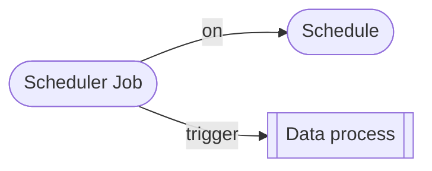

# Deploy Scheduler

Scheduler - **schedules** and **scheduled jobs** - together are one of the trigger features that can be deployed and managed from CLI. See [Triggers](/legacy/0.6/cli-handbook/cli-commands/triggers) commands for more details.



:::note
In the current CLI version the schedule is called as a trigger. This name will be deprecated in the next release.
:::

## Deploy a Schedule

We will use a `TimeUnit` schedule as example, but all types of schedule works in the same way.

To generate a schedule template file:

```bash
./loc s t init -t
```

A new file `trigger.yaml` will be created in your CLI workspace:

```yaml title="trigger.yaml" showLineNumbers
name: trigger
description: trigger
endTime: "2030-12-01T00:00:00.000Z"
repeatInterval:
    type: TimeUnit
    payload:
        count: 10
        unit: Second
```

| Field            | Description              |
| ---------------- | ------------------------ |
| `name`           | Schedule name            |
| `description`    | Schedule description     |
| `startTime`      | The time schedule starts |
| `endTime`        | The time schedule ends   |
| `repeatInterval` | Schedule interval        |

The default schedule above, if deployed, will run immediately (1 second after deplotment) and will trigger every 10 seconds until the end of year 2030.

This is another example:

```yaml showLineNumbers
repeatInterval:
    type: TimeUnit
    payload:
        repeatCount: 10
        count: 1
        unit: Minute
```

This one will trigger every 1 minute for _10 times total_.

:::info
`unit` can be `Second`, `Minute`, `Hour` or `Day`. `count` means to use how many units as interval.
:::

:::note
If you are using [Cron job](https://en.wikipedia.org/wiki/Cron) type schedule, the `repeatInterval` part looks like this:

```yaml showLineNumbers
repeatInterval:
    type: Cron
    payload:
        expression: 0/30 * * ? * * *
        timeZone: Asia/Taipei
```

You can use online tools like [Cron Expression Generator](https://www.freeformatter.com/cron-expression-generator-quartz.html) to generate the expression.
:::

Now modify the file as you like and deploy the schedule:

```bash
./loc s t deploy -f trigger.yaml
```

Then inspect the schedule PID:

```
> ./loc s t list

list trigger

ID                                    NAME     TYPE      PAYLOAD
------------------------------------  -------  --------  -------
3e694490-b575-4fe1-b158-18c729a2914e  trigger  TimeUnit  1m
...
```

## Deploy a Schedule Job

The schedule itself will start to run, but it will not affect anything. We need to deploy a scheduled job as well.

To generate a scheduled job template file:

```bash
./loc s sj init -t
```

`scheduled-job.yaml` will be created in your CLI workspace:

```yaml title="scheduled-job.yaml" showLineNumbers
name: scheduled-job
description: scheduled-job
# highlight-next-line
triggerId: 00000000-0000-0000-0000-000000000000
dataProcessPids:
    # highlight-next-line
    - pid: 00000000-0000-0000-0000-000000000000
      revision: latest
```

What you need to do is to replace the `triggerId` and data process PIDs, for example:

```yaml showLineNumbers
name: scheduled-job
description: scheduled-job
// highlight-next-line
triggerId: 3e694490-b575-4fe1-b158-18c729a2914e
dataProcessPids:
  // highlight-next-line
  - pid: e82c50f2-646d-49b9-940a-1ac86589d3ca
    revision: latest
```

And deploy the scheduled job:

```bash
./loc s sj deploy -f scheduled-job.yaml
```

Now the scheduled job will trigger data process(es) according to the schedule.

:::note
A scheduled job cannot be deployed if `triggerId` is not valid.

If you delete a schedule, all scheduled jobs that depends on it will also be deleted.
:::
