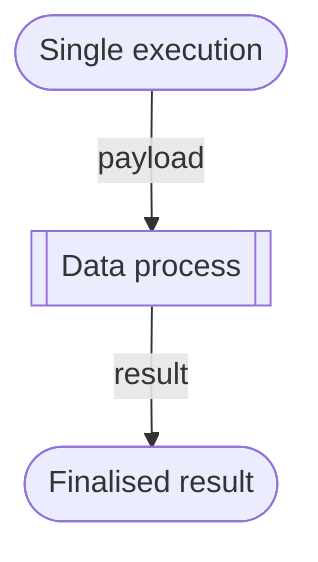

# Single Data Process Execution

If a data process is deployed, it can be run without using triggers. This is exactly the same as the **Execution** function in Studio.



## Create Payload File

Create a `payload.yaml` in your CLI workspace:

```yaml title="payload.yaml" showLineNumbers
executionResultTimeout: 180s
requests:
    - dataProcessIdentity:
          maybeRevision: 1
          permanentIdentity: 00000000-0000-0000-0000-000000000000
      payload:
          http:
              apiGatewayIdentityContext:
                  id: 00000000-0000-0000-0000-000000000000
                  name: string
              apiIdentityContext:
                  id: 00000000-0000-0000-0000-000000000000
                  name: string
              requestId: "42"
              scheme: https
              version: HTTP/1.1
              host: loc.example.com
              path: /hello
              method: POST
              headers:
                  Content-Type: application/json
              query: "?name=Arthur-Dent&age=42"
              body:
                  name: "Arthur Dent"
                  age: 42
      resultAggregationPath: /result
```

This is a mock-up API route payload; you don't have to set the PIDs, but feel free to set fields like `method`, `headers`, `query` and `body`. These can be read in the data process' context [payload](/legacy/0.6/sdk-reference/payload) as simulated input. The result returned by the data process will be under the `result` field (see below).

The `body` section will be translated to JSON:

```yaml showLineNumbers
body:
    name: "Arthur Dent"
    age: 42
```

Will be

```json
{
    "name": "Arthur Dent",
    "age": 42
}
```

<details>
    <summary><b>Tip</b> on creating a JSON array in payload</summary>

You can pass a JSON object array to the data process by writing `body` like this:

```yaml title="payload.yaml" showLineNumbers
body:
    - name: "Arthur Dent"
      age: 42
    - name: "Ford Perfect"
      age: 200
```

You will get

```json
[
    {
        "name": "Arthur Dent",
        "age": 42
    },
    {
        "name": "Ford Perfect",
        "age": 200
    }
]
```

</details>

## Execute Data Process

First look up the data process permanent ID (PID):

```bash
./loc dp search <data process name> -V
```

Copy the PID string and run this command:

```bash
./loc dp run <permanent id> -f payload.yaml
```

LOC will execute this data process with `payload.yaml`. Any finalised result from the [result agent](/legacy/0.6/sdk-reference/result) will be shown in the console.

For example, if we use the example from [Quick Start](/legacy/0.6/quickstart), you will see something like this:

```json
{
    "result": {
        "status": "ok",
        "taskId": {
            "executionId": "...",
            "id": "..."
        },
        "response": {
            "message": "Hello, Arthur Dent!"
        }
    }
}
```
