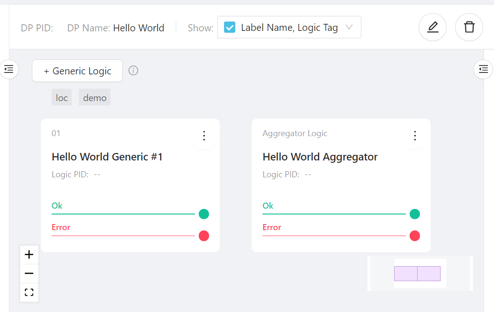

# Quick Start

This quick start will go through a tutorial of building a simple "Hello World" data process in LOC Studio using JavaScript.

This data process won't do much - it will respond to HTTP POST requests and return greeting messages. But this will give you a clear idea of what's it like to develop and deploy data processes in LOC.

:::info
This tutorial takes about 5-10 minutes providing you already have an account set up.
:::

For example, if you invoke it with this JSON payload

```json
{ "name": "Arthur Dent" }
```

The data process should respond with

```json
{ "message": "Hello, Arthur Dent!" }
```

The whole process is like this:


---

## Login LOC

First log in LOC Studio:


:::info
To sign up, please contact your LOC Studio administrator. You'll receive an email with a temporary password (which you are required to change after first login).
:::

:::note
You will be automatically logged out after some time of inactivity.
:::

## Create a Project and a Scenario

Go to **Data Process** panel then **DP Interactive Map**. First right click the **Default** unit and create a project (for example, **My Project**):


Then right click the new project and create a scenario (for example, **Demo**).


## Create a Data Process

Right click the scenario and create a data process (with a name, for example, **Hello World**):


The tags does not matter but feel free to create some. Click **Create** to create the data process.

## Create Logic

A data process has at least one generic logic and only one aggregator logic. In this demo we'll have one for each.

The generic logic will receive the HTTP request payload and extract the name, then send it to the aggregator logic, which will in turn send it back to the user.

### Create a Generic Logic

When a new data process is created, you'll see there's already an aggregator logic present.

Click **+Generic Logic** then select **Add Logic** in front of the aggregator logic:


Give the generic logic a name (and some tags if you like):


Click **Next** to switch to the **Logic Body** tab. This is where we input the actual code.

Notice that there are two tabs down here - **If OK** and **If Error**. This is because each logic actually has _two_ functions, one for normal operation and another for error handling.


#### Generic Code Implementation

First copy the following code to **If OK**:

```javascript title="Generic logic - If OK" showLineNumbers
async function run(ctx) {
    // highlight-start
    // read HTTP payload body, decode from Uint8Array to string and convert to JSON
    const payload = JSON.parse(
        new TextDecoder().decode(new Uint8Array(ctx.payload.http.body)),
    );

    // extract name field (and set it to a default string "World" if not exist)
    const name = payload.name || "World";

    // write the name variable into session storage
    await ctx.agents.sessionStorage.putString("name", name);
    // highlight-end
}
```

:::info
If you are using [CLI](/legacy/0.6/category/cli-handbook), the functions have to be exported, for example:

```javascript
export async function run(ctx) {
    // code
}
```

:::

:::tip
You can press hot keys in the code box to format the code (adding correct indentations, etc.):

-   Windows: `Alt` + `Shift` + `F`
-   macOS: `Shift` + `Option` + `F`
-   Linux: `Ctrl` + `Shift` + `I`
    :::

---

Let's paused a bit to understand what's happening here.

`run` is the main code body of this logic, sort of like `main` in some languages. It will be injected with `ctx`, which is the data context object that contains several useful stuff, like HTTP request payload and a series of built-in functionalities called [**agents**](/legacy/0.6/category/sdk-reference).

1. The first line reads the payload, which has to be convert from Uint8Array (an array of numbers representing byte data) to string. `TextDecoder` is from the Web API and is supported in LOC data processes. We assume that the request body is JSON and can be converted to a JSON object.

2. The second line tried to read a "name" field in the JSON object. If it returns unknown, the JavaScript _logical or operator_ (`||`) returns the default value `"World"`.

3. The third line of code uses the **session storage agent** to write a value into the data process' session. The variable can be accessed by any logic after this one, until the data process has completed its task.

:::note
Also notice that we use `await` keyword in front of `ctx.agents.sessionStorage.putString`. This is because the function is asynchronous and we want to wait until the action is finished.
:::

---

Next is the **If Error** block.

If something in `run` or **If OK** block went wrong, `handleError` will be called with the error (and the same error will be passed down to _all_ logic). See other parts of the documentation for more information.

Since we are not going to do error handling here, and we can return the error in aggregator logic anyway, we can leave it as it is:

```javascript title="Generic logic - If Error" showLineNumbers
async function handleError(ctx, error) {
    // highlight-next-line
    // leave it empty
}
```

Finally click **Create** to create the generic logic.

:::note
Do not mind the **Event Schema** tab - it has no use for us here anyway.
:::

### Create a Aggregator Logic

Now click **Add Aggregator Logic** on the screen. Same as before, give it a name and switch to the **Logic Body** tab. Notice that aggregator cannot have tags and do not have event schemas.

#### Aggregator Code Implementation

```javascript title="Aggregator - If OK" showLineNumbers
async function run(ctx) {
    // highlight-start
    // read name variable from session store
    const name = await ctx.agents.sessionStorage.get("name");

    // finalise result
    ctx.agents.result.finalize({
        status: "ok",
        taskId: ctx.task.taskId,
        response: {
            message: `Hello, ${name}!`,
        },
    });
    // highlight-end
}
```

The **result agent** will return a JSON object (with the status, the task ID as well as our greeting message) to whoever invoked this data process.

:::note
The `status` field above is not the HTTP response code, but an user-defined one.
:::

Next we'll add some code to `handleError` of the aggregator. It will return a JSON object as well, except that this time the error message is included:

```javascript title="Aggregator - If Error" showLineNumbers
async function handleError(ctx, error) {
    // highlight-start
    // finalise result withe error
    ctx.agents.result.finalize({
        status: "error",
        taskId: ctx.task.taskId,
        response: {
            error: error.message,
        },
    });
    // highlight-end
}
```

Again click **Create** to finish.

When everything is in place, your data process should look like this:



## Deploy the Data Process

Now the data process is ready to be deployed. Right click it and select **Deploy Data Process**:


Wait a moment and you should see the success message:


:::info
This will create and run a new data process container. The deployment _may fail_ if the deployment is already at its maximum container capacity.
:::

Now the data process shows a green dot and has a PID (permanent ID):


Congratulations! You have deployed your very first LOC data process.

:::note
Data processes and logic can only be modified _when_ the data process is undeployed (the container will be removed from Kubernetes).
:::

## Test with Simple Execution

When a data process is deployed, it can be tested with a mechanism called _single data process execution_.

Basically, we pass a JSON file to it which simulates the payload and execute the data process, read the finalised result without using actual triggers (like API routes). This is only intended for testing purposes.

First create a local JSON file with the following content:

```json title=payload.json showLineNumbers
{
    "name": "Arthur Dent"
}
```

<details>
    <summary><b>Tip</b> on creating blank files</summary>

You can either copy the profile from your team or create a blank file then copy/paste the content.

macOS and Linux users can do this with

```bash
touch <profile name>.yaml
```

Or (for Windows users)

```bash
type nul > <profile name>.yaml
```

Then open the file with an editor, copy/paste the profile and save it.

</details>

Now right click the data process and select **Execute Data Process**:


Open or drag the `payload.json` you've created into the dialog box:


You should be able to see the content of the payload:


Click **Execute** and wait for it to finish:


Click the **JSON** icon to see the finalised result:


This is exactly what we expect to receive from this "Hello World" data process.

:::info
The data process would return a error message if the JSON payload is not valid.
:::

## Create an API Route

Single execution is convinent, but not a practical way to invoke them in the real world.

The most common way is to create an API route, which will become a HTTP endpoint in LOC's API router. It can be invoked by any HTTP clients and thus can be integrated with other systems.

Go to **API Route**, right click **Default Unit** to create a directory (for example, **My API Routes**) and then right click the directory to create an API route:


Give the API route a name (here we use **Hello World API**) and make sure you have the following configurations:

1. Set the HTTP Method to **POST**.

2. URL to `/hello`.

3. Response Content Type to **JSON**.

4. Linked Data Processes: select the data process **Hello World** (or whatever you named it) and click **Add**.


And click **Create** on bottom-right corner to finish.

:::note
The API route URL can also be something like `/greeting/hello`.
:::

## Invoke With the API Route

Now wait for a bit for the API route to take effect.

From the API route screen above, we've learned that the full URL is `https://api.**********.fst.network/hello`. Now you can use a HTTP client (for example, [Insomnia](https://insomnia.rest/download) or [Postman](https://www.postman.com/downloads/)) to send a **POST** request a JSON payload:


Notice that the API route response is a bit longer than single execution - now we have actual HTTP response and some metadata. The finalised result are under the `data` field.

:::info
If you get HTTP response code 404, it could mean that the API route is not ready yet - wait a bit then try again.

If you undeploy a data process after linking it to an API route, you need to manually link it up again (edit the API route, remove the old link and add the updated data process).
:::

That's all! You've learned the basics of creating/deploying a data process along with an API route. Check out the tutorials and references to learn more.
