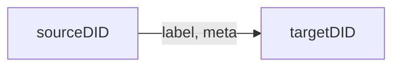

# Event Store Agent

Emit and query LOC data events.

Once emitted, events are stored and can be searched in Elasticsearch. They will be generated to data lineage graphs in Studio.

import Tabs from "@theme/Tabs";
import TabItem from "@theme/TabItem";

#### Availability

-   ✓ Generic logic
-   ✗ Aggregator logic

## Emit Events

```typescript
async eventStore.emit(events: Event.Event[]): Promise<void>
```

Emit event(s). The parameter `events` is an array of events.

Type `Event.Event` has to have the following fields:

| Field                                  | Type     | Description                                               |
| -------------------------------------- | -------- | --------------------------------------------------------- |
| `labelName`                            | `string` | Label name (event name)                                   |
| `sourceDigitalIdentity` or `sourceDID` | `string` | Source digital identity (DID)                             |
| `targetDigitalIdentity` or `targetDID` | `string` | Target DID                                                |
| `meta`                                 | `string` | Meta payload (additional data); max length `32768` bytes. |
| `type`                                 | `string` | Event type (group)                                        |

:::note
For now the `type` only supports `"default"`.
:::

The data lineage or data trail is represented by the relationship of



Source and target nodes will be created in Elasticsearch if not exist. Any nodes can be both source and target of other events.

#### Example

```typescript showLineNumbers
const events = [
    {
        // event 1
        labelName: "Event name 1",
        sourceDID: "Event source 1",
        targetDID: "Event target 1",
        meta: "",
        type: "default",
    },
    {
        // event 2
        labelName: "Event name 2",
        sourceDID: "Event source 2",
        targetDID: "Event target 2",
        meta: "",
        type: "default",
    },
    // ...
];

await ctx.agents.eventStore.emit(events);
```

:::note
The events may not be properly emitted without using `await`.
:::

:::tip
You can also use `JSON.stringify()` to include a JSON object in the meta payload, and later decode it with `JSON.parse()`.
:::

## Query Events

Query event(s) in Elasticsearch.

```typescript
async eventStore.search(request: Search): Promise<SearchResult>
```

Parameter `request` is of type `Search` (all field are **optional**):

:::note
Due to the complexity of search options, we won't show the detail of type `SearchRequest` and `SearchResponse` here. Please refer to the examples.
:::

The returned events (an array) will be at `SearchRequest.events`. _Each_ element has the type `Event`:

| Member                       | Type                                                                          | Description                |
| ---------------------------- | ----------------------------------------------------------------------------- | -------------------------- |
| `dataProcessIdentityContext` | `IdentityContext` (see [Context](/legacy/0.6/sdk-reference/context-and-task)) | Data process ID and name   |
| `logicIdentityContext`       | `IdentityContext`                                                             | Logic identity ID and name |
| `executionId`                | `string`                                                                      | Execution ID               |
| `taskId`                     | `string`                                                                      | Task ID                    |
| `sequence`                   | `number`                                                                      | Event sequence number      |
| `label`                      | `Label`, which is `{ id: string; name: string; }`                             | Event label ID and name    |
| `sourceDigitalIdentity`      | `string`                                                                      | Source DID                 |
| `targetDigitalIdentity`      | `string`                                                                      | Target DID                 |
| `meta`                       | `string`                                                                      | Meta payload               |
| `type`                       | `string`                                                                      | Event group                |
| `timestamp`                  | `string`                                                                      | Event emitted time         |

#### Example: query events

<Tabs>
  <TabItem value="query-js" label="JavaScript" default>

```javascript showLineNumbers
// helper function
// highlight-next-line
const createMatch = (field, value) => ({ Match: { field, value } });

const requests = {
    // highlight-start
    queries: [
        createMatch(
            // match condition 1
            "label_name", // field name
            "event name", // value
        ),
        // match condition 2...
    ],
    // highlight-end
    excludes: [],
    filters: [],
    from: 0,
    size: 1000,
    sorts: [],
};

const query = await ctx.agents.eventStore.search(requests);
const events = query?.events;

// iterate through events
events.forEach((event) => {
    const label_name = event.label.name;
    const meta = event.meta;
    // ...
});
```

  </TabItem>
  <TabItem value="query-ts" label="TypeScript">

```typescript showLineNumbers
// helper function
// highlight-next-line
const createMatch = (field: string, value: string) => ({
    Match: { field, value },
});

const requests = {
    // highlight-start
    queries: [
        createMatch(
            // match condition 1
            "label_name", // field name
            "event name", // value
        ),
        // match condition 2...
    ],
    // highlight-end
    excludes: [],
    filters: [],
    from: 0,
    size: 1000,
    sorts: [],
};

const query = await ctx.agents.eventStore.search(requests);
const events = query?.events;

// iterate through events
events.forEach((event) => {
    const label_name = event.label.name;
    const meta = event.meta;
    // ...
});
```

  </TabItem>
</Tabs>

:::tip
You can combine conditions in `queries`, `excludes`, `filters` and `sorts` for more precise search. These field names are also required even if you don't use them.  
:::

<details>
    <summary>List of available query field names</summary>

| Name                              | Description                    |
| --------------------------------- | ------------------------------ |
| `data_process_permanent_identity` | Data process permanent ID      |
| `data_process_name`               | Data process name              |
| `data_process_revision`           | Data process revision number   |
| `logic_name`                      | Logic name                     |
| `logic_permanent_identity`        | Logic permanent ID             |
| `logic_revision`                  | Logic revision number          |
| `execution_id`                    | Execution ID                   |
| `task_id`                         | Task ID                        |
| `sequence`                        | Event sequence number          |
| `label_id`                        | label ID                       |
| `label_name`                      | Label name (labelName in emit) |
| `source_digital_identity`         | Source DID (sourceDID in emit) |
| `target_digital_identity`         | Target DID (targetDID in emit) |
| `type`                            | Type (type in emit)            |

</details>

#### Example: exclude events

<Tabs>
  <TabItem value="exclude-js" label="JavaScript" default>

```javascript showLineNumbers
// highlight-next-line
const createMatch = (field, value) => ({ Match: { field, value } });

const requests = {
    queries: [],
    // highlight-start
    excludes: [
        createMatch(
            // match condition 1
            "source_digital_identity", // field name
            "source DID", // exclude events with this source DID
        ),
        // match condition 2...
    ],
    // highlight-end
    filters: [],
    from: 0,
    size: 1000,
    sorts: [],
};

const query = await ctx.agents.eventStore.search(requests);
const events = query?.events;
```

  </TabItem>
  <TabItem value="exclude-ts" label="TypeScript">

```typescript showLineNumbers
// highlight-next-line
const createMatch = (field: string, value: string) => ({
    Match: { field, value },
});

const requests = {
    queries: [],
    // highlight-start
    excludes: [
        createMatch(
            // match condition 1
            "source_digital_identity", // field name
            "source DID", // exclude events with this source DID
        ),
        // match condition 2...
    ],
    // highlight-end
    filters: [],
    from: 0,
    size: 1000,
    sorts: [],
};

const query = await ctx.agents.eventStore.search(requests);
const events = query?.events;
```

  </TabItem>
</Tabs>

#### Example: filter events (compare)

<Tabs>
  <TabItem value="filter-js" label="JavaScript" default>

```javascript showLineNumbers
// highlight-next-line
const filterCondition = (field, type, value) => ({ Range: { field, value: { [type]: value } } });

const requests = {
    queries: [],
    excludes: [],
    // highlight-start
    filters: [
        filterCondition(  // filter condition 1
            "target_digital_identity",  // field name
            "gte"  // compare type
            9000,  // compared value
        ),  // filter events that target DIDs >= 9000
        // filter condition 2...
    ],
    // highlight-end
    from: 0,
    size: 1000,
    sorts: [],
};

const query = await ctx.agents.eventStore.search(requests);
const events = query?.events;
```

  </TabItem>
  <TabItem value="filter-ts" label="TypeScript">

```typescript showLineNumbers
// highlight-next-line
const filterCondition = (field: string, type: string, value: number) => ({ Range: { field, value: { [type]: value } } });

const requests = {
    queries: [],
    excludes: [],
    // highlight-start
    filters: [
        filterCondition(  // filter condition 1
            "target_digital_identity",  // field name
            "gte"  // compare type
            9000,  // compared value
        ),  // filter events that target DIDs >= 9000
        // filter condition 2...
    ],
    // highlight-end
    from: 0,
    size: 1000,
    sorts: [],
};

const query = await ctx.agents.eventStore.search(requests);
const events = query?.events;
```

  </TabItem>
</Tabs>

The compared value has to be `number` type. The compare type can be either `"gte"` (greater than or equal) or `"lte"` (less than or equal).

:::tip
It would be a good idea to use `timestamp` field to filter out older events so you won't have to process them twice.
:::

#### Example: filter events (wildcard)

`filters` can apply a wildcard search as well:

<Tabs>
  <TabItem value="filter2-js" label="JavaScript" default>

```javascript showLineNumbers
// highlight-next-line
const filterConditionWildCard = (field, value) => ({
    Wildcard: { field, value },
});

const requests = {
    queries: [],
    excludes: [],
    // highlight-start
    filters: [
        filterConditionWildCard(
            // filter condition 1
            "target_digital_identity", // field name
            "target DID", // field name to be searched as wildcard
        ),
        // filter condition 2...
    ],
    // highlight-end
    from: 0,
    size: 1000,
    sorts: [],
};

const query = await ctx.agents.eventStore.search(requests);
const events = query?.events;
```

  </TabItem>
  <TabItem value="filter2-ts" label="TypeScript">

```typescript showLineNumbers
// highlight-next-line
const filterConditionWildCard = (field: string, value: string) => ({
    Wildcard: { field, value },
});

const requests = {
    queries: [],
    excludes: [],
    // highlight-start
    filters: [
        filterConditionWildCard(
            // filter condition 1
            "target_digital_identity", // field name
            "target DID", // field name to be searched as wildcard
        ),
        // filter condition 2...
    ],
    // highlight-end
    from: 0,
    size: 1000,
    sorts: [],
};

const query = await ctx.agents.eventStore.search(requests);
const events = query?.events;
```

  </TabItem>
</Tabs>

#### Example: sort events

<Tabs>
  <TabItem value="sort-js" label="JavaScript" default>

```javascript showLineNumbers
const requests = {
    queries: [],
    excludes: [],
    filters: [],
    from: 0,
    size: 1000,
    // highlight-start
    sorts: [
        {
            // sort condition 1
            field: "source_digital_identity",
            orderBy: "Desc",
        },
        // sort condition 2...
    ],
    // highlight-end
};

const query = await ctx.agents.eventStore.search(requests);
const events = query?.events;
```

  </TabItem>
  <TabItem value="sort-ts" label="TypeScript">

```typescript showLineNumbers
const requests = {
    queries: [],
    excludes: [],
    filters: [],
    from: 0,
    size: 1000,
    // highlight-start
    sorts: [
        {
            // sort condition 1
            field: "source_digital_identity",
            orderBy: "Desc" as "Asc" | "Desc",
        },
        // sort condition 2...
    ],
    // highlight-end
};

const query = await ctx.agents.eventStore.search(requests);
const events = query?.events;
```

  </TabItem>
</Tabs>

`orderBy` can be either `"Asc"` (ascending order) or `"Desc"` (descending order). Works for numeric or non-numeric string values.

## Query Event Sequences

Search _sequence_ of events. The first event has to satisfy first search condition, and so on...

```typescript
async eventStore.searchWithPattern(request: PatternRequest): Promise<PatternResponse>
```

:::note
Like `search`, we'll skip the detail of type `PatternRequest` and `PatternResponse`.
:::

#### Example

<Tabs>
  <TabItem value="pattern-js" label="JavaScript" default>

```javascript showLineNumbers
// helper function
const sequenceCondition = (field, value, type) => {
    const operators = ["Eq", "NotEq", "Gt", "Lt", "Gte", "Lte"];
    if (!operators.includes(type)) type = "Eq";
    return { [type]: { field, value } };
};

// create sequence search pattern
const requests = {
    sequences: [
        // must have at least two event conditions!
        {
            // sequence 1 event condition
            conditions: [sequenceCondition("label_name", "event name 1", "Eq")],
            sharedFields: [],
            type: "any",
        },
        {
            // sequence 2 event condition
            conditions: [sequenceCondition("label_name", "event name 2", "Eq")],
            sharedFields: [],
            type: "any",
        },
    ],
    filter: null,
    maxSpan: null,
};

const query = await ctx.agents.eventStore.searchWithPattern(requests);
const sequences = query?.sequences;

// iterate through sequences
sequences.forEach((sequence) => {
    // iterate through events in each sequence
    sequence.events?.forEach((event) => {
        const label_name = event.label.name;
        const meta = event.meta;
        // ...
    });
});
```

  </TabItem>
  <TabItem value="pattern-ts" label="TypeScript">

```typescript showLineNumbers
// helper function and type
interface QueryMap {
    field: string;
    value: string;
    [k: string]: unknown;
}
type Condition =
    | { Eq: QueryMap }
    | { NotEq: QueryMap }
    | { Gt: QueryMap }
    | { Lt: QueryMap }
    | { Gte: QueryMap }
    | { Lte: QueryMap };

const sequenceCondition = (field: string, value: string, type: string) => {
    const operators = ["Eq", "NotEq", "Gt", "Lt", "Gte", "Lte"];
    if (!operators.includes(type)) type = "Eq";
    return { [type]: { field, value } } as Condition;
};

// create sequence search pattern
const requests = {
    sequences: [
        // must have at least two event conditions!
        {
            // sequence 1 event condition
            conditions: [sequenceCondition("label_name", "event name 1", "Eq")],
            sharedFields: [],
            type: "any",
        },
        {
            // sequence 2 event condition
            conditions: [sequenceCondition("label_name", "event name 2", "Eq")],
            sharedFields: [],
            type: "any",
        },
    ],
    filter: null,
    maxSpan: null,
};

const query = await ctx.agents.eventStore.searchWithPattern(requests);
const sequences = query?.sequences;

// iterate through sequences
sequences.forEach((sequence) => {
    // iterate through events in each sequence
    sequence.events?.forEach((event) => {
        const label_name = event.label.name;
        const meta = event.meta;
        // ...
    });
});
```

  </TabItem>
</Tabs>

Available field names are the same as `search`

`type` operator options in sequenceCondition includes:

| Operator  | Descriptionn          |
| --------- | --------------------- |
| `"Eq"`    | equal                 |
| `"NotEq"` | not equal             |
| `"Gt"`    | greater than          |
| `"Lt"`    | less than             |
| `"Gte"`   | greater than or equal |
| `"Lte"`   | less than or equal    |
