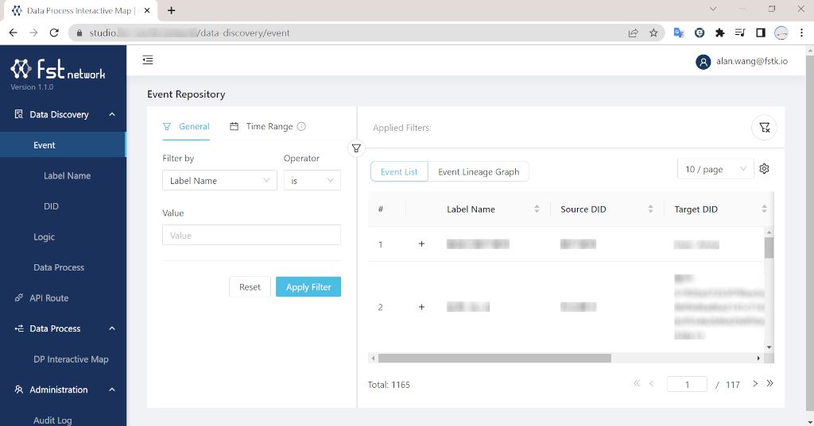
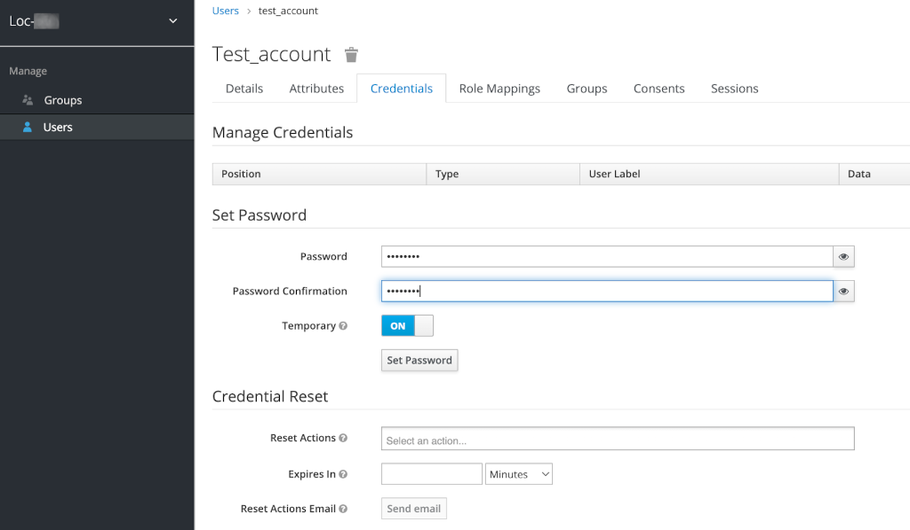

# Studio Overview

An overview of Studio functionalities.

Thanks to the highly-interactive Reack framework and UI/UX-driven design, LOC Studio is intuitive to use and doesn't need a lot of walkthrough. You've probably aldreay used most of it in [Quick Start](/legacy/0.6/quickstart) and [Tutorials](/legacy/0.6/category/tutorials).

:::info
This overview is currently based on Studio `v1.1.0`.

Like every other components of LOC, Studio is still rapidly evolving - there are always new features coming in future releases. We will expand the docs as soon as we can!
:::

## Studio Panels

### Data Discovery

For browsing LOC assets:

-   Emitted events and their data lineage graph
-   Created Logic
-   Deployed/undeployed data processes

The assets can also be filtered with a specific field or time range.

### API Route

For managing API routes, one of the most used trigger for data processes.

:::tip
A new created API route would need a bit time to take effect (the gateway returns `404` before the route is ready).

If a data process has been linked to an API route, and you later undeploy the data process to update it, you'll have to manually **re-link** it to the API route (modify the API route then link again).
:::

:::info
Studio does not yet support managing other triggers - message queues and schedulers.
:::

### Data Process - DP Interactive Map

For managing units, scenarios, data processes and logic, tag, revision info in them. You can drag, zoom or inspect the detail of the logic blocks.

:::tip
Anything in a data process _can only be modified_ when it's undeployed. When updating a logic, you can add comments as update log for what have been modified.
:::

:::info
Now there has only one unit `Default` and cannot be changed.
:::

### Administration - Audit Log

Audit Logs are events emitted when Studio user create, modify or delete data process and logic.

### User Management

Only available for users who have the permission. They can create new accounts for members using an email address.

One key action you should do when creating a new account is to switch on the **Temporary** option - the user will receive a temporary random password via email. After login Studio for the first time the user would be prompted for a new personal password.
