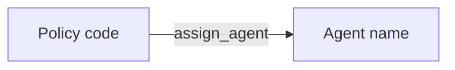
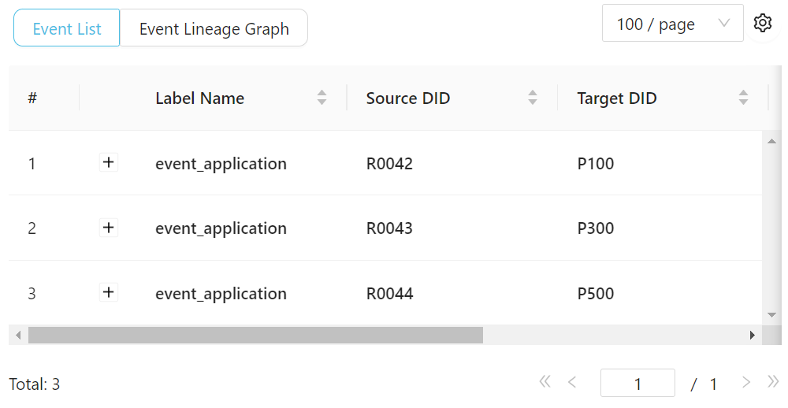
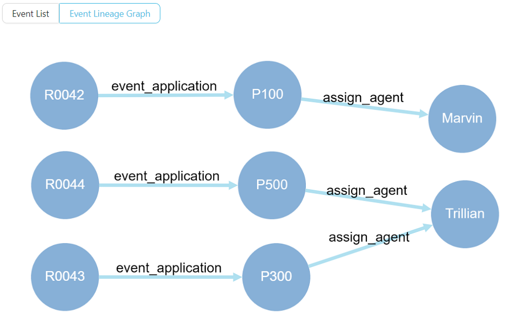

# Events and Multiple Data Processes

This is the follow-up of [Emit and Inspect Events](/legacy/0.6/tutorials/emit-and-inspect-event), in which we've learned the basics of emitting events.

> This tutorial uses JavaScript and assume you are using [LOC Studio](/legacy/0.6/category/studio-guide).

In reality, your company may have much longer business processes, and they may lay across several different departments. LOC events play an important role of communicate between data processes, as well as to track how data flows.

For example, now that we have some requests of insurance policy application, we need to assign them to an insurance agent. We will, of course, build a second data process to achieve this.

In this example we will simply execute it manually.

:::tip
How to trigger the second data process depends on your use case, but generally speaking you can

1. Have the second data process run on scheduler and check events periodically;
2. Have the first data process send a trigger via API route or message queue;
3. Use the same trigger to invoke both data processes - they will be executed by order.
4. Manually started by human operators.
   :::

## Query Events from Another Data Process

### Use Case: Assigning Insurance Agent

This new data process will query the `event_application` in the last article, extract the policy code and assign to the agent who is responsible for it:



We will use a mock-up agent mapping table

| Agent name | Responsible for  |
| ---------- | ---------------- |
| Marvin     | P100, P200       |
| Trillian   | P300, P400, P500 |

So if the requested insurance policy is P100, it will be assigned to Marvin, and so on.

The logic to be implemented are as below:

| Logic      | Purpose                                  |
| ---------- | ---------------------------------------- |
| Generic #1 | Query `event_application` events         |
| Generic #2 | Emit `assign_agent` events               |
| Aggregator | Report how many events have been emitted |

### Code Walkthrough

```javascript title="Generic logic #1" showLineNumbers
async function run(ctx) {
    // event query helper function
    const createMatch = (field, value) => ({ Match: { field, value } });

    // event query conditions
    const requests = {
        queries: [createMatch("label_name", "event_application")],
        excludes: [],
        filters: [],
        from: 0,
        size: 1000,
        sorts: [],
    };

    // query events
    const query = await ctx.agents.eventStore.search(requests);
    const events = query?.events;

    // pass events to session
    await ctx.agents.sessionStorage.putJson("appli_events", events);
}

async function handleError(ctx, error) {
    ctx.agents.logging.error(error.message);
}
```

```javascript title="Generic logic #2" showLineNumbers
async function run(ctx) {
    // read events from session
    const appli_events = await ctx.agents.sessionStorage.get("appli_events");

    // a mock-up lookup table of agents and their responsible policy types
    const insurance_agents = {
        Marvin: ["P100", "P200"],
        Trillian: ["P300", "P400", "P500"],
    };

    // agent name lookup helper
    const search_agent = (policyCode) => {
        for (let agent in insurance_agents)
            for (let responsibility of insurance_agents[agent])
                if (responsibility === policyCode) return agent;
        return null;
    };

    // use the queried events to generate new event schemas
    let events = [];
    appli_events.forEach((event) => {
        const policy_code = event.targetDigitalIdentity;
        const agent = search_agent(policy_code);

        if (agent) {
            // if an agent is found (not null)
            events.push({
                labelName: "assign_agent",
                sourceDID: policy_code,
                targetDID: agent,
                meta: String(new Date()),
                type: "default",
            });
        }
    });

    // emit events
    await ctx.agents.eventStore.emit(events);

    // pass the number of emitted events to session
    await ctx.agents.sessionStorage.putString(
        "emittedNum",
        String(events.length),
    );
}

async function handleError(ctx, error) {
    ctx.agents.logging.error(error.message);
}
```

The aggregator is same as before:

```javascript title="Aggregator logic" showLineNumbers
async function run(ctx) {
    const emittedNum = await ctx.agents.sessionStorage.get("emittedNum");

    ctx.agents.result.finalize({
        status: "ok",
        taskId: ctx.task.taskId,
        result: `Emitted ${emittedNum} events`,
    });
}

async function handleError(ctx, error) {
    ctx.agents.result.finalize({
        status: "error",
        taskId: ctx.task.taskId,
        error: error.message,
    });
}
```

This data process dosen't need a payload (you can pass anything to it in the single data process execution; it dosen't matter). It will generate a similar result as the first data process:

```json
{
    "status": "ok",
    "taskId": {
        "executionId": "...",
        "id": "..."
    },
    "result": "Emitted 3 events"
}
```

## Inspect Events

You can go back to Studio's Data Discovery and find the new events:



The data lineage part is a bit tricky, since the filter functions allow you to inspect events with one certain elements. In order to see multiple events together, _you have to see them all_.

Then again, by spending a little time, you can find and arrange the part you want:



This clearly show the data flow: customers submited a request for a certain type of insurance policy, and the policy got assigned to an agent.

If you find one policy node that haven't got assigned, there must be something wrong: incorrect agent mapping table or incorrect policy code. And now you can fix the problem, to make your data flow better.
