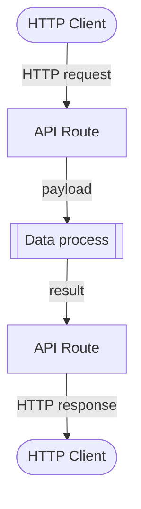

# Deploy API Route

API routes is one of the trigger features that can be deployed and managed from CLI, which make data processes RESTful-like.



See [API Route commands](/legacy/0.7/cli-handbook/cli-commands/triggers#api-route) for additional operations.

:::note
API route templates can be either JSON or YAML format - we'll use YAML in all of our examples.
:::

import Tabs from "@theme/Tabs";
import TabItem from "@theme/TabItem";

## API Route File

A `api-route-config.yaml` template file would always be included in a CLI template project. This is the configure file for an API route, for it is the most common trigger to be used with data processes.

```yaml title="api-route-config.yaml" showLineNumbers
method: GET
mode: Sync
encapsulation: true
name: <project name>
path: /<project name>
dataProcessPids:
    # highlight-next-line
    - pid: 00000000-0000-0000-0000-000000000000
      revision: latest
```

| Field             | Description                                    |
| ----------------- | ---------------------------------------------- |
| `method`          | HTTP method                                    |
| `mode`            | `Sync` (synchronous) or `Async` (asynchronous) |
| `name`            | API route name                                 |
| `path`            | API route path                                 |
| `dataProcessPids` | Data process PIDs                              |

Supported HTTP methods:

-   `GET`
-   `POST`
-   `PUT`
-   `PATCH`
-   `DELETE`
-   `CONNECT`
-   `OPTIONS`
-   `TRACE`

By default this is an synchronous API route that accepts GET requests at

```
<LOC base URL>/<path>
```

For example, if `path` is `/my-project`, the full HTTP entpoint would be `https://<LOC base URL>/my-project`.

## Deploy an API Route

In order to deploy an API route with CLI, you need to add at least one valid data process permanent ID under the `dataProcessPids`, for example:

```yaml showLineNumbers
method: POST
mode: Sync
encapsulation: true
name: "Hello World API"  # put "" around string if it contains spaces
path: /hello
dataProcessPids:
  // highlight-next-line
  - pid: e82c50f2-646d-49b9-940a-1ac86589d3ca
    revision: latest
```

:::tip
The PID can be looked up with `loc dp list` command:

```
> ./loc dp list

list data processes
PERMANENT IDENTITY                    NAME         REVISION  ENABLED  CREATED TIME
------------------------------------  -----------  --------  -------  ---------------------------
e82c50f2-646d-49b9-940a-1ac86589d3ca  Hello World  1         true     2022-05-18T02:01:23.541078Z
...
```

You can also add multiple PIDs like this:

```yaml showLineNumbers
dataProcessPids:
    - pid: e82c50f2-646d-49b9-940a-1ac86589d3ca
      revision: latest
    - pid: 1c2548af-690d-4c6c-8dc2-8ca7b0cccfdb
      revision: latest
    # ...
```

:::

Then deploy it to LOC (which will take effect in the API router service):

```bash
./loc ar deploy -f <project name>/api-route-config.yaml
```

## Auto Linking While Deploying a Data Process

There is a more convenient way, which is to deploy `api-route-config.yaml` at the same time when you deploy a data process. CLI will link up the two automatically.

<Tabs>
  <TabItem value="js" label="JavaScript template" default>

```bash
./loc deploy <project name> -ar
```

  </TabItem>
  <TabItem value="ts" label="TypeScript template">

```bash
./loc deploy -ts <project name> -ar
```

  </TabItem>
</Tabs>

The `api-route-config.yaml` in the project will be deployed as well with the single PID swapped to the newly deployed data process. If an API route with the same name exists, it will be updated.

:::info
`loc deploy` will create a new data process even though older ones with the same name exists. You'll have to manually delete unused assets yourself.
:::
