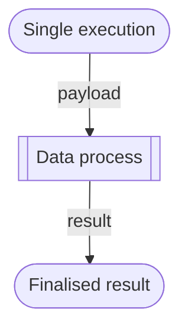

# Single Data Process Execution

If a data process is deployed, it can be run without using triggers (or rather, a _simulated_ API route). This is exactly the same as using the **Execution** function in Studio.



## Create Payload File

Create a `run-task.yaml` in your CLI workspace:

```bash
./loc dp run-init
```

Then choose `Remote (for 'loc dataprocess run')`.

You will see a new file appear in your local workspace:

```yaml title="run-task.yaml" showLineNumbers
triggerId: 00000000-0000-0000-0000-000000000000
triggerType: ApiRoute
invocations:
    # highlight-start
    - dataProcessIdentity:
          permanentIdentity: 00000000-0000-0000-0000-000000000000
          revision: 1
      # highlight-end
      payload:
          http:
              apiGatewayIdentityContext:
                  id: 00000000-0000-0000-0000-000000000000
                  name: string
              apiRouteIdentityContext:
                  id: 00000000-0000-0000-0000-000000000000
                  name: string
              request:
                  data:
                      body: Hello, World!
                  headers:
                      Content-Type: application/json
                  host: fst.network
                  method: GET
                  path: /doge
                  query: "?client=cli"
                  scheme: http
                  version: HTTP/1.1
              requestId: string
      resultAggregationPath: ""
```

The `permanentIdentity` should be changed to the PID of a deployed data process. You can add more data processes to be triggered.

:::info
The `triggerType` can be one of the following names:

-   `"ApiRoute"`
-   `"Subscriber"` (MQ)
-   `"ScheduledJob"` (scheduler)

You do not need to modify `triggerId`, `apiGatewayIdentityContext` or `apiRouteIdentityContext`.
:::

This is a mock-up task containing a trigger; feel free to set fields like `method`, `headers`, `query` and `body`. These can be read in the data process' context [payload](/legacy/0.7/sdk-reference/payload) as simulated input. The result returned by the data process will be under the `result` field (see below).

For example, we can modify the file like this:

This simulates a HTTP POST request that's unusually have both a querystring as well as a JSON body. The `body` section will be translated to JSON:

```yaml showLineNumbers
data:
    name: "Arthur Dent"
    age: 42
# ...
method: POST
```

This simulates a POST request with its payload. The body will be transformed to the following JSON data:

```json
{
    "name": "Arthur Dent",
    "age": 42
}
```

<details>
    <summary><b>Tip</b> on creating a JSON array in payload</summary>

You can pass a JSON object array to the data process by writing `body` like this:

```yaml title="run-task.yaml" showLineNumbers
data:
    - name: "Arthur Dent"
      age: 42
    - name: "Ford Perfect"
      age: 200
```

You will get

```json
[
    {
        "name": "Arthur Dent",
        "age": 42
    },
    {
        "name": "Ford Perfect",
        "age": 200
    }
]
```

</details>

## Execute Data Process

First look up the data process permanent ID (PID):

```bash
./loc dp search <data process name> -V
```

Copy the PID string, paste it after the `permanentIdentity` field of `run-task.yaml` and run this command:

```bash
./loc dp run -f run-task.yaml
```

LOC will execute this data process with `run-task.yaml`. Any finalised result from the [result agent](/legacy/0.7/sdk-reference/result) will be shown in the console.

For example, if we use the example from [Quick Start](/legacy/0.7/quickstart), you will see something like this:

```json
{
    "status": "ok",
    "taskId": {
        "executionId": "...",
        "id": "..."
    },
    "response": {
        "message": "Hello, Arthur Dent!"
    }
}
```

If you have set the `resultAggregationPath` in `run-task.yaml`, the result would be like this:

```json
{
    "<resultAggregationPath>": {
        "status": "ok",
        "taskId": {
            "executionId": "...",
            "id": "..."
        },
        "response": {
            "message": "Hello, Arthur Dent!"
        }
    }
}
```
