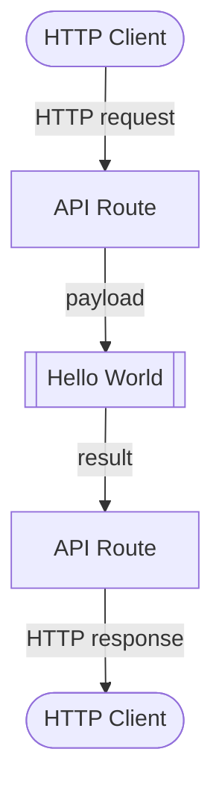

# Quick Start

This quick start will go through a tutorial of building a simple "Hello World" data process in LOC Studio using JavaScript.

This data process won't do much - it will respond to HTTP POST requests and return greeting messages. But this will give you a clear idea of what's it like to develop and deploy data processes in LOC.

:::info
This tutorial uses **JavaScript** and **LOC Studio**, which takes about **5-10 minutes ⏱️** providing you already have an account set up and LOC license is activated.

The [CLI TypeScript versions of the example](#typescript-versions-of-example-code) can be found at the end of this tutorial.
:::

For example, if you invoke it with this JSON payload

```json
{ "name": "Arthur Dent" }
```

The data process should respond with

```json
{ "message": "Hello, Arthur Dent!" }
```

The whole process is like this:



---

## Login LOC

First log in LOC Studio:

<div className="center-padded-sm">
    
</div>

:::info
See [User Management](/legacy/0.7/studio-guide/user-management) for how to setup a new account. You may need to contact your LOC Studio administrator.
:::

:::note
You will be automatically logged out after some time of inactivity.
:::

## Create a Project and a Scenario

Go to **Data Process** panel then **DP Interactive Map**. First right click the **Default** unit and create a project (for example, **My Project**):

<div className="center-padded-sm">
    
</div>

<div className="center-padded-sm">
    
</div>

Then right click the new project and create a scenario (for example, **Demo**).

<div className="center-padded-sm">
    
</div>

## Create a Data Process

Right click the scenario and create a data process (with a name, for example, **Hello World**):

<div className="center-padded-sm">
    
</div>

<div className="center-padded-sm">
    
</div>

The screen will show the newly created data process:

<div className="center-padded-sm">
    
</div>

The tags are not necessary but feel free to add some. Click **Create** to create the data process.

## Create Logic

A data process has at least one generic logic and only one aggregator logic. In this demo we'll have one for each.

The generic logic will receive the HTTP request payload and extract the name, then send it to the aggregator logic, which will in turn send it back to the user.

### Create a Generic Logic

Now click on the new data process to see the logic creation window. You'll see there's already an aggregator logic present.

Click **+ Generic Logic** then select **Add Logic** in front of the aggregator logic:

<div className="center-padded-sm">
    
</div>

Give the generic logic a name (and some tags if you like):

<div className="center-padded-sm">
    
</div>

Click **Next** to switch to the **Logic Body** tab. This is where we input the actual code.

Notice that there are two tabs down here - **If OK** and **If Error**. This is because each logic actually has _two_ functions, one for normal operation and another for error handling.

<div className="center-padded-sm">
    
</div>

#### Generic Code Implementation

First copy the following code to **If OK**:

```javascript title="Generic logic - If OK" showLineNumbers
import {
    Http,
    Mail,
    LocalStorageAgent,
    SessionStorageAgent,
    LogicVariable,
    DatabaseAgent,
    EventAgent,
    FileStorageAgent,
    HttpAgent,
    LoggingAgent,
    MailAgent,
} from "@fstnetwork/loc-logic-sdk";

export async function run(ctx) {
    // highlight-start
    // read HTTP payload
    const payload = await ctx.payload();

    // get payload body
    const data = payload.http.request.data;

    // decode body from Uint8Array to string and convert to JSON
    const parsed = JSON.parse(new TextDecoder().decode(new Uint8Array(data)));

    // log parsed JSON
    LoggingAgent.info({ parsed_json: parsed });

    // extract name field (and set it to a default string "World" if not exist)
    const name = parsed?.name || "World";

    // write the name variable into session storage
    await SessionStorageAgent.putString("name", name);
    // highlight-end
}
```

:::tip
You can press hot keys in the code box to format the code (adding correct indentations, etc.):

-   Windows: `Alt` + `Shift` + `F`
-   macOS: `Shift` + `Option` + `F`
-   Linux: `Ctrl` + `Shift` + `I`
    :::

---

Let's paused a bit to understand what's happening here.

`run` is the main code body of this logic, sort of like `main` in some programming languages. It will be injected with `ctx`, which is the data context object that contains several useful stuff, like HTTP request payload and task information.

Beside the context object, you can also access a series of built-in functionalities called [**agents**](/legacy/0.7/category/sdk-reference).

1. The first line reads the HTTP payload, which has to be convert from Uint8Array (an array of numbers representing byte data) to string. `TextDecoder` is part of the [Web API](https://developer.mozilla.org/en-US/docs/Web/API) and is supported by LOC's logic runtime. We assume that the request body is JSON and can be converted to a JSON object.

2. The second line tried to read a "name" field in the JSON object. If it returns unknown (the field does not exist), the JavaScript _logical or operator_ (`||`) returns the default value `"World"`.

3. The third line of code uses the [**session storage agent**](/legacy/0.7/sdk-reference/session) to write a value into the data process' session, which is a temporary storage used by the data process. The variable can be accessed by any logic after this one, until the data process has completed its task.

:::note
Also notice that we use `await` keyword in front of `SessionStorageAgent.putString`. This is because the function is asynchronous and we ned to wait until the action is finished. Otherwise the data won't be written into session storage
:::

---

Next is the **If Error** block.

If something in `run` or **If OK** block went wrong, `handleError` will be called with the error (and the same error will be passed down to _all_ logic). See other parts of the documentation for more information.

For now we will only log the error if present (which will appear in the [Execution History](/legacy/0.7/studio-guide/data-discovery#execution) panel in Studio afterwards):

```javascript title="Generic logic - If Error" showLineNumbers
export async function handleError(ctx, error) {
    // error logging
    // highlight-next-line
    LoggingAgent.error(error.message);
}
```

Finally click **Create** to create the generic logic.

:::note
Do not mind the **Event Schema** tab - it has no use for us here anyway.
:::

### Create a Aggregator Logic

Now click **Add Aggregator Logic** on the screen. Same as before, give it a name and switch to the **Logic Body** tab. Notice that aggregator cannot have tags and do not have event schemas.

#### Aggregator Code Implementation

```javascript title="Aggregator - If OK" showLineNumbers
import {
    SessionStorageAgent,
    LoggingAgent,
    ResultAgent,
} from "@fstnetwork/loc-logic-sdk";

export async function run(ctx) {
    // highlight-start
    // read name variable from session store
    const name = await SessionStorageAgent.get("name");

    // finalise result
    ResultAgent.finalize({
        status: "ok",
        response: {
            message: `Hello, ${name}!`,
        },
    });
    // highlight-end
}
```

The **result agent** will return a JSON object (with the status, the task ID as well as our greeting message) to whoever invoked this data process.

:::note
The `status` field above _is not_ the HTTP response code, but an user-defined one.
:::

Next we'll add some code to `handleError` of the aggregator. It will return a JSON object as well, except that this time the error message and error stack (the origin of the code where the error happened) are included:

```javascript title="Aggregator - If Error" showLineNumbers
export async function handleError(ctx, error) {
    // highlight-start
    // finalise result withe error message
    const err = {
        error: true,
        errorMessage: error.message,
        stack: error.stack,
        taskId: ctx.task.taskId,
    };

    LoggingAgent.error(err);
    ResultAgent.finalize(err);
    // highlight-end
}
```

Again click **Create** to finish.

When everything is in place, your data process should look like this:

<div className="center-padded-sm">
    
</div>

## Deploy the Data Process

Now the data process is ready to be deployed. Right click it and select **Deploy Data Process**:

<div className="center-padded-sm">
    
</div>

Wait a moment and you should see the success message:

<div className="center-padded-sm">
    
</div>

Now the data process shows a green dot and has a PID (permanent ID):

<div className="center-padded-sm">
    
</div>

Congratulations! You have deployed your very first LOC data process.

:::note
Data processes and logic can only be modified _when_ the data process is undeployed (the container will be removed from Kubernetes).
:::

## Test with Simple Execution

When a data process is deployed, it can be tested with a mechanism called _single data process execution_.

Basically, we pass a JSON file to it which simulates the payload and execute the data process, read the finalised result without using actual triggers (like API routes). This is only intended for testing purposes.

First create a local JSON file with the following content:

```json title=payload.json showLineNumbers
{
    "name": "Arthur Dent"
}
```

<details>
    <summary><b>Tip</b> on creating blank files</summary>

You can either copy the profile from your team or create a blank file then copy/paste the content.

macOS and Linux users can do this with

```bash
touch <profile name>.yaml
```

Or (for Windows users)

```bash
type nul > <profile name>.yaml
```

Then open the file with an editor, copy/paste the profile and save it.

</details>

Now right click the data process and select **Execute Data Process**:

<div className="center-padded-sm">
    
</div>

Open or drag the `payload.json` you've created into the dialog box:

<div className="center-padded-sm">
    
</div>

You should be able to see the content of the payload:

<div className="center-padded-sm">
    
</div>

Click **Execute** and wait for it to finish:

<div className="center-padded-sm">
    
</div>

Click the **JSON** icon to see the finalised result:

<div className="center-padded-sm">
    
</div>

This is exactly what we expect to receive from this "Hello World" data process.

:::info
The data process would return a error message if the JSON payload is not valid.
:::

## View Execution History Logs

Go to **Data Discovery** and click the sub panel **Execution**. Find the execution ID we've seen earlier in the execution result and click the ID:

<div className="center-padded-sm">
    
</div>

:::note
Notice that LOC lists the execution as triggered by an API route with all zero ID. This is because a single execution is essentially using a simulated API route.
:::

This is the execution history of the single execution, which contains the execution status, the JSON payload, the logs outputted by logging agent as well as the returned result.

Click the plus sign (**+**) to expand logic logs:

<div className="center-padded-sm">
    
</div>

Click the eye icon on the left of each logic to see logs:

<div className="center-padded-sm">
    
</div>

Logs are incredibly useful for debugging since if a data process failed to run, you can try to locate the problem by judging where did the logs stop.

## Create an API Route

Single execution is convenient, but not a practical way to invoke them in the real world.

The most common way is to create an API route, which will become a HTTP endpoint in LOC's API router. It can be invoked by any HTTP clients and thus can be integrated with other systems.

Go to **API Route**, right click **Default Unit** to create a directory (for example, **My API Routes**) and then right click the directory to create an API route:

<div className="center-padded-sm">
    
</div>

Give the API route a name (here we use **Hello World API**) and make sure you have the following configurations:

1. Set the HTTP Method to **POST**.

2. URL to `/hello`.

3. Response Content Type to **JSON**.

4. Linked Data Processes: select the data process **Hello World** (or whatever you named it) and click **Add**.

<div className="center-padded-sm">
    
</div>

<div className="center-padded-sm">
    
</div>

<div className="center-padded-sm">
    
</div>

And click **Create** on bottom-right corner to finish.

<div className="center-padded-sm">
    
</div>

:::note
The API route URL can also be something like `/greeting/hello`.
:::

## Invoke With the API Route

Now wait for a bit for the API route to take effect.

From the API route screen above, we've learned that the full URL is `https://api.**********.network/hello`. Now you can use a HTTP client (for example, [Insomnia](https://insomnia.rest/download) or [Postman](https://www.postman.com/downloads/)) to send a **POST** request a JSON payload:

<div className="center-padded-sm">
    
</div>

Or by using `curl` on macOS or Linux:

```bash
curl -X POST https://api.**********.network/hello \
    -H "Content-Type: application/json" \
    -d '{"name":"Ford Perfect"}'
```

The result would be like

```json
{
    "_status": 200,
    "_metadata": {
        "executionId": "Y2Sg_2VeQh-l1mF2jp4AGg",
        "triggerType": "ApiRoute",
        "triggerId": "e73097d6-8ba9-4f74-aaef-11b838dd5fa1",
        "creationTimestamp": "2022-11-04T05:19:59.975596Z",
        "completionTimestamp": "2022-11-04T05:20:00.095038Z",
        "status": "success"
    },
    "data": {
        "status": "ok",
        "response": {
            "message": "Hello, Ford Perfect!"
        }
    }
}
```

Notice that the API route response is a bit longer than single execution - now we have actual HTTP response and some metadata. The finalised result are under the `data` field.

:::info
If you get HTTP response code 404, it could mean that the API route is not ready yet - wait a bit then try again.

If you undeploy a data process after linking it to an API route, you need to manually link it up again (edit the API route, remove the old link and add the updated data process).

Finally, just like before, the execution history (with a real API route ID) will be available to view in the Data Discovery panel.
:::

That's all! You've learned the basics of creating/deploying a data process along with an API route. Check out the tutorials and references to learn more.

## TypeScript Versions of Example Code

Below is the TypeScript version that can be used as the "quick start" with [CLI](/legacy/0.7/category/cli-handbook). After generating a TypeScript template, copy the following code to your logic files respectively.

:::tip
You have to import agents (and maybe related types) from [SDK](/legacy/0.7/category/sdk-reference). We didn't need to do that in Studio because Studio already imports everything for you.
:::

```typescript title="Generic logic #1 (1.ts)" showLineNumbers
import {
    SessionStorageAgent,
    LoggingAgent,
    HttpPayload,
    GenericContext,
    RailwayError,
} from "@fstnetwork/loc-logic-sdk";

export async function run(ctx: GenericContext) {
    // read HTTP payload
    const payload = (await ctx.payload()) as { http: HttpPayload };

    // get payload body
    const data = payload.http.request.data;

    // decode body from Uint8Array to string and convert to JSON
    const parsed: { name: string } = JSON.parse(
        new TextDecoder().decode(new Uint8Array(data)),
    );

    // log parsed payload
    LoggingAgent.info({ payload_payload: parsed });

    // extract name field (and set it to a default string "World" if not exist)
    const name = parsed?.name || "World";

    // write the name variable into session storage
    await SessionStorageAgent.putString("name", name);
}

export async function handleError(ctx: GenericContext, error: RailwayError) {
    // error logging
    LoggingAgent.error(error.message);
}
```

> Ignore the second logic file generated by CLI. It won't do anything as long as there is no code in it.

```typescript title="Aggregator (aggregator.ts)" showLineNumbers
import {
    ResultAgent,
    SessionStorageAgent,
    LoggingAgent,
    AggregatorContext,
    RailwayError,
} from "@fstnetwork/loc-logic-sdk";

export async function run(ctx: AggregatorContext) {
    // read name variable from session store
    const name = (await SessionStorageAgent.get("name")) as string;

    // finalise result
    ResultAgent.finalize({
        status: "ok",
        response: {
            message: `Hello, ${name}!`,
        },
    });
}

export async function handleError(ctx: AggregatorContext, error: RailwayError) {
    // finalise result withe error message
    const err = {
        error: true,
        errorMessage: error.message,
        stack: error.stack,
        taskId: ctx.task.taskId,
    };

    LoggingAgent.error(err);
    ResultAgent.finalize(err);
}
```

## What's Next?

Now you've deployed your first data process in LOC, where should you go next in the docs?

1. First proceed to [Tutorials](/legacy/0.7/category/tutorials), which offers basic examples on specific topics and activities - all of them use JavaScript-based data processes in LOC Studio.
2. The tutorials also point you to various pages in [Studio Guide](/legacy/0.7/category/studio-guide) and [SDK Reference](/legacy/0.7/category/sdk-reference) for additional details.
3. If you are a developer, you'll need to learn about CLI, which can do more and makes debugging easier - [CLI Handbook](/legacy/0.7/category/cli-handbook) plus SDK Reference have everything you need.
4. See [System FAQs](/docs/category/system-faqs) if you'd like to know more about LOC.

Happy developing!
