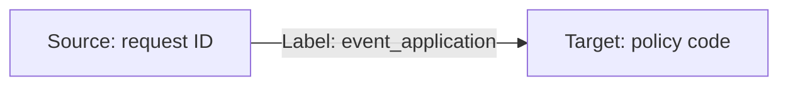

# Emit and Inspect Events

LOC data events allows users to generate a data flow or data trail to indicate who have sent and received data. These information can be very useful for two reasons:

-   To coordinate actions across multiple data processes
-   For auditing purpose

Here we will have a look at a simple example that use events and then inspect them in [Studio](/legacy/0.7/category/studio-guide).

:::note
The tutorials is written for JavaScript and [LOC Studio](/legacy/0.7/category/studio-guide).
:::

## Emit Events

### Use Case: Insuance Policy Application

Imagine you are working for a insurance company and need to build a new process to let customers submit applications for new policies.

We assume the company offers the following policies:

| Policy Code | Type                       |
| ----------- | -------------------------- |
| `P100`      | Permanent life insurance   |
| `P200`      | Health Insurance           |
| `P300`      | Liability car insurance    |
| `P400`      | Personal injury protection |
| `P500`      | Personal property coverage |

The system needs to record _who submits an application to what policy?_ so that the company and the customer can track the processing progress:



The applicant ID will also stored as meta in the event for reference.

The request JSON payload (multiple applications) looks like this:

```json title="payload" showLineNumbers
[
    {
        "requestID": "R0042",
        "policyCode": "P100",
        "applicantID": "A1979"
    },
    {
        "requestID": "R0043",
        "policyCode": "P300",
        "applicantID": "A1982"
    },
    {
        "requestID": "R0044",
        "policyCode": "P500",
        "applicantID": "A1992"
    }
]
```

So there will be 3 events:

```
R0042  ->  event_application  ->  P100
R0043  ->  event_application  ->  P300
R0044  ->  event_application  ->  P500
```

:::tip
How to design events is an art: to make it simple, easy to query, yet capable enough to serve your business. It would be equally important as designing the data processes themselves.
:::

### Code Walkthrough

We will use two generic logic in this example:

| Logic      | Purpose                                  |
| ---------- | ---------------------------------------- |
| Generic #1 | Read and parse payload                   |
| Generic #2 | Emit `event_application` events          |
| Aggregator | Report how many events have been emitted |

```javascript title="Generic logic #1" showLineNumbers
import { SessionStorageAgent, LoggingAgent } from "@fstnetwork/loc-logic-sdk";

export async function run(ctx) {
    // read payload and parse to JSON
    const payload = await ctx.payload();
    const data = payload.http.request.data;
    const parsed = JSON.parse(new TextDecoder().decode(new Uint8Array(data)));

    // generate event schema objects based on the payload
    let events = [];
    parsed.forEach((item) => {
        events.push({
            labelName: "event_application",
            sourceDID: item?.requestID,
            targetDID: item?.policyCode,
            meta: item?.applicantID,
            type: "default",
        });
    });

    // pass events to session
    await SessionStorageAgent.putJson("events", events);
}

export async function handleError(ctx, error) {
    // log error
    LoggingAgent.error(error.message);
}
```

```javascript title="Generic logic #2" showLineNumbers
import {
    SessionStorageAgent,
    EventAgent,
    LoggingAgent,
} from "@fstnetwork/loc-logic-sdk";

export async function run(ctx) {
    // read event schemas from session
    const events = await SessionStorageAgent.get("events");

    // emit events
    await EventAgent.emit(events);

    // log events
    LoggingAgent.info({ emitted_events: events });
}

export async function handleError(ctx, error) {
    // log error
    LoggingAgent.error(error.message);
}
```

```javascript title="Aggregator logic" showLineNumbers
import {
    SessionStorageAgent,
    ResultAgent,
    LoggingAgent,
} from "@fstnetwork/loc-logic-sdk";

export async function run(ctx) {
    // read event schemas from session
    const events = await SessionStorageAgent.get("events");

    // finalise result with a message
    ResultAgent.finalize({
        status: "ok",
        taskId: ctx.task.taskId,
        emitted_events: {
            length: events.length,
            events: events,
        },
    });
}

export async function handleError(ctx, error) {
    // finalise result withe error message
    const err = {
        error: true,
        errorMessage: error.message,
        stack: error.stack,
        taskId: ctx.task.taskId,
    };

    LoggingAgent.error(err);
    ResultAgent.finalize(err);
}
```

### Invoke

In order to inspect the events in Studio, you'll need to deploy the data process above to LOC (not local runtime).

You can invoke it with either an API route or single data process execution (see [QUick Start](/legacy/0.7/quickstart).)

The finalised result would be like

```json
{
    "status": "ok",
    "taskId": {
        "executionId": "...",
        "id": "..."
    },
    "emitted_events": {
        "length": 3,
        "events": [
            {
                "labelName": "event_application",
                "sourceDID": "R0042",
                "targetDID": "P100",
                "meta": "A1979",
                "type": "default"
            }
            // ... other events
        ]
    }
}
```

## Inspect Events

### Using Data Discovery

Now go to **Data Discovery** in Studio and click **Events**. Scroll the event browser to the latest ones, and you should see the `event_application` events:

<div className="center-padded-sm">
    
</div>

If you click the littke "+" mark in front of an event, you can inspect its details (including the meta payload, which contains the applicant ID):

<div className="center-padded-sm">
    
</div>

### Data Lineage Graph

There's another thing you can do in Data Discovery, that is **data lineage graph**.

Since there may be many other events in your LOC environment, we first need to filter out `event_application`:

<div className="center-padded-sm">
    
</div>

Click **Apply Filter** then click **Event Lineage Graph** on the right side.

The graph may be tangled together at first, but you can drag the blue dots around and zoom in/zoom out:

<div className="center-padded-sm">
    
</div>

You can clearly see that this is the graphical representation of an event - request `R0042` sent an application to policy `P100`, and so on. Both `R0042` and `P100` have became **nodes** - a digital or virtual identity as a data sender or receiver.

In the next article, we will see that we can extend this data flow even further - creating a longer data trail as the application get processed.
