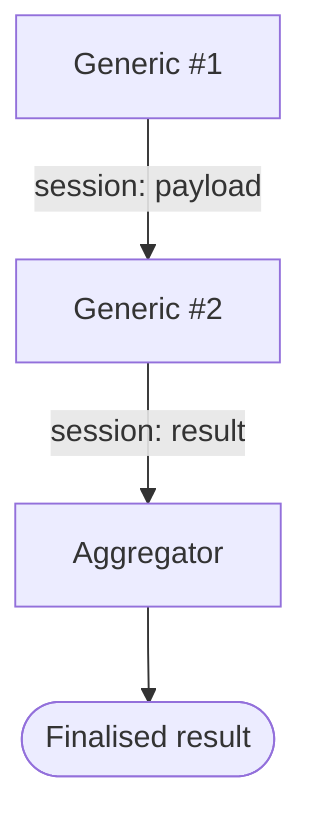
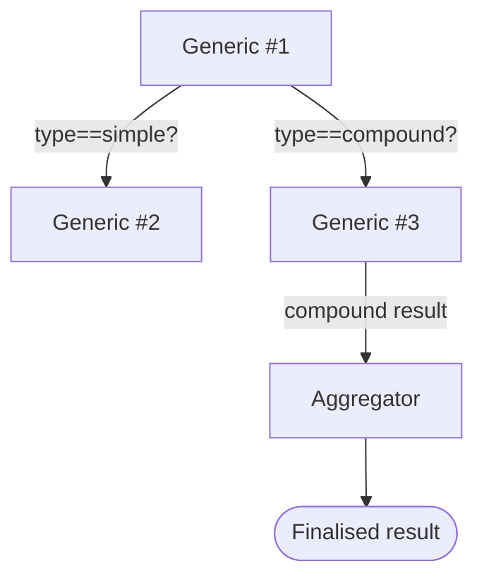

# Logic and Session

Logic are the core elements of a data process. They contains the implementation of a data pipeline (which may be part of a bigger one). And the **session storage** is the thing to link them up together.

import Tabs from "@theme/Tabs";
import TabItem from "@theme/TabItem";

## Understand Logic Functions

A data process is consisted of _at least one_ generic logic and _only one_ aggregator logic. In each logic, there are _two_ JavaScript (or TypeScript) functions - `run` and `handleError` - which are referred to **If OK** and **If Error** in Studio respectively:

<Tabs>
  <TabItem value="js" label="JavaScript (Studio/CLI)" default>

```javascript
// import agents and helper classes from SDK
import {
    Http,
    Mail,
    LocalStorageAgent,
    SessionStorageAgent,
    LogicVariable,
    DatabaseAgent,
    EventAgent,
    FileStorageAgent,
    HttpAgent,
    LoggingAgent,
    MailAgent,
} from "@fstnetwork/loc-logic-sdk";

// If OK
export async function run(ctx) {
    // normal code
}

// If Error
export async function handleError(ctx, error) {
    // error handling code
}
```

  </TabItem>
  <TabItem value="ts" label="TypeScript (CLI)">

```javascript
// import agents and helper classes from SDK
import {
  Http,
  Mail,
  LocalStorageAgent,
  SessionStorageAgent,
  LogicVariable,
  DatabaseAgent,
  EventAgent,
  FileStorageAgent,
  HttpAgent,
  LoggingAgent,
  MailAgent,
  GenericContext,
  RailwayError
} from '@fstnetwork/loc-logic-sdk';

// If OK
export async function run(ctx: GenericContext) {
    // normal code
}

// If Error
export async function handleError(ctx: GenericContext, error: RailwayError) {
    // error handling code
}
```

  </TabItem>
</Tabs>

When a data process get executed as a task, it will execute `run` in each generic logic one by one (the order is determinded by their order configured in Studio or CLI projects) and finally the `run` in aggregator logic. (We will discuss error handling in [another article](/legacy/0.7/tutorials/error-handling-tip).)

:::note
The tutorials is written for JavaScript and [LOC Studio](/legacy/0.7/category/studio-guide).

If you want to apply the tutorials with CLI, especially using TypeScript, see [CLI](/legacy/0.7/category/cli-handbook) and [SDK](/legacy/0.7/category/sdk-reference).
:::

## Pass Data With Session Storage

Ideally, for the sake of maintainability, you should have each logic responsible for only one job, and pass the data to another logic (usually the aggregator). For this purpose we will need the [session storage agent](/legacy/0.7/sdk-reference/session).

### Use Case: Simple Interest Calculator

---

Assuming you are a junior developer in a commercial bank and is tasked to write a _simple interest_ calculator service. A user would submit a principal amount, a yearly interest rate and a time period (months), and the service would return the final amount with interest.

So you split this data pipeline to two generic logic and the aggregator logic:

| Logic      | Purpose                    |
| ---------- | -------------------------- |
| Generic #1 | Read and parse payload     |
| Generic #2 | Calculate simple interest  |
| Aggregator | finalise and return amount |

This is what happens in each logic:

-   `Generic logic #1` reads the JSON payload from the API route, parse it to a JSON object then write it into session.
-   `Generic logic #2` reads the JSON object from session, calculates the amount, and write the new data to session as well.
-   `Aggregator` reads the data and prepare it as the finalised result (it will be returned to the API route).



:::note
Session data can actually pass down all the way to the aggregator, but you get the idea.
:::

Assuming the input JSON payload is

```json
{
    "principle": 10000,
    "interest": 0.06,
    "months": 36
}
```

> 10,000 at 6% yearly rate for 36 months

And the data process should return

```json
{
    "amount": 11800
}
```

> `10,000 x (1 + (0.06 / 12) x 36) = 11,800`

### Code Walkthrough

Since every stage in the data process all use JSON objects, this is pretty straightforward (we assume that the input format is always correct):

| Logic            | Name                | Purpose                     |
| ---------------- | ------------------- | --------------------------- |
| Generic logic #1 | `Input`             | Read and parse JSON payload |
| Generic logic #2 | `Simple Calculator` | Calculate simple interest   |
| Aggregator logic | (None)              | Finalise result             |

```javascript title="Generic logic #1: Input" showLineNumbers
import { SessionStorageAgent, LoggingAgent } from "@fstnetwork/loc-logic-sdk";

export async function run(ctx) {
    // read and parse JSON payload
    const payload = await ctx.payload();
    const data = payload.http.request.data;
    const parsed = JSON.parse(new TextDecoder().decode(new Uint8Array(data)));

    // write the JSON object to session
    await SessionStorageAgent.putJson("parsed", parsed);
}

export async function handleError(ctx, error) {
    // error logging
    LoggingAgent.error(error.message);
}
```

:::info
The payload is read from the [data context](/legacy/0.7/sdk-reference/context-and-task) (`ctx`) object, which is sent via a trigger (for example, as the HTTP request body via an API route) and is available to be loaded into all logic.

The session storage is shared by all logic but only for one particular _task_ (execution of one data process). Anything stored in the session storage will be purged once the task is done.
:::

```javascript title="Generic logic #2: Calculator" showLineNumbers
import { SessionStorageAgent, LoggingAgent } from "@fstnetwork/loc-logic-sdk";

export async function run(ctx) {
    // read parsed payload (JSON) from session
    const parsed = await SessionStorageAgent.get("parsed");

    // calculate simple interest amount
    const amount =
        parsed.principle * (1 + (parsed.interest / 12) * parsed.months);

    // write the result (in a JSON object) to session
    await SessionStorageAgent.putJson("result", { amount: amount });
}

async function handleError(ctx, error) {
    // error logging
    LoggingAgent.error(error.message);
}
```

```javascript title="Aggregator logic" showLineNumbers
import {
    SessionStorageAgent,
    ResultAgent,
    LoggingAgent,
} from "@fstnetwork/loc-logic-sdk";

export async function run(ctx) {
    // read calculated data (JSON) from session
    const result = await SessionStorageAgent.get("result");

    // finalise result
    ResultAgent.finalize({
        status: "ok",
        taskId: ctx.task.taskId,
        ...result,
    });
}

export async function handleError(ctx, error) {
    // finalise result withe error message
    const err = {
        error: true,
        errorMessage: error.message,
        stack: error.stack,
        taskId: ctx.task.taskId,
    };

    LoggingAgent.error(err);
    ResultAgent.finalize(err);
}
```

If something went wrong in any of the logic, the aggregator will finalise a result with the error message instead.

The data process should return something like this:

```json
{
	"_status": 200,
	"_metadata": {
		...
	},
	"data": {
		"status": "ok",
        "taskId": {
            "executionId": "...",
            "id": "..."
        },
		"amount": 18800
	}
}
```

## Logic Flow Control Using Session

Session data can also be used as flags or switches for logic, so that we can run code in some logic and skip others when needed.

### Use Case: Simple/Compound Interest Dual Calculator

Using the last example, your manager now asks you to expand the service so that it can calculate _compound interest_ as well. The user will provide an additional field `type` in the payload to indicate which calculation they want:

```json
{
    // highlight-next-line
    "type": "compound",
    "principle": 10000,
    "interest": 0.06,
    "months": 36
}
```

If `type` is `"simple"`, the data process will calculate with simple interest. It it's `"compound"`, then use compound interest.

So the JSON input above should get

```json
{
    "amount": 11966.805248234146
}
```

> `10,000 x (1 + (0.06 / 12)) ^ 36 ~= 11,966.81`

---

Of course, we can simply use `if...else` to add new calculations. But if the process is complicate or not really related, it is still a good idea to split them into seperated logic modules:

| Logic      | Name                  | Purpose                     |
| ---------- | --------------------- | --------------------------- |
| Generic #1 | `Input`               | Read and parse payload      |
| Generic #2 | `Simple Calculator`   | Calculate simple interest   |
| Generic #3 | `Compound Calculator` | Calculate compound interest |
| Aggregator | (None)                | finalise and return amount  |

-   If `type` is `"simple"`, execute generic logic #2 and skip #3.
-   If `type` is `"compound"`, execute generic logic #3 and skip #2.

#### When `type` == `"compound"`:



### Code Walkthrough

We'll skip generic logic #1 here since the code is exactly the same. Let's look at the new or modified generic logic #2 and #3:

```javascript title="Generic logic #2: Simple Calculator" showLineNumbers
import { SessionStorageAgent, LoggingAgent } from "@fstnetwork/loc-logic-sdk";

export async function run(ctx) {
    // read parsed payload (JSON) from session
    const parsed = await SessionStorageAgent.get("parsed");

    // exit function if type != "simple"
    // highlight-start
    if (parsed.type != "simple") return;
    // highlight-end

    // calculate simple interest amount
    const amount =
        parsed.principle * (1 + (parsed.interest / 12) * parsed.months);

    // write the result (in a JSON object) to session
    await SessionStorageAgent.putJson("result", { amount: amount });
}

export async function handleError(ctx, error) {
    // error logging
    LoggingAgent.error(error.message);
}
```

```javascript title="Generic logic #3: Compound Calculator" showLineNumbers
import { SessionStorageAgent, LoggingAgent } from "@fstnetwork/loc-logic-sdk";

export async function run(ctx) {
    // read parsed payload (JSON) from session
    const parsed = await SessionStorageAgent.get("parsed");

    // exit function if type != "compound"
    // highlight-start
    if (parsed.type != "compound") return;
    // highlight-end

    // calculate compound interest amount
    const amount =
        parsed.principle * Math.pow(1 + parsed.interest / 12, parsed.months);

    // write the result (in a JSON object) to session
    await SessionStorageAgent.putJson("result", { amount: amount });
}

export async function handleError(ctx, error) {
    // error logging
    LoggingAgent.error(error.message);
}
```

The aggregator logic is the same as the [previous version](/legacy/0.7/tutorials/logic-and-session#code-walkthrough).

:::note
If you are developing with CLI, remember to modify `config.yaml` in the project accordingly whenever you add or remove a logic file.
:::

When calculating compound interest, the result would be

```json
{
	"status": "ok",
    "taskId": {
        ...
    },
	"amount": 11966.805248234146
}
```

In practice, you might want to add some extra error handling to prevent invalid input values and make sure the logic will run in predictable states.

:::tip
Actually, each logic can directly load payload from `ctx` or similar constructs. But here we relies on the first logic to do JSON parsing. In practice, you'll probably need to do some JSON validating too.
:::
