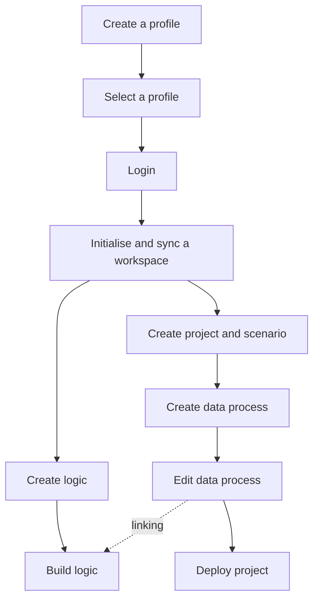

# Introduction and Setup

## Developing with CLI

**LOC CLI** is the dedicated command line tool for developers to create, manage and deploy assets (including data processes and logic) remotely in LOC.

Combined with TypeScript support, local runtime testing and powerful IDEs like Visual Studio Code, CLI makes coding and debug much easier than doing so in LOC Studio.

The workflow of using CLI is roughly as follows:



Also see [Command Reference](/legacy/0.8/category/cli-command-reference).

import Tabs from "@theme/Tabs";
import TabItem from "@theme/TabItem";

## Local Development Setup

To develop with CLI locally, you'll need to setup a login profile and some tools.

### Prerequisites

#### Prepare CLI Executable Binary

[FST Network](/docs/about) provides **CLI executable binaries** to our licensed clients and partners, which is portable and can be used without installation. The following platforms are supported:

-   Windows (x86-64)
-   macOS (x86-64/aarch64)
-   Linux (x86-64/aarch64)

:::info
This hankbook is based on CLI `v0.8.0` and LOC SDK `v0.8.0`. The hand book also assumes that you have renamed your file to `loc` (or `loc.exe` in Windows).
:::

Create a new directory, for example, `/loc-cli-workspace`, and copy the CLI binary into it.

Now open a terminal (for example, Bash on Linux, zsh on macOS and Command Prompt/PowerShell on Windows) and test the CLI binary:

<Tabs>
  <TabItem value="direct" label="Direct access in Terminal or PowerShell" default>

```bash
./loc -h
```

  </TabItem>
  <TabItem value="path" label="Access via $PATH or using Command Prompt">

```bash
loc -h
```

  </TabItem>
</Tabs>

:::tip
Linux and macOS users would have to mark the binary as executable. Open a terminal to the binary directory and run:

<Tabs>
  <TabItem value="linux-0" label="Linux" default>

```bash
sudo chmod +x ./loc
```

  </TabItem>
  <TabItem value="mac-0" label="macOS">

```bash
chmod +x ./loc
```

  </TabItem>
</Tabs>

In the handbook we'll assume you put your CLI binary in the workspace and access it with terminal or PowerShell. However, you can also put the executable elsewhere and access it via `$PATH` environment variable:

<details>
    <summary>Set $PATH for CLI</summary>

<Tabs>
  <TabItem value="linux-1" label="Linux" default>

Run

```bash
sudo nano ~/.bashrc
```

Then add the following line at the end of the file: (change your CLI binary path, for example, `/home/<user name>/loc-cli/`)

```
export PATH=$PATH:{CLI-binary-path}
```

Press `Ctrl` + `X` and enter `Y` to save.

  </TabItem>
  <TabItem value="mac-1" label="macOS">

Open `/Users/<your-user-name>/.bash_profile` in a text editor.

Then add the following line at the end of the file: (change your CLI binary path, for example, `/Users/<your-user-name>/loc-cli/`)

You'll also need to [change the security setting](https://support.apple.com/en-us/HT202491) to allow the CLI binary to run.

```
export PATH=$PATH:{CLI-binary-path}
```

And save the file.

  </TabItem>
  <TabItem value="windows-1" label="Windows">

Right click the Start Menu button and select **Syatem** --> **Advanced system settings** --> **Environment Variables...**.

Select `Path` in either your user variables or global variables and click **Edit...** then add the CLI binary path (for example, `C:\loc-cli\`) at the end of the list.

  </TabItem>
</Tabs>

---

The new path should take effect after opening a new terminal. (Close all VS Code windows and re-open if you are using them.)

</details>

You can also setup the **completion script** to add command completion suggestions for certain shells. See [Generate Shell Completion Scripts](/legacy/0.8/cli-handbook/cli-commands/general-profile-login#generate-shell-completion-scripts) for details.

:::

You should see CLI print out a list of available commands.

#### Install Node.js

**[Node.js](https://nodejs.org/en/download/)** is required for installing LOC SDK, which provides better language support for interfaces of data context, payload and agents, especially enabling intellisense in editors like VS Code.

<Tabs>
  <TabItem value="linux-2" label="Linux" default>

```bash
sudo apt install curl
curl -fsSL https://deb.nodesource.com/setup_18.x | sudo -E bash -
sudo apt install nodejs
```

  </TabItem>
  <TabItem value="mac-2" label="macOS">

```bash
/bin/bash -c "$(curl -fsSL https://raw.githubusercontent.com/Homebrew/install/HEAD/install.sh)"
brew update
brew install node
```

  </TabItem>
  <TabItem value="windows-2" label="Windows">

Windows users can download and run the [Windows installer](https://nodejs.org/en/download/). (The option **Automically install the necessary tools** is not required).

  </TabItem>
</Tabs>

---

#### Other Optional Tools

Some other tools are not required for developing data processes on LOC but are highly recommended:

1. A code editor that supports JavaScript and TypeScript IntelliSense, for example, [Visual Studio Code](https://code.visualstudio.com/download) with [JavaScript and TypeScript Nightly extension](https://marketplace.visualstudio.com/items?itemName=ms-vscode.vscode-typescript-next) installed.

2. Windows 10 users can also install [Windows Terminal](https://docs.microsoft.com/en-us/windows/terminal/install) to replace Command Prompt and PowerShell. Windows Terminal is the default console in Windows 11.

3. A HTTP client like [Hoppscotch](https://hoppscotch.io/) or [Thunder Client](https://www.thunderclient.com/).

4. [Git](https://git-scm.com/downloads) for using Github repositories for project [source/versioning control](/legacy/0.8/cli-handbook/source-control).

## Setting Up a Login Profile

CLI connects to your LOC environment with a _login profile_, which contains the LOC server name, description and URL. The login status is required to initialise the CLI workspace. For any operations involving LOC features and assets, you are also required to login with your LOC account.

:::info
Please contact your LOC owner or the member who has the right authorisation to create an account for you. You'll receive an email with a temporary password (which you are required to change it by logging in _Studio_). You can use it for CLI login after that.

The [LOC license](/legacy/0.8/studio-guide/administration#license) has to be activated in order to use LOC.
:::

### Create and Select a Profile

To create a login profile (and enter each field as prompted:):

```
> ./loc profile create

✔ Name of profile · my-profile
✔ Description of profile · description of my loc profile (can be blank)
✔ Server URL of Logic Operating Centre · https://api.******.fst.network
```

Then switch to the profile as your default:

```
> ./loc profile use my-profile

Current profile is now "my-profile".
```

:::tip
You can inspect the list of existing profiles with

```bash
./loc profile list
```

It will show

```
 NAME           DESCRIPTION                     SERVER URL
════════════════════════════════════════════════════════════════════
 my-profile *   description of my loc profile   https://api.******.fst.network/
```

The `*` represents the profile you are currently using.

Or to check which profile you are currently using with

```bash
./loc profile current -v
```

:::

## Login

With a login profile setup and selected, you can now login your LOC instance (if your LOC account has been created by your team and you've changed your password):

```
> ./loc login

✔ Username · <username>
✔ Password · ********
Log in to Logic Operating Centre with username: <username>, server URL: "https://api.******.fst.network/"
Log in to Logic Operating Centre successfully!
```

:::warning
If you have already logged in Studio, save your work and logout. Otherwise the CLI login would terminate your login status in Studio.
:::

## Initialise a CLI Workspace

After logged in, you can create a **local workspace** to develop projects, scenarios, data processes and logic alike.

<Tabs>
  <TabItem value="direct-2" label="Direct access in workspace" default>

Open terminal in the CLI workspace and run

```bash
./loc init
```

  </TabItem>
  <TabItem value="path-2" label="Access via $PATH">

Open terminal in the directry you'd like to create a workspace, then run

```bash
loc init <cli-workspace-dir-name>
cd <cli-workspace-dir-name>
```

  </TabItem>
</Tabs>

:::tip
You can create multiple workspaces on the same machine, but it is recommended to have one workspace per LOC instance/user account.
:::

<details>
    <summary>Open CLI workspace in VS Code</summary>

You can open the CLI workspace in editors like VS Code:

1. Go to **File** -> **New Window** -> **Open Folder...**
2. Select the local workspace you just created (_not_ the CLI binary dir).
3. Open a new terminal with **Terminal** -> **New Terminal** which will be at the workspace path.

</details>

### Install SDK and dependencies

[LOC SDK](https://www.npmjs.com/package/@fstnetwork/loc-logic-sdk) is a helper package which defines important functions and types for agents, data context and payload.

To install SDK in a workspace, open a terminal at your new local workspace:

<Tabs>
  <TabItem value="npm" label="Use NPM" default>

```bash
npm i -g npm@latest
npm i @fstnetwork/loc-logic-sdk@0.8.0-1 tslib@latest
npm prune
```

  </TabItem>
  <TabItem value="yarn" label="Use Yarn">

```bash
npm i -g yarn@latest
yarn add @fstnetwork/loc-logic-sdk@0.8.0-1 tslib@latest
```

> [Other ways to install Yarn](https://classic.yarnpkg.com/en/legacy/0.8/install)

  </TabItem>
  <TabItem value="pnpm" label="Use PNPM">

```bash
npm i -g pnpm@latest
pnpm i @fstnetwork/loc-logic-sdk@0.8.0-1 tslib@latest
```

> [Other ways to install Pnpm](https://pnpm.io/installation)

  </TabItem>
</Tabs>

You can also install any other dependencies, for example, [`lodash`](https://www.npmjs.com/package/lodash) as well as type definitions like [`@types/lodash`](https://www.npmjs.com/package/@types/lodash) in your workspace.

:::tip
For Linux users, use `sudo` with `npm i`, `yarn add` or `pnpm i`.

If you are a Windows user and uses Yarn or Pnpm, open PowerShell as Administrator and modify the execution policy permission with:

```bash
Set-ExecutionPolicy -Scope CurrentUser -ExecutionPolicy Unrestricted
```

:::

:::info

#### Can I install and use my own DB drivers?

**No** - any actions involving external (that is, outside of LOC) data sources are restricted except using [agents](/legacy/0.8/category/sdk-reference). This is to prevent users create data and security breaches outside proper organisational governance.
:::

<details>
    <summary>Create a CLI Workspace in DevContainer</summary>

> This method requires [Docker](https://docs.docker.com/engine/install/), VS Code with the DevContainer extension installed.

[DevContainer](https://code.visualstudio.com/legacy/0.8/devcontainers/containers) allows users to develop a project in an isolate container environment, in this case a Linux machine. You can even commit the directory to a private Github repository, then access the workspace in browser as [CodeSpace](https://github.com/features/codespaces).

Create a new directory as your CLI workspace, copy the Linux x86-64 binary into it, and create the following files at workspace root:

<Tabs>
  <TabItem value="devcontainer" label="DevContainer" default>

```json title="/.devcontainer/devcontainer.json"
{
    "name": "Node.js",
    "image": "mcr.microsoft.com/devcontainers/javascript-node:0-18",
    "updateContentCommand": "bash .devcontainer/install-dev-tools.sh",
    "postCreateCommand": "./loc login --username <username> && ./loc init",
    "customizations": {
        "vscode": {
            "extensions": [
                "ms-vscode.vscode-typescript-next",
                "dbaeumer.vscode-eslint",
                "esbenp.prettier-vscode"
            ]
        }
    }
}
```

  </TabItem>
  <TabItem value="script" label="Shell script">

```shell title="/.devcontainer/install-dev-tools.sh"
yarn add @fstnetwork/loc-logic-sdk@0.8.0-1
./loc profile create --name <profile-name> --server-url <server-url>
./loc profile use <profile-name>
```

  </TabItem>
</Tabs>

VS Code will download and start a Node.js-based Linux container, then run a script to modify it. The script will install SDK, then set and select a pre-defined CLI profile. After the container is up, VS Code will run `loc login` and `loc init`.

:::info
Modify the username, profile name and server URL accordingly.

Comment out `postCreateCommand` if you do not wish to login immediately.
:::

<details>
    <summary>How to Open DevContainer in VS Code</summary>

1. Open the CLI workspace with VS Code and make sure your Docker engine is up and running.
2. In VS Code, right click on the code and select "Format Document".
3. Key in and find `Dev Containers: Reopen in Container`.
4. Wait until VS Code starts up and setup the container.
5. While in DevContainer, you can rebuild the container with `Dev Containers: Rebuild in Container` or close the container with `Dev Containers: Reopen Folder Locally`.

</details>

</details>
