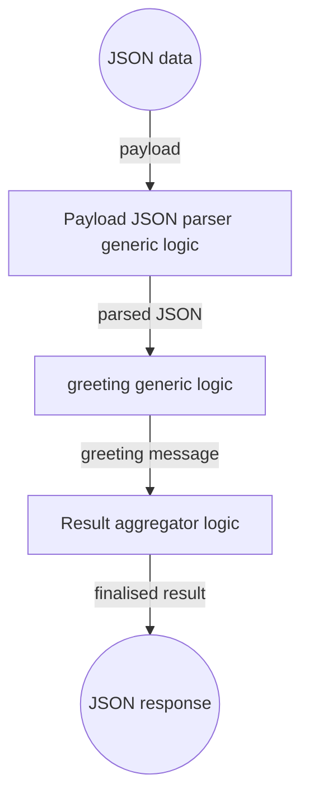

# Quick Start

## Create a "Hello World" Data Process

This quick start will take you through a tutorial of building a simple data process in LOC Studio.

This data process won't do much - it responds to HTTP POST requests and return JSON-format greeting messages, which is similar to a RESTful API. But this will give you a clear idea of what's it like to develop and deploy logic and data processes in LOC.

:::info
This tutorial uses **LOC Studio** and takes about **5-10 minutes ⏱️** providing you already have an account set up and the LOC license is activated.
:::

For example, if you invoke it with this JSON payload

```json
{
    "name": "Arthur Dent"
}
```

The data process should responds with

```json
{
    "message": "Hello, Arthur Dent!"
}
```

The whole "Hello World" data process would be like this:



import Tabs from "@theme/Tabs";
import TabItem from "@theme/TabItem";
import Link from "@docusaurus/Link";

---

## Login LOC

First login LOC [Studio](/legacy/0.8/category/studio-guide):

<div className="center-padded-sm">
    
</div>

:::info
See [User Management](/legacy/0.8/studio-guide/user-management) for how to setup a new account in LOC. You may need to contact your LOC Studio administrator.
:::

:::note
You will be automatically logged out after some time of inactivity.
:::

## Create Logic

Logic are modularised, reusable code components to be linked to data processes, which are created and managed seperatly with [projects, scenarios and data processes](/legacy/0.8/tutorials/loc-feat-overview). Each data process should links with _at least one_ **generic logic** and _only one_ **aggregator logic**. Generic logic will be executed by order and finally run the aggregator.

In the quickstart tutorial, our "Hello World" data process has one each generic and aggregator logic:

| Logic      | Logic name            | Description                                                                                      |
| ---------- | --------------------- | ------------------------------------------------------------------------------------------------ |
| Generic #1 | `payload-json-parser` | A general-purpose logic that parse trigger payload to JSON and stores it in session storage.     |
| Generic #2 | `greeting`            | A unique logic that reads from the parsed JSON to generate a greeting message.                   |
| Aggregator | `result-aggregator`   | A general-purpose aggregator that generates the finalised result to be sent back to the invoker. |

In order to create and execute the data process, we'll need to create the three logic first. The two general-purpose logic are also reusable in our other tutorials.

### Create a Generic Logic

Go to **Cloud Logic** panel under **Data Pipeline/Logic**:

<div className="center-padded-sm">
    
</div>

This panel shows you the list of existing generic or aggregator logic.

Click **Create New Logic** on the top-right corner:

<div className="center-padded-sm">
    
</div>

Key in the logic name and make sure the logic type is `Generic`. As for the language you can choose either `JavaScript` or `TypeScript`. Click **Create** to create the logic.

:::tip
The name of the logic is required, whereas tags and description are entirely optional, so feel free to play with them. However, accurate tags and detailed description are more helpful for improving the usability and searchability of your logic.
:::

Click **Logic Body** on the top to input the logic code, copy and paste the code in the following section then click **Create**.

<div className="center-padded-sm">
    
</div>

:::tip
You can press hot keys in the code box to format the code (adding correct indentations, etc.):

-   Windows: `Alt` + `Shift` + `F`
-   macOS: `Shift` + `Option` + `F`
-   Linux: `Ctrl` + `Shift` + `I`
    :::

If your code is built (compiled) successfully, you should see it in the Cloud Logic list as below:

<div className="center-padded-sm">
    
</div>

You can also click on the logic name to inspect its details or add a new revision:

<div className="center-padded-sm">
    
</div>

:::note
Revisions of a logic represent its editing history, which also ensures that your data process won't break if they depends on older versions.
:::

Below is the example code for all three logic.

---

### Generic logic: `payload-json-parser`

> You can also find the source code [here](/legacy/0.8/logic-library/result-aggregator).

import PayloadJSONParserJSExample from "./_logic-template-sources/_payload-json-parser-js.mdx";
import PayloadJSONParserJSDocExample from "./_logic-template-sources/_payload-json-parser-jsdoc.mdx";
import PayloadJSONParserTSExample from "./_logic-template-sources/_payload-json-parser-ts.mdx";

<Tabs>
  <TabItem value="js-1" label="JavaScript" default>

<PayloadJSONParserJSExample />

  </TabItem>
  <TabItem value="js-doc-1" label="JavaScript (with JSDoc)">

<PayloadJSONParserJSDocExample />

:::info
JavaScript with JSDoc annotations is still JavaScript; however it can enable typing intellisense in local editors like VS Code. See [CLI Handbook](/legacy/0.8/category/cli-handbook) for how to develop locally.
:::

  </TabItem>
  <TabItem value="ts-1" label="TypeScript">

<PayloadJSONParserTSExample />

  </TabItem>
</Tabs>

### Generic logic: `greeting`

<Tabs>
  <TabItem value="js-2" label="JavaScript" default>

```javascript title="greeting.js" showLineNumbers
import { LoggingAgent, SessionStorageAgent } from "@fstnetwork/loc-logic-sdk";

export async function run(ctx) {
    // read parsed payload from session
    const parsed = await SessionStorageAgent.get("parsed");

    // extract name field (and set it to a default string "World" if not exist)
    const name = parsed?.name || "World";

    // logging
    LoggingAgent.info({ name: name });

    // write the result (in a JSON object) to session
    await SessionStorageAgent.putJson("result", {
        message: `Hello, ${name}!`,
    });
}

export async function handleError(ctx, error) {
    // error logging
    LoggingAgent.error({
        error: true,
        errorMessage: error.message,
        stack: error.stack,
        taskId: ctx.task.taskId,
    });
}
```

  </TabItem>
  <TabItem value="js-doc-2" label="JavaScript (with JSDoc)">

```javascript title="greeting.js" showLineNumbers
import { LoggingAgent, SessionStorageAgent } from "@fstnetwork/loc-logic-sdk";

/** @param {import('@fstnetwork/loc-logic-sdk').GenericContext} ctx */
export async function run(ctx) {
    // read parsed payload from session
    /** @type { { name: string } } */
    const parsed = await SessionStorageAgent.get("parsed");

    // extract name field (and set it to a default string "World" if not exist)
    const name = parsed?.name || "World";

    // logging
    LoggingAgent.info({ name: name });

    // write the result (in a JSON object) to session
    await SessionStorageAgent.putJson("result", {
        message: `Hello, ${name}!`,
    });
}

/**
 * @param {import('@fstnetwork/loc-logic-sdk').GenericContext} ctx
 * @param {import('@fstnetwork/loc-logic-sdk').RailwayError} error
 */
export async function handleError(ctx, error) {
    // error logging
    LoggingAgent.error({
        error: true,
        errorMessage: error.message,
        stack: error.stack,
        taskId: ctx.task.taskId,
    });
}
```

  </TabItem>
  <TabItem value="ts-2" label="TypeScript">

```typescript title="greeting.ts" showLineNumbers
import {
    GenericContext,
    RailwayError,
    LoggingAgent,
    SessionStorageAgent,
} from "@fstnetwork/loc-logic-sdk";

export async function run(ctx: GenericContext) {
    // read parsed payload from session
    const parsed = (await SessionStorageAgent.get("parsed")) as {
        name: string;
    };

    // extract name field (and set it to a default string "World" if not exist)
    const name = parsed?.name || "World";

    // logging
    LoggingAgent.info({ name: name });

    // write the result (in a JSON object) to session
    await SessionStorageAgent.putJson("result", { message: `Hello, ${name}!` });
}

export async function handleError(ctx: GenericContext, error: RailwayError) {
    // error logging
    LoggingAgent.error({
        error: true,
        errorMessage: error.message,
        stack: error.stack,
        taskId: ctx.task.taskId,
    });
}
```

  </TabItem>
</Tabs>

### Aggregator logic: `result-aggregator`

> You can also find the source code [here](/legacy/0.8/logic-library/result-aggregator).

import ResultAggregatorJSExample from "./_logic-template-sources/_result-aggregator-js.mdx";
import ResultAggregatorJSDocExample from "./_logic-template-sources/_result-aggregator-jsdoc.mdx";
import ResultAggregatorTSExample from "./_logic-template-sources/_result-aggregator-ts.mdx";

<Tabs>
  <TabItem value="js-a" label="JavaScript" default>

<ResultAggregatorJSExample />

  </TabItem>
  <TabItem value="js-doc-a" label="JavaScript (with JSDoc)">

<ResultAggregatorJSDocExample />

  </TabItem>
  <TabItem value="ts-a" label="TypeScript">

<ResultAggregatorTSExample />

  </TabItem>
</Tabs>

---

With all three logic created, we can move to creating the data process itself.

## Build the Data Process

### Create a Project and Scenario

In order to create a data process in LOC Studio, we'll first need a **project** and **scenario**.

Go to the **Explorer** panel under **Data Pipeline/Data Process**, right click on one of the _unit_ and select **+ Create Project**:

<div className="center-padded-sm">
    
</div>

Give your project a name and some description (optional):

<div className="center-padded-sm">
    
</div>

Right click on the project to create a _scenario_ (again, give it a name and optional descriptions).

### Create a Data Process

Right click on the scenario and select **+ Create Data Process**:

<div className="center-padded-sm">
    
</div>

Like the logic, name is required for a data process with optional tags and descriptions:

<div className="center-padded-sm">
    
</div>

:::info
Execution timeout is how long LOC runtime should wait for the data process to finish the task. The available range is `6`~`300` seconds.
:::

### Link Logic to the Data Process

In the lower part of the data process creation window, click the **Add Generic Logic** button. Studio will prompt you to select a generic logic:

<div className="center-padded-sm">
    
</div>

Add the three logic (two generic and one aggregator) to the data process:

<div className="center-padded-sm">
    
</div>

:::tip
If a selected logic have more than one revisions, make sure you've selected the one you want. You can also change the revision in the data process creation window.
:::

Make sure your logic order is correct, then click **Create**.

<div className="center-padded-sm">
    
</div>

You can see that all three logic and the data process have an unique permanent identity (PID) number. You can also edit the data process, which will create a new revision.

:::note
All revisions of one data process or logic shares the same PID.
:::

## Run the Data Process - Simple Data Process Execution

We can execution the data process with so-called **simple data process execution**, which is in fact a mock API route trigger (simulating an incoming HTTP POST request).

Check out our other tutorials to see how to deploy a real API route on LOC.

Right click your data process and select **Execute Data Process**:

<div className="center-padded-sm">
    
</div>

Studio will prompt you to provide a text file which contains "payload data":

<div className="center-padded-sm">
    
</div>

In our case we can upload a `.json` file containing the JSON payload:

<div className="center-padded-sm">
    
</div>

Finally click **Execute**.

The result should show up momentarily:

<div className="center-padded-sm">
    
</div>

We can see the task ID, execution ID as well as the finalised result returned by the aggregator logic (by clicking the _Preview JSON_ button):

<div className="center-padded-sm">
    
</div>

The `response` field is exactly as what we expected - an included greeting message generated by three logic linked together in the "Hello World" data process.

:::tip
For how to properly invoke a data process with an API route trigger (HTTP endpoint), see [Create and Use an API Route Trigger](/legacy/0.8/tutorials/create-api-route).
:::

## What's Next?

Now you've deployed your first data process in LOC, where should you go next in the docs?

1. First proceed to [Tutorials](/legacy/0.8/category/tutorials), which offers basic examples on specific topics and activities for you to try in LOC Studio.
2. The tutorials also point you to various pages in [Studio Guide](/legacy/0.8/category/studio-guide) and [SDK Reference](/legacy/0.8/category/sdk-reference) for additional details.
3. If you are a developer, you'll need to learn about CLI, which can do more and makes debugging easier - [CLI Handbook](/legacy/0.8/category/cli-handbook) plus SDK Reference have everything you need.
4. See [System FAQs](/docs/category/system-faqs) if you'd like to know more about LOC.

Happy developing!
