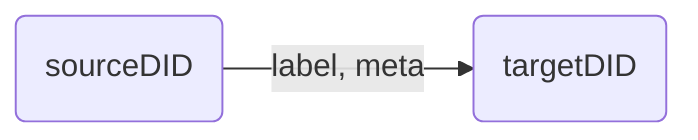

# Event Store Agent

```typescript
import { EventAgent, Event, Search, Pattern } from "@fstnetwork/loc-logic-sdk";
```

Emit and query LOC data events.

Once emitted, events are stored and can be searched in Elasticsearch. They will be generated to data lineage graphs in Studio.

The data lineage or data trail is represented by the relationship of the graph below:



#### Availability

-   ✓ Generic logic
-   ✗ Aggregator logic

import Tabs from "@theme/Tabs";
import TabItem from "@theme/TabItem";

## Emit Events

```typescript
async EventAgent.emit(events: Event.Event[]): Promise<void>
```

Emit event(s). The parameter `events` is an array of events.

### Event Schema

Type `Event.Event` has the following fields:

| Field                                  | Type     | Description                                                              |
| -------------------------------------- | -------- | ------------------------------------------------------------------------ |
| `labelName`                            | `string` | Label name (event name)                                                  |
| `sourceDigitalIdentity` or `sourceDID` | `string` | Source digital identity (DID)                                            |
| `targetDigitalIdentity` or `targetDID` | `string` | Target DID                                                               |
| `meta`                                 | `string` | Meta payload (additional data); max length 2<sup>15</sup> (32768) bytes. |
| `type`                                 | `string` | Event type (group)                                                       |

The input parameter/value of a would-be event is also referred as **event schema**.

:::info
For now `type` only supports `"default"`.

Elements of `events` does not have to be `Event.Event` type, but an error would be thrown if `label`, `sourceDID` or `targetDID` field is not present.
:::

Source and target nodes will be created in Elasticsearch if not exist. Any nodes can be both source and target of other events.

#### Example

<Tabs>
  <TabItem value="emit-js" label="JavaScript" default>

```javascript showLineNumbers
await EventAgent.emit([
    {
        // event 1
        labelName: "Event name 1",
        sourceDID: "Event source 1",
        targetDID: "Event target 1",
        meta: "",
        type: "default",
    },
    {
        // event 2
        labelName: "Event name 2",
        sourceDID: "Event source 2",
        targetDID: "Event target 2",
        meta: "",
        type: "default",
    },
    // ...
]);
```

  </TabItem>
  <TabItem value="emit-ts" label="TypeScript">

```typescript title="Import" showLineNumbers
import { ..., Event } from "@fstnetwork/loc-logic-sdk";
```

```typescript title="Logic" showLineNumbers
await EventAgent.emit([
    {
        // event 1
        labelName: "Event name 1",
        sourceDID: "Source DID 1",
        targetDID: "Target DID 1",
        meta: "",
        type: "default",
    },
    {
        // event 2
        labelName: "Event name 2",
        sourceDID: "Source DID 2",
        targetDID: "Target DID 2",
        meta: "",
        type: "default",
    },
    // ...
] as Event.Event[]);
```

  </TabItem>
</Tabs>

:::warning
The events may not be properly emitted without using `await`.
:::

:::tip
You can also use `JSON.stringify()` to include a JSON object in the meta payload, and later decode it with `JSON.parse()`.
:::

## Query Events

Query event(s) in Elasticsearch.

```typescript
async EventAgent.search(request: Search): Promise<SearchResult>
```

Parameter `request` is of type [`Search`](#search-parameter) and the function returns type [`SearchResult`](/legacy/0.8/sdk-reference/eventstore#search-result).

### Search Parameter

Type: `Search`

| Member         | Type                        | Description              |
| -------------- | --------------------------- | ------------------------ |
| `queries?`     | `Query[]` &#124; `null`     | Event query conditions   |
| `excludes?`    | `Query[]` &#124; `null`     | Event exclude conditions |
| `filters?`     | `Filter[]` &#124; `null`    | Event filter conditions  |
| `sort?`        | `Sort[]` &#124; `null`      | Event sort operator      |
| `aggregation?` | `Aggregation` &#124; `null` | Aggregation syntax       |
| `from?`        | `number` &#124; `null`      | Event query starts from  |
| `size?`        | `number` &#124; `null`      | Event query size         |

:::note

<Tabs>
  <TabItem value="Query" label="type Query" default>

```typescript
type Query =
    | {
          field: string;
          type: "match";
          value: string;
      }
    | {
          field: string;
          type: "match_phrase";
          value: string;
      }
    | {
          field: string;
          type: "term";
          value: string;
      };
```

  </TabItem>
  <TabItem value="Filter" label="type Filter">

```typescript
type Filter =
    | {
          field: string;
          gte?: number | null;
          lte?: number | null;
          type: "range";
      }
    | {
          field: string;
          type: "wildcard";
          value: string;
      };
```

  </TabItem>
  <TabItem value="Sort" label="type Sort">

```typescript
interface Sort {
    field: string;
    order: SortOrder;
}

type SortOrder = "asc" | "desc";
```

  </TabItem>
</Tabs>

<details>
    <summary>List of available query fields</summary>

| Name                              | Description                         |
| --------------------------------- | ----------------------------------- |
| `data_process_permanent_identity` | Data process permanent ID           |
| `data_process_name`               | Data process name                   |
| `data_process_revision`           | Data process revision number        |
| `logic_name`                      | Logic name                          |
| `logic_permanent_identity`        | Logic permanent ID                  |
| `logic_revision`                  | Logic revision number               |
| `execution_id`                    | Execution ID                        |
| `task_id`                         | Task ID                             |
| `sequence`                        | Event sequence number               |
| `label_id`                        | label ID                            |
| `label_name`                      | Label name (`labelName` in emit)    |
| `source_digital_identity`         | Source DID (`sourceDID` in `emit`)  |
| `target_digital_identity`         | Target DID (`targetDID` in `emit`)  |
| `type`                            | Type (`type` in `emit`)             |
| `timestamp`                       | Event emitted time (unix timestamp) |

</details>

:::

All fields are optional. `aggregation` is the syntax for [getting metrics, statistics, or other analytics](https://www.elastic.co/guide/en/elasticsearch/reference/current/search-aggregations.html) from Elasticsearch, which is an advanved feature that we will not demostrate here.

### Search Result

Type: `SearchResult`

| Member         | Type                              | Description                       |
| -------------- | --------------------------------- | --------------------------------- |
| `events`       | [`Event[]`](#queried-events)      | Queried events                    |
| `count`        | `number`                          | Queried number of events          |
| `total`        | `number`                          | Queried number of events          |
| `took`         | `number`                          | Query time (milllisecond seconds) |
| `aggregation?` | `AggregationResult` &#124; `null` | Aggregation results               |

`count` and `total` are similar metrics from Elasticsearch using different APIs; you can ignore them and simply use `events.length` instead.

#### Queried Events

Type: `Event`

An event in `events` is type of `Event` (different from the one used in `emit`):

| Member                       | Type                                                                                                | Description                                                                        |
| ---------------------------- | --------------------------------------------------------------------------------------------------- | ---------------------------------------------------------------------------------- |
| `dataProcessIdentityContext` | [`VersionedIdentityContext`](/legacy/0.8/sdk-reference/context-and-task#versioned-identity-context) | Data process ID and name                                                           |
| `logicIdentityContext`       | `VersionedIdentityContext`                                                                          | Logic identity ID and name                                                         |
| `executionId`                | `string`                                                                                            | Execution ID                                                                       |
| `taskId`                     | `string`                                                                                            | Task ID                                                                            |
| `sequence`                   | `number`                                                                                            | Event sequence number                                                              |
| `label`                      | `Label`, which is `{ id: string; name: string; }`                                                   | Event label ID and name                                                            |
| `sourceDigitalIdentity`      | `string`                                                                                            | Source DID                                                                         |
| `targetDigitalIdentity`      | `string`                                                                                            | Target DID                                                                         |
| `meta`                       | `string`                                                                                            | Meta payload                                                                       |
| `type`                       | `string`                                                                                            | Event group                                                                        |
| `timestamp`                  | `string`                                                                                            | Event emitted datetime ([ISO 8601](https://en.wikipedia.org/wiki/ISO_8601) string) |

Each queried event, other than the basic fields, also contains info about the execution, task, logic and data process where it was emitted.

#### Example: query events

<Tabs>
  <TabItem value="query-js" label="JavaScript" default>

```javascript showLineNumbers
const requests = {
    // highlight-start
    queries: [
        {
            field: "label_name", // field name
            type: "match", // matching operater
            value: "your event name", // value
        },
        // match condition 2...
    ],
    // highlight-end
    excludes: [],
    filters: [],
    sorts: [],
    aggregation: null,
    from: 0,
    size: 1000,
};

const query = await EventAgent.search(requests);
const events = query?.events;

// iterate through events
events.forEach((event) => {
    const label_name = event.label.name;
    const meta = event.meta;
    // ...
});
```

  </TabItem>
  <TabItem value="query-ts" label="TypeScript">

```typescript title="Import" showLineNumbers
import { ..., Search } from "@fstnetwork/loc-logic-sdk";
```

```typescript title="Logic" showLineNumbers
const requests: Search = {
    // highlight-start
    queries: [
        {
            field: "label_name", // field name
            type: "match", // querying method
            value: "your event name", // value
        },
        // match condition 2...
    ],
    // highlight-end
    excludes: [],
    filters: [],
    sorts: [],
    aggregation: null,
    from: 0,
    size: 1000,
};

const query = await EventAgent.search(requests);
const events = query?.events;

// iterate through events
events.forEach((event) => {
    const label_name = event.label.name;
    const meta = event.meta;
    // ...
});
```

  </TabItem>
</Tabs>

`type` defines how should the value be used to query the specified field:

| Query `type`     | Description                                                                                                                            |
| ---------------- | -------------------------------------------------------------------------------------------------------------------------------------- |
| `"match"`        | _Any word_ in the field matches words in your value. Standard full-text search. Suitable for most use cases.                           |
| `"term"`         | Field matches _exactly_ your value.                                                                                                    |
| `"match_phrase"` | Words and their order in the field matches words in your value. (For example, value `"has been"` matches field `it has been raining`.) |

:::info
These querying methods are directly from Elasticsearch: [match](https://www.elastic.co/guide/en/elasticsearch/reference/current/query-dsl-match-query.html), [term](https://www.elastic.co/guide/en/elasticsearch/reference/current/query-dsl-term-query.html) and [match_phrase](https://www.elastic.co/guide/en/elasticsearch/reference/current/query-dsl-match-query-phrase.html).
:::

#### Example: exclude events

<Tabs>
  <TabItem value="exclude-js" label="JavaScript" default>

```javascript showLineNumbers
const query = await EventAgent.search({
    queries: [],
    // highlight-start
    excludes: [
        {
            // exclude condition 1
            field: "source_digital_identity",
            type: "match",
            value: "your source DID",
        },
        // match condition 2...
    ],
    // highlight-end
    filters: [],
    sorts: [],
    aggregation: null,
    from: 0,
    size: 1000,
});

const events = query?.events;
```

  </TabItem>
  <TabItem value="exclude-ts" label="TypeScript">

```typescript title="Import" showLineNumbers
import { ..., Search } from "@fstnetwork/loc-logic-sdk";
```

```typescript title="Logic" showLineNumbers
// highlight-next-line
const query = await EventAgent.search({
    queries: [],
    // highlight-start
    excludes: [
        {
            // exclude condition 1
            field: "source_digital_identity",
            type: "match",
            value: "your source DID",
        },
        // exclude condition 2...
    ],
    // highlight-end
    filters: [],
    sorts: [],
    aggregation: null,
    from: 0,
    size: 1000,
} as Search);

const events = query?.events;
```

  </TabItem>
</Tabs>

#### Example: filter events (range)

If a field of certain events is numeric data, you can apply a filter range:

<Tabs>
  <TabItem value="filter-js" label="JavaScript" default>

```javascript showLineNumbers
const query = await EventAgent.search({
    queries: [],
    excludes: [],
    // highlight-start
    filters: [
        {
            // filter condition 1
            field: "target_digital_identity", // field name
            gte: 9000, // value greater than or equal to
            lte: null, // value smaller than or equal to
            type: "range",
        },
        // filter condition 2...
    ],
    // highlight-end
    sorts: [],
    aggregation: null,
    from: 0,
    size: 1000,
});

const events = query?.events;
```

  </TabItem>
  <TabItem value="filter-ts" label="TypeScript">

```typescript title="Import" showLineNumbers
import { ..., Search } from "@fstnetwork/loc-logic-sdk";
```

```typescript title="Logic" showLineNumbers
// highlight-next-line
const query = await EventAgent.search({
    queries: [],
    excludes: [],
    // highlight-start
    filters: [
        {
            // filter condition 1
            field: "target_digital_identity", // field name
            gte: 9000, // value greater than or equal to
            lte: null, // value smaller than or equal to
            type: "range",
        },
        // filter condition 2...
    ],
    // highlight-end
    sorts: [],
    aggregation: null,
    from: 0,
    size: 1000,
} as Search);

const events = query?.events;
```

  </TabItem>
</Tabs>

Both `gte` and `lte` fields are optional and can be set to either a `number` or `null`. The example above will query events that `target_digital_identity` >= 9000.

:::tip
When filtering events within a time range with `timestamp` field, convert the time to **unix timestamp**. For example:

```javascript showLineNumbers
filters: [  // filter events for the past hour
    {
        field: "timestamp",
        gte: Date.now() - 60 * 60 * 1000,  // starts from 1 hour ago (= 60 * 60 * 1000 ms)
        lte: Date.now(),
        type: "range",
    }
],
```

:::

#### Example: filter events (wildcard)

`filters` can apply a [wildcard search](https://www.elastic.co/guide/en/elasticsearch/reference/current/query-dsl-wildcard-query.html) on string names as well, using the following wildcard operators:

<Tabs>
  <TabItem value="filter2-js" label="JavaScript" default>

```javascript showLineNumbers
const query = await EventAgent.search({
    queries: [],
    excludes: [],
    // highlight-start
    filters: [
        {
            // filter condition 2...
            field: "target_digital_identity", // field name
            type: "wildcard",
            value: "some?name*", // wildcard value
        },
        // filter condition 2...
    ],
    // highlight-end
    sorts: [],
    aggregation: null,
    from: 0,
    size: 1000,
});

const events = query?.events;
```

| Wilcard operator | Description                                                  |
| ---------------- | ------------------------------------------------------------ |
| `?`              | Representing any single character                            |
| `*`              | Representing zero or more characters, including an empty one |

For example, `event-?-*` matches `event-A-1` and `event-B-123`, and so on.

  </TabItem>
  <TabItem value="filter2-ts" label="TypeScript">

```typescript title="Import" showLineNumbers
import { ..., Search } from "@fstnetwork/loc-logic-sdk";
```

```typescript title="Logic" showLineNumbers
// highlight-next-line
const query = await EventAgent.search({
    queries: [],
    excludes: [],
    // highlight-start
    filters: [
        {
            // filter condition 2...
            field: "target_digital_identity", // field name
            type: "wildcard",
            value: "some?name*", // wildcard value
        },
        // filter condition 2...
    ],
    // highlight-end
    sorts: [],
    aggregation: null,
    from: 0,
    size: 1000,
} as Search);

const events = query?.events;
```

  </TabItem>
</Tabs>

#### Example: sort events

<Tabs>
  <TabItem value="sort-js" label="JavaScript" default>

```javascript showLineNumbers
const query = await EventAgent.search({
    queries: [],
    excludes: [],
    filters: [],
    // highlight-start
    sorts: [
        {
            // sort condition 1
            field: "source_digital_identity",
            order: "desc",
        },
        // sort condition 2...
    ],
    // highlight-end
    aggregation: null,
    from: 0,
    size: 1000,
});

const events = query?.events;
```

  </TabItem>
  <TabItem value="sort-ts" label="TypeScript">

```typescript title="Import" showLineNumbers
import { ..., Search } from "@fstnetwork/loc-logic-sdk";
```

```typescript title="Logic" showLineNumbers
// highlight-next-line
const query = await EventAgent.search({
    queries: [],
    excludes: [],
    filters: [],
    // highlight-start
    sorts: [
        {
            // sort condition 1
            field: "source_digital_identity",
            order: "desc",
        },
        // sort condition 2...
    ],
    // highlight-end
    aggregation: null,
    from: 0,
    size: 1000,
} as Search);

const events = query?.events;
```

  </TabItem>
</Tabs>

`order` can be

-   `"asc"` (ascending order)
-   `"desc"` (descending order)

This also works for both numeric data or non-numeric strings (sorting alphabetically).

## Query Event Sequences

Search _sequence_ of events. The first event has to satisfy first search condition, and so on...

```typescript
async EventAgent.searchWithPattern(request: Pattern): Promise<PatternResult>
```

### Sequence Search Parameter

Type: `Pattern`

| Member      | Type         | Description                                                                                                           |
| ----------- | ------------ | --------------------------------------------------------------------------------------------------------------------- |
| `sequences` | `Sequence[]` | Sequence of conditions                                                                                                |
| `filter?`   | `Filter[]`   | Filter conditions (see [here](http://localhost:3000/legacy/0.8/sdk-reference/eventstore#example-filter-events-range)) |
| `maxSpan?`  | `string`     | Search time span (for example, `30s` = 30 secs and `15m` = 15 mins)                                                   |

#### Sequence Parameter

Type: `Sequence`

| Member          | Type                        | Description               |
| --------------- | --------------------------- | ------------------------- |
| `conditions?`   | `Condition[]` &#124; `null` | Sequence query conditions |
| `sharedFields?` | `string[]` &#124; `null`    |                           |
| `type?`         | `string` &#124; `null`      |                           |

The available field names in `conditions?` are the same as `search` (see [here](/legacy/0.8/sdk-reference/eventstore#example-query-events)). See the example for details.

### Sequence Search Result

Type: `PatternResult`

| Member      | Type                                                                        | Description                       |
| ----------- | --------------------------------------------------------------------------- | --------------------------------- |
| `sequences` | [`SequencesResult`](/legacy/0.8/sdk-reference/eventstore#returned-sequence) | Sequence of queried events        |
| `count`     | `number`                                                                    | Queried number of events          |
| `total`     | `number`                                                                    | Queried number of events          |
| `took`      | `number`                                                                    | Query time (milllisecond seconds) |

#### Returned Sequence

Type: `SequencesResult`

`PatternResult` contains an array of such sequences, each sequence would contain one or more events:

| Member     | Type                                                             | Description    |
| ---------- | ---------------------------------------------------------------- | -------------- |
| `events`   | [`Event[]`](/legacy/0.8/sdk-reference/eventstore#queried-events) | Queried events |
| `joinKeys` | `string[]`                                                       |                |

#### Example

<Tabs>
  <TabItem value="pattern-js" label="JavaScript" default>

```javascript showLineNumbers
// create sequence search pattern
const query = await EventAgent.searchWithPattern({
    sequences: [
        // must have at least two event conditions!
        {
            // sequence 1 event condition
            // highlight-start
            conditions: [
                {
                    field: "label_name", // field name
                    op: "eq", // operator
                    value: "label name", // value
                },
            ],
            // highlight-end
            sharedFields: [],
            type: "any",
        },
        {
            // sequence 2 event condition
            // highlight-start
            conditions: [
                {
                    field: "source_digital_identity",
                    op: "gt",
                    value: "source DID",
                },
                {
                    field: "target_digital_identity",
                    op: "lt",
                    value: "target DID",
                },
            ],
            // highlight-end
            sharedFields: [],
            type: "any",
        },
    ],
    filter: null,
    maxSpan: null,
});

const sequences = query?.sequences;

// iterate through sequences
sequences.forEach((sequence) => {
    // iterate through events in each sequence
    sequence.events?.forEach((event) => {
        const label_name = event.label.name;
        const meta = event.meta;
        // ...
    });
});
```

  </TabItem>
  <TabItem value="pattern-ts" label="TypeScript">

```typescript title="Import" showLineNumbers
import { ..., Pattern } from "@fstnetwork/loc-logic-sdk";
```

```typescript title="Logic" showLineNumbers
// create sequence search pattern
const query = await EventAgent.searchWithPattern({
    sequences: [
        // must have at least two event conditions!
        {
            // sequence 1 event condition
            // highlight-start
            conditions: [
                {
                    field: "label_name", // field name
                    op: "eq", // operator
                    value: "label name", // value
                },
            ],
            // highlight-end
            sharedFields: [],
            type: "any",
        },
        {
            // sequence 2 event condition
            // highlight-start
            conditions: [
                {
                    field: "source_digital_identity",
                    op: "gt",
                    value: "source DID",
                },
                {
                    field: "target_digital_identity",
                    op: "lt",
                    value: "target DID",
                },
            ],
            // highlight-end
            sharedFields: [],
            type: "any",
        },
    ],
    filter: null,
    maxSpan: null,
} as Pattern);

const sequences = query?.sequences;

// iterate through sequences
sequences.forEach((sequence) => {
    // iterate through events in each sequence
    sequence.events?.forEach((event) => {
        const label_name = event.label.name;
        const meta = event.meta;
        // ...
    });
});
```

  </TabItem>
</Tabs>

`op` operator in `conditions` includes the following options:

| Operator | Descriptionn             |
| -------- | ------------------------ |
| `"eq"`   | equal to                 |
| `"ne"`   | not equal to             |
| `"gt"`   | greater than             |
| `"lt"`   | less than                |
| `"gte"`  | greater than or equal to |
| `"lte"`  | less than or equal to    |
