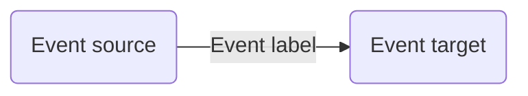
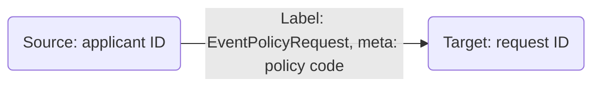

# Emit and Inspect Events

LOC [events](/legacy/0.8/tutorials/loc-feat-overview#events) allows users to generate metadata represent a data flow or data trail to indicate who have sent, used or received data. These information can be very useful for two reasons:

-   Active medatada management
-   Data collaboration
-   Data auditing

Here we will have a look at a simple example that use events and then inspect them in [Studio](/legacy/0.8/category/studio-guide).

## What are Events?

In LOC, **events** are user-defined metadata generated by using [Event Store Agent](/legacy/0.8/sdk-reference/eventstore). Both event _source_ and _target_ are user-defined nodes that will be created in Elasticsearch.



Events can be used to exchange information between data processes, or simply as a form of active metadata alongside existing database or file transactions, so that you can have a clear idea when and where did the data flow.

The graphical, network-like representation of events (which may share source or target nodes) in Studio is referred as **data lineage**.

:::info
There are also system auto-generated events, but we will not discuss that here.
:::

## Emit Events

### Use Case: Insurance Policy Application

Imagine you are working for a insurance company and need to build a new process to let customers submit applications for new policies.

We assume the company offers the following policies:

| Policy Code | Type                       |
| ----------- | -------------------------- |
| `P100`      | Permanent life insurance   |
| `P200`      | Health Insurance           |
| `P300`      | Liability car insurance    |
| `P400`      | Personal injury protection |
| `P500`      | Personal property coverage |

The system needs to record _who have submitted an application to what policy?_ so that the company and the customer can track the processing progress:



We'll use a mocked request JSON payload (multiple applications) like this:

```json title="payload" showLineNumbers
[
    {
        "requestID": "R0042",
        "policyCode": "P100",
        "applicantID": "A1979"
    },
    {
        "requestID": "R0043",
        "policyCode": "P300",
        "applicantID": "A1982"
    },
    {
        "requestID": "R0044",
        "policyCode": "P500",
        "applicantID": "A1982"
    }
]
```

So the data process handling the application process should generate 3 events (where two applicants send three policy applications):

```
A1979  ->  EventPolicyRequest (meta: P100)  ->  R0042
A1982  ->  EventPolicyRequest (meta: P300)  ->  R0043
A1982  ->  EventPolicyRequest (meta: P500)  ->  R0044
```

In reality, the payload may be far more complicated and the data process would have to process and store those application information. But you get the idea.

### Code Walkthrough

In this example we'll create a data process `policy-application` with the following logic:

| Logic                | Name                                                                            | Purpose                             |
| -------------------- | ------------------------------------------------------------------------------- | ----------------------------------- |
| Generic logic #1     | `payload-json-parser` ([source](/legacy/0.8/logic-library/payload-json-parser)) | Read and parse JSON payload         |
| **Generic logic #2** | `policy-application`                                                            | Process parsed JSON and emit events |
| Aggregator logic     | `result-aggregator` ([source](/legacy/0.8/logic-library/result-aggregator))     | Finalise task result                |

The `policy-application` logic is as below:

```javascript title="policy-application (generic logic #2)" showLineNumbers
import {
    LoggingAgent,
    SessionStorageAgent,
    EventAgent,
} from "@fstnetwork/loc-logic-sdk";

export async function run(ctx) {
    const parsed = await SessionStorageAgent.get("parsed");

    // check if parsed is an array
    if (!Array.isArray(parsed)) return;

    // filter out items with necessary fields
    const filteredList = parsed.filter(
        (item) =>
            "requestID" in item &&
            "policyCode" in item &&
            "applicantID" in item,
    );

    // exit logic if no events can be emitted
    if (filteredList.length === 0) return;

    // generate event objects
    let events = [];
    filteredList.forEach((item) => {
        events.push({
            labelName: "EventPolicyRequest", // label name (event name)
            sourceDID: item.applicantID, // source DID
            targetDID: item.requestID, // target DID
            meta: item.policyCode, // meta payload
            type: "default", // event type (group)
        });
    });

    // emit events
    await EventAgent.emit(events);

    // prepare result
    const result = {
        emitted_length: events.length,
        events: events,
    };

    // log events
    LoggingAgent.info(result);

    // write events to result
    await SessionStorageAgent.putJson("result", result);
}

export async function handleError(ctx, error) {
    // error logging
    LoggingAgent.error({
        error: true,
        errorMessage: error.message,
        stack: error.stack,
        taskId: ctx.task.taskId,
    });
}
```

### Invoke Data Process

In order to inspect the events in Studio, you'll need to deploy the data process above to LOC (not local runtime).

You can invoke it with either an API route or single data process execution (see [QUick Start](/legacy/0.8/quickstart).)

The finalised result would be like:

```json
{
    "status": "ok",
    "taskId": {
        "id": "kXq0U9ozoyh_uLm1DZbWhg",
        "executionId": "Y-NLJGafKjUT053V7GvjFg"
    },
    "response": {
        "emitted_length": 3,
        "events": [
            {
                "labelName": "EventPolicyRequest",
                "sourceDID": "A1979",
                "targetDID": "R0042",
                "meta": "P100",
                "type": "default"
            },
            {
                "labelName": "EventPolicyRequest",
                "sourceDID": "A1982",
                "targetDID": "R0043",
                "meta": "P300",
                "type": "default"
            },
            {
                "labelName": "EventPolicyRequest",
                "sourceDID": "A1982",
                "targetDID": "R0044",
                "meta": "P500",
                "type": "default"
            }
        ]
    }
}
```

## Inspect Events

### Using Data Discovery

Now go to **Data Discovery** in Studio and click **Events**. Enter the label name `EventPolicyRequest` and click **Apply Filter**:

<div className="center-padded-sm">
    
</div>

:::tip
You can also apply a time range filter if you have emitted the events several times.
:::

You can see the three events we've just emitted. You can expand the events to see more details (including the meta payload):

<div className="center-padded-sm">
    
</div>

Now click **Event Lineage Graph** to see the graphical data lineage:

<div className="center-padded-sm">
    
</div>

You can clearly see that this is the graphical representation of an event - applicant `A1979` sent an application request `R0042`, and so on. Both `A1979` and `R0042` have became **nodes** - a digital or virtual identity as a data sender or receiver.

In the next article, we will see that we can extend this data flow even further - creating a longer data trail as the application get processed.
