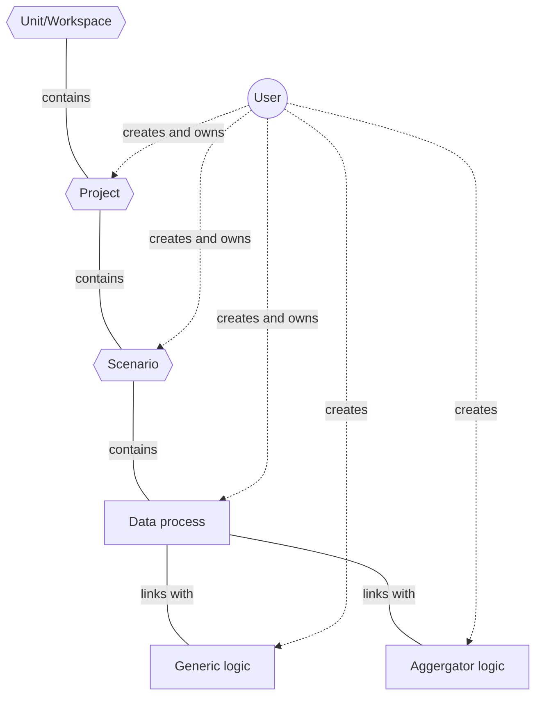
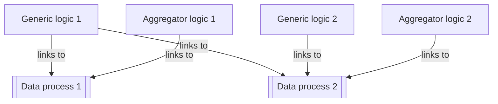
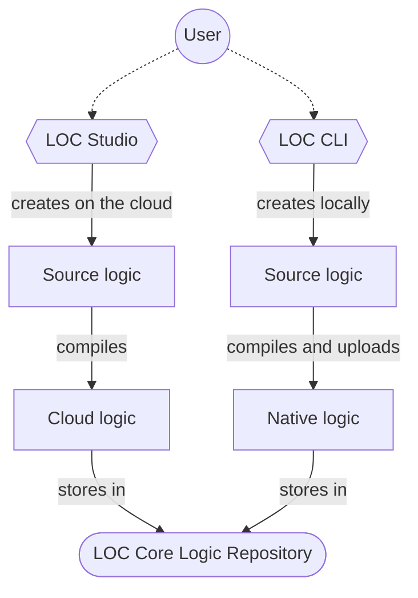
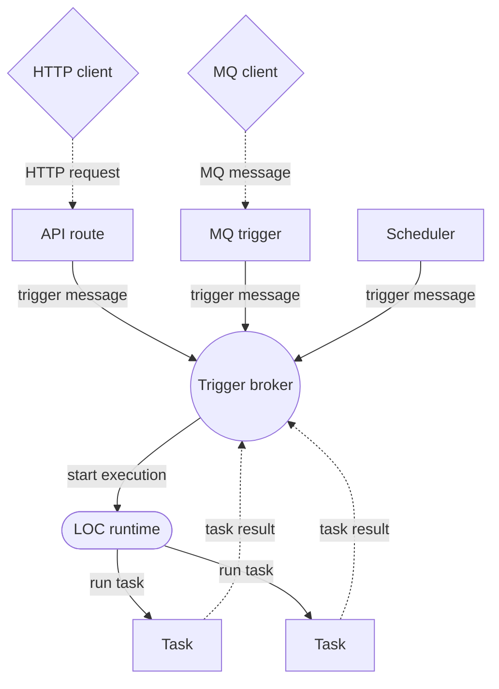
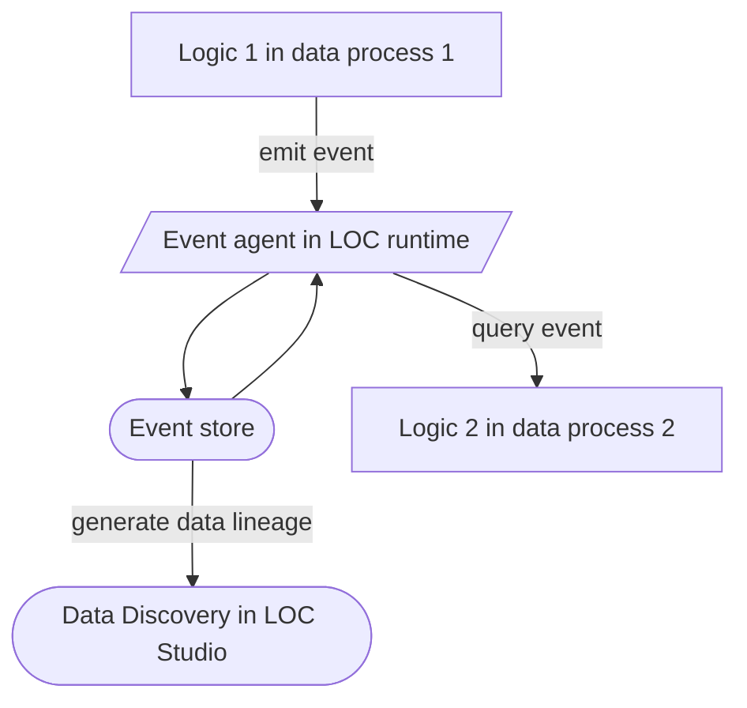

# LOC Features Overview

## Project, Scenario and Data Process Hierarchy

In LOC, the hierarchy of projects, scenarios, data processes and logic are arranged as follows:

| Term             | Description                                                                                    |
| ---------------- | ---------------------------------------------------------------------------------------------- |
| **Unit**         | represents the topmost LOC development **workspace** for all projects.                         |
| **Project**      | represents a **business logic** which may contain several scenarios.                           |
| **Scenario**     | represents a **use case** in a business logic and may contain several data processes.          |
| **Data process** | represents a **data pipeline** that have several logic linked to it.                           |
| **Logic**        | represents a **code module** which contains data processing scripts to perform specific tasks. |

A project owner owns all scenarios and data processes under it (but not the linked logic).

:::note
The name or any LOC assets cannot be blank, cannot exceed 128 characters and _can only contain the following characters_:

-   spaces
-   dot: `.`
-   dash: `-`
-   underscore: `_`
-   sharp: `#`
-   tilde: `~`
-   single quote: `'`
-   parentheses: `()`
-   square bracket: `[]`

> Spaces at both ends will be trimmed. All empty string is not allowed.

Whereas descriptions or assets have no such restriction and can be blank.

By default the entrypoint file path (the filename of source logic) is the same as the logic name.
:::

## Data Process and Logic

### Logic Types

A data process always has _at least one_ generic logic and _only one_ aggreggaror logic, which are the two main logic types in LOC.

-   **Generic logic** is the general purpose logic for performing any desired extracting, transformation or loading actions.
-   **Aggregator logic** is responsible for returning results from an executed data process. It is the last logic to be executed in a data process. Ideally, generic logic should pass their results to the aggregator logic via session variables.

Logic are designed to be _reusable_, so they are created and deployed independent of data processes. A data process is in fact a definition of some metadata and a series of linked logic's ID.

:::info
Currently LOC supports two languages for developing logic, both available in Studio and CLI:

-   **JavaScript** (`ES6/ES2015` and above)
-   **TypeScript** (version `3.7.0` and above)
    :::

You can read the following tutorials to learn more about how to create and use logic:

-   [Logic and Session](/legacy/0.8/tutorials/logic-and-session)
-   [Tips on Error Handling](/legacy/0.8/tutorials/error-handling-tip)

### Logic Modularisation

The same logic can be shared (linked) to more thah one data processes:

LOC thus llows you to create common, reusable logic modules to reduce duplicated code, logic coupling as well as development time. What and how to modularise your code really depends on use cases of your business and data logic.

### Cloud Logic vs. Native Logic

Depending on where the logic code is developed and deployed, both generic and aggregator logic stored in LOC Core can have two types - _cloud_ and _native_ logic:

These two types of logic essentially work in the same way with a few difference:

| Logic type       | Deployed from | Source code editable on the cloud | Support 3rd-party libraries | Suitable For                    |
| ---------------- | ------------- | --------------------------------- | --------------------------- | ------------------------------- |
| **Cloud logic**  | Studio        | Yes                               | No                          | Demostraion or proof of concept |
| **Native logic** | CLI           | No                                | Possible                    | General development             |

:::note
Source code - or "entry file" - of both cloud and native logic can be viewed in Studio. However only cloud logic entry files are editable.
:::

The only difference is that **cloud logic** would store both source code and compiled code directly in LOC, while **native logic** only uploads the compiled code (with the source code files or **source logic** remains on the developer's local machine).

:::note
If you copy and paste some source logic code to create logic directly in Studio, they will become cloud logic.
:::

Despite not editable in Studio, native logic have the advantages of combining with local development, testing and source control tools so that you can design and test-run logic before pushing them to production. The deployed assets can then be managed more easily via Studio's graphic interface.

For demostration purposes we will still mostly use cloud logic in our [tutorials](/legacy/0.8/category/tutorials). See [CLI Handbook](/legacy/0.8/category/cli-handbook) to learn more about CLI.

### Agents

Each logic can access a series of internal and external data source functionalities, which are part of the LOC runtime. These allow logic to share data with other logic or access HTTP endpoints, file servers and databases.

You can find full detailed interface documentation at [SDK Reference](/legacy/0.8/category/sdk-reference).

### Tags

**Tags** are metadata that can be added to data processes and logic. They are useful for improve the readability and searchability in both Studio and CLI.

## Triggers, Tasks and Executions

**Triggers** are features for invoking one or more data processes.

| Trigger type                  | Trigger message source | Can has payload | Return result            |
| ----------------------------- | ---------------------- | --------------- | ------------------------ |
| **API route** (HTTP endpoint) | HTTP request           | Yes             | Synchronous/asynchronous |
| **Message queue**             | MQ client              | Yes             | Asynchronous             |
| **Scheduler**                 | LOC scheduler          | No              | None                     |

The list of data processes linked to a trigger can be referred as the **trigger manifest**.

When a trigger send messages to LOC runtime, it starts an **execution**. Each data processes invoked in the execution is run as a **task**. All tasks would receive the same payload from the trigger if there is one.

If possible, the task result would be sent directly back to the trigger. The execution response (combined with task results from each data process) will also be stored in the execution histories, which can be queried later if the trigger is asynchronous.

You can learn how to create an API route with the following tutorial:

-   [Create and Use an API Route Trigger](/legacy/0.8/tutorials/create-api-route)

:::info
LOC Studio only supports managing API routes.

MQ and scheduler were available to manage via CLI in `v0.7.0`, but as the new CLI is currently being ported from TypeScript to Rust, these functionalities will be available again in later releases.
:::

## Events

**Events** or _data events_ are metadata emitted by users with [Event Agent](/legacy/0.8/sdk-reference/eventstore) to the LOC event store (which is built on Elasticsearch). Ideally, an event represents a **business logic event** and the metadata can be shared across different data processes, or to generate data lineage (which represents data flow between data processes).

You can read the following tutorials to learn more about using events:

-   [Emit and Inspect Events](/legacy/0.8/tutorials/emit-and-inspect-event)
-   [Events and Multiple Data Processes](/legacy/0.8/tutorials/event-and-multiple-dp)

In future releases events can even serve as triggers as well (invoke data processes with data events).
