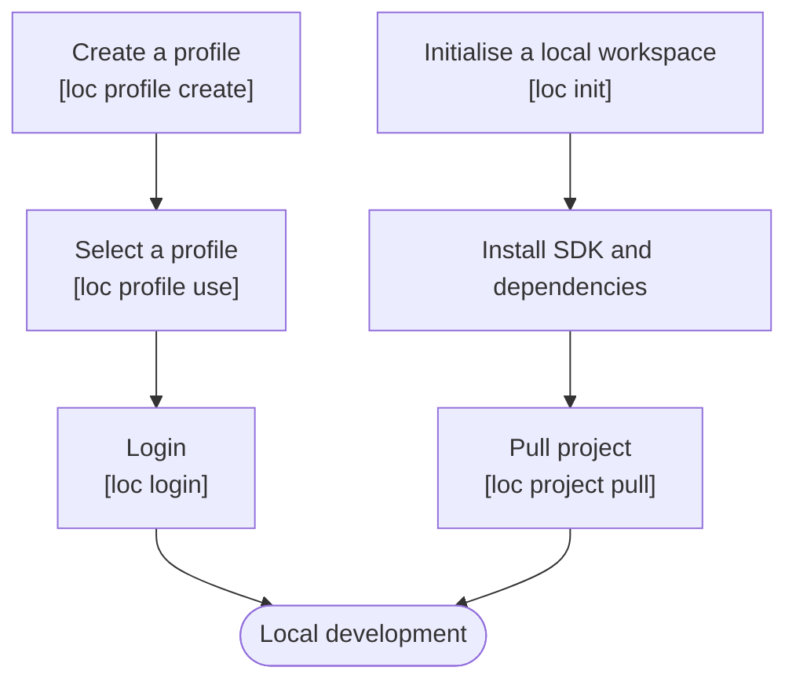

# Introduction and Setup

## Developing with CLI

**LOC CLI** is the dedicated command line tool for developers to create, manage and deploy assets (including data processes and logic) remotely in LOC.

Combined with TypeScript support, local runtime testing and powerful IDEs like Visual Studio Code, CLI makes coding and debug much easier than doing so in LOC Studio.

Also see [Command Reference](/legacy/0.9/category/cli-command-reference).

import Tabs from "@theme/Tabs";
import TabItem from "@theme/TabItem";

## Local Development Prerequisites

To develop with CLI locally, you'll need to setup a login profile, login and initialise a workspace.



:::tip
A local workspace is the development directory on your machine which corresponds to the cloud workspace in Studio.

It is not necessary to login _before_ initialising a workspace, however it will be required for some actions operating remote assets on the LOC server.
:::

### Prepare CLI Executable Binary

:::info
This hankbook is based on CLI `v0.9.2` and LOC SDK `v0.9.0-1`. The hand book also assumes that you have renamed your file to `loc` (or `loc.exe` in Windows).
:::

[FST Network](/docs/about-and-contact) provides **CLI executable binaries** to our licensed clients and partners, which is portable and can be used without installation. The following platforms are supported:

-   Windows (x86-64)
-   macOS (x86-64/aarch64)
-   Linux (x86-64/aarch64)

:::note
The macOS aarch64 build is targeted for Apple M1/M2 and is still experimental. If you encounter issues running CLI on M1/M2 machines, try install [Rosetta](https://support.apple.com/en-us/HT211861) to run the x86 version instead.
:::

#### Installation

1. Create a directory in your system. This is what we referred as the local workspace.

2. Copy and paste the CLI binary into the directory.

3. Rename the binary to `loc` (or `loc.exe` if you are using Windows).

4. Open a terminal and switch to the directory:

```bash
cd <path/local-workspace-directory>
```

:::note
For Linux and macOS users, you can also right-click the directory and select **Open in Terminal** to switch to the woskapce dir. For Windows 11 users (or Windows 10 that has installed Windows Terminal), you can do so by seelcting **Open in Windows Terminal**.

You can upgrade the CLI binary by simply _overwriting_ it. However, existing files in your directory may be renendered unusable due to the changes in the newer release. It is recommended to back them up and clear the original workspace dir.
:::

<details>
    <summary>Open local workspace in VS Code</summary>

You can open the CLI workspace in editors like VS Code:

1. Go to **File** -> **New Window** -> **Open Folder...**

2. Select the local workspace directory you just created.

3. Open a new terminal with **Terminal** -> **New Terminal** which will be automatically at the workspace path.

</details>

<details>
    <summary>Add CLI to $PATH for global access</summary>

You can also set your CLI binary to system `$PATH` variable:

<Tabs>
  <TabItem value="linux-1" label="Linux" default>

Run

```bash
sudo echo "export PATH=$PATH:{CLI-binary-path}" >> ~/.bashrc
```

And re-open the terminal.

  </TabItem>
  <TabItem value="mac-1" label="macOS">

Open `/Users/<your-user-name>/.bash_profile` in a text editor.

Then add the following line at the end of the file: (change your CLI binary path, for example, `/Users/<your-user-name>/loc-cli/`)

You'll also need to [change the security setting](https://support.apple.com/en-us/HT202491) to allow the CLI binary to run.

```
export PATH=$PATH:{CLI-binary-path}
```

And save the file.

  </TabItem>
  <TabItem value="windows-1" label="Windows">

Right click the Start Menu button and select **Syatem** --> **Advanced system settings** --> **Environment Variables...**.

Select `Path` in either your user variables or global variables and click **Edit...** then add the CLI binary path (for example, `C:\loc-cli\`) at the end of the list.

  </TabItem>
</Tabs>

---

The new path should take effect after opening a new terminal. (Close all VS Code windows and re-open if you are using them.)

</details>

#### Mark CLI as Executable (Linux and macOS)

For **Linux** and **macOS** users, run the following command in your terminal:

```bash
sudo chmod +x ./loc
```

In the handbook we assumes you'll access the CLI binary directory in the workspace dir using Linux/macOS terminal or Windows PowerShell. However, you can also store the executable elsewhere and access it via `$PATH` environment variable:

#### Test the CLI

Now open a terminal (for example, Bash on Linux, zsh on macOS and Command Prompt/PowerShell on Windows) and test the CLI binary:

<Tabs>
  <TabItem value="direct" label="Direct access in Terminal or PowerShell" default>

```bash
./loc -h
```

  </TabItem>
  <TabItem value="path" label="Access via $PATH or using Command Prompt">

```bash
loc -h
```

  </TabItem>
</Tabs>

You should see the following output, indicating the CLI binary is ready to go:

```
loc 0.9.0
FST Network Dev <dev@fstk.io>

Usage:
    loc help
    loc <COMMAND>
    loc <COMMAND> <SUBCOMMAND>

Options:
  -c, --profile <PROFILE>  specific profile to use
  -h, --help               Print help
  -V, --version            Print version

Commands:
  version       Print version info and exit
  completion    Generate shell completion scripts for bash, zsh, fish, elvish or powershell
  profile       Manage profile
  login         Login Logic Operating Centre
  logout        Logout Logic Operating Centre
  init          Initialise CLI Workspace
  checkout      Switch to a given project/scenario
  project       Manage projects
  scenario      Manage scenarios
  data-process  Manage data processes [aliases: dp]
  logic         Manage Logics
  api           Manage API functions
  help          Print this message or the help of the given subcommand(s)
```

:::tip
You can also setup the **completion script** to add command completion suggestions for certain shells. See [Generate Shell Completion Scripts](/legacy/0.9/cli-handbook/cli-commands/general-profile-login#generate-shell-completion-scripts) for details.
:::

### Install Node.js

**[Node.js](https://nodejs.org/en/download/)** is required for installing LOC SDK, which provides better language support for interfaces of data context, payload and agents, especially enabling intellisense in editors like VS Code.

<Tabs>
  <TabItem value="linux-2" label="Linux" default>

```bash
sudo apt install curl
curl -fsSL https://deb.nodesource.com/setup_18.x | sudo -E bash -
sudo apt install nodejs
```

  </TabItem>
  <TabItem value="mac-2" label="macOS">

```bash
/bin/bash -c "$(curl -fsSL https://raw.githubusercontent.com/Homebrew/install/HEAD/install.sh)"
brew update
brew install node
```

  </TabItem>
  <TabItem value="windows-2" label="Windows">

Windows users can download and run the [Windows installer](https://nodejs.org/en/download/). (The option **Automically install the necessary tools** is not required).

  </TabItem>
</Tabs>

---

### Optional Tools

Some other tools are not required for developing data processes on LOC but are _highly recommended_:

1. A code editor that supports JavaScript and TypeScript IntelliSense, for example, [**Visual Studio Code**](https://code.visualstudio.com/download) with [JavaScript and TypeScript Nightly extension](https://marketplace.visualstudio.com/items?itemName=ms-vscode.vscode-typescript-next) installed.

2. Windows 10 users can also install [**Windows Terminal**](https://docs.microsoft.com/en-us/windows/terminal/install) to replace Command Prompt and PowerShell. Windows Terminal is the default console in Windows 11.

3. A HTTP client like web-based [**Hoppscotch**](https://hoppscotch.io/) or [**Thunder Client**](https://www.thunderclient.com/) extension in VS code.

4. [**Git**](https://git-scm.com/downloads) for uploading your workspace to Github repositories as [source/versioning control](/legacy/0.9/cli-handbook/source-control).

## Initialise a CLI Workspace

With the CLI binary copied to your machine, you can create a **local workspace** to manage projects, scenarios, data processes and logic alike.

<Tabs>
  <TabItem value="direct-2" label="Direct access in workspace" default>

Open terminal in the CLI workspace and run

```bash
./loc init
```

  </TabItem>
  <TabItem value="path-2" label="Access via $PATH">

Open terminal in the directry you'd like to create a workspace, then run

```bash
loc init <new-cli-workspace-dir-name>
cd <new-cli-workspace-dir-name>
```

  </TabItem>
</Tabs>

A newly initialised workspace would look like this:

```
/[workspace]
    /.loc
        /projects
            projects.yaml
        logic-manifest.yaml
        triggers.yaml
    /aggregator-logic-source
    /generic-logic-source
    .locignore
    loc           <-- CLI binary
    package.json
```

:::note
`loc init` will not overwrite files existing in the workspace dir.

You can create multiple workspaces on the same machine, but it is recommended to maintain one workspace per LOC instance/user account at a time.
:::

<details>
    <summary>Create a CLI Workspace in DevContainer</summary>

> This method requires [Docker](https://docs.docker.com/engine/install/), VS Code with the DevContainer extension installed.

[DevContainer](https://code.visualstudio.com/legacy/0.9/devcontainers/containers) allows users to develop a project in an isolate container environment, in this case a Linux machine. You can even commit the directory to a private Github repository, then access the workspace in browser as [CodeSpace](https://github.com/features/codespaces).

Create a new directory as your CLI workspace, copy the Linux x86-64 binary into it, and create the following files at workspace root:

<Tabs>
  <TabItem value="devcontainer" label="DevContainer" default>

```json title="/.devcontainer/devcontainer.json"
{
    "name": "Node.js",
    "image": "mcr.microsoft.com/devcontainers/javascript-node:0-18",
    "updateContentCommand": "bash .devcontainer/install-dev-tools.sh",
    "postCreateCommand": "./loc login --username <username>",
    "customizations": {
        "vscode": {
            "extensions": [
                "ms-vscode.vscode-typescript-next",
                "dbaeumer.vscode-eslint",
                "esbenp.prettier-vscode"
            ]
        }
    }
}
```

  </TabItem>
  <TabItem value="script" label="Shell script">

```shell title="/.devcontainer/install-dev-tools.sh"
yarn add @fstnetwork/loc-logic-sdk@0.9.0-1
./loc profile create --name <profile-name> --server-url <server-url>
./loc profile use <profile-name>
./loc init
```

  </TabItem>
</Tabs>

VS Code will download and start a Node.js-based Linux container, then run a script to modify it. The script will install SDK, then set and select a pre-defined CLI profile. After the container is up, VS Code will run `loc init` and `loc login`.

:::info
Modify the username, profile name and server URL accordingly.

Comment out `postCreateCommand` if you do not wish to login immediately.
:::

<details>
    <summary>How to Open DevContainer in VS Code</summary>

1. Open the CLI workspace with VS Code and make sure your Docker engine is up and running.
2. In VS Code, right click on the code and select "Format Document".
3. Key in and find `Dev Containers: Reopen in Container`.
4. Wait until VS Code starts up and setup the container.
5. While in DevContainer, you can rebuild the container with `Dev Containers: Rebuild in Container` or close the container with `Dev Containers: Reopen Folder Locally`.

</details>

</details>

### Install SDK and dependencies

[LOC SDK](https://www.npmjs.com/package/@fstnetwork/loc-logic-sdk) is a helper package which defines important functions and types for agents, data context and payload.

To install SDK in a workspace, open a terminal at your new local workspace:

<Tabs>
  <TabItem value="npm" label="Use NPM" default>

```bash
npm i -g npm@latest
npm i @fstnetwork/loc-logic-sdk@0.9.0-1 tslib@latest
npm prune
```

  </TabItem>
  <TabItem value="yarn" label="Use Yarn">

```bash
npm i -g yarn@latest
yarn add @fstnetwork/loc-logic-sdk@0.9.0-1 tslib@latest
```

> [Other ways to install Yarn](https://classic.yarnpkg.com/en/legacy/0.9/install)

  </TabItem>
  <TabItem value="pnpm" label="Use PNPM">

```bash
npm i -g pnpm@latest
pnpm i @fstnetwork/loc-logic-sdk@0.9.0-1 tslib@latest
```

> [Other ways to install Pnpm](https://pnpm.io/installation)

  </TabItem>
</Tabs>

You can also install other NPM packages as dependencies, for example:

```bash
npm i lodash @types/lodash
```

:::tip
It does not matter to install project dependencies as `dependencies` or `devDependencies` (using `npm i -D`, `yarn add -D` or `pnpm i -D`).

For macOS and Linux users, you may need to use `sudo` while install Yarn or Pnpm globally.

If you are a Windows user and uses Yarn or Pnpm, open PowerShell as Administrator and modify the execution policy permission with:

```bash
Set-ExecutionPolicy -Scope CurrentUser -ExecutionPolicy Unrestricted
```

:::

<details>
    <summary>Can I install and use my own HTTP clients or database drivers?</summary>

Unfortunately, **no** - any access for external data sources - HTTP endpoints, database servers, FTP servers, etc. - are restricted except using [agents](/legacy/0.9/category/sdk-reference) with agent configurations. This is to prevent users create potential data/security breaches outside of proper organisational governance.

</details>

## Setting Up a Login Profile

CLI connects to your LOC environment with a _login profile_, which contains the LOC server name, description and URL. The login status or a "token" is required to operate any remote LOC assets.

:::info
Please contact your LOC owner or the member who has the right authorisation to create an account for you. You'll receive an email with a temporary password (which you are required to change it by logging in _Studio_). You can use it for CLI login after that.

The [LOC license](/legacy/0.9/studio-guide/administration#license) has to be activated in order to use LOC.
:::

### Create and Select a Profile

To create a login profile (and enter each field as prompted:):

```
> ./loc profile create

✔ Name of profile · my-profile
✔ Description of profile · description of my loc profile (can be blank)
✔ Server URL of Logic Operating Centre · https://api.******.fst.network
```

Then switch to the profile as your default:

```
> ./loc profile use my-profile

Current profile is now "my-profile".
```

:::tip
You can inspect the list of existing profiles with

```bash
./loc profile list
```

It will show

```
 NAME           DESCRIPTION                     SERVER URL
════════════════════════════════════════════════════════════════════
 my-profile *   description of my loc profile   https://api.******.fst.network/
```

The `*` represents the profile you are currently using.

Or to check which profile you are currently using with

```bash
./loc profile current -v
```

:::

## Login

With a login profile setup and selected, you can now login your LOC server (if your LOC account has been created by your team and you've changed your password):

```
> ./loc login

✔ Username · <username>
✔ Password · ********
Log in to Logic Operating Centre with username: <username>, server URL: "https://api.******.fst.network/"
Log in to Logic Operating Centre successfully!
```

:::warning
If you have already logged in Studio, save your work and logout. Otherwise the CLI login would terminate your login token in Studio.
:::

## Logout

```
> ./loc logout

Removing login credentials for https://api.******.fst.network/
```
