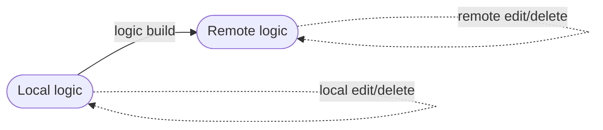
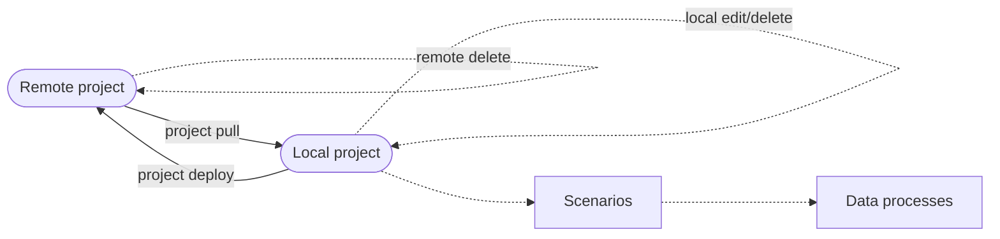
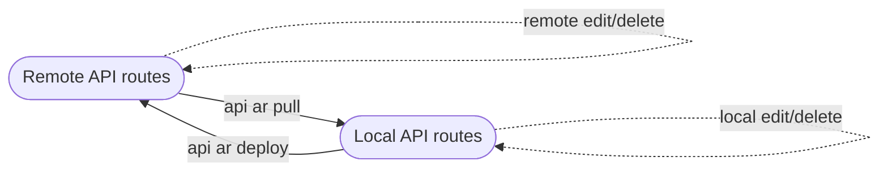

# Source and Version Control

## Synchronising Local and Remote Project

CLI provides several commands for synchronising your local project to or from remote server:

| Commands             | Description                                      | Effect                      |
| -------------------- | ------------------------------------------------ | --------------------------- |
| `loc logic build`    | Compile and upload logic                         | Create a new logic revision |
| `loc project pull`   | Pull remote project (except triggers) to local   | Overwrite a local project   |
| `loc project deploy` | Deploy local project (except triggers) to remote | Overwrite a remote project  |
| `loc api ar pull`    | Pull remote API routes to local                  | Overwrite local API routes  |
| `loc api ar deploy`  | Deploy local API routes to remote                | Overwrite remote API routes |

### Upload Logic



### Sync Project



### Sync API Routes of a Project



Projects and anything in it can be created either in Studio and CLI workspace and to be synced to another.

:::note
Deleting a remote asset with `loc <asset> delete --remote` won't delete the local assets; it will only remove the unique ID from local metadata. Likewise, after deleting a local asset, you have to deploy the project or trigger to apply deletion onto the server.
:::

## Asset Revisions

Some assets in LOC have **revisions**:

| Asset        | Have revisions |
| ------------ | -------------- |
| Logic        | ✓              |
| Project      | ✗              |
| Scenario     | ✗              |
| Data Process | ✓              |
| Tag          | ✗              |
| Unit         | ✗              |
| Trigger      | ✗              |

For these assets, re-deploy a modified version of them (which have different hash values) would create new revisions. All rrevisions of a asset share the same ID in LOC server.

:::note
CLI does not preserve editing histories for local source files. You can use [Git](#source-control-with-git) to commit them to a Github repository.
:::

## Source Control with Git

> [Install Git](https://git-scm.com/book/en/v2/Getting-Started-Installing-Git)

There are _many ways_ to achieve collaboration with Git, and you can check out Git's [official documentation](https://git-scm.com/legacy/0.9/gittutorial) to learn more. Here we'll give you one of the most basic example.

:::tip
If you are developing with VS Code, you can also use the built-in source control functionalities. See: [Using Git source control in VS Code](https://code.visualstudio.com/legacy/0.9/sourcecontrol/overview).
:::

Create a `.gitignore` under your local workspace so unnecessary files/folders will be ignored by Git:

```plain title="/[local workspace]/.gitignore" showLineNumbers
.DS_Store
node_modules
loc*
loc*.exe
package-lock.json
pnpm-lock.yaml
yarn.lock
```

Then create a private Github repo and [setup your SSH authentication](https://docs.github.com/en/authentication/connecting-to-github-with-ssh). Git will prompt you to enter password and SSH passphrase when needed.

Initialise your CLI workspace with Git and commit its contents:

```bash
git init
git add .
git commit -m "first commit"
git branch -M main
git remote add origin git@github.com:<Github account>/<repo name>.git
git push -u origin main
```

After that, you can push your workspace to the Github repo like this:

```bash
git add .
git commit -m "commit description"
git push origin main
```
