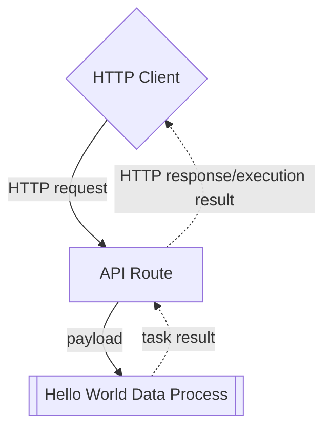

# Create and Use an API Route Trigger

:::tip Learning Objective

-   To create an API route (a HTTP endpoint) for a deployed data process.
-   To invoke a data process with a HTTP client.

:::

In LOC, a [trigger](/legacy/0.9/tutorials/loc-feat-overview#triggers-tasks-and-executions) is a feature which can be used to invoke one or more data processes. The most common form of it is **API route**, which is in fact user-defined HTTP endpoints.

Here we'll see how to add one API route for our "Hello World" data process demostrated in [Quick Start](/legacy/0.9/quickstart). The API route would work as follows:



:::note
See [Quick Start](/legacy/0.9/quickstart) for how to deploy the necessary logic and data process for this tutorial.
:::

## Create an API Route

Go to **API Route** panel, right click on your project to create an API route:

<div className="center-padded-sm">
    
</div>

:::tip
If you know have a project, create one in the **Data Pipeline/Data Process/Explorer** panel.
:::

Give the API route a name (for example, `hello-world-api`) and set it to accept HTTP `POST` requests. Click `Linked Data Processes` and find your deployed data process:

<div className="center-padded-sm">
    
</div>

Click **Add** to add the data process:

<div className="center-padded-sm">
    
</div>

Then click **Create**:

<div className="center-padded-sm">
    
</div>

Copy the URL in the API route (in the example it's `https://api.xxxxxx.fst.network/greetings`). This is the HTTP endpoint available for invoking the "Hello World" data process.

:::info
The list of data processes to be invoked by a trigger is also referred as the **trigger manifest**. If there are more than one data process linked, they will be executed _simultaneously_.

If a linked data process is modified, it'll have to be manually re-link to the trigger (by removing and adding it again) to be invoked properly again.
:::

## Invoke a Data Process with API Route

You can use any HTTP client (for example, the free and web-based [Hoppscotch](https://hoppscotch.io/)) to send a HTTP POST request:

:::tip
Make sure you have set the HTTP request type (`POST`) and body (Content type `application/json` with the JSON payload present).
:::

<div className="center-padded-sm">
    
</div>

:::note
The API route should always return a `200` reesponse even though an error had occurred in the data process.

-   If you receive a `404` response, it can be that LOC Core is still deploying the API route. Wait a dozen seconds then try again.

-   If you receive a `202` response, it could be one of the reasons below:

1. The response has exceeded the default limit of 15 seconds (timed out).
2. You set the API route as asynchronous by mistake so LOC did not wait for the execution result.
3. Something is wrong with LOC runtime to execute data processes properly.

If you have encounter multiple execution failure in LOC, please contact your team or [give us a call](/docs/about) if needed.
:::

Linux and macOS users can also use `curl`:

```bash
curl -X POST -d '{
    "name": "Zaphod Beeblebrox"
}' -v -i 'https://api.xxxxxx.fst.network/greetings'
```

In our example the API route responses with a JSON payload as below (formatted for readability):

```json
{
    "_status": 200,
    "_metadata": {
        "executionId": "ZCO2MdNybaUA46_WMzNWUw",
        "triggerType": "ApiRoute",
        "triggerId": "3cd98933-5ae7-44c5-add2-95fde8042d52",
        "creationTimestamp": "2023-03-29T03:53:21.444334Z",
        "completionTimestamp": "2023-03-29T03:53:21.547445Z",
        "status": "success"
    },
    "data": {
        "status": "ok",
        "taskId": {
            "id": "DAqoPC6KNh0G9-AlldmPgQ",
            "executionId": "ZCO2MdNybaUA46_WMzNWUw"
        },
        "data": {
            "message": "Hello, Zaphod Beeblebrox!"
        }
    }
}
```

This JSON data is more detailed than the task result we've seen in Quick Start, because this is the _execution result_ which contains one task result. If we have triggered multiple data processes with an API route, all of the task results would be included.

:::info
Data processes linked in the same trigger will be _invoked_ simultaneously.

If you wish to **return the task result only** (the custom result finalised by result agent), you can set the [API route encapsulation](/legacy/0.9/studio-guide/triggers) to `false`.
:::

## View Execution History

In LOC, any action of invoking data processes with triggers would be preserved as **execution histories** which you can query later.

An execution history contains the following information:

-   Task ID
-   Execution ID
-   Execution timestamps and status
-   Trigger ID
-   Executed data process and logic PIDs
-   Logic logging message (outputed with [Logging Agent](/legacy/0.9/sdk-reference/logging))
-   Trigger payload and result

Go to **Data Discovery/Execution** and find the entry with the correct execution ID:

<div className="center-padded-sm">
    
</div>

:::info
Executions triggered with [simple data process execution](/legacy/0.9/quickstart#run-the-data-process---simple-data-process-execution) would use a mocked API route which have all-zero IDs.
:::

Click the "Preview" button on the right to inspect the execution result:

<div className="center-padded-sm">
    
</div>

This is the same result we've seen received in the HTTP client.

Click on the execution ID itself to see task results (and click the `+` icon on the right of tasks to expand the logic list):

<div className="center-padded-sm">
    
</div>

You can inspect task payload, task result as well as logs outputted by Logging agent in a specific logic, for example, the `greeting` logic reporting the greeting message it had generated:

<div className="center-padded-sm">
    
</div>
