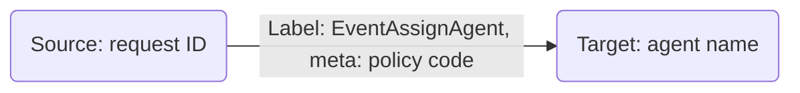

# Events and Multiple Data Processes

:::tip Learning Objective

-   To query events emitted from another data process.
-   To inspect the larger data lineage consist of multiple types of events.

:::

This is the follow-up of [Emit and Inspect Events](/legacy/0.9/tutorials/emit-and-inspect-event), in which we've learned the basics of emitting events.

In reality, your company may have much longer business processes, and they may lay across several different departments. LOC events play an important role of communicate between data processes, as well as to track how data flows.

For example, now that we have some policy applications coming in, we need to assign them to insurance agents. We will, of course, build a second data process to achieve this.

:::info
How to trigger the second data process depends on your use case, but generally you can

1. Have the second data process run on scheduler and check events periodically;
2. Have the first data process invoke a API route or message queue trigger;
3. Manually started by human operators.

In this example we will execute it manually.
:::

import Tabs from "@theme/Tabs";
import TabItem from "@theme/TabItem";

## Query Events

### Use Case: Assigning Insurance Agent

This new data process will query the `EventPolicyRequest` events emitted in the [previous tutorial](/legacy/0.9/tutorials/emit-and-inspect-event), extract the request ID and policy code, then assign to the agent who is responsible for a specific type of policy:



We will use a mock-up agent mapping table (instead of querying it from some databases):

| Agent name | Responsible for  |
| ---------- | ---------------- |
| Marvin     | P100, P200       |
| Trillian   | P300, P400, P500 |

So if the requested insurance policy is type P100, it will be assigned to Marvin, and so on.

### Code Walkthrough

This time we'll create the second data process `policy-assign`:

| Logic                | Name                                                                        | Purpose                                                  |
| -------------------- | --------------------------------------------------------------------------- | -------------------------------------------------------- |
| **Generic logic #1** | `policy-query`                                                              | Query `EventPolicyRequest` events and write into session |
| **Generic logic #2** | `policy-assign`                                                             | Read from session and emit `EventAssignAgent` events     |
| Aggregator logic     | `result-aggregator` ([source](/legacy/0.9/logic-library/result-aggregator)) | Finalise task result                                     |

We don't need `payload-json-parser` this time since this data process does not require trigger payload. Instead, `policy-query` will query the events we are looking for and write them into the `parsed` session variable.

<Tabs>
  <TabItem value="generic-2" label="Generic logic #1" default>

```javascript title="policy-query" showLineNumbers
import {
    LoggingAgent,
    SessionStorageAgent,
    EventAgent,
} from "@fstnetwork/loc-logic-sdk";

export async function run(ctx) {
    // event query conditions
    const requests = {
        queries: [
            {
                field: "label_name", // field name
                type: "match", // matching operator
                value: "EventPolicyRequest", // value (event name)
            },
        ],
        excludes: [],
        filters: [],
        from: 0,
        size: 1000,
        sorts: [],
    };

    // query events
    const query = await EventAgent.search(requests);
    const events = query?.events;

    if (events) {
        // log queried events
        LoggingAgent.info({ queried_events: query?.events });

        // overwrite parsed with events if not empty
        await SessionStorageAgent.putJson("parsed", query?.events);
    }
}

export async function handleError(ctx, error) {
    // error logging
    LoggingAgent.error({
        error: true,
        errorMessage: error.message,
        stack: error.stack,
        taskId: ctx.task.taskKey,
    });
}
```

  </TabItem>
  <TabItem value="generic-3" label="Generic logic #2">

```javascript title="policy-assign" showLineNumbers
import {
    LoggingAgent,
    SessionStorageAgent,
    EventAgent,
} from "@fstnetwork/loc-logic-sdk";

export async function run(ctx) {
    // read parsed from session
    const parsed = await SessionStorageAgent.get("parsed");

    // check if parsed is an array
    if (!Array.isArray(parsed)) return;

    // use the queried events to generate new event schemas
    let events = [];
    parsed.forEach((event) => {
        const policyCode = event?.meta;
        const requestID = event?.targetDigitalIdentity;

        if (requestID && policyCode) {
            const agent = search_agent(policyCode);

            if (agent) {
                // if an agent is found
                events.push({
                    labelName: "EventAssignAgent",
                    sourceDID: requestID,
                    targetDID: agent,
                    meta: policyCode,
                    type: "default",
                });
            }
        }
    });

    // emit events
    await EventAgent.emit(events);

    // prepare result
    const result = {
        emitted_length: events.length,
        events: events,
    };

    // log events
    LoggingAgent.info(result);

    // write events to result
    await SessionStorageAgent.putJson("result", result);
}

export async function handleError(ctx, error) {
    // error logging
    LoggingAgent.error({
        error: true,
        errorMessage: error.message,
        stack: error.stack,
        taskId: ctx.task.taskKey,
    });
}

// a mock-up lookup table of agents and their responsible policy types
const insurance_agents = {
    Marvin: ["P200", "P300"],
    Trillian: ["P100", "P400", "P500"],
};

// agent name lookup helper
const search_agent = (policyCode) => {
    for (let agent in insurance_agents)
        for (let responsibility of insurance_agents[agent])
            if (responsibility === policyCode) return agent;
    return null;
};
```

  </TabItem>
</Tabs>

<details>
    <summary>Filter events within a timespan</summary>

By the example above the event store agent would query as many as 1,000 events. It would be sensible to do some double-checking so that you won't process the same event twice. You can also filter events within s certain timespan:

```javascript showLineNumbers
...
const requests = {
    queries: [
        {
            field: "label_name",
            type: "match",
            value: "EventPolicyRequest"
        }
    ],
    excludes: [],
    // highlight-start
    filters: [  // add a filter condition
        {
            field: "timestamp",
            gte: Date.now() - 10 * 60 * 1000,  // greater than or equal
            lte: Date.now(),  // less than or equal
            type: "range",
        }
    ],
    // highlight-end
    from: 0,
    size: 1000,
    sorts: [],
    };

    ...
```

Both `gte` and `lte` fields receive a number (unix timestamp).

The query parameters above would try to find events with label name `EventPolicyRequest` emitted within 10 minutes.

</details>

### Invoke Data Process

:::note
Since this data process does not process trigger payload, you can leave the payload in single data process execution or body in HTTP request (while using an API route) empty.
:::

After executing the data process, tt should return a similar result as the first policy allication data process:

```json
{
    "status": "ok",
    "taskId": {
        "id": "Vfe81Qml67opRaBfndhUBw",
        "executionId": "ZCKROD8ZFQi9d03qxp2n8Q"
    },
    "response": {
        "emitted_length": 3,
        "events": [
            {
                "labelName": "EventAssignAgent",
                "sourceDID": "R0042",
                "targetDID": "Trillian",
                "meta": "P100",
                "type": "default"
            },
            {
                "labelName": "EventAssignAgent",
                "sourceDID": "R0043",
                "targetDID": "Marvin",
                "meta": "P300",
                "type": "default"
            },
            {
                "labelName": "EventAssignAgent",
                "sourceDID": "R0044",
                "targetDID": "Trillian",
                "meta": "P500",
                "type": "default"
            }
        ]
    }
}
```

## Inspect Events

Finally go back to Studio's **Data Discovery/Event** to find the policy events (in order to see multiple events, we use a time range filter instead):

<div className="center-padded-sm">
    
</div>

:::note
For now Studio does not support multiple search conditions, so we'll simply ignore unrelated events here. However, you can consider to add a common prefix to search a specific group of events easier.
:::

We can also switch to see the data lineage graph of total six events:

<div className="center-padded-sm">
    
</div>

:::note
You'll need to drag the nodes around to re-arrange the graph as above.
:::

This clearly show the data flow of between the two data processes: the applicant submited a request for a certain type of insurance policy, and each request got assigned to one agent. This can go on across the whole business process and be used to find out incorrect business mappings or missing links.
