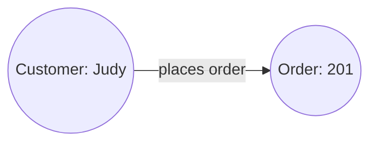
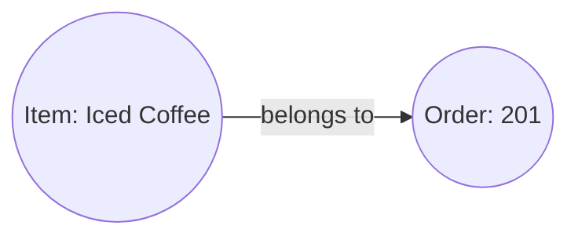
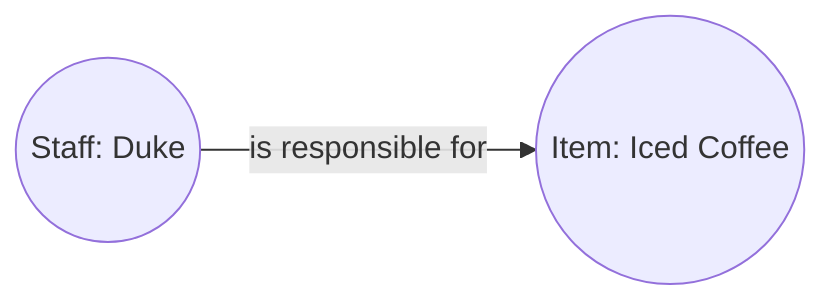

# Introduction

:::tip Learning Objective

To create a comprehensive project consist of

-   HTTP payload parsing and JSON custom validation
-   Use of session storage variables
-   Logging and error handling
-   Emit and query events
-   API routes and invoking other data processes
-   Use of HTTP agent and agent configuration
-   Use of logic variable agent (optional)

:::

## Lakeside Oasis Café's Dilemma

A charming little local joint, **Lakeside Oasis Café** - as it happens with the same abbreviation or **LOC** - has relied a crude but workable online ordering system since the late 2000s. However after the COVID-19 pandemic hit, the café struggled to deal with surged demands and its kitchen constantly lose track of order items. Customers complained and the café's ratings plummeted.

    

It appears that sometimes the ordering page did not update the menu correctly and the kitchen API ignores items that are not on their responsibility list. Logs are stored but it's kind of difficult to filter all these information. Surely we can find a way to visualise the data flow and find out where the missing links are...right?

## Requirements and Objectives

As a system integration engineer, you are commissioned to design a set of new data processes for the café to connect ordering pages to the kitchen's order system. More importantly, the data processes should be able to use LOC events to generate a _graphical_ representation of data flows:

1. Who has placed an order?

2. What items is ordered along with the order?

3. Which staff is responsible for preparing a specific item in the order? (and if there are any items not assigned?)

The first two events would be emitted by one data process and the third event from another. All types of events should also link together into longer, larger data lineage graphs.

## System Design

For the sake of demonstration, the data processes won't be actually request or post any data to external systems, and do not include any form of analysis or notification functionalities. One of the data process would also use a mocked staff responsibility list in order to assign staff to items.

Go to the [next page](/legacy/0.9/use-cases/loc-cafe/system-design) to view the system design details.
